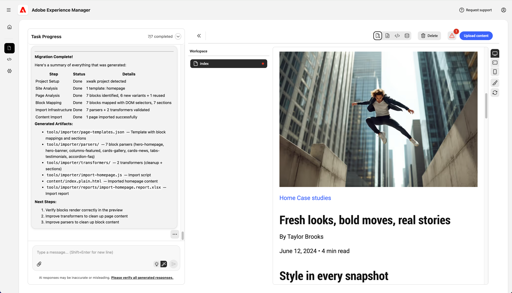
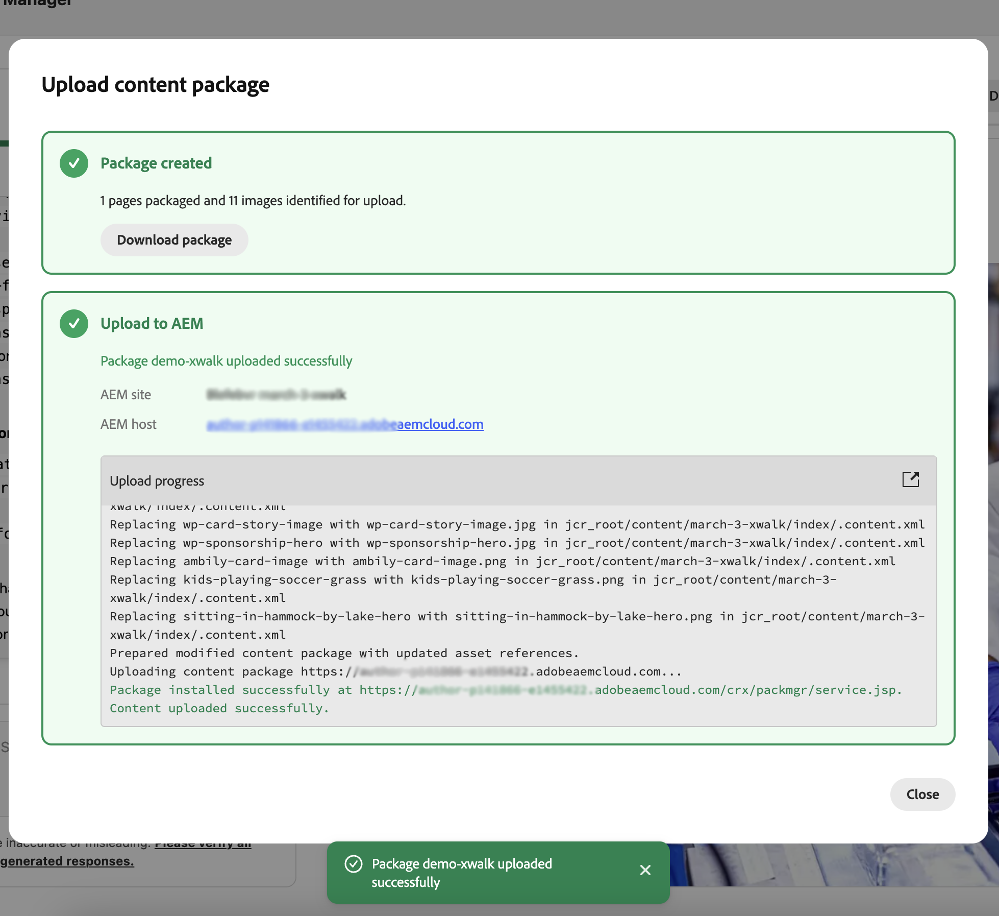

# 開始使用AEM製作專案的Experience Modernization Agent {#getting-started-aem-authoring}

對於使用通用編輯器的AEM製作專案，Experience現代化代理程式的準備工作與標準Edge Delivery流程不同。 本檔案說明這些設定差異。 完成下列步驟後，請依照主要[Experience Modernization Agent快速入門](getting-started.md)指南操作。

## 建立您的Edge Delivery Services專案存放庫 {#create-repo}

1. 使用[`aem-block-collection-xwalk`](https://github.com/adobe-rnd/aem-block-collection-xwalk)存放庫作為您的範本（不是標準Edge Delivery Services樣板）。
1. 驗證`fstab.yaml`是否指向您的AEM主機、Git擁有者和Git存放庫，並在連線GitHub應用程式之前認可對`main`所做的任何變更。
   * 如需指示，請參閱[設定內容來源](/help/implementing/cloud-manager/edge-delivery/configure-content-source.md)。
1. 請依照[通用編輯器教學課程](https://www.aem.live/developer/ue-tutorial)中的說明來設定您的存放庫。
   * 系統要求您在AEM中建立網站時停止。
1. 刪除`paths.json`並將此變更提交至`main`。
1. 將[AEM程式碼聯結器](https://github.com/apps/aem-code-connector/installations/select_target)應用程式新增至您的存放庫。
   * 這可讓主控台檢查您的程式碼。

## 在AEM中建立新網站 {#create-site}

1. 在AEM Sites主控台中，選取&#x200B;**從範本**&#x200B;建立&#x200B;**>**&#x200B;網站。
1. 選取包含Edge Delivery Services範本的&#x200B;**AEM網站**。
   * 沒有列出嗎？ [安裝範本。](https://github.com/adobe-rnd/aem-boilerplate-xwalk/releases)
1. 保留網站的&#x200B;**名稱** （不是標題），如所提供。
   * 網站名稱會作為唯一識別碼使用。
   * 可以變更標題以進行顯示。
1. 按一下「**建立**」。
   * 系統會將您重新導向至「網站」頁面。
   * 如果新網站未立即顯示，請重新整理頁面。

## 繼續進行標準快速入門步驟 {#continue}

完成上述步驟後，您可以繼續使用標準快速入門手冊，開始移轉您的內容。

請依照標準指南中的步驟操作。

1. [準備Edge Delivery GitHub存放庫](/help/ai-in-aem/agents/brand-experience/modernization/getting-started.md#prepare-repo)
1. [開啟「體驗現代化主控台」](/help/ai-in-aem/agents/brand-experience/modernization/getting-started.md#open-console)
1. [連線您的GitHub存放庫](/help/ai-in-aem/agents/brand-experience/modernization/getting-started.md#connect-repo)
1. [開始提示](/help/ai-in-aem/agents/brand-experience/modernization/getting-started.md#start-prompting)

完成這些步驟以移轉內容後，請繼續下列步驟。

## 驗證內容 {#validate-content}

在預覽面板中驗證所選頁面的內容。 按一下&#x200B;**錯誤**按鈕即可顯示任何錯誤。
繼續您與代理的聊天對話以修正錯誤。 使用**新增至聊天**&#x200B;功能，針對頁面、剖析器檔案或轉換器檔案的特定元素進行修正。

## 上傳內容 {#upload-content}

若要將內容上傳至AEM：

1. 確定您位於&#x200B;**Content**&#x200B;檢視中，然後按一下右上方的&#x200B;**Upload content**&#x200B;按鈕。
1. 在&#x200B;**建立內容封裝**&#x200B;對話方塊中，選擇要包含在封裝中的頁面。
   * 選擇性地輸入&#x200B;**封裝名稱** （如果留空，則預設為網站名稱）。
   * 使用&#x200B;**全部選取**、**清除選取專案**、**全部展開**&#x200B;或&#x200B;**全部收合**&#x200B;來管理清單。
1. 按一下&#x200B;**建立封裝**。

   

1. 建立封裝後，**上傳內容封裝**&#x200B;對話方塊會顯示封裝已就緒。
   1. 您可以&#x200B;**下載套件**&#x200B;以儲存至本機，或繼續上傳。
   1. 在&#x200B;**上傳至AEM**&#x200B;下方，確認&#x200B;**AEM網站**&#x200B;和&#x200B;**AEM主機** （從您的專案設定預先填入）。
      * 可選擇保留&#x200B;**上傳影像**&#x200B;以包含影像。
   1. 按一下&#x200B;**上傳至AEM**。

   

1. 此對話方塊會在頁面和資產傳送到AEM時顯示上傳進度。 上傳完成後，會顯示成功訊息和上傳記錄。 按一下&#x200B;**關閉**&#x200B;以關閉對話方塊。

   

您匯入的內容現在位於AEM中。 繼續進行主要快速入門手冊中的[推播程式碼變更](getting-started.md#push-code-changes)。

## 其他資源 {#additional-resources}

* [開始使用Experience Modernization Agent](getting-started.md) — 完整的工作流程，包括主控台、提示、上傳和預覽
* [體驗現代化主控台](console.md) — 主控台參考
* [Universal Editor教學課程](https://www.aem.live/developer/ue-tutorial) — 設定AEM編寫和Universal Editor專案
* [`aem-block-collection-xwalk`](https://github.com/adobe-rnd/aem-block-collection-xwalk) - AEM編寫和Universal Editor專案的範本存放庫
