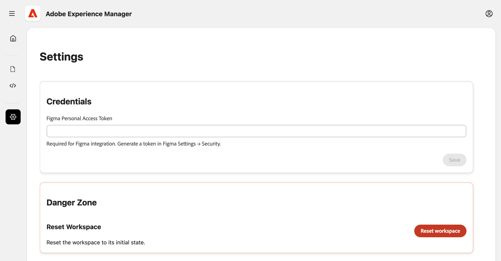

# Experience現代化主控台 {#console-reference}

Experience現代化主控台介面和功能的參考指南

>[!NOTE]
>
>如果您有興趣使用Experience Modernization Console，可以要求存取權以確保順利上線體驗。

## 概觀 {#overview}

Experience Modernization Console是Edge Delivery Services的託管、AI輔助開發環境，在[`aemcoder.adobe.io`以網頁介面的形式公開。](https://aemcoder.adobe.io)連線到他們的GitHub專案後，您就可以立即開始以自然語言提示變更，而無需任何進一步的設定或本機環境設定。

>[!TIP]
>
>如果您有興趣立即開始使用主控台，請參閱檔案[開始使用Experience現代化代理程式。](/help/ai-in-aem/agents/modernization/getting-started.md)

## 功能 {#capabilities}

主控台的核心功能：

* 與代理的互動式聊天面板及其技能
* 即時AEM預覽，可立即取得變更的視覺回饋
* 內容檔案瀏覽器和Markdown檢視器
* 與[Document Authoring](https://da.live)的內容同步處理
* 程式碼瀏覽器和比較檢視器，用於檢閱所做的變更
* GitHub整合，可透過變更建立提取請求

開發人員仍可完整掌控出貨內容。 透過主控台進行的所有變更都需要在部署前進行審查和核准，以確保治理、品牌一致性和安全性。

## 導覽 {#navigation}

在[`aemcoder.adobe.io`，](https://aemcoder.adobe.io)登入主控台後，您會進入主控台的主畫面。

### 選單列 {#menu-bar}

頂端功能表列提供：

* 左側的&#x200B;**開啟功能表**&#x200B;按鈕可展開和摺疊左側面板的詳細資訊
* 右側的&#x200B;**帳戶**&#x200B;按鈕，可用於切換到深色模式並登出主控台

### 左側欄 {#sidebar}

左側邊欄可讓您快速存取主控台的重要檢視。

* **[首頁檢視](#home-view)** （房屋圖示） — 您使用主控台的起點
* **[內容檢視](#content-view)** （檔案圖示） — 您已匯入的內容
* **[代碼檢視](#code-view)** （`</>`圖示） — 您正在處理的網站代碼
* **[設定檢視](#settings-view)** （齒輪圖示） — 主控台的設定

## 首頁檢視 {#home-view}

**Home**&#x200B;檢視是您使用主控台的起點。

* 頂端是[提示面板](#prompt-panel)，用來發出主控台的請求。
* 提示面板下是用來啟動專案的建議提示。

### 提示面板 {#prompt-panel}

提示面板提供與AI互動的控制項。

* **計畫/執行模式** （燈泡和魔術棒圖示）：分別在計畫模式和執行模式之間切換
   * **計畫模式**： AI會分析要求並概述方法，而不做變更，這有助於在認可之前瞭解策略。
   * **執行模式**： AI會執行計畫並進行實際的檔案變更。
* **附加檔案** （回形針圖示）：上傳檔案並附加至提示以取得其他內容（例如參考設計、熒幕擷圖、規格）
* **設定** （齒輪圖示）：選擇略過AI的確認問題
* **清除交談**：這會重設交談並清除AI的內容視窗。 當啟動與上一個交談無關的新工作時，請使用此選項。

## 內容檢視 {#content-view}

**內容檢視**&#x200B;提供瀏覽和預覽內容的工具。 依預設，檢視分為三個面板，由左至右：

* 與主控台和專案互動的提示面板
* 檔案瀏覽器以檢視內容檔案的概觀（切換顯示這個面板並帶有V形圖示）
* 預覽面板，可將檔案瀏覽器中選取的內容視覺化

預覽面板提供三種模式：

* **預覽** （含放大鏡圖示的檔案）以檢視轉譯的HTML內容
* **HTML檢視** （檔案圖示）可分別檢視基礎檔案編寫內容結構
* **設計模式** （繪圖筆刷圖示）可選取頁面內容元素，以取得提示

您一律可以按一下&#x200B;**重新整理預覽**&#x200B;圖示來更新預覽面板。

「**上傳內容**」按鈕會開啟一個強制回應視窗，以將檔案上傳至AEM Document Authoring。

* 如果您的專案有&#x200B;**檔案，則會預先填入**&#x200B;組織&#x200B;**和**&#x200B;存放庫`fstab.yaml`欄位
* 檔案選取範圍提供可編輯的目標路徑
* 不支援上傳至JCR （適用於通用編輯器）

## 程式碼檢視 {#code-view}

**程式碼檢視**&#x200B;提供瀏覽程式碼和管理程式碼變更的工具。 此檢視分為三個面板，由左至右：

* 與主控台和專案互動的提示面板
* 檔案瀏覽器，讓您概略瞭解程式碼檔案或異動變更
* 預覽面板，用於檢視在檔案瀏覽器中選取的程式碼檔案或差異

預覽面板提供兩種不同的模式：

* **Workspace檔案**&#x200B;以瀏覽目前工作區中的程式碼檔案
* **Git變更**&#x200B;以檢視您專案工作所建立的檔案變更差異
   * 按一下`+`圖示以暫存變更的檔案
   * 按一下箭頭圖示以捨棄變更的檔案

**資訊**&#x200B;圖示會列出您目前連線的GitHub帳戶和專案。

**GitHub動作**&#x200B;功能表（右上方）提供存放庫作業。

* **連線/重新連線**：起始GitHub OAuth
* **切換存放庫**：以不同的存放庫取代工作區。 任何未提交的工作都將遺失。
* **切換分支**：切換相同存放庫中的分支
* **同步**：從遠端來源提取最新變更
* **推送**：開啟強制回應，以將工作區變更推送至GitHub
* **登出**：中斷與GitHub的連線

推送變更時，您必須先執行階段變更，才能將其納入推送中。 推送時，您可以選擇建立新的PR，或直接推送至目前的分支

## 設定檢視 {#settings-view}

設定檢視可讓您管理主控台的基本設定。

* **認證**&#x200B;可讓您為Figma指定個人存取權杖，讓主控台可以存取您專案的設計區塊。
* **重設工作區**&#x200B;將主控台還原為開始狀態，所有未推送或未上傳的變更將會遺失。
