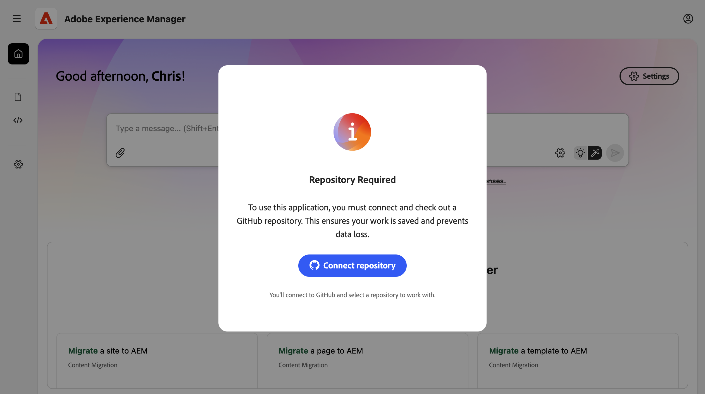
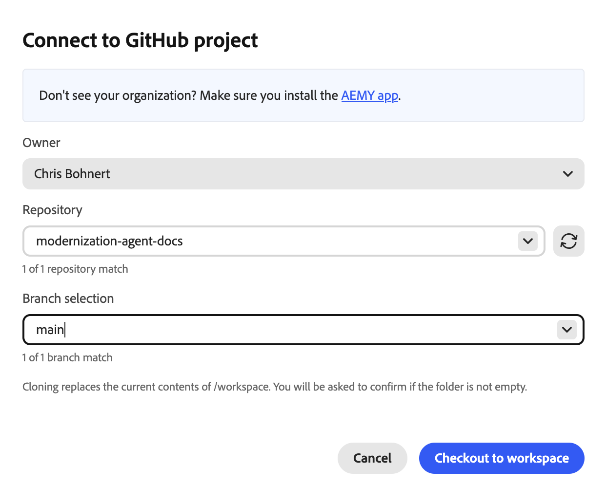
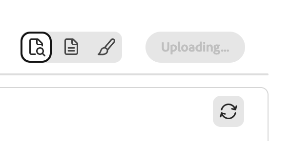

# Experience Modernization代理程式快速入門 {#getting-started}

瞭解使用Experience Modernization Console透過Experience Modernization Agent快速提高生產力的第一步。

>[!NOTE]
>
>如果您有興趣使用Experience Modernization Console，可以要求存取權以確保順利上線體驗。

## 準備Edge Delivery GitHub存放庫 {#prepare-repo}

1. 選取要與Experience Modernization Console搭配使用的[Edge Delivery Services](/help/edge/overview.md)存放庫。
   * 這可以是現有的Edge Delivery Services專案，或者您可以在[開發人員教學課程](https://www.aem.live/developer/tutorial)之後使用[樣板存放庫建立新的專案。](https://github.com/adobe/aem-boilerplate)
1. 確定存放庫中已安裝[AEMY GitHub應用程式](https://github.com/apps/aem-aemy)。
   * 這可讓主控台檢查您的程式碼。
1. 確定存放庫中已安裝[AEM Code Sync GitHub應用程式](https://github.com/apps/aem-code-sync)。
   * 這可讓Edge Delivery Services同步處理您的程式碼。
   * 如果您的存放庫是以教學課程為基礎，此步驟已完成。

## 開啟「體驗現代化主控台」 {#open-console}

1. 瀏覽至[`aemcoder.adobe.io`.](https://aemcoder.adobe.io)
1. 使用您的Adobe ID登入。

## 連線您的GitHub存放庫 {#connect-repo}

當您首次登入時，主控台會提示您輸入存放庫。

1. 按一下&#x200B;**連線儲存機制**。
1. 這會在新的瀏覽器標籤上開啟AEMY應用程式。 按一下&#x200B;**授權AEM AEMY**。
1. 回到主控台，選取&#x200B;**擁有者**、**存放庫**&#x200B;和&#x200B;**分支選取專案**，然後按一下&#x200B;**簽出至工作區**。
   
1. 當提示&#x200B;**取代現有工作區**&#x200B;時，請按一下&#x200B;**取代工作區**。
   

您的GitHub專案現已連線至主控台，而您正位於首頁畫面。

## 開始提示 {#start-prompting}

現在您的主控台可以存取您的程式碼，您就可以開始提示了。

1. 若要開始使用，您可以匯入網站的內容：
   * 「移轉頁面`https://wknd-trendsetters.site`。」
1. 這會匯入網站的內容。
   * 主控台會觀察關注點的分離，並單獨處理內容和簡報。
   * 網站內容的初始匯入可能需要幾分鐘的時間。
   * 主控台會在您開始工作時提供持續性的意見反應，包括計畫步驟的概觀。
     
1. 網站匯入後，**Workspace**&#x200B;面板會顯示頁面。 選取要在右側面板中預覽的頁面。
   
1. 現在您有了內容，您可以提示從相同來源匯入樣式。
   * 「從`https://wknd-trendsetters.site`匯入一般樣式。」
1. 與初始內容匯入一樣，匯入可能需要幾分鐘的時間，而且主控台會在處理您的請求並匯入樣式時提供意見回饋。 工作完成後，按一下右側面板中的&#x200B;**重新整理預覽**&#x200B;以檢視樣式內容。
   

現在您已將內容和樣式匯入主控台。

## 上傳內容 {#upload-content}

若要將您的內容上傳到[檔案製作](https://da.live)：

1. 確定您位於&#x200B;**Content**&#x200B;檢視中，然後按一下右上方的&#x200B;**Upload content**&#x200B;按鈕。
   * 依預設，您進入主控台時處於&#x200B;**內容**&#x200B;檢視中。
   * 在主控台左側的側邊欄中，反白顯示的圖示會指出您的檢視。
1. **上傳內容**&#x200B;對話方塊開啟，目標組織和存放庫已從您的`fstab.yaml`預先填入。
   * 如果連線的存放庫中沒有任何`fstab.yaml`，您必須手動輸入您的&#x200B;**組織**&#x200B;和&#x200B;**存放庫**。
   * 如果您使用樣版，則會提供`fstab.yaml`。
1. 選取您要上傳的檔案，然後按一下&#x200B;**上傳**。
   
1. 主控台會將&#x200B;**上傳**&#x200B;按鈕變成灰色，以指出上傳程式。
   
1. 完成後，通知會顯示在主控台底部。
   在AEM中檢視

若要在Document Authoring中存取上傳的內容，可選擇在上傳完成時按一下通知中的&#x200B;**[在AEM中檢視**]，或導覽至`https://da.live/#/{organization}/{repository}`。

您匯入的內容現在處於「檔案製作」中。

## 推送程式碼變更 {#push-code-changes}

在您對程式碼所做的變更感到滿意後，可以將其推送到GitHub存放庫。

1. 切換至&#x200B;**代碼**&#x200B;檢視（左側邊欄中為`</>`圖示），然後切換至&#x200B;**Git變更**&#x200B;標籤（右上角的分支圖示）。
   
1. 在變更的檔案清單中，如果某些檔案顯示為未追蹤，請按一下它們的`+`按鈕以暫存它們。
1. 按一下右上方的&#x200B;**GitHub動作**&#x200B;按鈕，然後從下拉式清單中選取&#x200B;**推播**。
1. 在&#x200B;**推送變更**&#x200B;對話方塊中，選擇推送變更至新的PR （預設）或目前的分支，然後按一下&#x200B;**確認**&#x200B;以推送變更。
   * 有疑問時，您可以推送至目前的分支，以保持事情簡單。
1. 完成後，通知會顯示在主控台底部。
   

如果您想要直接存取GitHub中的推送變更，請在推送完成時按一下通知中的「**檢視PR**」。

GitHub中的

您的程式碼現在位於GitHub中。

## 預覽網站 {#preview-site}

若要在預覽環境中檢視變更：

1. 返回「檔案製作」。
   * 在上傳內容後按一下[在AEM中檢視] **&#x200B;**&#x200B;後，它仍可能在您開啟的瀏覽器標籤中開啟。
   * 或導覽至`https://da.live/#/{organization}/{repository}`
1. 開啟您先前上傳至AEM的其中一個頁面。
1. 按一下紙張平面圖示（右上方）並選取&#x200B;**預覽**。
   

恭喜！您移轉的內容和樣式現在都可在AEM預覽環境中上線。

如果您將程式碼推送到`main`以外的分支，從「檔案編寫」開啟的預覽將不會顯示樣式。 更新預覽的URL以變更為分支，您可以看到您的樣式。

## 其他資源 {#additional-resources}

當您繼續探索Experience現代化代理程式及其主控台時，以下檔案可能會很有用。

* [體驗現代化主控台](/help/ai-in-aem/agents/modernization/console.md) — 主控台、其檢視、選項和功能的詳細資料
* [Edge Delivery Services開發人員教學課程](https://www.aem.live/developer/tutorial) — 如果您不熟悉AEM和Edge Delivery Services專案，則很實用
* [Document Authoring](https://da.live) — 如果您剛開始使用Document Authoring進行內容管理，則很實用
