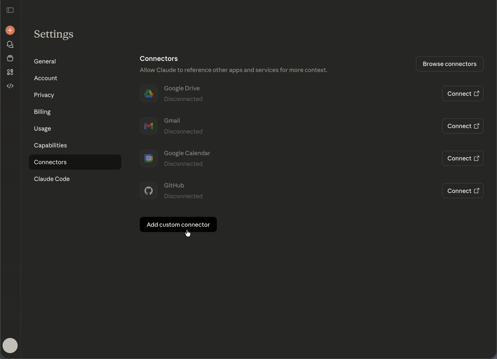

# 使用AEM MCP設定Anthropic Claude {#setup-claude}

本文將介紹兩種將Anthropic Claude與AEM搭配使用的不同方式：

- 在Claude中手動設定一或多個AEM的MCP伺服器（說明於[搭配AEM as a Cloud Service使用MCP的伺服器 — MCP伺服器](/help/ai-in-aem/mcp-support/using-mcp-with-aem-as-a-cloud-service.md#mcp-servers)）。
- 從Anthropic的聯結器市集安裝Adobe Experience Manager聯結器。 它目前與Content MCP Server具有同等的功能，並且將會公開AEM的MCP伺服器中日益增多的可用工具子集。

## 在Claude中手動設定AEM的MCP伺服器 {#manual-configure-aems-mcp-servers-in-claude}

本節說明&#x200B;**手動組態**&#x200B;方法，也就是您將一或多個AEM的MCP伺服器新增至Claude做為自訂聯結器。

>[!NOTE]
>
>Claude使用者介面可能會有所變更，而且不是決定性的。 這些指示僅供說明用途。

1. 開啟Claude網頁應用程式左下角的帳戶功能表，然後選擇&#x200B;**設定**&#x200B;以開啟[設定]區域。

   已選取克勞德中的

1. 在[設定]側邊欄中，選取&#x200B;**聯結器**。 在[聯結器]頁面上，選擇&#x200B;**新增自訂聯結器**&#x200B;以註冊自訂MCP端點。

   在[設定使用新增自訂聯結器]中的

1. 在&#x200B;**新增自訂聯結器**&#x200B;對話方塊中，輸入顯示名稱（例如&#x200B;**AEM Content MCP Service**）和您的MCP伺服器URL，然後選擇&#x200B;**新增**。 只有在您的部署需要額外的選項時，才使用&#x200B;**進階設定**。

   

1. 在聯結器清單上，找到您的自訂聯結器專案（它顯示&#x200B;**CUSTOM**&#x200B;標籤），然後選擇&#x200B;**連線**&#x200B;登入並將聯結器連結至您的Claude帳戶。

   已為AEM內容MCP服務選取連線的

1. 當聯結器出現在具有其URL的清單中時，請選擇&#x200B;**AEM內容MCP服務**&#x200B;旁的&#x200B;**設定**&#x200B;以開啟聯結器詳細資料並繼續安裝。

   已為AEM內容MCP服務選取設定的

1. 在&#x200B;**工具許可權**&#x200B;頁面上，檢閱預設值（例如，**需要核准**），然後將每個AEM工具設定為&#x200B;**一律允許**、**要求許可權**&#x200B;或&#x200B;**根據您的安全性原則，永遠不允許**。

   

1. 開啟交談。 選取訊息欄位左側的工具和模型功能表（滑桿圖示），啟用[聯結器]下的&#x200B;**AEM內容MCP服務**，然後輸入您的提示，讓Claude能夠使用該聊天的MCP工具。

   ![在[工具]功能表中啟用AEM Content MCP Service的聊天撰寫器。](assets/claude-7.png)

## 安裝Adobe Experience Manager Connector (Anthropic connector Marketplace) {#install-adobe-experience-manager-connector}

本節說明來自Anthropic聯結器市集的&#x200B;**可安裝聯結器** （與新增自訂聯結器URL相反）。 其中包括AEM MCP伺服器可用工具的子集。

若要安裝&#x200B;**Adobe Experience Manager聯結器**，請在Claude中開啟&#x200B;**設定** > **聯結器**。 您也可以直接在[https://claude.ai/settings/connectors](https://claude.ai/settings/connectors)開啟[聯結器]頁面。 聯結器會註冊MCP伺服器，公開越來越多的AEM工作流程工具。

