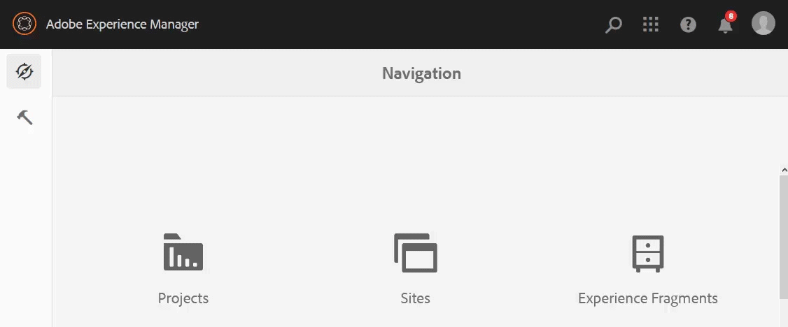

<!--
Original scope of this article for Core Assets for all a11y topics is around the following topics. This has changed since then but keeping this list of topics for posterity's sake.

* Convert the absolute doc links to relative links.
* Add an overview
* Compile a list of enhancements done in the last ~1 year.
* Top-level actions supported, such as clickable UI elements, keyboard shortcuts, popup dialogs, etc.)
* Specific user tasks supported, such as, download assets, datepicker, editing metadata, etc.
* Support matrix of user tasks with browsers and screen readers + OSes combinations
* Exceptions that users should be aware of.
* CTA – what is next and more info from AEM team:
  * Link to ACRs on a.com.
  * Generic a11y info by Adobe to begin with.
  * Examples of other a11y DX Docs from Elle.
  * Link to a11y-specific channels to report issues, seek support, or request enhancements, if any. Available info from Elle.
-->

# Accessibility in [!DNL Adobe Experience Manager Assets] as a Cloud Service {#accessibility-in-aem-assets}

Adobe致力於為所有使用者（包括殘障人士）製作產品。 [!DNL Adobe Experience Manager] 不斷增強，以滿足各種用戶的需求。 [!DNL Experience Manager] 發佈符合性資訊，詳細說明符合的標準、概述產品中的協助功能，並說明符合性等級。 它可協助使用者瞭解遵守程度。

[!DNL Adobe Experience Manager] 提供不同等級的支援：

* [網頁內容可及性指引 (WCAG) 2.1](https://www.w3.org/TR/WCAG/).
* [第508條修訂](https://www.access-board.gov/guidelines-and-standards/communications-and-it/about-the-ict-refresh/final-rule/text-of-the-standards-and-guidelines)。
* [韋亞](https://www.w3.org/WAI/standards-guidelines/aria/)。
* [EN 301 549](https://en.wikipedia.org/wiki/EN_301_549)。

要訪問詳細說明法規遵從性級別的報告，請參 [閱所有Adobe解決 ](https://www.adobe.com/accessibility/compliance.html) 方案的「輔助功能符合性報告(ACR)」頁。

## 輔助技術 {#at-support}

行動不便的使用者通常依賴硬體和軟體來存取網頁內容。 這些工具被稱為輔助技術。 [!DNL Adobe Experience Manager Assets] 使用下列輔助技術，在使用軟體的核心功能時提供使用者支援：

* 螢幕閱讀程式。
* 語音識別軟體。
* 鍵盤使用——導覽和捷徑。
* 輔助硬體，包括開關控制項、可重新整理的盲文顯示器和其他電腦輸入裝置。
* UI放大工具。

## [!DNL Experience Manager Assets] 可存取的使用案例 {#accessible-assets-use-cases}

在此 [!DNL Experience Manager]中，協助功能可解決使用者及其客戶的 [!DNL Experience Manager] 兩項主要需求。

對於內容設計人員和創作者，有一些功能可用來建立和發佈客戶和網站訪客輪流使用的可存取內容。 此內容可供殘障人士在協助技術的協助下使用。 如需詳細資訊，請參 [閱網頁協助工具方針](/help/onboarding/accessibility/web-accessibility.md)。

此外，還 [!DNL Experience Manager] 可讓殘障人士使用者和管理員存取使用者介面和控制項，以建立和管理內容。 殘障人士可以使用輔助技術來導覽、使用和管理 [!DNL Assets] 功能。

中的核心功能比 [!DNL Assets] 以前更容易取用，而且會定期更新，以改善全球標準的合規性。 資產中的CRUD操作在這些操作中具有一定程度的可訪問性。 您可透過鍵盤快速鍵、螢幕閱讀程式文字、色彩對比等，來存取新增、管理、搜尋和散布資產等DAM工作流程。

## 支援使用鍵盤 {#keyboard-use}

使用鍵盤也可以參與許多可點選或可操作的使用者介面元素。 使用鍵盤，使用者可專注在UI元素上並採取適當的動作。 使用者可直接使用鍵盤快速鍵來觸發命令或動作，而不需專注在UI元素上，並使用鍵盤來觸發。 例如，使用者可以使用鍵盤瀏覽至UI控制項，然後按回車鍵並按下鍵盤快速鍵，以開啟資產左側 `alt + 2` 的時間軸。

<!-- TBD items:

* The button/menu to toggle between list view and card view exposes relevant info to the screen readers. What about column view option? This info can go into ‘basic handling’ info aka article to ‘understand and use the workspace’.
* How to open and browse through the profile popup dialog in [!DNL Experience Manager] UI using a keyboard? The navigation does not match the order of visual display of options on the UI. This info can go into ‘basic handling’ info aka article to ‘understand and use the workspace’. What about setting preferences and impersonating a user?
* Using the [!DNL Experience Manager] tag browser and operating the buttons like delete tag? This info can go into ‘basic handling’ info aka article to ‘understand and use the workspace’.
* Read-only form fields can be focused with the keyboard. Can users tab to these fields to understand the contents and are they able to copy text from the fields?
-->

### 資產中的鍵盤快速鍵 {#keyboard-shortcuts}

<!-- TBD: Add here only those keyboard shortcuts that work for/with Assets. Do with Oct release.
-->

| 使用者介面或藍本 | 鍵盤快速鍵 | 動作 |
|---|---|---|
| Assets使用者介面中的欄檢視 | 向上和向下鍵 | 導覽至相同階層中的檔案和檔案夾。 |
| Assets使用者介面中的欄檢視 | 向左和向右箭頭鍵 | 導覽至目前檔案夾上方或下方的檔案和檔案夾。 |
| 瀏覽資產中的資料夾 | `/` | 開啟Omnisearch方塊以叫用搜尋。 |
| 資產主控台 | ` | 切換邊欄 |
| 資產主控台 | Alt + 1 | 開啟內容樹狀結構。 |
| 資產主控台 | Alt + 2 | 開啟 [!UICONTROL 導覽] 脫軌。 |
| 資產主控台 | Alt + 3 | 顯示 [!UICONTROL 選取資產] 的時間軸。 |
| 資產主控台 | Alt + 4 | 開啟選取資產的即時副本參考。 |
| 資產主控台 | Alt + 5 | 在選定資料夾中調用搜索和搜索。 |
| 已選取資產或資料夾 | 回空格 | 刪除選定的資產或資料夾。 |
| 已選取資產或資料夾 | `p` | 開啟所選資產的「屬性」頁面。 |
| 已選取資產或資料夾 | `e` | 編輯選取的資產。 |
| 已選取資產或資料夾 | `m` | 移動選定資產。 |
| 已選取資產或資料夾 | Ctrl + c | 複製選取的資產。 |
| 已選取資產或資料夾 | Esc | 取消選取選取範圍。 |
| 對話框開啟並位於焦點中 | Esc | 關閉對話框。 |
| 在DAM的資料夾內 | Ctrl + v | 貼上複製的資產。 |
| 資產主控台 | Ctrl + A | 選取所有資產。 |
| 資產屬性頁面 | Ctrl + S | 儲存變更。 |
| 資產主控台 | `?` | 請參閱鍵盤快速鍵清單。 |

套用至「控制台」的大部分鍵 [!DNL Experience Manager] 盤快速鍵也套用至「資產」。 請參 [閱控制台的鍵盤快速鍵](https://docs.adobe.com/content/help/en/experience-manager-65/authoring/essentials/keyboard-shortcuts.html)。 瞭解如何啟 [用或停用鍵盤快速鍵](/help/sites-cloud/authoring/getting-started/keyboard-shortcuts.md)。

## 登入並導覽使用 [!DNL Assets] 者介面 {#login}

使用者可使用鍵盤導覽並填寫登入欄位以登入。 每次發生錯誤時，螢幕閱讀程式會宣佈因登入頁面上的使用者名稱和密碼組合不正確而產生的錯誤訊息。

登入後，DAM使用者可使用鍵盤導 [!DNL Assets] 覽至使用者介面。 鍵盤導覽順序為從左至右和從上至下。 使用鍵盤導覽時，所有聚焦的可操作選項都會以較佳的色彩對比反白顯示，並由螢幕閱讀程式旁白。 螢幕閱讀程式會宣佈功能表中焦點選項的狀態——展開或收合。

如果使用者從功能表展開說明或使用者設定檔選項，螢幕閱讀程式會宣佈適當的選項或狀態。 如果使用者展開使用者設定檔選項，則可使用鍵盤選取可用的選項。 例如，使用者可以模擬不同的使用者。 用戶介面選項和錯誤消息

*圖：使用金鑰在Experience Manager使用者介面頂端的選項中導`Tab`覽。*

如果使用者從「說明」選項搜尋字串  ，旁白者會宣佈「搜尋說明」，以指出搜尋正在進行中。

## 瀏覽現有資產並檢視相關資訊 {#browse}

在使用 [!DNL Assets] 者介面中，使用者可以使用鍵盤瀏覽DAM儲存庫中現有數位資產的清單、預覽或下載資產、查看產生的轉譯、切換檢視、查看產生的轉譯、查看時間軸和版本記錄、查看注釋和參考，以及檢視和管理中繼資料。

<!-- TBD: Not sure about the following list items mean:

In Experience Manager header section, when navigating in browse mode, screen reader now announces,
  
  * Suggestions to search in Omnisearch.
  * The state as expanded or collapsed for Solutions, Help, Inbox and User options.
  * The Searching Help status message that is displayed when user enters a search string in Search for Help field under Help option
  * The error message if incorrect value is entered in Impersonate as field under User option and focus correctly moves to the text field (NPR-33804).

Review CQ-4282133 before adding - Close button in a coral-dialog wasn't accessible through keyboard, due to which user cannot trigger close button through keyboard press in version preview dialog. After fix, user can close dialog through close button using keyboard.

* CQ-4273122 - Assets of video/audio type will have aria-label in format "Multimedia player: <Title>" so users relying on screen-reader will get to know that they are video/audio assets.
-->

瀏覽資產儲存庫時，下列功能可改善協助工具：

* 螢幕閱讀程式會發佈文字替代項目，說明圖示的用途或功能，而非其名稱。
* 使用者可使用鍵盤按鍵，存取並集中「參考」資產清單中的互動式使用者介面選項。
* 清單檢視中每一列的元素會由螢幕閱讀程式宣佈為同一列的元素。
* 使用鍵導覽時的使 `Tab` 用者焦點可移至版本預覽中的關閉選項。
* 當使用鍵盤瀏覽時，反白顯示的可操作使用者介面選項會以增強的對比顯示更突出的視覺焦點。 它可讓使用者更容易辨識出焦點區域。
* 使用鍵將快 `Esc` 速動作圖示從縮圖檢視中移除，並不會移除鍵盤焦點從最後一個焦點項目中移除。
* 在選取資產時，按Alt + 4鍵盤快速鍵會開啟「參照」(References)清單。 使用 `Tab` 金鑰，使用者可瀏覽無零參照項目。
* 資產時間軸中提供資產的注釋。 可通過鍵盤訪問。
* 您可透過鍵盤存取Experience Manager中的檢視設定。 使用者可使用方向鍵來瀏覽可用的卡片大小，並選取和切換，以在現有的「檢視設定」檢視中瀏覽及設定其他元素。

<!-- TBD: Gradually,  as more enhancements are done in these categories, add more content.

## Add and upload digital assets {#upload}

## Configure and administer [!DNL Assets] {#config-admin}

* List the a11y fixes in workflows to configure and administer [!DNL Experience Manager Assets]?
* Some enhancements in Processing profiles creation or application to a folder?
* Some enhancements to metadata properties UI?

-->

## 管理數位資產 {#manage-assets}

許多資產管理工作（例如CRUD作業、下載資產、新增中繼資料）都可以不同程度地存取。 Assets可讓您使用各種輔助技術完成工作，尤其是螢幕閱讀器和鍵盤。

請參閱如何使用鍵盤瀏覽儲存庫和 [下載資產的視頻演示](https://youtu.be/K3dgqMRQJys)。

對於通常由行銷人員和管理員等角色執行的中繼資料作業，下列功能可改善協助工具：

* [!UICONTROL 現在，您可以使用鍵盤] ，存取資產「屬性」頁面上的「儲存並關閉」選項。
* 螢幕閱讀程式會宣佈刪除資產「屬性」按鈕「基本」標籤中選取標籤的選項，以刪除選取的標籤。
* 日期選擇器彈出式對話方塊可使用鍵盤。 日期選擇器用於設定開啟時間和關閉時間。
* 使用鍵盤的拖動功能在螢幕閱讀器的瀏覽模式下可在元資料架構編輯器中正常工作。
* 用戶可以使用鍵盤將焦點移動到資料夾「屬性」的「權限」頁籤的「關閉的用戶組」下的「添加用戶」或「組」欄位。

## 搜尋數位資產 {#search-assets}

快速順暢的資產搜尋體驗可大幅提升內容速度。 內容速度使用案例是核心功能的一 [!DNL Assets] 部分。 若要從Omnisearch列開始搜尋，使用者可以使用鍵盤快速鍵，或 `/` 搭配螢幕 `Tab` 閱讀程式使用，以快速找到搜尋選項。 當焦點在搜尋選項搜尋選項時，螢幕閱讀程式會將選項的名 [!UICONTROL 稱旁白為] 「搜尋按鈕 。 使用者可 `Return` 以按鍵開啟Omnisearch方塊。 螢幕閱讀器不僅會說明搜尋方塊中輸入的關鍵字，也會說明所提供的建議 [!DNL Experience Manager Assets]。 使用者可使用方向鍵組合 `Return`，並 `Tab` 存取各種選項以觸發搜尋。

搜尋功能可透過下列功能進一步存取：

* 頁面標題（如螢幕閱讀程式所提供）有助於將頁面識別為資產的搜尋頁面。
* 使用者從Omnisearch列中搜尋資產。 使用鍵盤按鍵或鍵盤快速鍵 `/` 訪問Omnisearch列。
* 開始輸入搜尋關鍵字，然後使用鍵盤來選取自動建議。 按Return鍵可接受自動建議的字串並搜尋資產。
* 螢幕閱讀程式可在篩選搜尋結果時，在「篩選」面板中識別並宣佈混合狀態核取方塊（除非您選取所有巢狀謂詞，否則不會選取並擷取第一層核取方塊）。
* 在Omnisearch方塊關閉後，使用者焦點會移至搜尋選項。

篩選搜尋結果時：

* 搜尋結果頁面提供資訊標題，以進一步瞭解螢幕閱讀程式使用者。
* 螢幕閱讀器將搜索過濾器中的選項作為可擴展的收合器來宣佈。
* 具有混合狀態按鈕的謂詞由螢幕閱讀器宣佈。

## 共用資產 {#share-assets}

<!-- TBD: Accessibility in DA, BP, AAL? Asked CCE team for AAL content?
-->

共用資產時，下列功能可改善無障礙環境支援：

* 使用者可以在連結共用對話方塊中，使用鍵盤在搜尋和新增電子郵件地址欄位中移動焦點。

* 在連結共用對話方塊中，當在瀏覽模式中導覽時，螢幕閱讀程式、

   * 載入對話方塊後，請勿立即對表格資訊進行旁白。
   * 可導覽至所有列出的建議。
   * 對顯示的「新增電子郵件地址」和「搜尋」欄位建議進行旁白。

## 無障礙環境支援 [!DNL Dynamic Media] {#dynamic-media-accessibility}

使用動態媒體時，下列功能可協助您存取：

* 使用者可以集中 `Flyout`使用、 `InlineZoom`、、、 `Shoppable_Banner`和選 `Zoom_dark`項，在檢視者的資產詳細資 `Zoom_light``ZoomVertical_dark``ZoomVertical_light``Tab`[!DNL Dynamic Media]料中加入關鍵資訊。

## 可存取的檔案 {#accessible-docs}

[!DNL Experience Manager] 提供可存取的檔案，讓殘障人士也能使用。 以下內容可讓您立即存取內容，而Adobe也會持續改善範本和內容：

* 螢幕閱讀程式可以閱讀文字。
* 影像和插圖有替代文字可供使用。
* 鍵盤導覽是可能的。
* 對比度有助於反白顯示說明檔案網站的部分部分。

<!-- 
## More resources for accessibility {#a11y-resources}

TBD: If anyone is aware of AEM-specific resources that help users leverage any accessibility features or use any assistive technology with AEM, please share or leave a link here.
-->

## 版本中的增強 [!DNL Experience Manager Assets] 功能 {#rn-fixes}

如需各個個別版本中所做特定增強功能的清單，請參 [閱各版本](https://docs.adobe.com/content/help/zh-Hant/experience-manager-cloud-service/release-notes/home.html) 的發行說明。

>[!MORELIKETHIS]
>
>* [AEM協助工具指南](/help/onboarding/accessibility/web-accessibility.md)
>* [Adobe解決方案符合性報表](https://www.adobe.com/accessibility/compliance.html)

