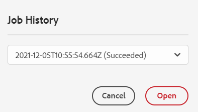

# 將數位資產新增至[!DNL Adobe Experience Manager]做為[!DNL Cloud Service] [!DNL Assets] {#add-assets-to-experience-manager}

[!DNL Adobe Experience Manager Assets]接受許多來源的數位資產型別。 它會儲存二進位檔和已建立的轉譯，可以使用各種工作流程和[!DNL Adobe Sensei]服務進行資產處理，允許透過許多管道在多個表面進行分發。

[!DNL Adobe Experience Manager]利用豐富的中繼資料、智慧標籤、轉譯和其他數位資產管理(DAM)服務，豐富上傳數位檔案的二進位內容。 您可以從本機資料夾或網路磁碟機將各種型別的檔案（例如影像、檔案及原始影像檔案）上傳到[!DNL Experience Manager Assets]。

除了最常用的瀏覽器上傳之外，還有其他將資產新增至[!DNL Experience Manager]存放庫的方法。 這些其他方法包括案頭使用者端(例如Adobe Asset Link或[!DNL Experience Manager]案頭應用程式)、上傳和客戶將會建立的擷取指令碼，以及新增為[!DNL Experience Manager]擴充功能的自動化擷取整合。

雖然您可以上傳和管理[!DNL Experience Manager]中的任何二進位檔案，但最常用的檔案格式支援其他服務，例如中繼資料擷取或預覽/轉譯產生。 如需詳細資訊，請參閱[支援的檔案格式](file-format-support.md)。

您也可以選擇對上傳的資產完成其他處理。 您可以在上傳資產的資料夾上設定數個資產處理設定檔，以新增特定中繼資料、轉譯或影像處理服務。 請參閱上傳時[處理資產](#process-when-uploaded)。

[!DNL Assets]提供下列上傳方法。 Adobe建議您先瞭解上傳選項的使用案例與適用性，再開始使用。

| 上傳方法 | 何時使用？ | 主要角色 |
|---------------------|----------------|-----------------|
| [Assets主控台使用者介面](#upload-assets) | 偶爾上傳、輕鬆按壓和拖曳、尋找上傳。 請勿使用上傳許多資產。 | 所有使用者 |
| [上傳API](#upload-using-apis) | 適用於上傳期間的動態決策。 | 開發人員 |
| [[!DNL Experience Manager] 桌面應用程式](https://experienceleague.adobe.com/docs/experience-manager-desktop-app/using/using.html) | 低流量資產擷取，但不適用於移轉。 | 管理員、行銷人員 |
| [[!DNL Adobe Asset Link]](https://helpx.adobe.com/tw/enterprise/using/adobe-asset-link.html) | 當創意人員與行銷人員從支援的[!DNL Creative Cloud]案頭應用程式內處理資產時相當實用。 | Creative，行銷人員 |
| [資產大量擷取](#asset-bulk-ingestor) | 建議用於大規模移轉及不定期的大量擷取。 僅適用於支援的資料存放區。 | 管理員、開發人員 |

## 上傳資產 {#upload-assets}

<!-- #ENGCHECK do we support pausing? I couldn't get pause to show with 1.5GB upload.... If not, this should be removed#

   You can pause the uploading of large assets (greater than 500 MB) and resume it later from the same page. Select the **[!UICONTROL Pause]** icon beside progress bar that appears when an upload starts.

   The size above which an asset is considered a large asset is configurable. For example, you can configure the system to consider assets above 1000 MB (instead of 500 MB) as large assets. In this case, **[!UICONTROL Pause]** appears on the progress bar when assets of size greater than 1000 MB are uploaded.

   The [!UICONTROL Pause] option does not show if a file greater than 1000 MB is uploaded with a file less than 1000 MB. However, if you cancel the less than 1000 MB file upload, the **[!UICONTROL Pause]** option appears.

   To modify the size limit, configure the `chunkUploadMinFileSize` property of the `fileupload` node in the CRX repository.

   When you click the **[!UICONTROL Pause]** icon, it toggles to a **[!UICONTROL Play]** icon. To resume uploading, click **[!UICONTROL Play]** option.
-->

<!-- #ENGCHECK do we support pausing? I couldn't get pause to show with 1.5GB upload.... If not, this should be removed#
   The ability to resume uploading is especially helpful in low-bandwidth scenarios and network glitches, where it takes a long time to upload a large asset. You can pause the upload operation and continue later when the situation improves. When you resume, uploading starts from the point where you paused it.
-->

<!-- #ENGCHECK assuming this is not relevant? remove after confirming#
   During the upload operation, [!DNL Experience Manager] saves the portions of the asset being uploaded as chunks of data in the CRX repository. When the upload completes, [!DNL Experience Manager] consolidates these chunks into a single block of data in the repository.

   To configure the cleanup task for the unfinished chunk upload jobs, go to `https://[aem_server]:[port]/system/console/configMgr/org.apache.sling.servlets.post.impl.helper.ChunkCleanUpTask`.
-->

若要上傳檔案（或多個檔案），您可以在案頭上選取檔案，然後在使用者介面（網頁瀏覽器）上拖曳至目的地資料夾。 或者，您可以從使用者介面啟動上傳。

>[!IMPORTANT]
>
>您上傳至Experience Manager的Assets若檔案名稱超過100個字元，在Dynamic Media中使用時，其名稱會縮短。
>
>檔案名稱中的前100個字元會依原樣使用；其餘字元會由英數字元字串取代。 此重新命名方法可確保在Dynamic Media中使用資產時具有唯一名稱。 其用意也是為了適應Dynamic Media中允許的最大資產檔案名稱長度。


1. 在[!DNL Assets]使用者介面中，導覽至您要新增數位資產的位置。
1. 若要上傳資產，請執行下列任一項作業：

   * 在工具列上，按一下&#x200B;**[!UICONTROL 建立]** > **[!UICONTROL 檔案]**。 如有需要，您可以在顯示的對話方塊中重新命名檔案。
   * 在支援HTML5的瀏覽器中，直接在[!DNL Assets]使用者介面上拖曳資產。 不會顯示重新命名檔案的對話方塊。

   

   若要選取多個檔案，請選取`Ctrl`或`Command`索引鍵，然後在檔案選擇器對話方塊中選取資產。 使用iPad時，您一次只能選取一個檔案。

1. 若要取消進行中的上傳，請按一下進度列旁的關閉(`X`)。 當您取消上傳作業時，[!DNL Assets]會刪除已部分上傳的資產部分。
如果您在上傳檔案之前取消上傳作業，[!DNL Assets]會停止上傳目前的檔案並重新整理內容。 不過，不會刪除已上傳的檔案。

1. [!DNL Assets]中的上傳進度對話方塊會顯示已成功上傳檔案的計數以及無法上傳的檔案。
此外，[!DNL Assets]使用者介面會顯示您上傳的最新資產或您先建立的資料夾。

>[!NOTE]
>
>若要上傳巢狀資料夾階層，請參閱[大量上傳資產](#bulk-upload)。

<!-- #ENGCHECK I'm assuming this is no longer relevant.... If yes, this should be removed#

### Serial uploads {#serialuploads}

Uploading numerous assets in bulk consumes significant I/O resources, which may adversely impact the performance of [!DNL Assets]. In particular, if you have a slow internet connection, the time to upload drastically increases due to a spike in disk I/O. Moreover, your web browser may introduce additional restrictions to the number of POST requests [!DNL Assets] can handle for concurrent asset uploads. As a result, the upload operation fails or terminate prematurely. In other words, [!DNL Assets] may miss some files while ingesting a bunch of files or altogether fail to ingest any file.

To overcome this situation, [!DNL Assets] ingests one asset at a time (serial upload) during a bulk upload operation, instead of the concurrently ingesting all the assets.

Serial uploading of assets is enabled by default. To disable the feature and allow concurrent uploading, overlay the `fileupload` node in CRX-DE and set the value of the `parallelUploads` property to `true`.

### Streamed uploads {#streamed-uploads}

If you upload many assets to [!DNL Experience Manager], the I/O requests to server increase drastically, which reduces the upload efficiency and can even cause some upload task to time out. [!DNL Assets] supports streamed uploading of assets. Streamed uploading reduces the disk I/O during the upload operation by avoiding asset storage in a temporary folder on the server before copying it to the repository. Instead, the data is transferred directly to the repository. This way, the time to upload large assets and the possibility of timeouts is reduced. Streamed upload is enabled by default in [!DNL Assets].

>[!NOTE]
>
>Streaming upload is disabled for [!DNL Experience Manager] running on JEE server with servlet-api version lower than 3.1.
-->

### 處理現有資產的上傳 {#handling-upload-existing-file}

您可以上傳與現有資產具有相同路徑（相同名稱和相同位置）的資產。 但是，會顯示警告對話方塊，其中包含下列選項：

* 取代現有資產：如果您取代現有資產，則資產的中繼資料以及您先前對現有資產所做的任何修改（例如，註解和裁切）都會被刪除。

  >[!NOTE]
  >
  >如果資產已鎖定或出庫，則無法使用取代資產的選項。

* 建立其他版本：在存放庫中建立現有資產的新版本。 您可以在[!UICONTROL 時間表]中檢視這兩個版本，並可視需要還原成先前的現有版本。
* 保留兩者：如果您選擇保留兩個資產，則新資產會重新命名。

若要在[!DNL Assets]中保留重複的資產，請按一下[保留]。**** 若要刪除您上傳的重複資產，請按一下[刪除]。****

### 檔案名稱處理和禁止使用的字元 {#filename-handling}

[!DNL Experience Manager Assets]會防止您上傳檔案名稱中包含禁止使用的字元的資產。 如果您嘗試上傳檔案名稱包含不允許的字元或多個字元的資產，[!DNL Assets]會顯示警告訊息並停止上傳，直到您移除這些字元或使用允許名稱上傳為止。

為了符合您組織的特定檔案命名慣例，[!UICONTROL 上傳Assets]對話方塊可讓您為上傳的檔案指定長名稱。 不支援下列（以空格分隔的）字元清單：

* 資產名稱的字元無效： `* / : [ \\ ] | # % { } ? &`
* 資產資料夾名稱的字元無效： `* / : [ \\ ] | # % { } ? \" . ^ ; + & \t`

## 大量上傳資產 {#bulk-upload}

大量資產擷取器能夠有效地處理許多資產。 不過，大規模擷取並不僅僅是廣泛的檔案傾印或休閒移轉。 若要讓大規模內嵌成為符合您業務目的且有效率的有意義專案，請規劃移轉並組織資產組織。 所有內嵌都不同，因此非歸納，而是會考量細微的存放庫構成和業務需求。 以下是規劃和執行大量擷取的一些整體建議：

* 組織資產：移除DAM中不需要的資產。 請考慮移除未使用、過時或重複的資產。 這類內部管理可減少傳輸資料和擷取的資產，進而加快擷取速度。
* 組織資產：請考慮以某些邏輯順序組織內容，例如檔案大小、檔案格式、使用案例或優先順序。 一般而言，大型複雜檔案需要更多處理。 您也可以考慮使用檔案大小篩選選項（如下所述），個別擷取大型檔案。
* 交錯擷取：請考慮將擷取分割為多個大量擷取專案。 q可讓您更快看到內容，並視需要更新您的內嵌。 例如，您可在非尖峰時間擷取處理密集的資產，或逐漸在多個區塊中擷取。 不過，您可以一次擷取不需要太多處理的較小且較簡單的資產。

若要上傳大量檔案，請使用下列其中一種方法。 另請參閱[使用案例和方法](#upload-methods-comparison)

* [資產上傳API](developer-reference-material-apis.md#asset-upload)：如有必要，請使用自訂上傳指令碼或使用API的工具來新增資產的額外處理（例如，翻譯中繼資料或重新命名檔案）。
* [[!DNL Experience Manager] 案頭應用程式](https://experienceleague.adobe.com/docs/experience-manager-desktop-app/using/using.html)：對於從本機檔案系統上傳資產的創意專業人員和行銷人員非常有用。 用它來上傳本機可用的巢狀資料夾。
* [大量擷取工具](#asset-bulk-ingestor)：在部署[!DNL Experience Manager]時，用於偶爾或最初擷取大量資產。

### 資產大量匯入工具 {#asset-bulk-ingestor}

此工具僅提供給管理員群組，用於從Azure或S3資料存放區大規模擷取資產。 請參閱設定和擷取的影片逐步解說。

>[!VIDEO](https://video.tv.adobe.com/v/329680/?quality=12&learn=on)

下圖說明從資料存放區擷取資產至Experience Manager時的各個階段：


**先決條件**

使用此功能需要來自Azure或AWS的外部儲存帳戶或貯體。

>[!NOTE]
>
>將儲存體帳戶容器或貯體建立為私用，並僅接受來自授權請求的連線。 但是，不支援對輸入網路連線的額外限制。

>[!NOTE]
>
>外部儲存體帳戶的檔案/資料夾名稱規則可能與「大量匯入」工具不同。 如需有關不允許/逸出的名稱的詳細資訊，請參閱[在大量匯入期間處理檔案名稱](#filename-handling-bulkimport)。


### 設定大量匯入工具 {#configure-bulk-ingestor-tool}

若要設定「大量匯入」工具，請執行下列步驟：

1. 導覽至&#x200B;**[!UICONTROL 工具]** > **[!UICONTROL Assets]** > **[!UICONTROL 大量匯入]**。 選取&#x200B;**[!UICONTROL 建立]**&#x200B;選項。

1. 在&#x200B;**[!UICONTROL 標題]**&#x200B;欄位中指定大量匯入組態的標題。

1. 從&#x200B;**[!UICONTROL 匯入Source]**&#x200B;下拉式清單中選取資料來源型別。

1. 提供值以建立與資料來源的連線。 例如，如果您選取&#x200B;**Azure Blob儲存體**&#x200B;作為資料來源，請指定Azure儲存體帳戶、Azure Blob容器和Azure存取金鑰的值。

1. 從下拉式清單中選取所需的驗證模式。 **Azure存取金鑰**&#x200B;提供對Azure儲存體帳戶的完整存取，而&#x200B;**Azure SAS權杖**&#x200B;可讓系統管理員使用許可權和到期原則來限制權杖的功能。

1. 在「**[!UICONTROL 來源資料夾]**」欄位中提供包含資料來源中資產的根資料夾名稱。

1. （選用）在&#x200B;**[!UICONTROL 依大小下限篩選]**&#x200B;欄位中，提供資產的最小檔案大小（以MB為單位），以納入擷取程式。

1. (可選) 提供資產的檔案大小上限 (以 MB 為單位)，以納入「**[!UICONTROL 按大小上限篩選]**」欄位的擷取程序。

1. （選用）在&#x200B;**[!UICONTROL 排除MIME型別]**&#x200B;欄位中，指定要從擷取中排除的MIME型別清單（以逗號分隔）。 例如 `image/jpeg, image/.*, video/mp4`。請參閱[所有支援的檔案格式](/help/assets/file-format-support.md)。

1. 指定要包含在&#x200B;**[!UICONTROL 包含MIME型別]**&#x200B;欄位之內嵌中的MIME型別清單（以逗號分隔）。 請參閱[所有支援的檔案格式](/help/assets/file-format-support.md)。

1. 選取&#x200B;**[!UICONTROL 匯入後刪除來源檔案]**&#x200B;選項，以在檔案匯入[!DNL Experience Manager]後，從來源資料存放區中刪除原始檔案。

1. 選取「**[!UICONTROL 匯入模式]**」。選取「**跳過**」、「**取代**」或「**建立版本**」。略過模式為預設模式，在此模式中，擷取程式會略過以匯入資產（若已存在）。 檢視[取代和建立版本選項](#handling-upload-existing-file)的意義。

1. 要使用「**[!UICONTROL 資產目標資料夾]**」欄位在所要匯入資產的 DAM 中定義位置，請指定路徑。 例如，`/content/dam/imported_assets`。

1. (選用) 在「**[!UICONTROL 中繼資料檔案]**」欄位中指定要匯入的中繼資料檔案 (以 CSV 格式提供)。在來源Blob位置中指定CSV檔案，並在設定「大量匯入」工具時參照路徑。 當您[大量匯入和匯出資產中繼資料](https://experienceleague.adobe.com/docs/experience-manager-cloud-service/content/assets/admin/metadata-import-export.html)時，此欄位中參考的CSV檔案格式與CSV檔案格式相同。 如果您選取&#x200B;**匯入後刪除來源檔案**&#x200B;選項，請使用&#x200B;**排除**、**包含MIME型別**&#x200B;或&#x200B;**依路徑/檔案**&#x200B;欄位篩選CSV檔案。 您可以使用規則運算式來篩選這些欄位中的CSV檔案。

1. 按一下[儲存]儲存組態。****

### 管理大量匯入工具設定 {#manage-bulk-import-configuration}

建立大量匯入工具設定後，您可以先執行工作以評估設定，然後再將資產大量擷取到Experience Manager執行個體。 若要檢視可用來管理大量匯入工具組態的可用選項，請選取位於&#x200B;**[!UICONTROL 工具]** > **[!UICONTROL Assets]** > **[!UICONTROL 大量匯入]**&#x200B;的可用組態。

### 編輯設定 {#edit-configuration}

若要編輯組態詳細資料，請選取組態，然後按一下[編輯]。**** 執行編輯操作時，您無法編輯設定和匯入資料來源的標題。

### 刪除設定 {#delete-configuration}

選取組態，然後按一下&#x200B;**[!UICONTROL 刪除]**&#x200B;以刪除大量匯入組態。

### 驗證與資料來源的連線 {#validate-connection}

若要驗證與資料來源的連線，請選取組態，然後按一下&#x200B;**[!UICONTROL 檢查]**。 如果連線成功，Experience Manager會顯示下列訊息：


### 叫用大量匯入工作的測試回合 {#invoke-test-run-bulk-import}

選取組態並按一下&#x200B;**[!UICONTROL 試執行]**&#x200B;以叫用大量匯入工作的測試回合。 Experience Manager會顯示下列有關大量匯入工作的詳細資訊：


### 大量匯入期間處理檔名 {#filename-handling-bulkimport}

當您大量匯入資產或資料夾時，[!DNL Experience Manager Assets] 會匯入存在於匯入來源中的整個結構。 [!DNL Experience Manager] 會遵循資產和資料夾名稱中內建的特殊字元規則，因此這些檔名需要經過清理。 對於資料夾名稱和資產名稱，使用者定義的標題保持不變，並且儲存在 `jcr:title` 中。

在大量匯入期間，[!DNL Experience Manager] 會尋找現有資料夾以避免重複匯入資產和資料夾，並確認在發生匯入的父資料夾中已套用清理規則。 如果已在父資料夾中套用清理規則，則相同的規則也將套用於匯入來源。 對於新匯入，將套用以下清理規則來管理資產和資料夾的檔名。

**大量匯入中不允許的名稱**

檔案和資料夾名稱中不允許使用下列字元：

* 控制字元和私用字元（0x00到0x1F， \u0081， \uE000）
* 以點(.)結尾的檔案或資料夾名稱

匯入程式期間會略過名稱符合這些條件的檔案或資料夾，並標示為失敗。

**正在處理大量匯入的資產名稱**

對於資產檔案名稱，會使用API來清除JCR名稱和路徑： `JcrUtil.escapeIllegalJcrChars`。

* Unicode字元不會變更
* 以其URL逸出代碼取代特殊字元，例如，`new%asset.png`已更新為`new%25asset.png`：

  ```
                  URL escape code   
  
  "               %22
  %               %25
  '               %27
  *               %2A
  /               %2F
  :               %3A
  [               %5B
  \n              %0A
  \r              %0D
  \t              %09
  ]               %5D
  |               %7C
  ```

**正在處理大量匯入的資料夾名稱**

針對資料夾檔案名稱，會使用API來清除JCR名稱和路徑： `DamUtil.getSanitizedFolderName`。

* 大寫字元轉換為小寫
* Unicode字元不會變更
* 以破折號(&#39;-&#39;)取代特殊字元，例如，`new folder`已更新為`new-folder`：

  ```
  "                           
  #                         
  %                           
  &                          
  *                           
  +                          
  .                           
  :                           
  ;                          
  ?                          
  [                           
  ]                           
  ^                         
  {                         
  }                         
  |                           
  /         It is used for split folder in cloud storage and is pre-handled, no conversion here.
  \         Not allowed in Azure, allowed in AWS.
  \t
  space     It is the space character.
  ```

<!-- 
[!DNL Experience Manager Assets] manages the forbidden characters in the filenames while you upload assets or folders. [!DNL Experience Manager] updates only the node names in the DAM repository. However, the `title` of the asset or folder remains unchanged.

Following are the file naming conventions that are applied while uploading assets or folders in [!DNL Experience Manager Assets]:

| Characters &Dagger; | When occurring in file names | When occurring in folder names | Example |
|---|---|---|---|
| `. / : [ ] | *` | Replaced with `-` (hyphen). | Replaced with `-` (hyphen). A `.` (dot) in the filename extension is retained as is. | Replaced with `-` (hyphen). | `myimage.jpg` remains as is and `my.image.jpg` changes to `my-image.jpg`. |
| `% ; # , + ? ^ { } "` and whitespaces | Whitespaces are retained | Replaced with `-` (hyphen). | `My Folder.` changes to `my-folder-`. |
| `# % { } ? & .` | Replaced with `-` (hyphen). | NA. | `#My New File.` changes to `-My New File-`. |
| Uppercase characters | Casing is retained as is. | Changed to lowercase characters. | `My New Folder` changes to `my-new-folder`. |
| Lppercase characters | Casing is retained as is. | Casing is retained as is. | NA. |

&Dagger; The list of characters is a whitespace-separated list.
-->

#### 排程一次性或循環的大量匯入 {#schedule-bulk-import}

要安排單次或定期大量匯入的排程，請執行以下步驟：

1. 建立大量匯入設定。
1. 選取設定，然後從工具列選取&#x200B;**[!UICONTROL 排程]**。
1. 設定單次擷取或排定每小時、每天或每週排程。按一下「**[!UICONTROL 提交]**」。

   


#### 檢視Assets目標資料夾 {#view-assets-target-folder}

若要檢視在執行大量匯入工作後匯入資產的Assets目標位置，請選取設定，然後按一下&#x200B;**[!UICONTROL 檢視Assets]**。

#### 執行大量匯入工具 {#run-bulk-import-tool}

在[設定大量匯入工具](#configure-bulk-ingestor-tool)，並選擇性[管理大量匯入工具設定](#manage-bulk-import-configuration)之後，您可以執行設定工作以開始大量擷取資產。

若要啟動大量匯入程式，請瀏覽至&#x200B;**[!UICONTROL 工具]** > **[!UICONTROL Assets]** > **[!UICONTROL 大量匯入]**，選取[大量匯入設定](#configure-bulk-ingestor-tool)，然後按一下&#x200B;**[!UICONTROL 執行]**。 再按一下&#x200B;**[!UICONTROL 執行]**&#x200B;以確認。

Experience Manager會在成功完成工作後，將工作的狀態更新為&#x200B;**處理中**&#x200B;和&#x200B;**成功**。 若要在Experience Manager中檢視匯入的資產，請按一下[檢視Assets]。****

當工作正在進行時，您也可以選取組態並按一下[停止] **以停止大量擷取程式。**&#x200B;再按一下[執行&#x200B;****]繼續此程式。 您也可以按一下&#x200B;**試執行**，瞭解仍在等候匯入的資產詳細資訊。

#### 管理執行後的工作 {#manage-jobs-after-execution}

Experience Manager可讓您檢視大量匯入工作的歷史記錄。 工作歷史記錄包含工作的狀態、工作建立者、記錄以及其他詳細資訊，例如開始日期和時間、建立日期和時間，以及完成日期和時間。

若要存取組態的工作記錄，請選取組態並按一下&#x200B;**[!UICONTROL 工作記錄]**。 選取工作並按一下[開啟]。****



Experience Manager會顯示工作歷史記錄。 在[大量匯入工作記錄]頁面上，您也可以按一下[刪除]，刪除[大量匯入]組態的該工作。****


## 使用案頭使用者端上傳資產 {#upload-assets-desktop-clients}

除了網頁瀏覽器使用者介面，[!DNL Experience Manager]還支援案頭上的其他使用者端。 它們也提供上傳體驗，無需前往網頁瀏覽器。

* [[!DNL Adobe Asset Link]](https://helpx.adobe.com/tw/enterprise/using/adobe-asset-link.html)可讓您存取Adobe Photoshop、Adobe Illustrator和Adobe InDesign案頭應用程式中[!DNL Experience Manager]的資產。 您可以從這些案頭應用程式內，直接從Adobe Asset Link使用者介面將目前開啟的檔案上傳到[!DNL Experience Manager]。
* [[!DNL Experience Manager] 案頭應用程式](https://experienceleague.adobe.com/docs/experience-manager-desktop-app/using/using.html)可簡化在案頭上處理資產的工作，不受其檔案型別或處理資產的原生應用程式影響。 從本機檔案系統上傳巢狀資料夾階層的檔案會很有用，因為瀏覽器上傳僅支援上傳一般檔案清單。

## 上傳時處理資產 {#process-when-uploaded}

若要對已上傳的資產執行其他處理，您可以對上傳資料夾套用處理設定檔。 設定檔可在[!DNL Assets]中資料夾的&#x200B;**[!UICONTROL 屬性]**&#x200B;頁面中使用。 沒有副檔名或副檔名不正確的數位資產不會視需要處理。 例如，上傳這類資產時，可能沒有任何反應，或資產適用的處理設定檔不正確。 使用者仍然可以在DAM中儲存二進位檔案。


可使用下列標籤：

* [中繼資料設定檔](metadata-profiles.md)可讓您將預設中繼資料屬性套用至上傳至該資料夾的資產。
* [處理設定檔](asset-microservices-configure-and-use.md)可讓您產生超過預設可能的轉譯。

此外，如果您的部署已啟用[!DNL Dynamic Media]，則可使用下列標籤：

* [[!DNL Dynamic Media] 影像設定檔](dynamic-media/image-profiles.md)可讓您套用特定的裁切（**[!UICONTROL 智慧型裁切]**&#x200B;和畫素裁切）和銳利化設定至上傳的資產。
* [[!DNL Dynamic Media] 視訊設定檔](dynamic-media/video-profiles.md)可讓您套用特定的視訊編碼設定檔（解析度、格式、引數）。

>[!NOTE]
>
>對資產執行[!DNL Dynamic Media]裁切和其他作業並非破壞性，也就是說，這些作業不會變更上傳的原始檔案。 而是會在傳送資產時，提供用於裁切或轉換的引數。

若為已指派處理設定檔的資料夾，設定檔名稱會出現在卡片檢視的縮圖上。 在清單檢視中，設定檔名稱會顯示在&#x200B;**[!UICONTROL 處理設定檔]**&#x200B;欄中。

## 使用API上傳或內嵌資產 {#upload-using-apis}

開發人員參考的[資產上傳](developer-reference-material-apis.md#asset-upload)區段中提供上傳API和通訊協定的技術詳細資料，以及開放原始碼SDK和範例使用者端的連結。

## 提示、最佳實務和限制 {#tips-limitations}

* 直接二進位上傳是上傳資產的新方法。 產品功能和使用者端預設支援此功能，例如[!DNL Experience Manager]使用者介面、[!DNL Adobe Asset Link]和[!DNL Experience Manager]案頭應用程式。 客戶技術團隊自訂或擴充的任何自訂程式碼都必須使用新的上傳API和通訊協定。

* Adobe建議在[!DNL Experience Manager Assets]的每個資料夾中新增不超過1000個資產。 如果您嘗試這麼做，可能會收到警告訊息，指出「此目錄包含1000個以上的專案。 上傳和新資料夾建立可能延遲。」 雖然您仍可以將更多資產新增至資料夾，但您可能會遇到效能問題，例如導覽至這類資料夾的速度變慢。

* 當您在[!UICONTROL 名稱衝突]對話方塊中選取&#x200B;**[!UICONTROL 取代]**&#x200B;時，系統會重新產生新資產的資產識別碼。 此ID與先前資產的ID不同。 如果[Assets Insights](/help/assets/assets-insights.md)已啟用透過[!DNL Adobe Analytics]追蹤閱聽或點按，則重新產生的資產ID會使在[!DNL Analytics]上擷取的資產資料失效。

* 有些上傳方法不會阻止您上傳檔案名稱中有[禁止使用的字元](#filename-handling)的資產。 字元已取代為`-`符號。

* 使用瀏覽器上傳資產僅支援一般檔案清單，不支援巢狀資料夾階層。 若要上傳巢狀資料夾內的所有資產，請考慮使用[案頭應用程式](#upload-assets-desktop-clients)。

* 大量匯入方法會匯入資料來源中存在的整個資料夾結構。 不過，在[!DNL Experience Manager]中只會建立非空白資料夾。


<!-- TBD: Link to file name handling in DA docs when it is documented. 
-->

**另請參閱**

* [翻譯資產](translate-assets.md)
* [Assets HTTP API](mac-api-assets.md)
* [資產支援的檔案格式](file-format-support.md)
* [搜尋資產](search-assets.md)
* [連接的資產](use-assets-across-connected-assets-instances.md)
* [資產報表](asset-reports.md)
* [中繼資料結構描述](metadata-schemas.md)
* [下載資產](download-assets-from-aem.md)
* [管理中繼資料](manage-metadata.md)
* [搜尋 Facet](search-facets.md)
* [管理收藏集](manage-collections.md)
* [大量中繼資料匯入](metadata-import-export.md)
* [發佈資產至 AEM 和 Dynamic Media](/help/assets/publish-assets-to-aem-and-dm.md)

>[!MORELIKETHIS]
>
>* [[!DNL Adobe Experience Manager] 桌面應用程式](https://experienceleague.adobe.com/docs/experience-manager-desktop-app/using/introduction.html)
>* [關於 [!DNL Adobe Asset Link]](https://www.adobe.com/tw/creativecloud/business/enterprise/adobe-asset-link.html)
>* [[!DNL Adobe Asset Link] 文件](https://helpx.adobe.com/tw/enterprise/using/adobe-asset-link.html)
>* [資產上傳的技術參考](developer-reference-material-apis.md#asset-upload)
