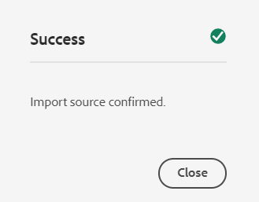

# 將數位資產新增至 [!DNL Adobe Experience Manager] as a [!DNL Cloud Service] [!DNL Assets] {#add-assets-to-experience-manager}

[!DNL Adobe Experience Manager Assets] 接受來自許多來源的許多類型數位資產。 它可儲存二進位檔和建立的轉譯，並使用各種工作流程和 [!DNL Adobe Sensei] 服務，可透過許多介面的許多管道進行分送。

[!DNL Adobe Experience Manager] 透過豐富的中繼資料、智慧標籤、轉譯及其他數位資產管理(DAM)服務，豐富上傳數位檔案的二進位內容。 您可以從本地資料夾或網路驅動器將各種類型的檔案（如影像、文檔和原始影像檔案）上載到 [!DNL Experience Manager Assets].

除了最常使用的瀏覽器上傳外，其他將資產新增至 [!DNL Experience Manager] 存放庫，包括案頭用戶端，例如Adobe資產連結或 [!DNL Experience Manager] 案頭應用程式、上傳和擷取指令碼（客戶可建立），以及自動擷取整合新增為 [!DNL Experience Manager] 擴充功能。

若要上傳和管理任何二進位檔案，請依 [!DNL Experience Manager]，最常用的檔案格式會支援其他服務，例如中繼資料擷取或預覽/轉譯產生。 請參閱 [支援的檔案格式](file-format-support.md) 以取得詳細資訊。

您也可以選擇對上傳的資產執行其他處理。 您可以在資料夾上設定多個資產處理設定檔，並將資產上傳至該資料夾，以新增特定中繼資料、轉譯或影像處理服務。 請參閱 [上傳時處理資產](#process-when-uploaded).

[!DNL Assets] 提供下列上傳方法。 Adobe建議您先了解上傳選項的使用案例和適用性，再加以使用。

| 上傳方法 | 何時使用？ | 主要角色 |
|---------------------|----------------|-----------------|
| [Assets Console使用者介面](#upload-assets) | 偶爾上傳、輕鬆按下和拖曳、搜尋器上傳。 請勿上傳大量資產。 | 所有使用者 |
| [上傳API](#upload-using-apis) | 用於上傳期間的動態決策。 | 開發人員 |
| [[!DNL Experience Manager] 桌面應用程式](https://experienceleague.adobe.com/docs/experience-manager-desktop-app/using/using.html) | 大量資產擷取量低，但不適用於移轉。 | 管理員、行銷人員 |
| [[!DNL Adobe Asset Link]](https://helpx.adobe.com/enterprise/admin-guide.html/enterprise/using/adobe-asset-link.ug.html) | 當創意人員和行銷人員從受支援者中處理資產時相當實用 [!DNL Creative Cloud] 案頭應用程式。 | 創意、行銷人員 |
| [資產大量內嵌](#asset-bulk-ingestor) | 建議進行大規模遷移和偶爾批量遷移。 僅適用於支援的資料存放區。 | 管理員、開發人員 |

## 上傳資產 {#upload-assets}

<!-- #ENGCHECK do we support pausing? I couldn't get pause to show with 1.5GB upload.... If not, this should be removed#

   You can pause the uploading of large assets (greater than 500 MB) and resume it later from the same page. Tap the **[!UICONTROL Pause]** icon beside progress bar that appears when an upload starts.

   The size above which an asset is considered a large asset is configurable. For example, you can configure the system to consider assets above 1000 MB (instead of 500 MB) as large assets. In this case, **[!UICONTROL Pause]** appears on the progress bar when assets of size greater than 1000 MB are uploaded.

   The [!UICONTROL Pause] option does not show if a file greater than 1000 MB is uploaded with a file less than 1000 MB. However, if you cancel the less than 1000 MB file upload, the **[!UICONTROL Pause]** option appears.

   To modify the size limit, configure the `chunkUploadMinFileSize` property of the `fileupload` node in the CRX repository.

   When you click the **[!UICONTROL Pause]** icon, it toggles to a **[!UICONTROL Play]** icon. To resume uploading, click **[!UICONTROL Play]** option.
-->

<!-- #ENGCHECK do we support pausing? I couldn't get pause to show with 1.5GB upload.... If not, this should be removed#
   The ability to resume uploading is especially helpful in low-bandwidth scenarios and network glitches, where it takes a long time to upload a large asset. You can pause the upload operation and continue later when the situation improves. When you resume, uploading starts from the point where you paused it.
-->

<!-- #ENGCHECK assuming this is not relevant? remove after confirming#
   During the upload operation, [!DNL Experience Manager] saves the portions of the asset being uploaded as chunks of data in the CRX repository. When the upload completes, [!DNL Experience Manager] consolidates these chunks into a single block of data in the repository.

   To configure the cleanup task for the unfinished chunk upload jobs, go to `https://[aem_server]:[port]/system/console/configMgr/org.apache.sling.servlets.post.impl.helper.ChunkCleanUpTask`.
-->

若要上傳檔案（或多個檔案），您可以在案頭上選取檔案，然後拖曳使用者介面（網頁瀏覽器）至目標資料夾。 或者，您也可以從使用者介面起始上傳。

1. 在 [!DNL Assets] 使用者介面，導覽至您要新增數位資產的位置。
1. 若要上傳資產，請執行下列其中一項操作：

   * 在工具列上，按一下 **[!UICONTROL 建立]** > **[!UICONTROL 檔案]**. 您可以視需要重新命名顯示對話方塊中的檔案。
   * 在支援HTML5的瀏覽器中，將資產直接拖曳至 [!DNL Assets] 使用者介面。 不會顯示要更名檔案的對話框。

   

   若要選取多個檔案，請選取 `Ctrl` 或 `Command` 鍵並在檔案選取器對話方塊中選取資產。 使用iPad時，一次只能選取一個檔案。

1. 若要取消持續上傳，請按一下關閉(`X`)。 取消上傳操作時， [!DNL Assets] 刪除資產的已部分上傳部分。
如果您在檔案上傳前取消上傳作業， [!DNL Assets] 停止上傳目前的檔案並重新整理內容。 不過，不會刪除已上傳的檔案。

1. 上傳進度對話方塊，位於 [!DNL Assets] 顯示成功上傳的檔案的計數以及無法上傳的檔案。
此外， [!DNL Assets] 使用者介面會顯示您上傳的最新資產，或您先建立的資料夾。

>[!NOTE]
>
>若要上傳巢狀資料夾階層，請參閱 [大量上傳資產](#bulk-upload).

<!-- #ENGCHECK I'm assuming this is no longer relevant.... If yes, this should be removed#

### Serial uploads {#serialuploads}

Uploading numerous assets in bulk consumes significant I/O resources, which may adversely impact the performance of [!DNL Assets]. In particular, if you have a slow internet connection, the time to upload drastically increases due to a spike in disk I/O. Moreover, your web browser may introduce additional restrictions to the number of POST requests [!DNL Assets] can handle for concurrent asset uploads. As a result, the upload operation fails or terminate prematurely. In other words, [!DNL Assets] may miss some files while ingesting a bunch of files or altogether fail to ingest any file.

To overcome this situation, [!DNL Assets] ingests one asset at a time (serial upload) during a bulk upload operation, instead of the concurrently ingesting all the assets.

Serial uploading of assets is enabled by default. To disable the feature and allow concurrent uploading, overlay the `fileupload` node in CRX-DE and set the value of the `parallelUploads` property to `true`.

### Streamed uploads {#streamed-uploads}

If you upload many assets to [!DNL Experience Manager], the I/O requests to server increase drastically, which reduces the upload efficiency and can even cause some upload task to time out. [!DNL Assets] supports streamed uploading of assets. Streamed uploading reduces the disk I/O during the upload operation by avoiding asset storage in a temporary folder on the server before copying it to the repository. Instead, the data is transferred directly to the repository. This way, the time to upload large assets and the possibility of timeouts is reduced. Streamed upload is enabled by default in [!DNL Assets].

>[!NOTE]
>
>Streaming upload is disabled for [!DNL Experience Manager] running on JEE server with servlet-api version lower than 3.1.
-->

### 資產已存在時處理上傳 {#handling-upload-existing-file}

您可以上傳與現有資產路徑相同（名稱和位置相同）的資產。 不過，會顯示警告對話方塊，其中包含下列選項：

* 汰換現有資產：如果您取代現有資產，則會刪除資產的中繼資料以及您對現有資產所做的任何先前修改（例如註解、裁切等）。
* 建立其他版本：系統會在存放庫中建立新版本的現有資產。 您可以在 [!UICONTROL 時間表] 並可視需要回復至先前的現有版本。
* 保留兩者：如果您選擇保留兩個資產，則會重新命名新資產。

若要在 [!DNL Assets]，按一下 **[!UICONTROL 保留]**. 若要刪除您上傳的重複資產，請按一下 **[!UICONTROL 刪除]**.

### 檔案名稱處理和禁止的字元 {#filename-handling}

[!DNL Experience Manager Assets] 會嘗試防止上傳檔案名稱中含有禁止字元的資產。 如果您嘗試上傳檔案名稱包含不允許的字元或更多字元的資產， [!DNL Assets] 顯示警告訊息並停止上傳，直到您移除這些字元或上傳並且允許名稱為止。

若要符合貴組織的特定檔案命名慣例，請 [!UICONTROL 上傳資產] 對話方塊可讓您為上傳的檔案指定長名稱。 不支援下列（以空格分隔的）字元清單：

* 資產檔案名稱的字元無效 `* / : [ \\ ] | # % { } ? &`
* 資產資料夾名稱的字元無效 `* / : [ \\ ] | # % { } ? \" . ^ ; + & \t`

## 大量上傳資產 {#bulk-upload}

大量資產擷取工具可有效處理大量資產。 不過，大規模擷取不只是廣泛的檔案傾印或臨時移轉。 為了將大規模擷取作為符合您業務目的且有效率的有意義的專案，請規劃移轉並組織資產組織。 所有收集都不同，因此在細緻的儲存庫構成和業務需求中，不能概括性地考慮。 以下是計畫及執行大量擷取的幾項總體建議：

* 組織資產：移除DAM中不需要的資產。 請考慮移除未使用、過時或重複的資產。 這可減少資料傳輸和擷取的資產，進而加快擷取速度。
* 組織資產：請考慮按照某種邏輯順序組織內容，例如按檔案大小、檔案格式、使用案例或優先順序。 一般而言，大型複雜檔案需要更多處理。 您也可以考慮使用檔案大小篩選選項（如下所述）個別擷取大型檔案。
* 交錯擷取：請考慮將擷取分割為多個大量擷取專案。 這可讓您更快查看內容，並視需要更新擷取。 例如，您可以在非尖峰時段內內嵌處理密集型資產，或逐步以多個區塊內嵌。 不過，您可以一次內嵌較小且較簡單的資產，而不需要多大的處理。

若要上傳較多檔案，請使用下列其中一種方法。 另請參閱 [使用案例和方法](#upload-methods-comparison)

* [資產上傳API](developer-reference-material-apis.md#asset-upload):視需要使用自訂上傳指令碼或工具，利用API來新增資產的其他處理方式（例如轉譯中繼資料或重新命名檔案）。
* [[!DNL Experience Manager] 案頭應用程式](https://experienceleague.adobe.com/docs/experience-manager-desktop-app/using/using.html):適合從本機檔案系統上傳資產的創意專業人員和行銷人員。 使用它上傳可在本機使用的巢狀資料夾。
* [大量擷取工具](#asset-bulk-ingestor):部署時，偶爾或最初擷取大量資產時使用 [!DNL Experience Manager].

### 資產大量匯入工具 {#asset-bulk-ingestor}

此工具僅提供給管理員群組，以用於從Azure或S3資料存放區大量擷取資產。 請參閱設定和擷取的影片逐步說明。

>[!VIDEO](https://video.tv.adobe.com/v/329680/?quality=12&learn=on)

下圖說明從資料存放區內嵌資產以Experience Manager時的各個階段：

#### 必備條件 {#prerequisites-bulk-ingestion}

您必須有源blob儲存詳細資訊，才能將Experience Manager實例連接到資料儲存。

#### 配置批量導入工具 {#configure-bulk-ingestor-tool}

若要設定「大量匯入」工具，請遵循下列步驟：

1. 導覽至 **[!UICONTROL 工具]** > **[!UICONTROL 資產]** > **[!UICONTROL 大量匯入]**. 選取 **[!UICONTROL 建立]** 選項。

1. 在 **[!UICONTROL 標題]** 欄位。

1. 從 **[!UICONTROL 導入源]** 下拉式清單。

1. 提供值以建立與資料來源的連線。 例如，若您選取 **Azure Blob儲存** 作為資料源，請指定Azure儲存帳戶、Azure blob容器和Azure訪問密鑰的值。

1. 提供根資料夾的名稱，該根資料夾包含 **[!UICONTROL 源資料夾]** 欄位。

1. （選用）提供資產的檔案大小下限(MB)，以便納入 **[!UICONTROL 按最小大小篩選]** 欄位。

1. （選用）提供資產的檔案大小上限(MB)，以將其納入 **[!UICONTROL 按最大大小篩選]** 欄位。

1. （選用）指定要從中擷取以逗號分隔的MIME類型清單 **[!UICONTROL 排除MIME類型]** 欄位。 例如， `image/jpeg, image/.*, video/mp4`. 請參閱 [所有支援的檔案格式](/help/assets/file-format-support.md).

1. 指定要從中擷取包含的MIME類型清單（以逗號分隔） **[!UICONTROL 包含MIME類型]** 欄位。 請參閱 [所有支援的檔案格式](/help/assets/file-format-support.md).

1. 選取 **[!UICONTROL 導入後刪除源檔案]** 將檔案導入後從源資料儲存中刪除原始檔案的選項 [!DNL Experience Manager].

1. 選取 **[!UICONTROL 匯入模式]**. 選擇 **略過**, **取代**，或 **建立版本**. 「略過」模式是預設模式，在此模式中，擷取者會略過匯入資產（如果資產已存在）。 請參閱 [替換和建立版本選項](#handling-upload-existing-file).

1. 指定路徑以定義DAM中要使用匯入資產的位置 **[!UICONTROL 資產目標資料夾]** 欄位。 例如， `/content/dam/imported_assets`.

1. （選用）指定要匯入的中繼資料檔案，以CSV格式提供，位於 **[!UICONTROL 中繼資料檔案]** 欄位。 在來源blob位置中指定CSV檔案，並在設定大量匯入工具時參考路徑。 當您 [大量匯入和匯出資產中繼資料](https://experienceleague.adobe.com/docs/experience-manager-cloud-service/assets/admin/metadata-import-export.html). 如果您選取 **導入後刪除源檔案** 選項，使用 **排除** 或 **包含MIME類型** 或 **依路徑/檔案篩選** 欄位。 您可以使用規則運算式來篩選這些欄位中的CSV檔案。

1. 按一下 **[!UICONTROL 儲存]** 以儲存設定。

#### 管理批量導入工具配置 {#manage-bulk-import-configuration}

建立大量匯入工具設定後，您可以先執行工作以評估設定，再將大量資產擷取至您的Experience Manager例項。 選取可用的設定 **[!UICONTROL 工具]** > **[!UICONTROL 資產]** > **[!UICONTROL 大量匯入]** 查看管理批量導入工具配置的可用選項。

##### 編輯設定 {#edit-configuration}

選取設定，然後按一下 **[!UICONTROL 編輯]** 修改配置詳細資訊。 執行編輯操作時，無法編輯配置的標題和導入資料源。

##### 刪除設定 {#delete-configuration}

選取設定，然後按一下 **[!UICONTROL 刪除]** 刪除批量導入配置。

##### 驗證與資料源的連接 {#validate-connection}

選取設定，然後按一下 **[!UICONTROL check]** 驗證與資料來源的連線。 如果連線成功，Experience Manager會顯示下列訊息：

##### 調用批量導入作業的測試運行 {#invoke-test-run-bulk-import}

選取設定，然後按一下 **[!UICONTROL 乾流]** 調用批量導入作業的測試運行。 Experience Manager顯示有關批量導入作業的以下詳細資訊：

##### 排程一次性或循環大量匯入 {#schedule-bulk-import}

若要排程一次性或循環大量匯入，請執行下列步驟：

1. 建立大量匯入設定。
1. 選取設定並選取 **[!UICONTROL 排程]** 的上界。
1. 設定一次性擷取或排程每小時、每日或每週排程。 按一下 **[!UICONTROL 提交]**.

   

##### 檢視Assets目標資料夾 {#view-assets-target-folder}

選取設定，然後按一下 **[!UICONTROL 檢視資產]** 檢視執行大量匯入工作後匯入資產的Assets目標位置。

#### 執行大量匯入工具 {#run-bulk-import-tool}

之後 [配置批量導入工具](#configure-bulk-ingestor-tool) （可選） [管理批量導入工具配置](#manage-bulk-import-configuration)，您可以執行設定工作以開始大量擷取資產。

導覽至 **[!UICONTROL 工具]** > **[!UICONTROL 資產]** > **[!UICONTROL 大量匯入]**，請選取 [批量導入配置](#configure-bulk-ingestor-tool) 按一下 **[!UICONTROL 執行]** 啟動批量導入過程。 按一下 **[!UICONTROL 執行]** 再次確認。

Experience Manager將作業的狀態更新為 **處理** 和 **成功** 作業成功完成後。 按一下 **檢視資產** 檢視已匯入的Experience Manager。

作業正在進行時，您也可以選取設定，然後按一下 **停止** 來停止大量擷取程式。 按一下 **執行** 以繼續程式。 您也可以按一下 **乾流** 以了解仍待匯入的資產詳細資訊。

#### 執行後管理作業 {#manage-jobs-after-execution}

Experience Manager可讓您查看大量匯入作業的歷史記錄。 作業歷史記錄包括作業的狀態、作業建立者、日誌，以及其他詳細資訊，如開始日期和時間、建立日期和時間、完成日期和時間。

要訪問配置的作業歷史記錄，請選擇配置並按一下 **[!UICONTROL 工作記錄]**. 選擇作業並按一下 **開啟**.

Experience Manager顯示作業歷史記錄。 在「批量導入作業歷史記錄」頁上，也可以按一下 **刪除** 刪除批量導入配置的作業。

## 使用案頭用戶端上傳資產 {#upload-assets-desktop-clients}

除了網頁瀏覽器使用者介面外， [!DNL Experience Manager] 支援案頭上的其他客戶端。 此外，它們也提供上傳體驗，而無需前往網頁瀏覽器。

* [[!DNL Adobe Asset Link]](https://helpx.adobe.com/tw/enterprise/using/adobe-asset-link.html) 可從 [!DNL Experience Manager] 在Adobe Photoshop、Adobe Illustrator和Adobe InDesign案頭應用程式中。 您可以將目前開啟的檔案上傳至 [!DNL Experience Manager] 直接從這些案頭應用程式內的Adobe資產連結使用者介面。
* [[!DNL Experience Manager] 案頭應用程式](https://experienceleague.adobe.com/docs/experience-manager-desktop-app/using/using.html) 可簡化案頭上使用資產的作業，不受檔案類型或處理資產的原生應用程式所影響。 從本機檔案系統上傳巢狀資料夾階層中的檔案特別實用，因為瀏覽器上傳僅支援上傳平面檔案清單。

## 上傳時處理資產 {#process-when-uploaded}

若要對上傳的資產執行其他處理，您可以在上傳資料夾上套用處理設定檔。 設定檔可在 **[!UICONTROL 屬性]** 資料夾頁面(位於 [!DNL Assets]. 沒有擴充功能或擴充功能不正確的數位資產不會視需要處理。 例如，上傳這類資產時，資產不會發生任何情況，或可能會套用錯誤的處理設定檔。 使用者仍可將二進位檔案儲存在DAM中。

可使用下列標籤：

* [中繼資料設定檔](metadata-profiles.md) 可讓您將預設中繼資料屬性套用至上傳至該資料夾的資產。
* [處理設定檔](asset-microservices-configure-and-use.md) 可讓您產生的轉譯數預設為多。

此外，若 [!DNL Dynamic Media] 在您的部署上啟用，則可使用下列標籤：

* [[!DNL Dynamic Media] 影像設定檔](dynamic-media/image-profiles.md) 可讓您套用特定裁切(**[!UICONTROL 智慧型裁切]** 和像素裁切)，以及銳利化上傳資產的設定。
* [[!DNL Dynamic Media] 視訊設定檔](dynamic-media/video-profiles.md) 可讓您套用特定視訊編碼設定檔（解析度、格式、參數）。

>[!NOTE]
>
>[!DNL Dynamic Media] 對資產進行的裁切和其他操作不具破壞性，也就是說，這些操作不會變更已上傳的原始操作。 而是會提供參數，供您在傳送資產時裁切或轉換。

若資料夾已指派處理設定檔，設定檔名稱會顯示在卡片檢視的縮圖上。 在清單檢視中，描述檔名稱會出現在 **[!UICONTROL 處理設定檔]** 欄。

## 使用API上傳或內嵌資產 {#upload-using-apis}

上傳API和通訊協定的技術詳細資訊，以及開放原始碼SDK和範例用戶端的連結，請參閱 [資產上傳](developer-reference-material-apis.md#asset-upload) 開發人員參考的區段。

## 提示、最佳實務和限制 {#tips-limitations}

* 直接二進位上傳是上傳資產的新方法。 產品功能和用戶端(例如 [!DNL Experience Manager] 使用者介面， [!DNL Adobe Asset Link]，和 [!DNL Experience Manager] 案頭應用程式。 由客戶技術團隊自訂或延伸的任何自訂程式碼，都必須使用新的上傳API和通訊協定。

* Adobe建議在中的每個資料夾中新增不超過1000個資產 [!DNL Experience Manager Assets]. 雖然您可以新增更多資產至資料夾，但您可能會遇到效能問題，例如導覽至這類資料夾的速度變慢。

* 選取 **[!UICONTROL 取代]** 在 [!UICONTROL 名稱衝突] 對話框中，將為新資產重新生成資產ID。 此ID與先前資產的ID不同。 若 [Assets Insights](/help/assets/assets-insights.md) 啟用，可追蹤曝光數或點按次數 [!DNL Adobe Analytics]，重新產生的資產ID會讓上為資產擷取的資料失效 [!DNL Analytics].

* 有些上傳方法無法阻止您上傳資產，其中 [禁止字元](#filename-handling) 檔案名中。 字元會取代為 `-` 符號。

* 使用瀏覽器上傳資產只支援平面檔案清單，不支援巢狀資料夾階層。 若要上傳巢狀資料夾內的所有資產，請考慮使用 [案頭應用程式](#upload-assets-desktop-clients).

* 大量匯入方法會匯入整個資料夾結構，因為它存在於資料來源上。 不過，系統只會在中建立非空白資料夾 [!DNL Experience Manager].

<!-- TBD: Link to file name handling in DA docs when it is documented. 
-->

>[!MORELIKETHIS]
>
>* [[!DNL Adobe Experience Manager] 桌面應用程式](https://experienceleague.adobe.com/docs/experience-manager-desktop-app/using/introduction.html)
>* [關於 [!DNL Adobe Asset Link]](https://www.adobe.com/tw/creativecloud/business/enterprise/adobe-asset-link.html)
>* [[!DNL Adobe Asset Link] 文件](https://helpx.adobe.com/enterprise/using/adobe-asset-link.html)
>* [資產上傳技術參考](developer-reference-material-apis.md#asset-upload)

