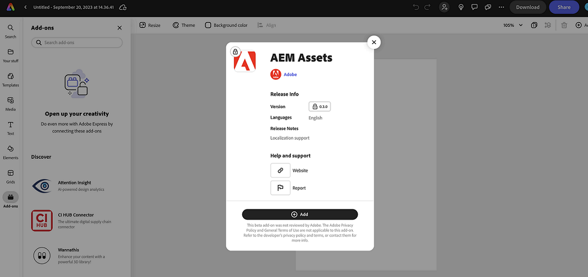

# 適用於 Adobe Express 的 AEM Assets 附加元件 {#assets-addon-adobe-express}

適用於 Adobe Express 的 AEM Assets 附加元件可讓您從 Adobe Express 使用者介面直接存取 AEM Assets 儲存的資源。您可以將 AEM Assets 中管理的內容放置在 Express 畫布中，然後將新的或編輯的內容儲存在 AEM Assets 存放庫中。此附加元件提供以下主要優點：

* 透過在 AEM 中編輯和儲存新資源來提高內容重複使用率

* 減少建立新資產或現有資產新版本的整體時間和精力

## 先決條件 {#prerequisites}

有權存取 Adobe Express 以及 AEM Assets 中至少一個環境。此環境可以是 Assets as a Cloud Service 或 Assets Essentials 中的任何存放庫。

## 將 AEM Assets 附加元件新增至 Adobe Express {#access-assets-addon}

執行以下步驟，將 AEM Assets 附加元件新增至 Adobe Express：

1. 開啟 Adobe Express Web 應用程式。

1. 透過載入新範本或專案或建立新資源來開啟新的空白畫布。

1. 在左側導覽窗格中，點選適用的「**[!UICONTROL 附加元件]**」。

1. 在[!UICONTROL 附加元件]的頂部區段可用搜尋列中指定 **[!UICONTROL AEM Assets]**，並點選 AEM Assets 附加元件。

   

1. 按一下&#x200B;**[!UICONTROL 「新增」]**。此附加元件會顯示在&#x200B;**[!UICONTROL 您附加元件]**&#x200B;部份的清單中。再次按一下該附加元件，即可在右側導覽窗格中顯示內容。此附加元件會顯示您有權存取的存放庫清單，以及根層級可用的資產和資料夾清單。

   使用搜尋列來搜尋您需要在畫布中使用的資源。

   

   A. 選擇您的 AEM Assets 存放庫 B. 使用搜尋列搜尋資產 C. 依升序或降序對資產進行排序 D. 所選位置的可用資產和資料夾。E. 儲存 AEM Assets 中的變更

## 在 Adobe Express 編輯器中使用 AEM Assets {#use-aem-assets-in-express}

將 AEM Assets 附加元件新增至 Adobe Express 後，您可以開始在 Express 畫布內使用儲存在 AEM Assets 存放庫中的 PNG 和 JPEG 影像。導覽至適當的資料夾並按一下資源，即可將其包含在畫布中。

## 將 Adobe Express 專案儲存在 AEM Assets 中 {#save-express-projects-in-assets}

將適當的修改加入 Express 畫布後，您可以將其儲存在 AEM Assets 存放庫中。

1. 按一下「**[!UICONTROL 儲存]**」，開啟「**[!UICONTROL 上傳]**」對話框。
1. 指定資產的名稱和格式。您可以將畫布內容儲存為 PNG 或 JPEG 格式類型。

1. 按一下「**[!UICONTROL 位置]**」欄位旁邊的資料夾圖示，導覽至需要儲存資產的位置，然後按一下「**[!UICONTROL 選取]**」。資料夾名稱會顯示在「**[!UICONTROL 位置]**」欄位內。

1. 按一下「**[!UICONTROL 上傳]**」，將資產上傳到 AEM Assets。

   
