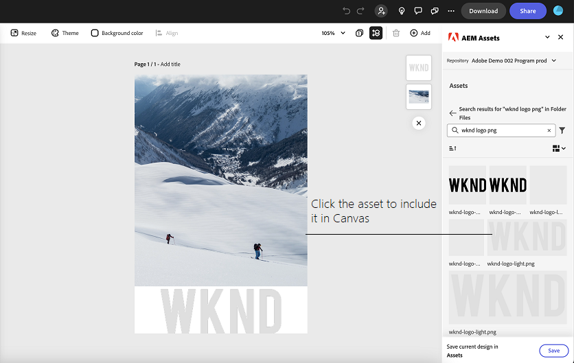

# 適用於Adobe Express的AEM Assets附加元件 {#assets-addon-adobe-express}

適用於Adobe Express的AEM Assets附加元件可讓您從Adobe Express使用者介面直接存取AEM Assets中儲存的資產。 您可以將AEM Assets中管理的內容放在快速畫布中，然後將新內容或編輯過的內容儲存在AEM Assets存放庫中。 此附加元件提供下列主要優點：

* 透過在AEM中編輯和儲存新資產，提高內容重複使用率

* 減少建立新資產或建立現有資產新版本的整體時間和精力

## 先決條件 {#prerequisites}

存取AEM Assets中Adobe Express和至少一個環境的權益。 環境可以是資產as a Cloud Service或Assets Essentials中的任何存放庫。

## 將AEM Assets附加元件新增至Adobe Express {#access-assets-addon}

執行以下步驟，將AEM Assets附加元件新增至Adobe Express：

1. 開啟Adobe ExpressWeb應用程式。

1. 載入新範本或專案，或建立新資產，以開啟新的空白畫布。

1. 按一下 **[!UICONTROL 附加元件]** 可在左側導覽窗格中使用。

1. 指定 **[!UICONTROL AEM Assets]** 在頂端可用的搜尋列中 [!UICONTROL 附加元件] 區段，然後按一下AEM Assets附加元件。

   

1. 按一下 **[!UICONTROL 新增]**. 附加元件會顯示在 **[!UICONTROL 您的附加元件]** 區段。 再按一下附加元件，右側導覽窗格中就會顯示內容。 附加元件會顯示您有權存取的存放庫清單，以及在根層級可用的資產和檔案夾清單。

   使用搜尋列來搜尋您需要在畫布中使用的資產。

   

   A.選取您的AEM Assets存放庫B.使用搜尋列搜尋資產C.以遞增或遞減順序排序資產D.所選位置可用的資產和資料夾。 E.將變更儲存在AEM Assets中

## 在Adobe Express編輯器中使用AEM Assets {#use-aem-assets-in-express}

將AEM Assets附加元件新增至Adobe Express後，您就可以開始使用儲存在AEM Assets存放庫中的PNG和JPEG影像（在快速畫布中）。 導覽至適當的資料夾，然後按一下資產以將其納入畫布中。

## 在AEM Assets中儲存Adobe Express專案 {#save-express-projects-in-assets}

在Express畫布中加入適當的修改後，您就可以將畫布儲存到AEM Assets存放庫中。

1. 按一下 **[!UICONTROL 儲存]** 以開啟 **[!UICONTROL 上傳]** 對話方塊。
1. 指定資產的名稱和格式。 您可以將畫布的內容儲存為PNG或JPEG格式型別。

1. 按一下旁邊的資料夾圖示 **[!UICONTROL 位置]** 欄位，導覽至您需要儲存資產的位置，然後按一下 **[!UICONTROL 選取]**. 資料夾的名稱會顯示在 **[!UICONTROL 位置]** 欄位。

1. 按一下 **[!UICONTROL 上傳]** 將資產上傳至AEM Assets。

   

