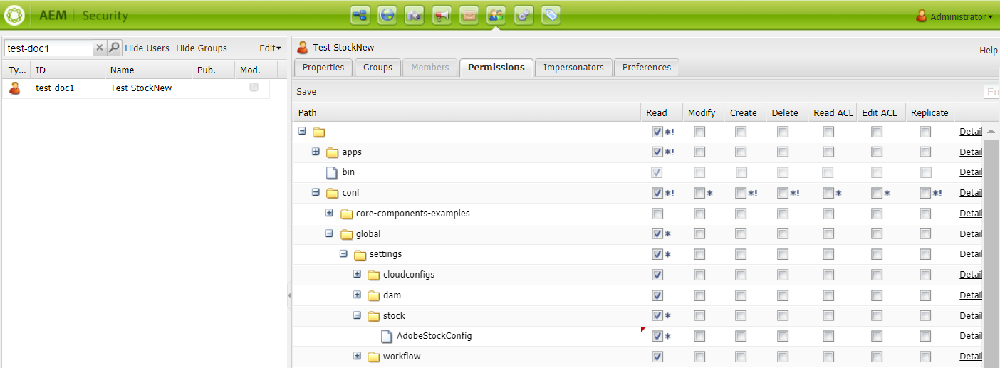

# 使用 [!DNL Adobe Stock] 資產 [!DNL Adobe Experience Manager Assets] {#use-adobe-stock-assets-in-aem-assets}

[!DNL Adobe Stock] 該服務為設計人員和企業提供數百萬張高質量、精心策劃、免版稅的照片、向量圖、插圖、視頻、模板和3D資產，供其所有創意項目使用。

[!DNL Adobe Stock] 針對企業產品，依預設會包含整個組織的共用權限。 一旦貴組織的使用者授權資產後，貴組織的其他使用者就能識別、下載及使用此資產，不必再次授權。 一旦貴組織授權資產後，使用該資產的權利即為永久。

組織可以整合其企業 [!DNL Adobe Stock] 計畫 [!DNL Experience Manager Assets] 確保授權資產可廣泛供其創意及行銷專案使用，並具備強大的資產管理功能 [!DNL Experience Manager]. [!DNL Experience Manager] 使用者可以快速找到、預覽和授權儲存在的Adobe Stock資產 [!DNL Experience Manager]，而不需離開 [!DNL Experience Manager] 介面。

## 整合 [!DNL Experience Manager] 和 [!DNL Adobe Stock] {#integrate-aem-and-adobe-stock}

[!DNL Experience Manager Assets] 讓使用者能夠搜尋、預覽、儲存和授權 [!DNL Adobe Stock] 資產直接從 [!DNL Experience Manager].

**必備條件**

整合需要：

* 安 [企業 [!DNL Adobe Stock] 計畫](https://stockenterprise.adobe.com/)
* 具有預設Stock產品設定檔Admin Console權限的使用者
* 具有「開發人員存取」設定檔權限的使用者，可在「Adobe開發人員控制台」中建立整合

企業 [!DNL Adobe Stock] 計畫，

* 提供的產品權限 [!DNL Adobe Stock] (與Experience Manager有關的股票)
* 已購入的積分 [!DNL Adobe Admin Console] 您的股票權利
* 在中啟用服務帳戶(JWT)驗證 [!DNL Adobe Developer Console] 您的股票權利
* 允許從內部全局管理信用和許可 [!DNL Adobe Admin Console]

在權益中，預設的產品設定檔 [!DNL Adobe Stock] 存在 [!DNL Admin Console]. 可以建立多個設定檔，且這些設定檔會決定誰可以授權Stock資產。 直接存取產品設定檔的使用者可以存取 [https://stock.adobe.com/](https://stock.adobe.com/) 和授權Stock資產。 而有其他方法可使用開發人員存取來建立整合(API)，以驗證 [!DNL Experience Manager] 和 [!DNL Adobe Stock].

>[!NOTE]
>
>股票服務帳戶(JWT)驗證隨附企業股票權利。
>
>整合不支援企業股票權益的Oauth驗證。

<!--
### Create an IMS configuration {#create-an-ims-configuration}

1. In the [!DNL Experience Manager] user interface, navigate to **[!UICONTROL Tools]** > **[!UICONTROL Security]** > **[!UICONTROL Adobe IMS Configurations]**. Click **[!UICONTROL Create]** and select **[!UICONTROL Cloud Solution]** > **[!UICONTROL Adobe Stock]**.
1. Either reuse an existing certificate or select **[!UICONTROL Create new certificate]**.
1. Click **[!UICONTROL Create certificate]**. Once created, download the public key. Click **[!UICONTROL Next]**. Leave the [!UICONTROL Adobe IMS Technical Account Configuration] screen open to provide the required values shortly.
1. Access [Adobe Developer Console](https://console.adobe.io). Ensure that your account has administrator permissions for the organization for which the integration is required.
1. Click **[!UICONTROL Create new project]** and click **[!UICONTROL Add API]**. Select **[!UICONTROL Adobe Stock]** from the list of APIs that are available to you. Select [!UICONTROL OAUTH 2.0 Web].
1. Provide **[!UICONTROL Default redirect URI]** and **[!UICONTROL Redirect URI pattern]** values. Click **[!UICONTROL Save configured API]**. Copy the generated ID and secret.
1. In [!UICONTROL Adobe IMS Technical Account Configuration] screen, provide the values in the boxes titled **[!UICONTROL Title]**, **[!UICONTROL Authorization Server]**, **[!UICONTROL API Key]**, **[!UICONTROL Client Secret]**, and **[!UICONTROL Payload]**. For detailed information about these values, see [JWT authentication quick start](https://www.adobe.io/authentication/auth-methods.html#!AdobeDocs/adobeio-auth/master/JWT/JWT.md).

-->
<!-- TBD: Update the URL to update the terminology when AIO team updates their documentation URL. Logged issue github.com/AdobeDocs/adobeio-auth/issues/63.
-->

<!--
### Create [!DNL Adobe Stock] configuration in [!DNL Experience Manager] {#create-adobe-stock-configuration-in-aem}

1. In the [!DNL Experience Manager], navigate to **[!UICONTROL Tools]** > **[!UICONTROL Cloud Services]** > **[!UICONTROL Adobe Stock]**.
1. Click **[!UICONTROL Create]** to create a configuration and associate it with your existing IMS Configuration. Select `PROD` as the environment parameter.
1. In **[!UICONTROL Licensed Assets Path]** field, leave a location as is. Do not change the location where you want to store the [!DNL Adobe Stock] assets.
1. Complete creation by adding all the required properties. Click **[!UICONTROL Save & Close]**.
1. Add [!DNL Experience Manager] users or groups, who can license the assets.

>[!NOTE]
>
>If there are multiple [!DNL Adobe Stock] configurations, select the desired configuration in User Preferences panel. To access the panel from Experience Manager home page, click the user icon and then click **[!UICONTROL User Preferences]** > **[!UICONTROL Stock Configuration]**.

-->

## 整合步驟 [!DNL Experience Manager] 和 [!DNL Adobe Stock] {#integration-steps}

要整合 [!DNL Experience Manager] 和 [!DNL Adobe Stock]，請依所列順序執行下列步驟：

1. [取得公開憑證](#public-certificate)

   在 [!DNL Experience Manager]，建立IMS帳戶並產生公開憑證（公開金鑰）。

1. [建立服務帳戶(JWT)連線](#createnewintegration)

   在 [!DNL Adobe Developer Console]，請為您的 [!DNL Adobe Stock] 組織。 在專案下，使用公開金鑰設定API以建立服務帳戶(JWT)連線。 取得服務帳戶憑證和JWT裝載資訊。

1. [設定IMS帳戶](#create-ims-account-configuration)

   在 [!DNL Experience Manager]，請使用服務帳戶憑證和JWT裝載來設定IMS帳戶。

1. [設定雲端服務](#configure-the-cloud-service)

   在 [!DNL Experience Manager]，設定 [!DNL Adobe Stock] 雲端服務。

### 建立IMS設定 {#create-an-ims-configuration}

IMS設定會驗證您的 [!DNL Experience Manager Assets] 具有的作者例項 [!DNL Adobe Stock] 權利。

IMS 設定包括兩個步驟：

* [取得公開憑證](#public-certificate)
* [設定IMS帳戶](#create-ims-account-configuration)

### 取得公開憑證 {#public-certificate}

公開金鑰（憑證）會在Adobe開發人員控制台中驗證您的產品設定檔。

1. 登入 [!DNL Experience Manager Assets] 製作例項。 預設URL為 `http://localhost:4502/aem/start.html`.

1. 從 **[!UICONTROL 工具]** 面板，導覽至 **[!UICONTROL 安全性]** > **[!UICONTROL Adobe IMS設定]**.

1. 在Adobe IMS設定頁面中，按一下 **[!UICONTROL 建立]**. 此 **[!UICONTROL Adobe IMS技術帳戶設定]** 頁面開啟。

1. 在 **[!UICONTROL 憑證]** 索引標籤，選取 **[!UICONTROL Adobe Stock]** 從 **[!UICONTROL 雲端解決方案]** 下拉式清單。

1. 您可以建立憑證或為設定重複使用現有憑證。

   若要建立憑證，請選取 **[!UICONTROL 建立新憑證]** 核取方塊並指定 **別名** 公開金鑰。 別名用作公鑰的名稱。

1. 按一下&#x200B;**[!UICONTROL 建立憑證]**。然後，按一下 **[!UICONTROL 確定]** 來產生公開金鑰。

1. 按一下 **[!UICONTROL 下載公開金鑰]** 圖示並將公開金鑰(.crt)檔案儲存在電腦上。 公開金鑰稍後會用來設定Brand Portal租用戶的API，以及在Adobe開發人員控制台中產生服務帳戶憑證。

   按一下&#x200B;**[!UICONTROL 下一步]**。

   

1. 在 **帳戶** 標籤，系統會建立需要服務帳戶憑證的Adobe IMS帳戶。

   開啟新標籤，然後 [在Adobe開發人員控制台中建立服務帳戶(JWT)連線](#createnewintegration).

### 建立服務帳戶(JWT)連線 {#createnewintegration}

在「Adobe開發人員控制台」中，專案和API是在組織層級設定。 設定API會建立服務帳戶(JWT)連線。 有兩種方法可用來設定API，方法是產生金鑰組（私密和公開金鑰）或上傳公開金鑰。 在此範例中，服務帳戶認證是透過上傳公開金鑰來產生。

要生成服務帳戶憑據和JWT裝載，請執行以下操作：

1. 以系統管理員權限登入Adobe開發人員控制台。 預設URL為 [https://www.adobe.com/go/devs_console_ui](https://www.adobe.com/go/devs_console_ui).

   確認您已從下拉式清單（組織）中選取正確的IMS組織（股票權益）。

1. 按一下 **[!UICONTROL 建立新專案]**. 系統會為您的組織建立一個空白專案，其名稱為系統產生。

   按一下 **[!UICONTROL 編輯專案]**. 更新 **[!UICONTROL 專案標題]** 和 **[!UICONTROL 說明]**，然後按一下 **[!UICONTROL 儲存]**.

1. 在 **[!UICONTROL 專案概述]** 按一下 **[!UICONTROL 新增API]**.

1. 在 **[!UICONTROL 新增API視窗]**，選取 **[!UICONTROL Adobe Stock]**. 按一下&#x200B;**[!UICONTROL 下一步]**。

1. 在 **[!UICONTROL 設定API]** 窗口，選擇 **[!UICONTROL 服務帳戶(JWT)]** 驗證。 按一下&#x200B;**[!UICONTROL 下一步]**。

   

1. 按一下 **[!UICONTROL 上傳您的公開金鑰]**. 按一下 **[!UICONTROL 選取檔案]** 並上傳您在 [取得公開憑證](#public-certificate) 區段。 按一下&#x200B;**[!UICONTROL 下一步]**。

1. 驗證公開金鑰並按一下 **[!UICONTROL 下一個]**.

1. 選取預設值 **[!UICONTROL Adobe Stock]** 產品設定檔，按一下 **[!UICONTROL 儲存已設定的API]**.

1. 設定API後，系統會將您重新導向至API概觀頁面。 從下方的左側導覽 **[!UICONTROL 憑證]**，按一下 **[!UICONTROL 服務帳戶(JWT)]** 選項。 您可以在此檢視憑證，並執行產生JWT代號、複製憑證詳細資訊和擷取用戶端密碼等動作。

1. 從 **[!UICONTROL 客戶端憑據]** 頁簽，複製 **[!UICONTROL 用戶端ID]**.

   按一下 **[!UICONTROL 擷取用戶端密碼]** 並複製 **[!UICONTROL 用戶密碼]**.

   

1. 導覽至 **[!UICONTROL 產生JWT]** 標籤並複製 **[!UICONTROL JWT裝載]** 資訊。

您現在可以將用戶端ID（API金鑰）、用戶端密碼和JWT裝載，用於 [設定IMS帳戶](#create-ims-account-configuration) in [!DNL Experience Manager Assets].

### 設定IMS帳戶 {#create-ims-account-configuration}

您必須擁有 [憑證](#public-certificate) 和 [服務帳戶(JWT)憑證](#createnewintegration) 來設定IMS帳戶。

若要設定IMS帳戶：

1. 開啟IMS設定並導覽至 **[!UICONTROL 帳戶]** 標籤。 您在 [取得公開憑證](#public-certificate).

1. 指定 IMS 帳戶的&#x200B;**[!UICONTROL 標題]**。

   在 **[!UICONTROL 授權伺服器]** 欄位，輸入URL: [https://ims-na1.adobelogin.com/](https://ims-na1.adobelogin.com/).

   在 **[!UICONTROL API金鑰]** 欄位， **[!UICONTROL 用戶端密碼]**，和 **[!UICONTROL 裝載]** （JWT裝載），而您 [建立服務帳戶(JWT)連線](#createnewintegration).

1. 按一下&#x200B;**[!UICONTROL 建立]**。已建立IMS帳戶設定。

   

1. 選取IMS帳戶設定，然後按一下 **[!UICONTROL 檢查運行狀況]**.

   按一下 **[!UICONTROL 檢查]** 框中輸入URL。 成功設定時，畫面會顯示訊息，指出 *已成功檢索令牌*.

   

### 設定雲端服務 {#configure-the-cloud-service}

若要設定 [!DNL Adobe Stock] 雲端服務：

1. 在 [!DNL Experience Manager] 使用者介面，導覽至 **[!UICONTROL 工具]** > **[!UICONTROL Cloud Services]** > **[!UICONTROL Adobe Stock]**.

1. 在 [!DNL Adobe Stock Configurations] 頁面，按一下 **[!UICONTROL 建立]**.

1. 指定 **[!UICONTROL 標題]** 雲端設定。

   選取您在 [設定IMS帳戶](#create-ims-account-configuration).

   從下拉式清單中選取您的地區。

   

1. 按一下&#x200B;**[!UICONTROL 「儲存並關閉」]**。

   您的 [!DNL Experience Manager Assets] 製作例項現在已與 [!DNL Adobe Stock]. 您可以建立多個 [!DNL Adobe Stock] 配置（例如，區域設定配置）。 您現在可以存取、搜尋及授權 [!DNL Adobe Stock] 資產 [!DNL Experience Manager] 使用者介面。

   

   >[!NOTE]
   >
   >在整合的這個階段，只有管理員可以存取 [!DNL Adobe Stock] 資產、搜尋Stock資產（使用omnisearch）及授權 [!DNL Adobe Stock] 資產。
   >
   >管理員可進一步新增使用者或群組至 [!DNL Adobe Stock] 雲端服務，並為這些非管理員使用者授予 [!DNL Experience Manager] 以存取Stock設定。

1. 若要新增使用者或群組，請選取 [!DNL Adobe Stock] 雲端設定，按一下 **[!UICONTROL 屬性]**.

1. 搜尋以新增您已指派存取Adobe Stock設定之權限的使用者或群組。 請參閱 [將權限指派給使用者群組](#assign-permissions-to-group).

## 將權限指派給使用者群組 {#assign-permissions-to-group}

管理員可以建立使用者群組，並為特定使用者或群組授予存取 [!DNL Adobe Stock] 雲端服務。

以下是使用者搜尋及授權Adobe Stock資產所需的權限：

* 設定路徑： `/conf/global/settings/stock`
* 權限: `jcr:read`
* 權限類型: `Allow`

您可以建立使用者群組或指派權限至現有使用者群組。 權限可從 [!DNL Experience Manager Assets] 介面或 [!DNL User Admin] 主控台。

**若要提供使用者群組的存取權，請從 [!DNL Experience Manager]:**

1. 在 [!DNL Experience Manager] 使用者介面，導覽至 **[!UICONTROL 工具]** > **[!UICONTROL 安全性]** > **[!UICONTROL 群組]**. 為 [!DNL Adobe Stock].

1. 導覽至 **[!UICONTROL 工具]** > **[!UICONTROL 安全性]** > **[!UICONTROL 權限]**.

1. 在左側面板中搜尋使用者群組並新增 **[!UICONTROL 訪問控制項(ACE)]** Adobe Stock。

   * 設定路徑： `/conf/global/settings/stock`
   * 權限: `jcr:read`
   * 權限類型: `Allow`

   按一下&#x200B;**[!UICONTROL 「新增」]**。

   

1. 導覽至 **[!UICONTROL 工具]** > **[!UICONTROL Cloud Services]** > **[!UICONTROL Adobe Stock]**. 選取 [!DNL Adobe Stock] 雲端設定，按一下 **[!UICONTROL 屬性]**.

1. 將新建立的使用者群組新增至 [!DNL Adobe Stock] 設定。 按一下&#x200B;**[!UICONTROL 「儲存並關閉」]**。

   

**若要提供使用者的存取權，請 [!DNL User Admin Console]:**

1. 開啟 [!DNL Experience Manager] 使用者Admin Console。 預設URL為 `http://localhost:4502/userdamin`.

1. 在左側面板中，輸入 `user_id` 或 `name`. 按兩下以開啟使用者屬性。

1. 導覽至 **[!UICONTROL 權限]** 標籤和允許 `read` 的權限 [!DNL Adobe Stock] 雲配置： `/conf/global/settings/stock`.

   >[!CAUTION]
   >
   >如果不允許雲端設定，則使用者只能存取 **[!UICONTROL 資產]** 在 [!DNL Experience Manager] 介面。
   >
   >允許存取 [!UICONTROL 資產] 和 [!DNL Adobe Stock] assets，請確定使用者允許進行雲端設定。

1. 按一下 **[!UICONTROL 儲存]** 以更新權限。

   

1. 將使用者或群組新增至 [!DNL Adobe Stock] 雲端設定。

## 存取Adobe Stock資產 {#access-stock-assets}

擁有 [!DNL Adobe Stock] 雲端設定可搜尋及授權 [!DNL Adobe Stock] 資產 [!DNL Experience Manager] 介面。

使用者必須執行額外的步驟來啟動 [!DNL Adobe Stock] 存取前的雲端設定 [!DNL Adobe Stock] 資產。 這是一次性活動。 如果將使用者指派給多個 [!DNL Adobe Stock] 雲端設定，使用者可從 **[!UICONTROL 使用者偏好設定]**.

若要啟用 [!DNL Adobe Stock] 雲配置：

1. 登入 [!DNL Experience Manager].

1. 按一下右上角的使用者圖示，然後按一下 **[!UICONTROL 我的偏好設定]**. 此 **[!UICONTROL 使用者偏好設定]** 窗口。

1. 選取所需 **[!UICONTROL 庫存配置]** 從下拉式清單中，按一下 **[!UICONTROL 接受]** 來啟動設定。

   

1. 導覽至 **[!UICONTROL 資產]** > **[!UICONTROL Adobe Stock]**. 您現在可以檢視、搜尋和授權 [!DNL Adobe Stock] 資產。

下表說明存取 [!DNL Adobe Stock] 資產：

| 使用者 | 群組 | 權限 | 在用戶首選項中接受庫存配置 | 存取資產 | 存取Adobe Stock |
| --- | --- | --- | --- | --- | --- |
| 管理員 | N/A | 全部 | 不適用 | 是 | 是 |
| test-doc1 | DAM 使用者 | `/conf/global/settings/stock/cloud-config` | 是 | 是 | 是 |
| test-doc1 | DAM 使用者 | `/conf/global/settings/stock/cloud-config` | 否 | 錯誤：無法載入資料 | 否 |
| test-doc1 | DAM 使用者 | 允許： `/conf/global/settings/stock` 拒絕： `/cloud-config` | 庫存配置不可見 | 是 | 否 |

## 使用和管理 [!DNL Adobe Stock] 資產 [!DNL Experience Manager] {#usemanage}

使用此功能，組織可讓其使用者透過 [!DNL Adobe Stock] 資產 [!DNL Experience Manager Assets]. 從 [!DNL Experience Manager] 用戶介面，用戶可搜索 [!DNL Adobe Stock] 資產及授權所需資產。

一次 [!DNL Adobe Stock] 資產授權於 [!DNL Experience Manager]，它可像一般資產一樣使用和管理。 在 [!DNL Experience Manager]，使用者可以搜尋及預覽資產；複製並發佈資產；於 [!DNL Brand Portal];透過 [!DNL Experience Manager] 案頭應用程式；等等。

![搜尋 [!DNL Adobe Stock] 資產和篩選結果 [!DNL Adobe Experience Manager] 工作區](assets/adobe-stock-search-results-workspace.png)

**A.**[!DNL Adobe Stock] 搜尋與已提供 ID 之資產的類似資產。**B.** 搜尋與您選取的型態或方向相符的資產。**C.** 搜尋一或多個支援的資產類型 **D.** 開啟或收合篩選器窗格 **E.** 在 中為選取的資產授權並加以儲存 [!DNL Experience Manager]**F.**[!DNL Experience Manager] 將資產儲存在 中並加上浮水印 **G.**[!DNL Adobe Stock] 在 網站上探索與選取的資產類似的資產 **H.**[!DNL Adobe Stock] 在 網站上檢視選取的資產 **I.** 搜尋結果中選取的資產數目 **J.** 在卡片檢視與清單檢視之間切換

### 尋找資產 {#find-assets}

您的 [!DNL Experience Manager] 使用者可在兩者中搜尋資產， [!DNL Experience Manager] 和 [!DNL Adobe Stock]. 當搜尋位置不限於 [!DNL Adobe Stock]，搜尋結果來自 [!DNL Experience Manager] 和 [!DNL Adobe Stock] 的下界。

* 要搜索 [!DNL Adobe Stock] 資產，按一下 **[!UICONTROL 導覽]** > **[!UICONTROL 資產]** > **[!UICONTROL 搜尋Adobe Stock]**.

* 若要在 [!DNL Adobe Stock] 和 [!DNL Experience Manager Assets]，按一下搜尋 .

或者，開始鍵入 `Location: Adobe Stock` ，以選取 [!DNL Adobe Stock] 資產。 [!DNL Experience Manager] 針對所搜尋的資產提供進階篩選功能，讓使用者能使用篩選器（例如支援的資產類型、影像方向和授權狀態），快速將目標鎖定於所需的資產。

>[!NOTE]
>
>搜尋的資產 [!DNL Adobe Stock] 顯示於 [!DNL Experience Manager]. [!DNL Adobe Stock] 資產會擷取並儲存於 [!DNL Experience Manager] 僅在用戶 [儲存資產](/help/assets/aem-assets-adobe-stock.md#saveassets) 或 [授權並儲存資產](/help/assets/aem-assets-adobe-stock.md#licenseassets). 已儲存於 [!DNL Experience Manager] 會顯示並反白顯示，以方便參考和存取。 此外， [!DNL Stock] 資產會與某些其他中繼資料一起儲存，以指出來源為 [!DNL Stock].

![在中搜尋篩選器 [!DNL Experience Manager] 突出顯示 [!DNL Adobe Stock] 搜尋結果中的資產](assets/aem-search-filters2.jpg)

### 儲存並檢視所需資產 {#saveassets}

選取您要儲存的資產 [!DNL Experience Manager]. 按一下 [!UICONTROL 儲存] 在頂端的工具列中，並提供資產的名稱和位置。 未授權的資產會以浮水印儲存在本機。

下次搜尋資產時，儲存的資產會以徽章強調顯示，以指出這些資產可用於 [!DNL Experience Manager Assets].

>[!NOTE]
>
>最近新增的資產會顯示「新」徽章，而非「授權」徽章。

### 授權資產 {#licenseassets}

使用者可取得授權 [!DNL Adobe Stock] 資產，透過 [!DNL Adobe Stock] 企業計畫。 當您授權資產時，資產會儲存且不含浮水印，且可供在中搜尋及使用 [!DNL Experience Manager Assets].

![對話方塊以授權和儲存 [!DNL Adobe Stock] 資產 [!DNL Experience Manager Assets]](assets/aem-stock_licenseandsave.jpg)

### 存取中繼資料和資產屬性 {#access-metadata-and-asset-properties}

使用者可以存取和預覽中繼資料，包括 [!DNL Adobe Stock] 儲存於中之資產的中繼資料屬性 [!DNL Experience Manager]，然後新增 **[!UICONTROL 授權參考]** 的URL。 不過，系統不會在 [!DNL Experience Manager] 和 [!DNL Adobe Stock] 網站。

使用者可以查看授權和未授權資產的屬性。

## 已知限制 {#known-limitations}

* **限制使用者授權的功能無法正常運作**:所有用戶 `read` 對stock配置的權限可用於搜索和許可 [!DNL Adobe Stock] 資產。

* **非管理員使用者必須手動啟用 [!DNL Adobe Stock] 雲端設定**:在 **[!UICONTROL 使用者偏好設定]** 窗口， **[!UICONTROL 庫存配置]** 顯示 [!DNL Adobe Stock] 雲端設定已啟用，但非管理員使用者無法使用。 使用者必須按一下 **[!UICONTROL 接受]** 按鈕，啟用Stock配置。 如果沒有此步驟，系統會在存取時顯示錯誤訊息 **[!UICONTROL 資產]**.

* **未顯示編輯影像警告**:授權影像時，使用者無法檢查影像是否為「僅編輯使用」。 為了防止可能的誤用，管理員可以關閉Admin Console對編輯資產的存取權。

* **顯示的許可證類型錯誤**:中可能顯示不正確的授權類型 [!DNL Experience Manager] 的URL。 使用者可登入 [!DNL Adobe Stock] 網站以查看授權類型。

* **未同步參考欄位和中繼資料**:當用戶更新許可證參考欄位時，許可證參考資訊在 [!DNL Experience Manager] 但不在 [!DNL Adobe Stock] 網站。 同樣地，如果使用者更新 [!DNL Adobe Stock] 網站，更新不會同步於 [!DNL Experience Manager].

<!--
## Use and manage [!DNL Adobe Stock] assets in [!DNL Experience Manager] {#usemanage}

Using this capability, organizations users can work using [!DNL Adobe Stock] assets in [!DNL Experience Manager Assets]. From within the [!DNL Experience Manager] user interface, users can search [!DNL Adobe Stock] assets and license the required assets.

Once an [!DNL Adobe Stock] asset is licensed in [!DNL Experience Manager], it can be used and managed like a typical asset. In [!DNL Experience Manager], the users can search and preview the assets; copy and publish the assets; share the assets on [!DNL Brand Portal]; access and use the assets via [!DNL Experience Manager] desktop app; and so on.
-->

<!--  

*Figure: Search for [!DNL Adobe Stock] assets and filter results from your [!DNL Experience Manager] interface.*

**A.** Search assets similar to the assets whose [!DNL Adobe Stock] ID is provided. **B.** Search assets that match your selection of shape or orientation. **C.** Search for one of more supported asset types **D.** Open or collapse the filters pane **E.** License and save the selected asset in [!DNL Experience Manager] **F.** Save the asset in [!DNL Experience Manager] with watermark **G.** Explore assets on [!DNL Adobe Stock] website that are similar to the selected asset **H.** View the selected assets on [!DNL Adobe Stock] website **I.** Number of selected assets from the search results **J.** Switch between Card view and List view -->

<!--
### Find assets {#find-assets}

Your [!DNL Experience Manager] users, can search for assets in both, [!DNL Experience Manager] and [!DNL Adobe Stock]. When the search location is not limited to [!DNL Adobe Stock], the search results from [!DNL Experience Manager] and [!DNL Adobe Stock] are displayed.

* To search for [!DNL Adobe Stock] assets, click **[!UICONTROL Navigation]** > **[!UICONTROL Assets]** > **[!UICONTROL Search Adobe Stock]**.

* To search for assets across [!DNL Adobe Stock] and [!DNL Experience Manager Assets], click search .

Alternatively, start typing `Location: Adobe Stock` in the search bar to select [!DNL Adobe Stock] assets. [!DNL Experience Manager] offers advanced filtering capabilities on the searched assets, allowing users to quickly zero-in on the required assets using filters, such as types of supported assets, image orientation, and licensed state.

>[!NOTE]
>
>Assets searched from [!DNL Adobe Stock] are just displayed in [!DNL Experience Manager]. [!DNL Adobe Stock] assets are fetched and stored in [!DNL Experience Manager] repository only after a user either [saves an asset](/help/assets/aem-assets-adobe-stock.md#saveassets) or [licenses and saves an asset](/help/assets/aem-assets-adobe-stock.md#licenseassets). Assets that are already stored in [!DNL Experience Manager] are displayed and highlighted for ease of reference and access. Also, the [!DNL Stock] assets are saved with some additional metadata to indicate the source as [!DNL Stock].

*Figure: Search filters in [!DNL Experience Manager] and highlighted [!DNL Adobe Stock] assets in search results.*

### Save and view the required assets {#saveassets}

Select an asset that you want to save in [!DNL Experience Manager]. Click [!UICONTROL Save] in the toolbar at the top and provide the name and location of the asset. The unlicensed assets are saved locally with a watermark.

Next time when you search for assets, the saved assets are highlighted with a badge, to indicate that such assets are available in [!DNL Experience Manager Assets].

>[!NOTE]
>
>The recently added assets display a New badge instead of Licensed badge.

### License assets {#licenseassets}

Users can license [!DNL Adobe Stock] assets by using the quota of their [!DNL Adobe Stock] enterprise plan. When you license an asset, it is saved without a watermark and is available for searching and using in [!DNL Experience Manager Assets].

*Figure: Dialog to license and save [!DNL Adobe Stock] assets in [!DNL Experience Manager Assets].*

### Access metadata and asset properties {#access-metadata-and-asset-properties}

Users can access and preview the metadata, including the [!DNL Adobe Stock] metadata properties for the assets saved in [!DNL Experience Manager], and add **[!UICONTROL License References]** for an asset. However, the updates to license reference are not synced between [!DNL Experience Manager] and [!DNL Adobe Stock] website.

Users can see the properties for both, licensed and unlicensed assets.

*Figure: View and access metadata and license references of saved assets.*

## Known limitations {#known-limitations}

* **Editorial image warning is not displayed**: When licensing an image, users cannot check if an image is Editorial Use Only. To prevent possible misuse, the administrators can turn off the access to editorial assets from the Admin Console.

* **Wrong license type is displayed**: It is possible that an incorrect license type is displayed in [!DNL Experience Manager] for an asset. Users can log into the [!DNL Adobe Stock] website to see the license type.

* **Reference fields and metadata are not synced**: When a user updates a license reference field, the license reference information is updated in [!DNL Experience Manager] but not on the [!DNL Adobe Stock] website. Similarly, if the user updates the reference fields on the [!DNL Adobe Stock] website, the updates are not synchronized in [!DNL Experience Manager].
-->

>[!MORELIKETHIS]
>
>* [關於搭配Experience Manager Assets使用Adobe Stock資產的教學課程影片](https://experienceleague.adobe.com/docs/experience-manager-learn/assets/creative-workflows/adobe-stock.html)
>* [Adobe Stock企業計畫說明](https://helpx.adobe.com/enterprise/using/adobe-stock-enterprise.html)
>* [Adobe Stock常見問題集](https://helpx.adobe.com/stock/faq.html)

