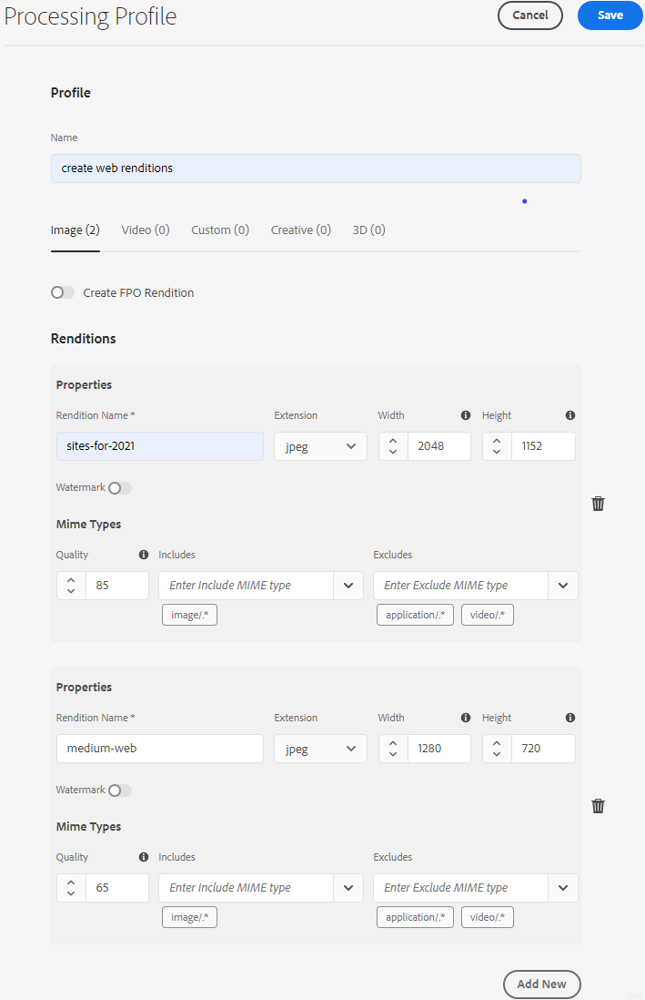

# 使用資產微服務和處理設定檔 {#get-started-using-asset-microservices}

資產微服務提供使用雲端原生應用程式（也稱為背景工作）的資產可擴充且具彈性的處理功能。 Adobe管理服務，以最佳處理不同資產類型和處理選項。

與舊版[!DNL Experience Manager]相比，資產微服務可讓您處理[廣泛的檔案類型](/help/assets/file-format-support.md)，涵蓋更多現成可用格式。 例如，現在可以擷取PSD和PSB格式的縮圖，但先前需要的協力廠商解決方案，例如[!DNL ImageMagick]。

資產處理取決於&#x200B;**[!UICONTROL 處理設定檔]**&#x200B;中的設定。 Experience Manager提供基本預設設定，並讓管理員新增更具體的資產處理設定。 管理員建立、維護和修改後置處理工作流程的設定，包括可選自訂。 自訂工作流程可讓開發人員擴充預設產品。

<!-- Proposed DRAFT diagram for asset microservices flow - see section "asset-microservices-flow.png (asset-microservices-configure-and-use.md)" in the PPTX deck

https://adobe-my.sharepoint.com/personal/gklebus_adobe_com/_layouts/15/guestaccess.aspx?guestaccesstoken=jexDC5ZnepXSt6dTPciH66TzckS1BPEfdaZuSgHugL8%3D&docid=2_1ec37f0bd4cc74354b4f481cd420e07fc&rev=1&e=CdgElS
-->

>[!NOTE]
>
>此處所述的資產處理會取代`DAM Update Asset`舊版[!DNL Experience Manager]中存在的工作流程模型。 大部分標準轉譯產生和中繼資料相關步驟會由資產微服務處理取代，其餘步驟（若有）則可由後置處理工作流程設定取代。

## 了解資產處理選項 {#get-started}

[!DNL Experience Manager] 允許下列處理層級。

| 選項 | 說明 | 涵蓋的使用案例 |
|---|---|---|
| [預設設定](#default-config) | 可依原樣使用，且無法修改。 此配置提供了非常基本的格式副本生成功能。 | <ul> <li>[!DNL Assets]使用者介面使用的標準縮圖（48、140和319像素） </li> <li> 大型預覽（Web轉譯 — 1280像素） </li><li> 中繼資料和文字擷取。</li></ul> |
| [自訂設定](#standard-config) | 由管理員透過使用者介面進行設定。 透過擴充預設選項，為產生轉譯提供更多選項。 擴充現成可用的選項，以提供不同的格式和轉譯。 | <ul><li>FPO轉譯。 </li> <li>更改影像的檔案格式和解析度</li> <li> 有條件地應用於配置的檔案類型。 </li> </ul> |
| [自訂設定檔](#custom-config) | 由管理員透過使用者介面設定，以透過自訂應用程式使用自訂程式碼，以呼叫[Asset compute服務](https://experienceleague.adobe.com/docs/asset-compute/using/introduction.html)。 支援雲端原生和可擴充方法中更複雜的需求。 | 請參閱[允許的使用案例](#custom-config)。 |

<!-- To create custom processing profiles specific to your custom requirements, say to integrate with other systems, see [post-processing workflows](#post-processing-workflows).
-->

## 支援的檔案格式 {#supported-file-formats}

資產微服務支援多種檔案格式，以處理、產生轉譯或擷取中繼資料。 有關MIME類型的完整清單以及每種類型支援的功能，請參閱[支援的檔案格式](file-format-support.md)。

## 預設設定 {#default-config}

有些預設值會預先設定，以確保Experience Manager中需要的預設轉譯可供使用。 預設設定也可確保中繼資料擷取和文字擷取作業可供使用。 使用者可以立即開始上傳或更新資產，且基本處理預設可供使用。

使用預設設定時，只會設定最基本的處理設定檔。 此類處理設定檔在使用者介面上不可見，且您無法加以修改。 系統一律會執行以處理上傳的資產。 此類預設處理設定檔可確保[!DNL Experience Manager]所需的基本處理完成於所有資產上。

<!-- 
-->

## 標準配置 {#standard-config}

[!DNL Experience Manager] 根據使用者需求，提供針對常用格式產生更特定轉譯的功能。管理員可以建立其他[!UICONTROL 處理設定檔]以便建立這類轉譯。 然後，使用者將一或多個可用的設定檔指派給特定資料夾，以完成其他處理作業。 例如，額外的處理可產生網頁、行動裝置和平板電腦的轉譯。 以下影片說明如何建立和套用[!UICONTROL 處理設定檔]，以及如何存取已建立的轉譯。

* **轉譯寬度和高度**:格式副本寬度和高度規範可提供生成的輸出影像的最大大小。資產微服務會嘗試產生最大可能的轉譯，其寬度和高度分別不大於指定的寬度和高度。 長寬比會保留，與原始的相同。 空白值表示資產處理會假設原始影像的像素維度。

* **MIME類型包含規則**:處理具有特定MIME類型的資產時，系統會先根據轉譯規格的排除MIME類型值檢查MIME類型。如果符合該清單，則不會為資產產生此特定轉譯（已封鎖清單）。 否則，會根據包含的MIME類型檢查MIME類型，如果該類型與清單匹配，則生成格式副本（允許的清單）。

* **特殊FPO轉譯**:將大型資產從放入檔 [!DNL Experience Manager] 案 [!DNL Adobe InDesign] 時，創意專業人員放入資產後會等待相 [當長的時間](https://helpx.adobe.com/indesign/using/placing-graphics.html)。同時，用戶被阻止使用[!DNL InDesign]。 這會中斷創意流程，並對使用者體驗造成負面影響。 Adobe可以臨時將小尺寸格式副本放在[!DNL InDesign]文檔中以開頭，以後可以用完全解析度的按需資產替換。 [!DNL Experience Manager] 提供僅用於版位(FPO)的轉譯。這些FPO轉譯的檔案大小很小，但外觀比例相同。

處理設定檔可包含FPO（僅限For Placement）轉譯。 請參閱[!DNL Adobe Asset Link] [檔案](https://helpx.adobe.com/tw/enterprise/using/manage-assets-using-adobe-asset-link.html)了解您是否需要為處理設定檔開啟它。 如需詳細資訊，請參閱[Adobe資產連結完成檔案](https://helpx.adobe.com/tw/enterprise/using/adobe-asset-link.html)。

### 建立標準設定檔 {#create-standard-profile}

若要建立標準處理設定檔，請依照下列步驟操作：

1. 管理員可存取&#x200B;**[!UICONTROL 工具]** > **[!UICONTROL 資產]** > **[!UICONTROL 處理設定檔]**。 按一下&#x200B;**[!UICONTROL 建立]**。
1. 提供名稱，協助您在套用至資料夾時唯一識別設定檔。
1. 要生成FPO格式副本，請在&#x200B;**[!UICONTROL Standard]**&#x200B;頁簽上啟用&#x200B;**[!UICONTROL 建立FPO格式副本]**。 輸入介於1和100之間的&#x200B;**[!UICONTROL Quality]**&#x200B;值。
1. 若要產生其他轉譯，請按一下「新增」**[!UICONTROL 並提供下列資訊：]**

   * 每個格式副本的檔案名。
   * 每個轉譯的檔案格式（PNG、JPEG、GIF或WebP）。
   * 每個轉譯的寬度和高度（像素）。 如果未指定值，則使用原始影像的全像素大小。
   * 每個JPEG和WebP轉譯的品質百分比。
   * 包含和排除的MIME類型，以定義設定檔的適用性。

   

1. 按一下「**[!UICONTROL 儲存]**」。

<!-- TBD: Update the video link when a new video is available from Tech Marketing.

The following video demonstrates the usefulness and usage of standard profile.

>[!VIDEO](https://video.tv.adobe.com/v/29832?quality=9)
-->

<!-- This image was removed per cqdoc-15624, as requested by engineering.
  
 -->

## 自訂設定檔和使用案例 {#custom-config}

[!DNL Asset Compute Service]支援多種使用案例，例如預設處理、處理Adobe特定格式(如Photoshop檔案)，以及實作自訂或組織特定處理。 過去需要的DAM更新資產工作流程自訂會自動處理，或透過處理設定檔設定。 如果這些處理選項不滿足業務需求，Adobe建議開發並使用[!DNL Asset Compute Service]擴展預設功能。 如需概覽，請參閱[了解擴充性，以及其使用時機](https://experienceleague.adobe.com/docs/asset-compute/using/extend/understand-extensibility.html)。

>[!NOTE]
>
>Adobe建議僅在無法使用預設配置或標準配置檔案完成業務需求時使用自定義應用程式。

它可以將影像、視訊、檔案和其他檔案格式轉換為不同的轉譯，包括縮圖、擷取的文字和中繼資料，以及封存。

開發人員可以使用[!DNL Asset Compute Service]建立自訂應用程式](https://experienceleague.adobe.com/docs/asset-compute/using/extend/develop-custom-application.html)以了解支援的使用案例。 [[!DNL Experience Manager] 可使用管理員設定的自訂設定檔，從使用者介面呼叫這些自訂應用程式。[!DNL Asset Compute Service] 支援以下叫用外部服務的使用案例：

* 使用[!DNL Adobe Photoshop]的[ImageCutout API](https://github.com/AdobeDocs/photoshop-api-docs-pre-release#imagecutout)並將結果儲存為轉譯。
* 呼叫協力廠商系統以更新資料，例如PIM系統。
* 使用[!DNL Photoshop] API根據Photoshop範本產生各種轉譯。
* 使用[AdobeLightroom API](https://github.com/AdobeDocs/lightroom-api-docs#supported-features)來最佳化擷取的資產，並將其儲存為轉譯。

>[!NOTE]
>
>您無法使用自訂應用程式編輯標準中繼資料。 您只能修改自訂中繼資料。

### 建立自訂設定檔 {#create-custom-profile}

若要建立自訂設定檔，請執行下列步驟：

1. 管理員可存取&#x200B;**[!UICONTROL 工具]** > **[!UICONTROL 資產]** > **[!UICONTROL 處理設定檔]**。 按一下&#x200B;**[!UICONTROL 建立]**。
1. 按一下「**[!UICONTROL 自訂]**」標籤。 按一下「**[!UICONTROL 新增]**」。 提供所需的轉譯檔案名稱。
1. 提供下列資訊。

   * 每個轉譯的檔案名和支援的副檔名。
   * [Firefly自訂應用程式的端點URL](https://experienceleague.adobe.com/docs/asset-compute/using/extend/deploy-custom-application.html)。應用程式必須來自與Experience Manager帳戶相同的組織。
   * 將服務參數添加到[將額外資訊或參數傳遞到自定義應用程式](https://experienceleague.adobe.com/docs/asset-compute/using/extend/develop-custom-application.html#extend)。
   * 已包含和排除的MIME類型，以將處理限制為少數特定檔案格式。

   按一下「**[!UICONTROL 儲存]**」。

自訂應用程式為無頭[Project Firefly](https://github.com/AdobeDocs/project-firefly)應用程式。 如果自訂應用程式是以處理設定檔設定，則會取得所有提供的檔案。 應用程式必須篩選檔案。

>[!CAUTION]
>
>如果Firefly應用程式和[!DNL Experience Manager]帳戶不來自相同的組織，則整合無法運作。

### 自訂設定檔的範例 {#custom-profile-example}

為了說明自訂設定檔的使用方式，我們將考慮使用案例，將一些自訂文字套用至促銷活動影像。 您可以建立處理設定檔，利用Photoshop API來編輯影像。

asset compute服務整合允許Experience Manager使用[!UICONTROL 服務參數]欄位將這些參數傳遞到自定義應用程式。 接著，自訂應用程式會呼叫Photoshop API，並將這些值傳遞至API。 例如，您可以傳遞字型名稱、文字顏色、文字粗細和文字大小，將自訂文字新增至促銷活動影像。

<!-- TBD: Check screenshot against the interface. -->

*圖：使用 [!UICONTROL Service ] Parametersfield將新增資訊傳遞至自訂應用程式中建立的預先定義參數。在此範例中，上傳促銷活動影像時，會以`Arial-BoldMT`字型的`Jumanji`文字更新影像。*

## 使用處理設定檔來處理資產 {#use-profiles}

建立其他自訂處理設定檔，並套用至特定資料夾，以便Experience Manager處理上傳至或更新在這些資料夾中的資產。 預設的內建標準處理設定檔一律會執行，但使用者介面上不會顯示。 如果您新增自訂設定檔，則兩個設定檔都用來處理上傳的資產。

使用下列其中一種方法，將處理設定檔套用至資料夾：

* 管理員可以在&#x200B;**[!UICONTROL 工具]** > **[!UICONTROL 資產]** > **[!UICONTROL 處理設定檔]**&#x200B;中選取處理設定檔定義，並使用&#x200B;**[!UICONTROL 將設定檔套用至資料夾]**&#x200B;動作。 它會開啟內容瀏覽器，讓您導覽至特定資料夾、選取資料夾並確認設定檔的應用程式。
* 使用者可以在「資產」使用者介面中選取資料夾、使用&#x200B;**[!UICONTROL 屬性]**&#x200B;動作來開啟資料夾屬性畫面、按一下&#x200B;**[!UICONTROL 處理設定檔]**&#x200B;標籤，然後在快顯清單中，為該資料夾選取適當的處理設定檔。 要保存更改，請按一下&#x200B;**[!UICONTROL 保存並關閉]**。
   

>[!TIP]
>
>只能將一個處理設定檔套用至資料夾。 若要產生更多轉譯，請新增更多轉譯定義至現有的處理設定檔。

將處理設定檔套用至資料夾後，此資料夾或其任何子資料夾中已上傳（或更新）的所有新資產都會使用設定的其他處理設定檔進行處理。 此處理方式除了標準預設設定檔之外。

>[!NOTE]
>
>套用至資料夾的處理設定檔適用於整個樹狀結構，但可能與套用至子資料夾的其他設定檔重疊。 當資產上傳至資料夾時，Experience Manager會檢查容納資料夾的屬性以取得處理設定檔。 如果未套用任何資料夾，則會檢查階層中的父資料夾以套用處理設定檔。

若要確認已處理資產，請在左側邊欄的[!UICONTROL 轉譯]檢視中預覽產生的轉譯。 開啟資產預覽並開啟左側邊欄以存取&#x200B;**[!UICONTROL 轉譯]**&#x200B;檢視。 處理設定檔中的特定轉譯（特定資產的類型與MIME類型包含規則相符）應可見且可供存取。

*圖：處理設定檔套用至上層資料夾時產生的兩個額外轉譯範例。*

## 後置處理工作流程 {#post-processing-workflows}

若是使用處理設定檔無法達成的資產需要額外處理的情況，可將其他後續處理工作流程新增至設定。 後置處理可讓您在使用資產微服務的可設定處理之上新增完全自訂的處理。

若已設定，微服務處理完成後，處理後工作流程會由[!DNL Experience Manager]自動執行。 不需要手動新增工作流程啟動器來觸發工作流程。 範例包括：

* 處理資產的自訂工作流程步驟。
* 整合功能，可從外部系統將中繼資料或屬性新增至資產，例如產品或程式資訊。
* 由外部服務完成的其他處理。

若要將後置處理工作流程組態新增至[!DNL Experience Manager]，請執行下列步驟：

* 建立一或多個工作流模型。 這些自訂模型在本檔案中稱為&#x200B;*後處理工作流程模型*。 這些是一般的[!DNL Experience Manager]工作流模型。
* 將所需的工作流程步驟新增至這些模型。 檢閱預設工作流程的步驟，並將所有必要的預設步驟新增至自訂工作流程。 步驟會根據工作流程模型設定對資產執行。 例如，如果您希望智慧標籤在資產上傳時自動發生，請將步驟新增至自訂後置處理工作流程模型。
* 在結尾新增[!UICONTROL DAM更新資產工作流程完成的程式]步驟。 新增此步驟可確保Experience Manager知道處理何時結束，且資產可標示為已處理，資產上會顯示&#x200B;*New*。
* 為「自訂工作流程執行者服務」建立設定，可讓您透過路徑（資料夾位置）或規則運算式來設定處理後工作流程模型的執行。

如需可在後置處理工作流程中使用標準工作流程步驟的詳細資訊，請參閱開發人員參考中的後置處理工作流程](developer-reference-material-apis.md#post-processing-workflows-steps)中的[工作流程步驟。

### 建立後置處理工作流程模型 {#create-post-processing-workflow-models}

後處理工作流模型是一般的[!DNL Experience Manager]工作流模型。 如果您需要針對不同存放庫位置或資產類型進行不同處理，請建立不同的模型。

視需要新增處理步驟。 您可以同時使用可用的支援步驟，以及任何自訂實作的工作流程步驟。

請確定每個後置處理工作流程的最後一個步驟為`DAM Update Asset Workflow Completed Process`。 最後一個步驟有助於確保Experience Manager知道資產處理何時完成。

### 設定後置處理工作流程執行 {#configure-post-processing-workflow-execution}

資產微服務完成上傳資產的處理後，您可以定義後置處理工作流程以進一步處理資產。 若要使用工作流程模型來設定後續處理，您可以執行下列其中一項操作：

* [在資料夾屬性中套用工作流程模型](#apply-workflow-model-to-folder)。
* [設定自訂工作流程執行者服務](#configure-custom-workflow-runner-service)。

#### 將工作流模型應用於資料夾 {#apply-workflow-model-to-folder}

對於典型的後置處理使用案例，請考慮使用方法將工作流程套用至資料夾。 要在資料夾[!UICONTROL 屬性]中應用工作流模型，請執行以下步驟：

1. 建立工作流模型。
1. 選取資料夾，從工具列按一下「**[!UICONTROL 屬性]**」，然後按一下「資產處理&#x200B;]**」標籤。**[!UICONTROL 
1. 在&#x200B;**[!UICONTROL 自動啟動工作流]**&#x200B;下，選擇所需的工作流，提供工作流的標題，然後保存更改。

   

#### 設定自訂工作流程執行者服務 {#configure-custom-workflow-runner-service}

您可以為無法透過將工作流程套用至資料夾而輕鬆履行的進階設定，設定自訂工作流程執行者服務。 例如，使用規則運算式的工作流程。 Adobe CQ DAM自訂工作流程執行者(`com.adobe.cq.dam.processor.nui.impl.workflow.CustomDamWorkflowRunnerImpl`)是OSGi服務。 它提供下列兩個設定選項：

* 依路徑(`postProcWorkflowsByPath`)的後置處理工作流程：可以根據不同的存放庫路徑列出多個工作流程模型。 使用冒號分隔路徑和模型。 支援簡單的存放庫路徑。 將這些參數映射到`/var`路徑中的工作流模型。 例如：`/content/dam/my-brand:/var/workflow/models/my-workflow`。
* 依運算式(`postProcWorkflowsByExpression`)進行後續處理工作流程：可以根據不同的規則運算式列出多個工作流程模型。 運算式和模型應以冒號分隔。 規則運算式應直接指向「資產」節點，而非任何一個轉譯或檔案。 例如：`/content/dam(/.*/)(marketing/seasonal)(/.*):/var/workflow/models/my-workflow`。

要了解如何部署OSGi配置，請參閱[部署到 [!DNL Experience Manager]](/help/implementing/deploying/overview.md)。

## 最佳實務和限制 {#best-practices-limitations-tips}

* 設計工作流程時，請考量您對所有轉譯類型的需求。 如果您預計未來不需要轉譯，請從工作流程移除其建立步驟。 之後無法大量刪除轉譯。 長時間使用[!DNL Experience Manager]後，不適當的轉譯可能會佔用大量儲存空間。 對於個別資產，您可以從使用者介面手動移除轉譯。 對於多個資產，您可以自訂[!DNL Experience Manager]以刪除特定轉譯或刪除資產並再次上傳這些資產。
* 目前，支援僅限於產生轉譯。 不支援產生新資產。
* 目前，中繼資料擷取的檔案大小限制約為10 GB。 上傳超大型資產時，有時中繼資料擷取作業會失敗。

>[!MORELIKETHIS]
>
>* [asset compute服務簡介](https://experienceleague.adobe.com/docs/asset-compute/using/introduction.html)。
>* [了解擴充性，以及可在何時使用](https://experienceleague.adobe.com/docs/asset-compute/using/extend/understand-extensibility.html)。
>* [如何建立自訂應用程式](https://experienceleague.adobe.com/docs/asset-compute/using/extend/develop-custom-application.html)。
>* [支援各種使用案例的MIME類型](/help/assets/file-format-support.md)。

<!-- TBD: 
* How/where can admins check what's already configured and provisioned.
* How/where to request for new provisioning/purchase.
-->
