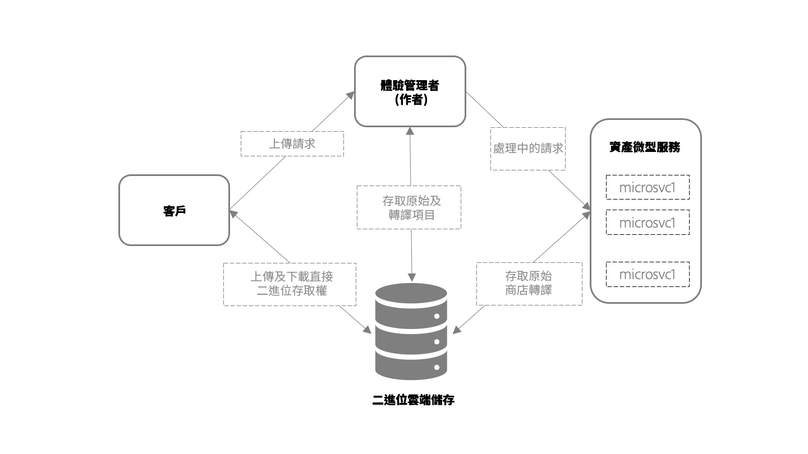

# 資產微服務資產擷取與處理概觀 {#asset-microservices-overview}

<!--
First half of content at https://git.corp.adobe.com/aklimets/project-nui/blob/master/docs/Project-Nui-Asset-Compute-Service.md is useful for this article.
TBD: Post-GA we will provide detailed information at \help\assets\asset-microservices-configure-and-use.md. However, for GA, all information is added, in short, in this article.
-->

Adobe Experience Manager作為雲端服務，提供雲端原生方式來運用Experience Manager應用程式和功能。 此新架構的關鍵元素之一，是資產擷取與處理，由資產微型服務提供支援。

Asset microservices使用雲端服務提供可擴充且具彈性的資產處理，由Adobe管理，以最佳化處理不同的資產類型和處理選項。 主要優點包括：

* 可擴展的體系結構，允許對資源密集型操作進行無縫處理。
* 高效的索引和文字摘取功能，不會影響您的Experience Manager環境的效能。
* 將在Experience Manager環境中處理資產處理的工作流程需求降到最低。 這樣可釋放資源、將Experience Manager的負載降至最低，並提供可擴充性。
* 改善資產處理的彈性。 處理非典型檔案（如損壞的檔案或極大的檔案）時的潛在問題不會再影響部署的效能。
* 簡化管理員的資產處理設定。
* Adobe負責管理和維護資產處理設定，以針對各種檔案類型提供處理轉譯、中繼資料和文字擷取的最知名設定
* 在適用情況下會使用原生Adobe檔案處理服務，提供高精確輸出，並 [有效率地處理Adobe專屬格式](file-format-support.md)。
* 能夠設定後處理工作流程，以新增使用者專屬的動作和整合。

Asset microservices可協助您避免需要協力廠商轉換工具（例如ImageMagick）並簡化系統的組態，同時為一般檔案類型提供現成可用的功能。

## 高階架構 {#asset-microservices-architecture}

高階架構圖說明資產擷取、處理及整個系統中資產流程的關鍵元素。

<!-- Proposed DRAFT diagram for asset microservices overview - see section "Asset processing - high-level diagram" in the PPTX deck

https://adobe-my.sharepoint.com/personal/gklebus_adobe_com/_layouts/15/guestaccess.aspx?guestaccesstoken=jexDC5ZnepXSt6dTPciH66TzckS1BPEfdaZuSgHugL8%3D&docid=2_1ec37f0bd4cc74354b4f481cd420e07fc&rev=1&e=CdgElS
-->

使用資產微服務擷取和處理的主要步驟為：

* 用戶端（例如網頁瀏覽器或Adobe Asset Link）會傳送上傳請求至Experience Manager，然後開始直接將二進位檔上傳至二進位雲端儲存空間。
* 當直接二進位上傳完成時，用戶端會通知Experience Manager。
* Experience Manager會傳送處理要求至資產微型服務。 請求內容取決於Experience Manager中指定哪些轉譯應產生的處理設定檔設定
* Assets microservices後端接收請求，並根據請求將請求分派給一或多個Microsoft Services。 每個Microservice都直接從二進位雲端儲存區存取原始二進位檔。
* 處理結果（例如轉譯）會儲存在二進位雲端儲存空間中。
* Experience Manager會收到處理完成的通知，並會將直接指標指向產生的二進位檔（轉譯），然後可在Experience Manager中針對上傳的資產使用這些二進位檔（轉譯）

這是資產提取與處理的基本流程。 如果已設定，Experience Manager也可以啟動客戶的工作流程模型，對資產進行後處理，例如，執行特定於客戶環境的某些自訂步驟，例如從客戶的企業系統擷取資訊以新增至資產屬性。

擷取和處理流程是Experience Manager資產微服務架構的主要概念。

* **直接二進位存取**:一旦為Experience Manager環境設定好資產，資產就會傳輸（並上傳）至Cloud Binary Store，然後AEM、資產微型服務，最後客戶可以直接存取資產以執行其工作。 這樣可最大限度地減少網路負載和儲存二進位檔案的複製
* **外部化處理**:資產處理是在AEM環境以外進行，並節省其資源（CPU、記憶體），以提供主要數位資產管理功能，並支援針對使用者的系統進行互動式工作

## 直接二進位存取的資產上傳 {#asset-upload-with-direct-binary-access}

Experience Manager客戶端是產品方案的一部分，預設情況下，所有客戶端都支援直接二進位訪問進行上載。 其中包括使用網頁介面、Adobe Asset Link和AEM案頭應用程式上傳。

您可以使用自訂的上傳工具，直接與AEM HTTP API搭配使用。 您可以直接使用這些API，或使用並擴充下列實作上傳通訊協定的開放原始碼專案：

* [開放原始碼上傳程式庫](https://github.com/adobe/aem-upload)
* [開放原始碼命令列工具](https://github.com/adobe/aio-cli-plugin-aem)

如需詳細資訊，請參 [閱上傳資產](add-assets.md)。

## 新增自訂資產後處理 {#add-custom-asset-post-processing}

雖然大部分客戶應從可設定的資產微服務取得其所有資產處理需求，但有些客戶可能需要額外的資產處理。 如果資產需要根據來自其他系統的資訊，透過整合處理，則特別如此。 在這類情況下，可使用自訂的後處理工作流程。

後置處理工作流程是一般的AEM工作流程模型，在AEM Workflow編輯器中建立和管理。 客戶可以設定工作流程，對資產執行其他處理步驟，包括使用可用的現成可用工作流程步驟和自訂工作流程。

Adobe Experience Manager可設定為在資產處理完成後自動觸發後處理工作流程。

<!-- TBD asgupta, Engg: Create some asset-microservices-data-flow-diagram.
-->

>[!MORELIKETHIS]
>
>* [開始使用資產微服務](asset-microservices-configure-and-use.md)
>* [支援的檔案格式](file-format-support.md)
>* [Adobe Asset Link](https://helpx.adobe.com/tw/enterprise/using/adobe-asset-link.html)
>* [AEM案頭應用程式](https://docs.adobe.com/content/help/zh-Hant/experience-manager-desktop-app/using/introduction.html)
>* [直接二進位存取的Apache Oak檔案](https://jackrabbit.apache.org/oak/docs/features/direct-binary-access.html)

