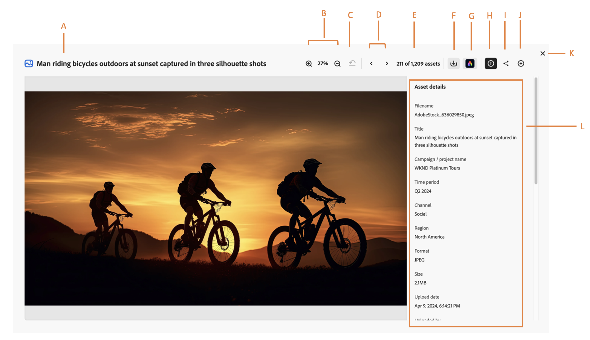

# 在Content Hub中預覽資產及其屬性 {#asset-properties}

[!DNL The Content Hub]可讓您檢視對有效率資產發佈至關重要的資產相關資訊。 這是資產所有可用資料的集合。

檢視資產預覽及其屬性可協助您進一步將資產分類，而且隨著數位資訊量成長，將相當實用。 您可以僅根據檔案名稱、縮圖和記憶體體來管理數百個檔案。但是，當涉及的人數以及管理的資產數量增加時，此方法將無法擴充。 此外，數位資產的價值會隨著資產成長：

* 更易於存取 - 系統和使用者可以更輕鬆找到資產。
* 更易於付諸行動 — 您擁有資產的視覺效果和相關資訊的完整資訊，以便更快速且更信賴地付諸行動。
* 完整 — 資產攜帶更多資訊和內容。

## 先決條件 {#prerequisites}

[Content Hub使用者](deploy-content-hub.md#onboard-content-hub-users)可以執行本文中提到的動作。

## 預覽資產及其屬性 {#properties-ui}

使用、分享或下載資產前，您可以更密切地檢視資產。預覽功能不僅可讓您檢視影像，也可檢視一些其他支援的資產型別。 您不僅可以檢視資產，也可以檢視其詳細資訊並採取其他動作。 若要檢視資產的資訊，請導覽至該資產，或[搜尋](search-assets.md)該資產，然後按一下該資產以開啟其屬性。 下圖示範資產屬性頁面上可用的欄位：

* **A：**&#x200B;資產的標題
* **B：**&#x200B;放大或縮小比例，可更密切地縮放或預覽資產
* **C：**&#x200B;復原縮放至先前選取的百分比
* **D：**&#x200B;繼續前一個或下一個資產
* **E：** Assets計數
* **F：**&#x200B;下載資產
* **G：**&#x200B;使用[!DNL Adobe Express]編輯資產
* **高：**&#x200B;收合或預覽資產資訊
* **I：**&#x200B;共用資產
* **J：**&#x200B;新增資產到[!DNL Collection]
* **K：**&#x200B;關閉預覽畫面
* **L：**&#x200B;資產的資訊，包括標題、格式、大小、解析度、標籤、顏色標籤和智慧標籤。

## 支援的資產格式 {#supported-formats}

[!DNL Content Hub]支援基礎[!DNL Assets]存放庫支援的所有資產型別和格式。 下表列出[!DNL the Content Hub]中的主要檔案格式，為以視覺效果預覽資產提供額外支援：

<table> 
    <tbody>
     <tr>
      <th><strong>檔案類型</strong></th>
      <th><strong>支援的格式</strong></th>
     </tr>
     <tr>
        <td rowspan="3"> 影像 </td>
    </tr>
    </tr>
    <tr>
        <td>[！UICONTROL JPEG]</td>
    </tr>
    <tr>
        <td>[！UICONTROL PNG]</td>
    </tr>
    <tr>
        <td rowspan="4"> 影片 </td>
    </tr>
    </tr>
    <tr>
        <td>[！UICONTROL Quicktime]</td>
    </tr>
    <tr>
        <td>[！UICONTROL MP4]</td>
    </tr>
    <tr>
        <td>[！UICONTROL MPEG]</td>
    </tr>
    <tr>
        <td rowspan="4"> 文件 </td>
    </tr>
    </tr>
    <tr>
        <td>[！UICONTROL txt] （純文字）</td>
    </tr>
    <tr>
        <td>[！UICONTROL Doc/Docx]</td>
    </tr>
    <tr>
        <td>[！UICONTROL XML]</td>
    </tr>
    <tr>
        <td rowspan="2"> 列印媒體 </td>
    </tr>
    </tr>
    <tr>
        <td>[！UICONTROL PDF]</td>
    </tr>
    </tbody>
</table>

### 衍生屬性 {#derived-properties}

資產上傳至[!DNL Content Hub]後，在[!DNL Assets]核准可用性時，[!DNL Content Hub]中顯示之資產的某些屬性會衍生或自動產生。 以下是其中一些的清單：

* **大小：**&#x200B;大小代表儲存在基礎存放庫中的資產二進位檔大小。

<!--* **Tags:** Tags help you categorize assets that can be browsed and searched more efficiently. Tagging helps in propagating the appropriate taxonomy to other users and workflows. -->

* **智慧標籤：** [!DNL The Content Hub]使用Adobe AI的智慧內容服務，在標籤架構上使用辨識演演算法來訓練資產。 然後，再利用這些內容智慧對不同的資產集套用相關標記。智慧標籤可協助您快速找到相關資產，提升專案的內容速度。 智慧型標籤即是不含在影像中的資產資訊範例。 [!DNL Experience Manager Assets]預設會自動將智慧標籤套用至資產。

* **色彩標籤：** [色彩標籤](#https://experienceleague.adobe.com/docs/experience-manager-cloud-service/content/assets/manage/color-tag-images.html?lang=en)可協助您使用Adobe的AI功能，在資產中自動識別的顏色，來識別資產。

* 上傳日期

* 上傳者

* 上次修改時間

* 上次修改者

將資產新增至Content Hub時，也會指定屬性。 如需詳細資訊，請參閱[將品牌核准的資產新增至Content Hub](upload-brand-approved-assets.md)。 這些屬性也會顯示在資產屬性頁面上。

管理員也可以設定屬性，屬性會針對每個資產顯示：

* 在資產預覽UI：請參閱[設定Content Hub使用者介面](configure-content-hub-ui-options.md#configure-asset-details-content-hub)。
* 在搜尋結果或集合中的資產卡上：請參閱[設定Content Hub使用者介面](configure-content-hub-ui-options.md#asset-card)。

<!--

### Date range {#date-range} 

The date range allows you to select dates you want to see the assets. You can customize date range by choosing the start and end dates. 

-->
