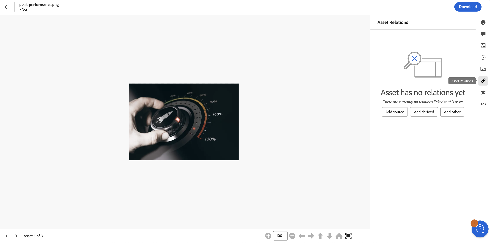
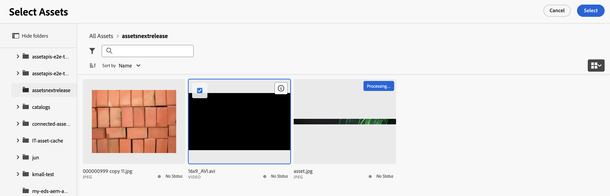

# 資產關係 {#related-assets}

[!DNL Adobe Experience Manager Assets]可讓您使用相關資產功能，根據貴組織的需求手動建立資產關聯。 例如，您可以將授權檔案與類似主題的資產或影像/影片建立關聯。 您可以將共用特定通用屬性的資產建立關聯。 您也可以使用功能來建立資產之間的來源/衍生關係。 例如，如果您有一個從INDD檔案產生的PDF檔案，您可以將PDF檔案與其來源INDD檔案相關聯。

使用此功能，您可以彈性地與廠商或機構共用低解析度的PDF檔案或JPG檔案，並僅在提出要求時提供高解析度的INDD檔案。

>[!NOTE]
>
>只有對資產具有編輯許可權的使用者才能建立資產的相關性和取消資產的相關性。

## 建立資產關聯的步驟 {#steps-to-relate-assets}

1. 從[!DNL Experience Manager]介面，開啟要建立關聯之資產的&#x200B;**[!UICONTROL 屬性]**&#x200B;頁面。

   

1. 若要將另一個資產與您選取的資產建立關聯，請按一下&#x200B;**[!UICONTROL 資產關係]** 。
1. 執行下列任一項作業：

   * 若要關聯資產的來源檔案，請從清單中選取&#x200B;**[!UICONTROL 新增Source]**。 您只能將單一資產關聯為來源。
   * 若要關聯衍生檔案，請從清單中選取&#x200B;**[!UICONTROL 新增衍生檔案]**。 您可以在此類別中關聯多個資產。
   * 若要在資產之間建立雙向關係，請從清單中選取&#x200B;**[!UICONTROL 新增其他]**。 您可以在此類別中關聯多個資產。

1. 從&#x200B;**[!UICONTROL 選取Assets]**&#x200B;畫面中，導覽至您要建立關聯的資產位置，然後選取該資產。 您可以在按一下時按住Shift鍵，一次選取單一資產或多個資產，其中可能包括Assets檢視](/help/assets/supported-file-formats-assets-view.md)支援的任何[檔案格式。

   

1. 按一下&#x200B;**[!UICONTROL 選取]**。 根據您在步驟3中選擇的關係，相關資產會列在&#x200B;**[!UICONTROL 資產關係]**&#x200B;區段的適當類別下。 例如，如果您相關的資產是目前資產的來源檔案，則會列在&#x200B;**[!UICONTROL Source]**&#x200B;下。

   

1. 按一下&#x200B;**[!UICONTROL 取消關聯]** ，可用於每個區段([!UICONTROL Source]、[!UICONTROL Derived]和[!UICONTROL Other])中的所有相關資產，以取消關聯資產。

## 翻譯相關資產 {#translating-related-assets}

使用相關資產功能在資產之間建立來源/衍生關係，在翻譯工作流程中也很有幫助。 當您在衍生資產上執行翻譯工作流程時，[!DNL Experience Manager Assets]會自動擷取來源檔案參考的任何資產，並將其納入以進行翻譯。 如此一來，來源資產所參考的資產會與來源和衍生資產一併轉譯。 如果來源檔案與另一個資產相關，[!DNL Experience Manager Assets]會擷取參照的資產並包含它以進行翻譯。

請參閱[在AEM中翻譯資產](/help/assets/translate-assets.md)。

## 後續步驟 {#next-steps}

* 使用資產檢視使用者介面所提供的[!UICONTROL 意見回饋]選項提供產品意見回饋

* 若要提供文件意見回饋，請使用右側邊欄提供的[!UICONTROL 編輯此頁面]或[!UICONTROL 記錄問題]

* 聯絡[客戶服務](https://experienceleague.adobe.com/?support-solution=General#support)

>[!MORELIKETHIS]
>
>* [檢視資產的版本](/help/assets/manage-organize-assets-view.md#view-versions)
>* [在AEM中翻譯資產](/help/assets/translate-assets.md)
>* 在Assets檢視中[支援的檔案格式](/help/assets/supported-file-formats-assets-view.md)。
