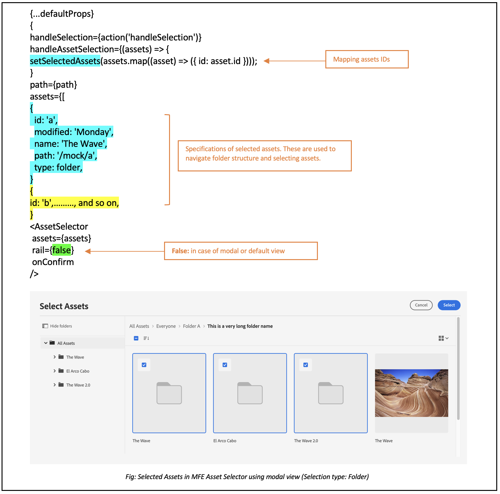
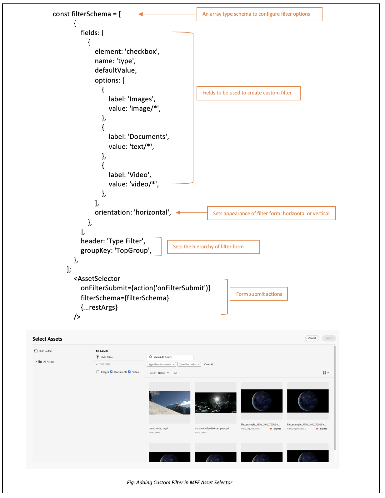

# 微前端資產選擇器 {#Overview}

微前端資產選擇器提供一個輕鬆整合 [!DNL Experience Manager Assets] 存放庫的使用者介面，讓您可以瀏覽或搜尋存放庫中的可用數位資產，並用於您的應用程式編寫體驗。

在您的應用程式體驗中可利用資產選擇器套件使用微前端使用者介面。套件的任何更新都會自動匯入，而最新部署的資產選擇器會自動載入到您的應用程式。


資產選擇器提供了許多優點，例如：

* 使用Vanilla JavaScript程式庫輕鬆與任何[Adobe](#asset-selector-ims)或[非Adobe](#asset-selector-non-ims)應用程式整合。
* 容易維護，因為資產選擇器套件的更新會自動部署到您的應用程式可用的資產選擇器。您的應用程式無需更新即可載入最新的修改內容。
* 簡易的自訂功能，因為有可以控制應用程式中資產選擇器顯示的可用屬性。
* 全文搜尋、開箱即用和自訂篩選器，可快速找到要在編寫體驗中使用的資產。
* 能夠在 IMS 組織內切換存放庫以選擇資產。
* 能夠按名稱、維度和大小對資產進行排序，並以清單、網格、圖庫或瀑布視圖檢視。

<!--Perform the following tasks to integrate and use Asset Selector with your [!DNL Experience Manager Assets] repository:

1. [Install Asset Selector](#installation)
2. [Integrate Asset Selector using Vanilla JS](#integration-using-vanilla-js)
3. [Use Asset Selector](#using-asset-selector)
-->

<!--
## Setting up Asset Selector {#asset-selector-setup}


-->

## 先決條件{#prereqs}

您必須確保以下通訊方式：

* 該應用程式是在 HTTPS 上運作。
* 應用程式的 URL 位於 IMS 用戶端的重新導向 URL 允許清單中。
* IMS 登入流程是使用網頁瀏覽器上的快顯視窗進行設定和轉譯。因此，應在目標瀏覽器上啟用或允許快顯視窗。

如果您需要Asset Selector的IMS驗證工作流程，請使用上述先決條件。 或者，如果您已透過 IMS 工作流程進行驗證，則可以改為新增 IMS 資訊。

>[!IMPORTANT]
>
> 存放庫旨在作為補充文件，說明整合資產選擇器的可用 API 和使用範例。在嘗試安裝或使用資產選擇器之前，請確保您的組織已佈建對資產選擇器的存取權限，作為 Experience Manager Assets as a Cloud Service 設定檔的一部分。如果您尚未佈建，則無法整合或使用這些元件。若要請求布建，您的程式管理員應從Admin Console提出標示為P2的支援票證，並包含下列資訊：
>
>* 託管整合應用程式的網域名稱。
>* 佈建後，您的組織將獲得與所要求之環境相對應的 `imsClientId`、`imsScope` 和 `redirectUrl`，對於資產選擇器的設定至關重要。如果沒有這些有效屬性，您就無法執行安裝步驟。

## 安裝 {#installation}

ESM 內容傳遞網路 (例如 [esm.sh](https://esm.sh/)/[skypack](https://www.skypack.dev/)) 和 [UMD](https://github.com/umdjs/umd) 版本均可使用資產選擇器。

在使用 **UMD 版** 的瀏覽器中 (建議)：

```
<script src="https://experience.adobe.com/solutions/CQ-assets-selectors/static-assets/resources/assets-selectors.js"></script>

<script>
  const { renderAssetSelector } = PureJSSelectors;
</script>
```

在具備 `import maps` 支援並使用 **ESM CDN 版**&#x200B;的瀏覽器中：

```
<script type="module">
  import { AssetSelector } from 'https://experience.adobe.com/solutions/CQ-assets-selectors/static-assets/resources/@assets/selectors/index.js'
</script>
```

在使用 **ESM CDN 版**&#x200B;的 Deno/Webpack Module Federation 中：

```
import { AssetSelector } from 'https://experience.adobe.com/solutions/CQ-assets-selectors/static-assets/resources/@assets/selectors/index.js'
```

## 使用 Vanilla JS 整合資產選擇器 {#integration-using-vanilla-js}

您可以將任何[!DNL Adobe]或非Adobe應用程式與[!DNL Experience Manager Assets]存放庫整合，並從應用程式中選取資產。 請參閱[資產選擇器與各種應用程式的整合](#asset-selector-integration-with-apps)。

匯入資產選擇器套件，並使用 Vanilla JavaScript 程式庫連接到 Assets as a Cloud Service，便完成了整合作業。編輯`index.html`或您應用程式內的任何適當檔案，以：

* 定義身份驗證詳細資訊
* 存取 Assets as a Cloud Service 存放庫
* 設定資產選擇器顯示屬性

在以下情況下，您可以在不定義某些 IMS 屬性的情況下執行身份驗證：

* 在 [!DNL Adobe] [Unified Shell](https://experienceleague.adobe.com/docs/experience-manager-cloud-service/content/overview/aem-cloud-service-on-unified-shell.html?lang=zh-Hant) 之上整合一個應用程式時。
* 您已經具有針對身份驗證產生的一個 IMS 語彙基元。

## 整合Asset Selector與各種應用程式 {#asset-selector-integration-with-apps}

您可以整合Asset Selector與各種應用程式，例如：

* [將資產選擇器與 [!DNL Adobe] 應用程式整合](#adobe-app-integration-vanilla)
* [整合資產選擇器與非 Adobe 應用程式](#adobe-non-app-integration)
* [整合Dynamic Media與OpenAPI功能](#adobe-app-integration-polaris)

>[!BEGINTABS]

<!--Integration with an Adobe application content starts here-->

>[!TAB 與Adobe應用程式整合]

### 先決條件{#prereqs-adobe-app}

如果您整合Asset Selector與[!DNL Adobe]應用程式，請使用下列先決條件：

* [通訊方法](#prereqs)
* imsOrg
* imsToken
* apikey

### 將資產選擇器與[!DNL Adobe]應用程式整合 {#adobe-app-integration-vanilla}

下列範例示範在Unified Shell下執行[!DNL Adobe]應用程式或您已針對驗證產生`imsToken`時，資產選擇器的使用方式。

使用`script`標籤在您的程式碼中加入Asset Selector套件，如下列範例的&#x200B;_行6-15_&#x200B;所示。 在載入指令碼後，即可使用 `PureJSSelectors` 全域變數。定義資產選擇器[屬性](#asset-selector-properties)，如&#x200B;_行16-23_&#x200B;所示。 在Adobe應用程式中驗證時需要`imsOrg`和`imsToken`屬性。 `handleSelection` 屬性用於處理選取的資產。要轉譯資產選擇器，請呼叫 `renderAssetSelector` 函數，如&#x200B;_第 17 行_&#x200B;所述。資產選擇器顯示於 `<div>` 容器元素，如&#x200B;_第 21 和 22 行_&#x200B;所示。

按照這些步驟操作，您就可以將Asset Selector與[!DNL Adobe]應用程式搭配使用。

```html {line-numbers="true"}
<!DOCTYPE html>
<html>
<head>
    <title>Asset Selector</title>
    <script src="https://experience.adobe.com/solutions/CQ-assets-selectors/assets/resources/assets-selectors.js"></script>
    <script>
        // get the container element in which we want to render the AssetSelector component
        const container = document.getElementById('asset-selector-container');
        // imsOrg and imsToken are required for authentication in Adobe application
        const assetSelectorProps = {
            imsOrg: 'example-ims@AdobeOrg',
            imsToken: "example-imsToken",
            apiKey: "example-apiKey-associated-with-imsOrg",
            handleSelection: (assets: SelectedAssetType[]) => {},
        };
        // Call the `renderAssetSelector` available in PureJSSelectors globals to render AssetSelector
        PureJSSelectors.renderAssetSelector(container, assetSelectorProps);
    </script>
</head>

<body>
    <div id="asset-selector-container" style="height: calc(100vh - 80px); width: calc(100vw - 60px); margin: -20px;">
    </div>
</body>

</html>
```

<!--For detailed example, visit [Asset Selector Code Example](https://github.com/adobe/aem-assets-selectors-mfe-examples).-->

+++**ImsAuthProps**
`ImsAuthProps`屬性定義Asset Selector用來取得`imsToken`的驗證資訊和流程。 藉由設定這些屬性，您可以控制驗證流程應該如何行為並註冊各種驗證事件的接聽程式。

| 屬性名稱 | 說明 |
|---|---|
| `imsClientId` | 代表用於驗證目的之IMS使用者端ID的字串值。 此值由Adobe提供，且為您的Adobe AEM CS組織專用。 |
| `imsScope` | 說明用於驗證的範圍。 範圍會決定應用程式對貴組織資源的存取層級。 多個範圍可以用逗號分隔。 |
| `redirectUrl` | 代表驗證後重新導向使用者的URL。 此值通常設定為應用程式目前的URL。 如果未提供`redirectUrl`，`ImsAuthService`會使用用來登入`imsClientId`的redirectUrl |
| `modalMode` | 表示驗證流程是否應該顯示在強制回應視窗（快顯視窗）中的布林值。 如果設為`true`，驗證流程會以快顯視窗顯示。 如果設為`false`，則驗證流程會以全頁重新載入顯示。 _Note :_若要獲得較好的UX，您可以在使用者停用瀏覽器快顯視窗時動態控制此值。 |
| `onImsServiceInitialized` | Adobe IMS驗證服務初始化時呼叫的回呼函式。 此函式接受一個引數`service`，此引數是代表Adobe IMS服務的物件。 如需詳細資訊，請參閱[`ImsAuthService`](#imsauthservice-ims-auth-service)。 |
| `onAccessTokenReceived` | 從Adobe IMS驗證服務收到`imsToken`時所呼叫的回呼函式。 此函式接受一個引數`imsToken`，該引數是代表存取權杖的字串。 |
| `onAccessTokenExpired` | 當存取權杖過期時所呼叫的回呼函式。 此函式通常用於觸發新的驗證流程，以取得新的存取權杖。 |
| `onErrorReceived` | 驗證期間發生錯誤時所呼叫的回呼函式。 此函式採用兩個引數：錯誤型別和錯誤訊息。 錯誤型別是代表錯誤型別的字串，而錯誤訊息是代表錯誤訊息的字串。 |

+++

+++**ImsAuthService**
`ImsAuthService`類別會處理Asset Selector的驗證流程。 其負責從Adobe IMS驗證服務取得`imsToken`。 `imsToken`可用來驗證使用者，並授權以[!DNL Adobe Experience Manager] Assets存放庫身分存取[!DNL Cloud Service]。 ImsAuthService使用`ImsAuthProps`屬性來控制驗證流程並註冊各種驗證事件的接聽程式。 您可以使用方便的[`registerAssetsSelectorsAuthService`](#purejsselectorsregisterassetsselectorsauthservice)函式，以資產選擇器註冊&#x200B;_ImsAuthService_&#x200B;執行個體。 `ImsAuthService`類別上有以下可用函式。 不過，如果您使用&#x200B;_registerAssetsSelectorsAuthService_&#x200B;函式，則不需要直接呼叫這些函式。

| 函式名稱 | 說明 |
|---|---|
| `isSignedInUser` | 判斷使用者目前是否已登入服務並據此傳回布林值。 |
| `getImsToken` | 擷取目前登入使用者的驗證`imsToken`，此驗證可用於驗證其他服務的要求，例如產生資產_rendition。 |
| `signIn` | 起始使用者的登入程式。 此函式使用`ImsAuthProps`在快顯視窗或整頁重新載入中顯示驗證 |
| `signOut` | 將使用者登出服務，讓其驗證Token失效，並要求他們再次登入以存取受保護的資源。 叫用此函式將會重新載入目前頁面。 |
| `refreshToken` | 重新整理目前登入使用者的驗證Token，避免其到期並確保受保護資源的存取不中斷。 傳回可用於後續請求的新驗證Token。 |

+++

+++**使用提供的IMS權杖進行驗證**

```
<script>
    const apiToken="<valid IMS token>";
    function handleSelection(selection) {
    console.log("Selected asset: ", selection);
    };
    function renderAssetSelectorInline() {
    console.log("initializing Asset Selector");
    const props = {
    "repositoryId": "delivery-p64502-e544757.adobeaemcloud.com",
    "apiKey": "ngdm_test_client",
    "imsOrg": "<IMS org>",
    "imsToken": apiToken,
    handleSelection,
    hideTreeNav: true
    }
    const container = document.getElementById('asset-selector-container');
    PureJSSelectors.renderAssetSelector(container, props);
    }
    $(document).ready(function() {
    renderAssetSelectorInline();
    });
</script>
```

+++

+++**向IMS服務註冊回呼**

```
// object `imsProps` to be defined as below 
let imsProps = {
    imsClientId: <IMS Client Id>,
        imsScope: "openid",
        redirectUrl: window.location.href,
        modalMode: true,
        adobeImsOptions: {
            modalSettings: {
            allowOrigin: window.location.origin,
},
        useLocalStorage: true,
},
onImsServiceInitialized: (service) => {
            console.log("onImsServiceInitialized", service);
},
onAccessTokenReceived: (token) => {
            console.log("onAccessTokenReceived", token);
},
onAccessTokenExpired: () => {
            console.log("onAccessTokenError");
// re-trigger sign-in flow
},
onErrorReceived: (type, msg) => {
            console.log("onErrorReceived", type, msg);
},
}
```

+++

<!--Integration with non-Adobe application content starts here-->

>[!TAB 與非Adobe應用程式整合]

<!--### Integrate Asset Selector with a [!DNL non-Adobe] application {#adobe-non-app-integration}-->

### 先決條件 {#prereqs-non-adobe-app}

如果您整合Asset Selector與非Adobe應用程式，請使用下列先決條件：

* [通訊方法](#prereqs)
* imsClientId
* imsScope
* redirectUrl
* imsOrg
* apikey

Asset Selector支援使用Identity Management System (IMS)屬性（例如[!DNL Experience Manager Assets]或`imsScope`）驗證`imsClientID`存放庫(當您將其與非Adobe應用程式整合時)。

+++**設定非Adobe應用程式的資產選擇器**
若要為非Adobe應用程式設定Asset Selector，您必須先記錄布建的支援票證，然後進行整合步驟。

**正在記錄支援票證**
透過Admin Console記錄支援票證的步驟：

1. 在票證標題中新增具有AEM Assets **的**&#x200B;資產選擇器。

1. 在說明中提供以下詳細資訊：

   * [!DNL Experience Manager Assets]作為[!DNL Cloud Service] URL （方案ID和環境ID）。
   * 託管非Adobe Web應用程式的網域名稱。
+++

+++**整合步驟**
將Asset Selector與非Adobe應用程式整合時，請使用這個範例`index.html`檔案進行驗證。

使用`Script`標籤存取Asset Selector套件，如範例&#x200B;*檔案的*&#x200B;第9 *行到*&#x200B;第11`index.html`行所示。

範例的&#x200B;*第14*&#x200B;行到&#x200B;*第38*&#x200B;行說明IMS流程屬性，例如`imsClientId`、`imsScope`和`redirectURL`。 函式要求您至少定義`imsClientId`和`imsScope`屬性之一。 如果您未定義`redirectURL`的值，則會使用使用者端ID的註冊重新導向URL。

由於您尚未產生`imsToken`，請使用`registerAssetsSelectorsAuthService`和`renderAssetSelectorWithAuthFlow`函式，如範例`index.html`檔案的第40行至第50行所示。 使用`registerAssetsSelectorsAuthService`之前的`renderAssetSelectorWithAuthFlow`函式，以透過資產選擇器註冊`imsToken`。 [!DNL Adobe]建議您在具現化元件時呼叫`registerAssetsSelectorsAuthService`。

在`const props`區段中定義驗證和其他Assets as a Cloud Service存取相關屬性，如範例&#x200B;*檔案的*&#x200B;行54 *到*&#x200B;行60`index.html`所示。

在`PureJSSelectors`第65 *行中提到的*&#x200B;全域變數是用來在網頁瀏覽器中轉譯Asset Selector。

資產選擇器已在`<div>`容器元素上呈現，如&#x200B;*第74*&#x200B;行到&#x200B;*第81*&#x200B;行中所述。 此範例使用對話方塊來顯示「資產選取器」。

```html {line-numbers="true"}
<!DOCTYPE html>
<html>

<head>
    <meta http-equiv="X-UA-Compatible" content="IE=edge">
    <meta charset="utf-8">
    <title>Asset Selectors</title>
    <link rel="stylesheet" href="index.css">
    <script id="asset-selector"
        src="https://experience.adobe.com/solutions/CQ-assets-selectors/assets/resources/asset-selectors.js"></script>
    <script>

        const imsProps = {
            imsClientId: "<obtained from IMS team>",
            imsScope: "openid, <other scopes>",
            redirectUrl: window.location.href,
            modalMode: true, // false to open in a full page reload flow
            onImsServiceInitialized: (service) => {
                // invoked when the ims service is initialized and is ready
                console.log("onImsServiceInitialized", service);
            },
            onAccessTokenReceived: (token) => {
                console.log("onAccessTokenReceived", token);
            },
            onAccessTokenExpired: () => {
                console.log("onAccessTokenError");
                // re-trigger sign-in flow
            },
            onErrorReceived: (type, msg) => {
                console.log("onErrorReceived", type, msg);
            },
        }

        function load() {
            const registeredTokenService = PureJSSelectors.registerAssetsSelectorsAuthService(imsProps);
            imsInstance = registeredTokenService;
        };

        // initialize the IMS flow before attempting to render the asset selector
        load();
        

        //function that will render the asset selector
            const otherProps = {
            // any other props supported by asset selector
            }
            const assetSelectorProps = {
                "imsOrg": "imsorg",
                ...otherProps
            }
             // container element on which you want to render the AssetSelector/DestinationSelector component
            const container = document.getElementById('asset-selector');

            /// Use the PureJSSelectors in globals to render the AssetSelector/DestinationSelector component
            PureJSSelectors.renderAssetSelectorWithAuthFlow(container, assetSelectorProps, () => {
                const assetSelectorDialog = document.getElementById('asset-selector-dialog');
                assetSelectorDialog.showModal();
            });
        }
    </script>

</head>
<body class="asset-selectors">
    <div>
        <button onclick="renderAssetSelectorWithAuthFlowFlow()">Asset Selector - Select Assets with Ims Flow</button>
    </div>
        <dialog id="asset-selector-dialog">
            <div id="asset-selector" style="height: calc(100vh - 80px); width: calc(100vw - 60px); margin: -20px;">
            </div>
        </dialog>
    </div>
</body>

</html>
```

+++

+++**無法存取傳遞存放庫**

>[!TIP]
>
>如果您已使用註冊登入工作流程整合資產選擇器，但仍無法存取傳遞存放庫，請確定已清理瀏覽器Cookie。 否則，您會在主控台中收到`invalid_credentials All session cookies are empty`錯誤。

+++

<!--Integration with Polaris application content starts here-->

>[!TAB 整合Dynamic Media與OpenAPI功能]

### 先決條件 {#prereqs-polaris}

如果您整合Asset Selector與Dynamic Media以及OpenAPI功能，請使用下列先決條件：

* [通訊方法](#prereqs)
* 若要使用OpenAPI功能存取Dynamic Media，您必須擁有下列專案的授權：
   * Assets存放庫(例如Experience Manager Assets as a Cloud Service)。
   * AEM Dynamic Media。
* 只有[個核准的資產](#approved-assets.md)可供使用，以確保品牌一致性。

### 整合Dynamic Media與OpenAPI功能{#adobe-app-integration-polaris}

Asset Selector與Dynamic Media OpenAPI程式的整合涉及各種步驟，包括建立自訂的Dynamic Media URL或準備選取Dynamic Media URL等。

+++**整合Dynamic Media的資產選擇器與OpenAPI功能**

`rootPath`和`path`屬性不應該是具有OpenAPI功能的Dynamic Media的一部分。 您可以改為設定`aemTierType`屬性。 以下是設定的語法：

```
aemTierType:[1: "delivery"]
```

此設定可讓您檢視所有核准的資產，而不使用資料夾或以平面結構檢視。 如需詳細資訊，請導覽至`aemTierType`資產選擇器屬性[下的](#asset-selector-properties)屬性

+++

+++**從核准的資產建立動態傳遞URL**
設定「資產選擇器」後，系統會使用物件的結構描述，從選取的資產建立動態傳送URL。
例如，從選取資產時收到的物件陣列中的一個物件的結構描述：

```
{
"dc:format": "image/jpeg",
"repo:assetId": "urn:aaid:aem:xxxxxxxx-xxxx-xxxx-xxxx-xxxxxxxxxxxx",
"repo:name": "image-7.jpg",
"repo:repositoryId": "delivery-pxxxx-exxxxxx.adobe.com",
...
}
```

所有選取的資產都由做為JSON物件的`handleSelection`函式執行。 例如 `JsonObj`。動態傳遞URL是透過結合以下電信業者來建立：

| 物件 | JSON |
|---|---|
| 主機 | `assetJsonObj["repo:repositoryId"]` |
| API根目錄 | `/adobe/assets` |
| asset-id | `assetJsonObj["repo:assetId"]` |
| seo-name | `assetJsonObj["repo:name"].split(".").slice(0,-1).join(".")` |
| 格式 | `.jpg` |

**核准的資產傳遞API規格**

URL格式：
`https://<delivery-api-host>/adobe/assets/<asset-id>/as/<seo-name>.<format>?<image-modification-query-parameters>`

其中，

* 主機為`https://delivery-pxxxxx-exxxxxx.adobe.com`
* API根目錄為`"/adobe/assets"`
* `<asset-id>`為資產識別碼
* `as`是open API規格的常數部分，指出要參照的資產名稱
* `<seo-name>`為資產名稱
* `<format>`為輸出格式
* `<image modification query parameters>`為核准資產的傳遞API規格所支援

**已核准的資產原始轉譯傳遞API**

動態傳送URL擁有下列語法：
`https://<delivery-api-host>/adobe/assets/<asset-id>/original/as/<seo-name>`，其中，

* 主機為`https://delivery-pxxxxx-exxxxxx.adobe.com`
* 原始轉譯傳遞的API根為`"/adobe/assets"`
* `<asset-id>`為資產識別碼
* `/original/as`是open API規格的常數部分，指出原始轉譯稱為
* `<seo-name>`為具有或不具有副檔名的資產名稱

+++

+++**已準備好挑選動態傳遞URL**
所有選取的資產都由做為JSON物件的`handleSelection`函式執行。 例如 `JsonObj`。動態傳遞URL是透過結合以下電信業者來建立：

| 物件 | JSON |
|---|---|
| 主機 | `assetJsonObj["repo:repositoryId"]` |
| API根目錄 | `/adobe/assets/deliver` |
| asset-id | `assetJsonObj["repo:assetId"]` |
| seo-name | `assetJsonObj["repo:name"]` |

以下是遍歷JSON物件的兩種方式：


* **縮圖：**縮圖可為影像，資產為PDF、影片、影像等。 不過，您可以使用資產縮圖的高度和寬度屬性作為動態傳送轉譯。
下列轉譯集可用於PDF型別資產：
在sidekick中選取PDF後，選取內容會提供以下資訊。 以下為遍歷JSON物件的方式：

  <!---->

  您可以在上方熒幕擷圖中，參考`selection[0].....selection[4]`以取得一系列轉譯連結。 例如，其中一個縮圖轉譯的關鍵屬性包括：

  ```
  { 
      "height": 319, 
      "width": 319, 
      "href": "https://delivery-pxxxxx-exxxxx.adobeaemcloud.com/adobe/assets/urn:aaid:aem:8560f3a1-d9cf-429d-a8b8-d81084a42d41/as/algorithm design.jpg?width=319&height=319", 
      "type": "image/webp" 
  } 
  ```

在上述熒幕擷圖中，如果需要PDF，而非其縮圖，則需要將PDF原始轉譯的傳送URL合併至目標體驗。 例如 `https://delivery-pxxxxx-exxxxx-cmstg.adobeaemcloud.com/adobe/assets/urn:aaid:aem:8560f3a1-d9cf-429d-a8b8-d81084a42d41/original/as/algorithm design.pdf`

* **影片：**您可以使用內嵌iFrame的影片型別資產，使用影片播放器URL。 您可以在目標體驗中使用下列陣列轉譯：
  <!---->

  ```
  { 
      "height": 319, 
      "width": 319, 
      "href": "https://delivery-pxxxxx-exxxxx.adobeaemcloud.com/adobe/assets/urn:aaid:aem:2fdef732-a452-45a8-b58b-09df1a5173cd/as/asDragDrop.2.jpg?width=319&height=319", 
      "type": "image/webp" 
  } 
  ```

  您可以在上方熒幕擷圖中，參考`selection[0].....selection[4]`以取得一系列轉譯連結。 例如，其中一個縮圖轉譯的關鍵屬性包括：

  上述熒幕擷取畫面中的程式碼片段為視訊資產的範例。 其中包含轉譯連結陣列。 摘錄中的`selection[5]`是影像縮圖的範例，可做為目標體驗中視訊縮圖的預留位置。 轉譯陣列中的`selection[5]`適用於視訊播放器。 此函式提供HTML，可設為iframe的`src`。 它支援自我調整位元速率串流，這是網頁最佳化的視訊傳送方式。

  在上述範例中，視訊播放器URL為`https://delivery-pxxxxx-exxxxx.adobeaemcloud.com/adobe/assets/urn:aaid:aem:2fdef732-a452-45a8-b58b-09df1a5173cd/play`

+++**具有OpenAPI功能的Dynamic Media資產選擇器使用者介面**

與Adobe的微前端資產選擇器整合後，您只能看到Experience Manager資產存放庫中所有已核准資產的結構。


* **A**：[隱藏/顯示面板](#hide-show-panel)
* **B**： [Assets](#repository)
* **C**： [排序](#sorting)
* **D**：[篩選器](#filters)
* **E**：[搜尋列](#search-bar)
* **F**： [依遞增或遞減順序排序](#sorting)
* **G**：取消選取
* **H**：選取單一或多個資產

+++

+++**設定自訂篩選器**
具有OpenAPI功能的Dynamic Media資產選擇器可讓您設定自訂屬性，以及基於自訂屬性的篩選器。 `filterSchema`屬性是用來設定這類屬性。 自訂可公開為`metadata.<metadata bucket>.<property name>.`，以便針對其設定篩選器，其中，

* `metadata`是資產的資訊
* `embedded`是用於設定的靜態引數，並且
* `<propertyname>`是您正在設定的篩選器名稱

對於設定，定義在`jcr:content/metadata/`層級的屬性會針對您要設定的篩選器，公開為`metadata.<metadata bucket>.<property name>.`。

例如，在具有OpenAPI功能的Dynamic Media資產選擇器中，`asset jcr:content/metadata/client_name:market`上的屬性會針對篩選器設定轉換為`metadata.embedded.client_name:market`。

若要取得名稱，必須完成一次性活動。 對資產發出搜尋API呼叫，然後取得屬性名稱（基本上是貯體）。

+++

>[!ENDTABS]

## 資產選擇器屬性 {#asset-selector-properties}

您可以使用資產選擇器屬性自訂資產選擇器的呈現方式。下表列出可用於自訂和使用資產選擇器的屬性。

| 屬性 | 類型 | 必要 | 預設 | 說明 |
|---|---|---|---|---|
| *rail* | 布林值 | 否 | 假 | 如果標籤為`true`，資產選擇器將會在左側邊欄檢視中轉譯。 如果資產選擇器標示為`false`，則會以模組檢視呈現。 |
| *imsOrg* | 字串 | 是 | | Adobe Identity Management System (IMS) ID 是在為您的組織佈建 [!DNL Adobe Experience Manager] as a [!DNL Cloud Service] 時所指派的。`imsOrg`金鑰是驗證您所存取的組織是否位於Adobe IMS下的必要專案。 |
| *imsToken* | 字串 | 否 | | 用於身份驗證的 IMS 持有人語彙基元。如果您使用`imsToken`應用程式進行整合，則需要[!DNL Adobe]。 |
| *apiKey* | 字串 | 否 | | 用於存取 AEM Discovery 服務的 API 金鑰。如果您使用`apiKey`應用程式整合，則需要[!DNL Adobe]。 |
| *filterSchema* | 陣列 | 否 | | 用於設定篩選器屬性的模式。這可用於想要限制資產選擇器中的特定篩選器選項時。 |
| *filterFormProps* | 物件 | 否 | | 指定用於調整搜尋所需的篩選器屬性。針對！ 例如，MIME型別JPG、PNG、GIF。 |
| *selectedAssets* | 陣列 `<Object>` | 否 |                 | 呈現資產選擇器時指定選取的資產。需要包含資產的 id 屬性的物件陣列。例如，在目前的目錄中必須可以使用 `[{id: 'urn:234}, {id: 'urn:555'}]` 資產。如果您需要使用不同的目錄，請為該 `path` 屬性提供一個值。 |
| *acvConfig* | 物件 | 否 | | 包含要覆寫預設值之自訂設定的物件的資產集合檢視屬性。 此外，此屬性會與`rail`屬性搭配使用，以啟用資產檢視器的邊欄檢視。 |
| *i18nSymbols* | `Object<{ id?: string, defaultMessage?: string, description?: string}>` | 否 |                 | 如果OOTB轉譯不足以滿足您的應用程式需求，您可以公開介面，讓您透過`i18nSymbols` prop傳遞自己的自訂本地化值。 透過此介面傳遞值會覆寫所提供的預設翻譯，並改用您自己的翻譯。 若要執行覆寫，您必須傳遞一個有效的 [Message Descriptor](https://formatjs.io/docs/react-intl/api/#message-descriptor) 物件至您想要覆寫的 `i18nSymbols` 金鑰。 |
| *intl* | 物件 | 否 | | 資產選擇器提供預設的OOTB翻譯。 您可以透過 `intl.locale`prop 提供有效的語言環境字串，以選擇翻譯語言。例如：`intl={{ locale: "es-es" }}`</br></br>支援的語言環境字串遵循 [ISO 639 - 代碼](https://www.iso.org/iso-639-language-codes.html)來選擇代表語言標準名稱的代碼。</br></br>支援的語言環境清單：英文 - &#39;en-us&#39; (預設) 西班牙文 - &#39;es-es&#39; 德文 - &#39;de-de&#39; 法文 - &#39;fr-fr&#39; 義大利文 - &#39;it-it&#39; 日文 - &#39;ja-jp&#39;韓文 - &#39;ko-kr&#39; 葡萄牙文 - &#39;pt-br&#39; 中文 (繁體)- &#39;zh-cn&#39; 中文 (台灣) - &#39;zh-tw&#39; |
| *repositoryId* | 字串 | 否 | &#39;&#39; | 資產選擇器從中載入內容的存放庫。 |
| *additionalAemSolutions* | `Array<string>` | 否 | [ ] | 它可讓您新增其他AEM存放庫的清單。 如果此屬性未提供任何資訊，則僅考慮媒體資料庫或 AEM Assets 存放庫。 |
| *hideTreeNav* | 布林值 | 否 |  | 指定顯示或隱藏資產樹導覽側邊欄。那僅用於模組視圖，因此，此屬性在邊欄視圖中沒有影響。 |
| *onDrop* | 函數 | 否 | | 該屬性允許資產的放置功能。 |
| *dropOptions* | `{allowList?: Object}` | 否 | | 使用 &#39;allowList&#39; 設定放置選項。 |
| *colorScheme* | 字串 | 否 | | 為資產選擇器設定主題 (`light`或者`dark`)。 |
| *handleSelection* | 函數 | 否 | | 在選取資產並按一下`Select`模組上的按鈕時，叫用資產項目陣列。此函數僅在模組視圖中叫用。對於邊欄視圖，請使用 `handleAssetSelection`或`onDrop` 函數。範例： <pre>handleSelection=（資產：資產[]）=> {...}</pre> 查看[選取的資產類型](#selected-asset-type)以了解詳細資訊。 |
| *handleAssetSelection* | 函數 | 否 | | 在選擇或取消選擇資產時，以項目陣列叫用。當您想要在使用者選擇資產時進行監聽，這是十分實用的功能。範例： <pre>handleSelection=（資產：資產[]）=> {...}</pre> 查看[選取的資產類型](#selected-asset-type)以了解詳細資訊。 |
| *onClose* | 函數 | 否 | | 在按下`Close`模組視圖中的按鈕時叫用。這只在`modal`視圖中呼叫，而在`rail`視圖中忽略。 |
| *onFilterSubmit* | 函數 | 否 | | 當使用者變更不同的篩選條件時，以篩選項目叫用。 |
| *selectionType* | 字串 | 否 | 單身 | 一次設定`single`或`multiple`資產選擇方式。 |
| *dragOptions.allowList* | 布林值 | 否 | | 屬性可用來允許或拒絕拖曳無法選取的資產。 |
| *aemTierType* | 字串 | 否 |  | 它可讓您選取是否要顯示傳送層級、作者層級或兩者的資產。 <br><br>語法： `aemTierType:[0]: "author" 1: "delivery"` <br><br>例如，如果同時使用`["author","delivery"]`，則存放庫切換器會顯示製作和傳遞的選項。 |
| *handleNavigateToAsset* | 函數 | 否 | | 這是一個Callback函式，可處理資產的選取專案。 |
| *noWrap* | 布林值 | 否 | | *noWrap*&#x200B;屬性有助於在側邊欄面板中轉譯「資產選取器」。 如果未提及此屬性，預設會轉譯&#x200B;*對話方塊檢視*。 |
| *dialogSize* | 小型、中型、大型、全熒幕或全熒幕接管 | 字串 | 選用 | 您可以使用指定的選項指定版面大小，以控制版面。 |
| *colorScheme* | 淺色或深色 | 否 | | 此屬性用於設定Asset Selector應用程式的主題。 您可以選擇淺色或深色主題。 |
| *filterRepoList* | 函數 | 否 |  | 您可以使用`filterRepoList`回呼函式來呼叫Experience Manager存放庫並傳回已篩選的存放庫清單。 |
| *expiryOptions* | 函數 | | | 您可以在下列兩個屬性之間使用： **getExpiryStatus**，它提供過期資產的狀態。 函式會根據您提供的資產到期日傳回`EXPIRED`、`EXPIRING_SOON`或`NOT_EXPIRED`。 請參閱[自訂過期的資產](#customize-expired-assets)。 此外，您可以使用&#x200B;**allowSelectionAndDrag**，函式值可以是`true`或`false`。 當值設定為`false`時，無法在畫布上選取或拖曳過期的資產。 |
| *showToast* | | 否 | | 它可讓「資產選擇器」顯示已過期資產的自訂快顯通知訊息。 |

<!--
| *rootPath* | String | No | /content/dam/ | Folder path from which Asset Selector displays your assets. `rootPath` can also be used in the form of encapsulation. For example, given the following path, `/content/dam/marketing/subfolder/`, Asset Selector does not allow you to traverse through any parent folder, but only displays the children folders. |
| *path* | String | No | | Path that is used to navigate to a specific directory of assets when the Asset Selector is rendered. |
| *expirationDate* | Function | No | | This function is used to set the usability period of an asset. |
| *disableDefaultBehaviour* | Boolean | No | False | It is a function that is used to enable or disable the selection of an expired asset. You can customize the default behavior of an asset that is set to expire. See [customize expired assets](#customize-expired-assets). |
-->

## 使用資產選擇器屬性的範例 {#usage-examples}

您可以定義 `index.html` 檔案裡的資產選擇器[屬性](#asset-selector-properties)，以便自訂在應用程式內的資產選擇器顯示。

### 範例 1：邊欄視圖中的資產選擇器


如果AssetSelector `rail`的值設為`false`或未在屬性中提及，預設會在強制回應檢視中顯示Asset Selector。 `acvConfig`屬性允許一些深入設定，例如拖放。 請造訪[啟用或停用拖放](#enable-disable-drag-and-drop)，以瞭解`acvConfig`屬性的使用方式。

<!--
### Example 2: Use selectedAssets property in addition to the path property

Use the `path` property to define the folder name that displays automatically when the Asset Selector is rendered. In addition, use the `selectedAssets` property to define the IDs for the assets that you need to select within the folder. Moreover, when you want to display assets that are pre-defined within the folder, you can use selectedAssets property.

   
-->

### 範例 2：中繼資料彈出視窗

使用各種屬性定義您要使用資訊圖示檢視的資產中繼資料。資訊彈出視窗提供有關資產或資料夾的資訊集合，包括資產的標題、尺寸、修改日期、位置和說明。在下面的範例中，各種屬性用於顯示資產的中繼資料，例如，`repo:path`屬性指定資產的位置<!--`repo` represents the repository from where the asset is showing, whereas, `path` represents the route from where the asset or folder is rendered.-->。


### 範例 3：邊欄視圖中的自訂篩選器屬性

除了多面向搜尋之外，Assets Selector可讓您自訂各種屬性，以將搜尋從[!DNL Adobe Experience Manager]縮小為[!DNL Cloud Service]應用程式。 新增下列程式碼，在您的應用程式中新增自訂的搜尋篩選器。 在下面的範例中，`Type Filter`在影像、文件或影片中篩選資產類型，或為搜尋新增篩選器類型的搜尋。



<!--

## Customization after integrating Asset Selector 

### Custom metadata

Assets display panel shows the out of the box metadata that can be displayed in the info of the asset. In addition to this, [!DNL Adobe Experience Manager] as a [!DNL Cloud Service] application allows configuration of the asset selector by adding custom metadata that is shown in info panel of the asset.
-->

## 功能設定程式碼片段{#code-snippets}

定義`index.html`檔案或應用程式實作中類似檔案的先決條件，以定義存取[!DNL Experience Manager Assets]存放庫的驗證詳細資料。 完成後，您可以視需求新增程式碼片段。

### 自訂篩選器面板 {#customize-filter-panel}

您可以在`assetSelectorProps`物件中新增下列程式碼片段，以自訂篩選器面板：

```
filterSchema: [
    {
    header: 'File Type',
    groupKey: 'TopGroup',
    fields: [
    {
    element: 'checkbox',
    name: 'type',
    options: [
    {
    label: 'Images',
    value: '<comma separated mimetypes, without space, that denote all images, for e.g., image/>',
    },
    {
    label: 'Videos',
    value: '<comma separated mimetypes, without space, that denote all videos for e.g., video/,model/vnd.mts,application/mxf>'
    }
    ]
    }
    ]
    },
    {
    fields: [
    {
    element: 'checkbox',
    name: 'type',
    options: [
    { label: 'JPG', value: 'image/jpeg' },
    { label: 'PNG', value: 'image/png' },
    { label: 'TIFF', value: 'image/tiff' },
    { label: 'GIF', value: 'image/gif' },
    { label: 'MP4', value: 'video/mp4' }
    ],
    columns: 3,
    },
    ],
    header: 'Mime Types',
    groupKey: 'MimeTypeGroup',
    }},
    {
    fields: [
    {
    element: 'checkbox',
    name: 'property=metadata.application.xcm:keywords.value',
    options: [
    { label: 'Fruits', value: 'fruits' },
    { label: 'Vegetables', value: 'vegetables'}
    ],
    columns: 3,
    },
    ],
    header: 'Food Category',
    groupKey: 'FoodCategoryGroup',
    }
],
```

### 在強制回應檢視中自訂資訊 {#customize-info-in-modal-view}

按一下圖示，即可自訂資產的詳細資料檢視。 執行以下程式碼：

```
// Create an object infoPopoverMap and set the property `infoPopoverMap` with it in assetSelectorProps
const infoPopoverMap = (map) => {
// for example, to skip `path` from the info popover view
let defaultPopoverData = PureJSSelectors.getDefaultInfoPopoverData(map);
return defaultPopoverData.filter((i) => i.label !== 'Path'
};
assetSelectorProps.infoPopoverMap = infoPopoverMap;
```

### 啟用或停用拖放模式 {#enable-disable-drag-and-drop}

將下列屬性新增至`assetSelectorProp`以啟用拖放模式。 若要停用拖放，請將`true`引數取代為`false`。

```
rail: true,
acvConfig: {
dragOptions: {
allowList: {
'*': true,
},
},
selectionType: 'multiple'
}

// the drop handler to be implemented
function drop(e) {
e.preventDefault();
// following helps you get the selected assets – an array of objects.
const data = JSON.parse(e.dataTransfer.getData('collectionviewdata'));
}
```

### 選擇Assets {#selection-of-assets}

選取的資產類型是一個物件陣列，包含使用 `handleSelection`、`handleAssetSelection` 和 `onDrop` 函數時的資產資訊。

執行以下步驟，設定選取單一或多個資產的選項：

```
acvConfig: {
selectionType: 'multiple' // 'single' for single selection
}
// the `handleSelection` callback, always gets you the array of selected assets
```

**結構語法**

```
interface SelectedAsset {
    'repo:id': string;
    'repo:name': string;
    'repo:path': string;
    'repo:size': number;
    'repo:createdBy': string;
    'repo:createDate': string;
    'repo:modifiedBy': string; 
    'repo:modifyDate': string; 
    'dc:format': string; 
    'tiff:imageWidth': number;
    'tiff:imageLength': number;
    'repo:state': string;
    computedMetadata: Record<string, any>;
    _links: {
        'https://ns.adobe.com/adobecloud/rel/rendition': Array<{
            href: string;
            type: string;
            'repo:size': number;
            width: number;
            height: number;
            [others: string]: any;
        }>;
    };
}
```

下表說明選取之資產物件的一些重要屬性。

| 屬性 | 類型 | 說明 |
|---|---|---|
| *存放庫:repositoryId* | 字串 | 儲存資產之存放庫的唯一識別碼。 |
| *存放庫:id* | 字串 | 資產的唯一識別碼。 |
| *存放庫:assetClass* | 字串 | 資產的分類 (例如影像或影片、文件)。 |
| *存放庫:name* | 字串 | 資產的名稱，包括檔案副檔名。 |
| *存放庫:size* | 數字 | 資產的大小，以位元組計。 |
| *存放庫:path* | 字串 | 資產在存放庫中的位置。 |
| *存放庫:ancestors* | `Array<string>` | 存放庫中資產的上階項目陣列。 |
| *存放庫:state* | 字串 | 存放庫中資產的目前狀態（例如，作用中、已刪除等）。 |
| *存放庫:createdBy* | 字串 | 建立資產的使用者或系統。 |
| *存放庫:createDate* | 字串 | 建立資產的日期與時間。 |
| *存放庫:modifiedBy* | 字串 | 上次修改資產的使用者或系統。 |
| *存放庫:modifyDate* | 字串 | 上次修改資產的日期和時間。 |
| *dc:format* | 字串 | 資產的格式，例如檔案型別(例如JPEG、PNG等)。 |
| *tiff:imageWidth* | 數字 | 資產的寬度。 |
| *tiff:imageLength* | 數字 | 資產的高度。 |
| *computedMetadata* | `Record<string, any>` | 代表貯體的一個物件，可存放各種類型之所有資產中繼資料 (存放庫、應用程式或嵌入式中繼資料)。 |
| *_links* | `Record<string, any>` | 相關資產的超媒體連結。包括中繼資料和轉譯等資源的連結。 |
| *_links.<https://ns.adobe.com/adobecloud/rel/rendition>* | `Array<Object>` | 包含有關資產轉譯資訊的物件陣列。 |
| *_links.<https://ns.adobe.com/adobecloud/rel/rendition[].href>* | 字串 | 轉譯的 URI。 |
| *_links.<https://ns.adobe.com/adobecloud/rel/rendition[].type>* | 字串 | 轉譯的 MIME 類型。 |
| *_links.<https://ns.adobe.com/adobecloud/rel/rendition[].repo:size>&#39;* | 數字 | 轉譯的大小，以位元組計。 |
| *_links.<https://ns.adobe.com/adobecloud/rel/rendition[].width>* | 數字 | 轉譯的寬度。 |
| *_links.<https://ns.adobe.com/adobecloud/rel/rendition[].height>* | 數字 | 轉譯的高度。 |

<!--For a complete list of properties and detailed example, visit [Asset Selector Code Example](https://github.com/adobe/aem-assets-selectors-mfe-examples).-->

### 自訂過期的資產 {#customize-expired-assets}

資產選擇器可讓您控制已過期資產的使用方式。 您可以使用&#x200B;**即將到期**&#x200B;徽章來自訂已到期的資產，這可以協助您提前知道將在目前日期起30天內到期的資產。 此外，您也可以視需求自訂。 您也可以允許在畫布上選取過期的資產，反之亦然。 您可以使用某些程式碼片段，以各種方式自訂過期的資產：

<!--{
    getExpiryStatus: function, // to control Expired/Expiring soon badges of the asset
    allowSelectionAndDrag: boolean, // set true to allow the selection of expired assets on canvas, set false, otherwise.
}-->

```
expiryOptions: {
    getExpiryStatus: getExpiryStatus;
}
```

#### 選取已過期的資產 {#selection-of-expired-asset}

您可以自訂已過期資產的使用方式，使其成為可選取或無法選取。 您可以自訂是否允許在「資產選擇器」畫布上拖放過期的資產。 若要這麼做，請使用下列引數，讓資產在畫布上無法選取：

```
expiryOptions:{
    allowSelectionAndDrop: false;
}
```

<!--
Additionally, To do this, navigate to **[!UICONTROL Disable default expiry behavior]** under the [!UICONTROL Controls] tab and set the boolean value to `true` or `false` as per the requirement. If `true` is selected, you can see the select box over the expired asset, otherwise it remains unselected. You can hover to the info icon of an asset to know the details of an expired asset. 

-->

#### 設定過期資產的持續時間 {#set-duration-of-expired-asset}

下列程式碼片段可協助您為將在未來五天內到期的資產設定&#x200B;**即將到期**&#x200B;徽章： <!--The `expirationDate` property is used to set the expiration duration of an asset. Refer to the code snippet below:-->

```
/**
  const getExpiryStatus = async (asset) => {
  if (!asset.expirationDate) {
    return null;
  }
  const currentDate = new Date();
  const millisecondsInDay = 1000 * 60 * 60 * 24;
  const fiveDaysFromNow = new Date(value: currentDate.getTime() + 5 * millisecondsInDay);
  const expirationDate = new Date(asset.expirationDate);
  if (expirationDate.getTime() < currentDate.getTime()) {
    return 'EXPIRED';
  } else if (expirationDate.getTime() < fiveDaysFromNow.getTime()) {
    return 'EXPIRING_SOON';
  } else {
    return 'NOT_EXPIRED';
  }
};
```

<!--In the above code snippet, the `getExpiryStatus` function is used to show the **Expiring soon** badge that have expiration date stored in `customExpirationDate`. Additionally, it sets the expiration date of an asset to five days from the current date. The `millisecondsInDay` helps you set expiry of an asset by specifying the time range in milliseconds. You can replace milliseconds with hours directly or customize function as per the requirement. Whereas, the `getTime()` function returns the number of milliseconds for the mentioned date. See [properties](#asset-selector-properties) to know about `expirationDate` property.-->

請參閱以下範例，瞭解屬性如何運作以擷取目前的日期和時間：

```
const currentData = new Date();
currentData.getTime(),
```

傳回`1718779013959`，其格式為日期格式2024-06-19T06:36:53.959Z。

#### 自訂已過期資產的快顯通知訊息 {#customize-toast-message}

`showToast`屬性是用來自訂您要在過期資產上顯示的快顯通知訊息。

語法：

```
{
    type: 'ERROR', 'NEUTRAL', 'INFO', 'SUCCESS',
    message: '<message to be shown>',
    timeout: optional,
}
```

預設逾時為500毫秒。 然而，您可以視需要加以修改。 此外，傳遞值`timeout: 0`會保持快顯通知開啟，直到您按一下交叉按鈕為止。

以下是當需要禁止選取資料夾並顯示對應訊息時顯示快顯通知訊息的範例：

```
const showToast = {
    type: 'ERROR',
    message: 'Folder cannot be selected',
    timeout: 5000,
}
```

使用下列程式碼片段，顯示使用過期資產的快顯通知訊息：


### 關聯式引動篩選{#contextual-invocation-filter}

資產選擇器可讓您新增標籤選取器篩選器。 它支援標籤群組，此群組會將所有相關標籤結合至特定標籤群組。 此外，它可讓您選取與您正在尋找的資產對應的其他標籤。 此外，您也可以在大部分由您使用的內容叫用篩選下設定預設標籤群組，以便您隨時可以存取這些群組。

>
>
> * 您必須新增內容引動程式碼片段，才能在搜尋中啟用標籤篩選器。
> * 必須使用對應至標籤群組型別`(property=xcm:keywords.id=)`的名稱屬性。

語法：

```
const filterSchema=useMemo(() => {
    return: [
        {
            element: 'taggroup',
            name: 'property=xcm:keywords.id='
        },
    ];
}, []);
```

若要在篩選器面板中新增標籤群組，必須至少新增一個標籤群組作為預設值。 此外，使用以下程式碼片段，新增從標籤群組中預先選取的預設標籤。

```
export const WithAssetTags = (props) = {
const [selectedTags, setSelectedTags] = useState (
new Set(['orientation', 'color', 'facebook', 'experience-fragments:', 'dam', 'monochrome'])
const handleSelectTags = (selected) => {
setSelectedTags (new Set (selected)) ;
};
const filterSchema = useMemo ((); => {
    return {
        schema: [
            ｛
                fields: [
                    {
                    element: 'checkbox', 
                    name: 'property=xcm:keywords=', 
                    defaultValue: Array. from(selectedTags), 
                    options: assetTags, 
                    orientation: 'vertical',
                    },
                ],
    header: 'Asset Tags', 
    groupkey: 'AssetTagsGroup',
        ],
    },
｝；
}, [selectedTags]);
```


## 使用物件結構處理資產選擇 {#handling-selection}

`handleSelection` 屬性用於處理資產選擇器中單個或多個資產選擇。下面的範例說明使用 `handleSelection` 的語法。


## 停用選擇的Assets {#disable-selection}

「停用選取」可用來隱藏或停用資產或資料夾無法選取的功能。 它會隱藏卡片或資產中的「選取」核取方塊，使其無法選取。 若要使用此功能，您可以宣告要在陣列中停用的資產或資料夾位置。 例如，如果您要停用選取出現在第一個位置的資料夾，可以新增下列程式碼：
`disableSelection: [0]:folder`

您可以為陣列提供您想要停用的mime型別（例如影像、資料夾、檔案或其他mime型別，例如image/jpeg）清單。 您宣告的mime型別對應到資產的`data-card-type`和`data-card-mimetype`屬性。

此外，已停用選取範圍的Assets是可拖曳的。 若要停用特定資產型別的拖放，您可以使用`dragOptions.allowList`屬性。

停用選取的語法如下：

```
(args)=> {
    return(
        <ASDialogWrapper
            {...args}
            disableSelection={args.disableSelection}
            handleAssetSelection={action('handleAssetSelection')}
            handleSelection={action('handleSelection')}
            selectionType={args.selectionType}
        />
    );
}
```

>[!NOTE]
>
> 若是資產，選取核取方塊會隱藏；若是資料夾，則資料夾無法選取，但提及資料夾的導覽仍會顯示。

## 使用資產選擇器 {#using-asset-selector}

在資產選擇器設定完成後，且您以 [!DNL Adobe Experience Manager] as a [!DNL Cloud Service] 應用程式使用資產選擇器完成身分驗證，則您可以選擇資產或執行各種其他操作，以便在存放庫中搜尋您的資產。


* **A**：[隱藏/顯示面板](#hide-show-panel)
* **B**：[存放庫切換器](#repository-switcher)
* **C**：[資產](#repository)
* **D**：[篩選器](#filters)
* **E**：[搜尋列](#search-bar)
* **F**：[排序](#sorting)
* **G**：[按遞增或遞減順序排序](#sorting)
* **H**：[檢視](#types-of-view)

### 隱藏/顯示面板 {#hide-show-panel}

若要將資料夾隱藏在左側導覽中，請按一下&#x200B;**[!UICONTROL 隱藏資料夾]**&#x200B;圖示。要還原變更，請再按一下&#x200B;**[!UICONTROL 隱藏資料夾]**&#x200B;圖示。

### 存放庫切換器 {#repository-switcher}

資產選擇器也可讓您切換存放庫進行資產選擇。您可以從左側面板中的下拉清單中選擇您要的存放庫。下拉清單中可用的存放庫選項是根據`repositoryId``index.html`檔案中定義的屬性。它是以登入使用者所存取的選定 IMS org 環境為基礎。消費者可以傳遞一個偏好的`repositoryID`，而且在該情況下，資產選擇器將停止呈現 repo 切換器，並僅從指定的存放庫呈現資產。

### 資產存放庫

那是可用於執行操作的資產資料夾集合。

### 現成可用篩選器 {#filters}

資產選擇器也提供現成可用的篩選器選項，以調整您的搜尋結果。您可以使用以下篩選器：

* **[!UICONTROL 狀態]：**&#x200B;包含在 `all`、`approved`、`rejected` 和 `no status` 之間的資產現況。
* **[!UICONTROL 檔案類型]：**&#x200B;包含 `folder`、`file`、`images`、`documents` 或 `video`。
* **[!UICONTROL 過期狀態]：**&#x200B;依據資產的過期時間提及資產。您可以勾選 `[!UICONTROL Expired]` 核取方塊來篩選過期的資產；或設定資產的 `[!UICONTROL Expiration Duration]` 以根據其到期時間顯示資產。當資產已過期或即將過期時，系統會顯示一個標誌，說明相同專案。 此外，您可以控制是否允許使用 (或拖放) 過期資產。了解更多有關[自訂過期資產](#customize-expired-assets)的資訊。依預設，會針對未來30天即將到期的資產顯示&#x200B;**即將到期**&#x200B;徽章。 不過，您可以使用 `expirationDate` 屬性來設定過期時間。

  >[!TIP]
  >
  > 如果您想根據未來的到期日檢視或篩選資產，請在 `[!UICONTROL Expiration Duration]` 欄位中提及未來的日期範圍。它會顯示附有&#x200B;**即將過期**&#x200B;徽章的資產。

* **[!UICONTROL MIME 類型]：**&#x200B;包含 `JPG`、`GIF`、`PPTX`、`PNG`、`MP4`、`DOCX`、`TIFF`、`PDF`、`XLSX`。
* **[!UICONTROL 影像尺寸]：**&#x200B;包含影像的最小/最大寬度、最小/最大高度。

  

### 自訂搜尋

除了全文搜尋外，資產選擇器也可讓您使用自訂搜尋來搜尋檔案中的資產。您可以在模組檢視和邊欄檢視模式下，使用自訂搜尋篩選器。


您也可以建立預設的搜尋篩選器，以儲存您經常搜尋的欄位，以供之後使用。若要為資產建立自訂搜尋，您可以使用 `filterSchema` 屬性。

### 搜尋列 {#search-bar}

「資產選擇器」可讓您在選取的存放庫中執行資產的全文搜尋。 例如，如果您在搜尋列中鍵入關鍵字 `wave`，就會顯示中繼資料屬性中提及 `wave` 關鍵字的所有資產。

### 排序 {#sorting}

您可以按資產的名稱、維度或大小對資產選擇器中的資產進行排序。您可以依照遞增或遞減順序排序資產。

### 檢視的類型 {#types-of-view}

資產選擇器可讓您在四種不同的檢視中檢視資產：

* ** [!UICONTROL 清單檢視]** 清單檢視會在單一欄中顯示可捲動的檔案和資料夾。
* ** [!UICONTROL 網格檢視]** 網格檢視會在列與欄的網格中顯示可捲動的檔案和資料夾。
* ** [!UICONTROL 圖庫視圖]** 圖庫視圖會在居中鎖定的水平清單中顯示檔案或資料夾。
* ** [!UICONTROL 瀑布視圖]** 瀑布視圖會以 Bridge 的形式顯示檔案或資料夾。

<!--
### Modes to view Asset Selector

Asset Selector supports two types of out of the box views:

**  Modal view or Inline view:** The modal view or inline view is the default view of Asset Selector that represents Assets folders in the front area. The modal view allows users to view assets in a full screen to ease the selection of multiple assets for import. Use `<AssetSelector rail={false}>` to enable modal view.

    

**  Rail view:** The rail view represents Assets folders in a left panel. The drag and drop of assets can be performed in this view. Use `<AssetSelector rail={true}>` to enable rail view.

    
-->
<!--

### Application Integration

Asset Selector is flexible and can be integrated within your existing [!DNL Adobe Experience Manager] as a [!DNL Cloud Service] application. It is accessible and localized to add, search, and select assets in your application. With Asset Selector you can:
*   **Configure** You can configure the files/folders that you want to show at the upfront. The assets that are chosen to view can be of any supported formats, for example, JPEG. It lets you control the display of various text or symbols as per your choice.
*   **Perfect fit** Asset selector easily fits in your existing [!DNL Adobe Experience Manager] as a [!DNL Cloud Service] application and choose the way you want to view. The mode of view can be inline, rail, or modal view.
*   **Accessible** With Asset Selector, you can reach the desired asset in an easy manner.
*   **Localize** Assets can be availed for the various locales available as per Adobe's localization standards.
-->
<!--

### Support for multiple instances

The micro front-end design supports the display of multiple instances of Asset Selector on a single screen.


-->

<!--

### Controlled selection with multi-select

You can make default multi-selection of assets by specifying the assets to the component using `selectedAssets` property. You should specify an array of asset IDs. For example, `[{id: 'urn:234}, {id: 'urn:555'}].`
-->
<!--

### Action buttons

When you customize your application with Asset Selector based on ReactJS, you are provided with the following action buttons to perform various actions:
*   **Open in media library** Lets you open the asset in media library.
*   **Upload** Lets you upload an asset directly.
*   **Download** Downloads the asset in [!DNL Adobe Experience Manager] as a [!DNL Cloud Service].
-->
<!--

### Status of an asset

Asset Selector lets you know the status of your uploaded assets. The status can be `Approved`, `Rejected`, or `Expired` of the asset. 
-->
<!--

### Localization

The integration of Asset Selector with [!DNL Adobe Experience Manager] as a [!DNL Cloud Service] allows localized content appear in your application.
-->


<!--Best Practice-->
<!--
+++**Control default selection of the filter**
You can make the selection of filter default by implementing the following code snippet:

```
"defaultValue": [
    "image/*",
    "application/*"
],

{
    "label": "Documents",
    "value": "application/*"
}
```

+++
-->
