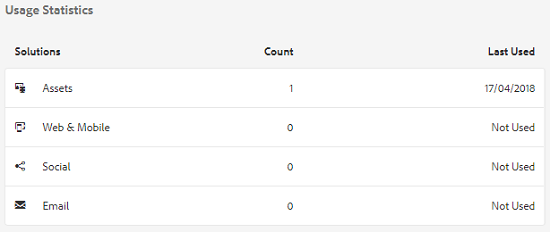

# 資產透視 {#asset-insights}

Assets Insights功能使您能夠跟蹤用戶對在第三方網站、市場營銷活動和Adobe的創造性解決方案中使用的影像的評級和使用情況統計。 它有助於對影像的效能和受歡迎程度提供洞見。

Assets Insights可捕獲用戶活動詳細資訊，如評級、按一下影像和觀感的次數（將影像載入到網站上的次數）。 它根據這些統計資料給影像分配分數。 您可以使用分數和業績統計資訊來選擇要包含在目錄、市場營銷活動等中的流行影像。 您甚至可以根據這些統計資料制定存檔和許可證續訂策略。

對於Assets Insights，要從網站捕獲影像的使用統計資訊，必須在網站代碼中包含影像的嵌入代碼。

要讓Assets Insights顯示資產的使用情況統計資訊，請首先配置功能以從中獲取報告資料 [!DNL Adobe Analytics]。 有關詳細資訊，請參閱 [配置資產透視](#configure-asset-insights)。 要使用此功能，請購買 [!DNL Adobe Analytics] 單獨許可。

>[!NOTE]
>
>只支援和提供影像的見解。

## 查看影像的統計資訊 {#viewing-statistics-for-an-image}

您可以從元資料頁面查看Assets Insights得分。

1. 從「資產」用戶介面中，選擇影像，然後按一下 **[!UICONTROL 屬性]** 的子菜單。
1. 在「屬性」頁中，按一下 **[!UICONTROL 洞察力]**。
1. 複查中資產的使用詳細資訊 **[!UICONTROL 洞察力]** 頁籤。 的 **[!UICONTROL 得分]** 節描述資產的資產使用總量和效能分類。

   使用情況分數描述了資產在各種解決方案中使用的次數。

   的 **[!UICONTROL 印象]** score是在網站上載入資產的次數。 顯示在下面的編號 **[!UICONTROL 按一下]** 是按一下資產的次數。

1. 查看 **[!UICONTROL 使用情況統計]** 瞭解資產是哪些實體的一部分，以及最近使用了哪些創造性解決方案。 使用率越高，該資產在用戶中受歡迎的可能性就越大。 使用資料顯示在以下標題下：

   * **[!UICONTROL 資產]**:資產作為集合或複合資產一部分的次數。
   * **[!UICONTROL Web和移動]**:該資產是網站和應用的一部分的次數。
   * **[!UICONTROL 社會]**:在其他解決方案(如 [!DNL Adobe Campaign]。
   * **[!UICONTROL 電子郵件]**:資產在電子郵件市場活動中使用的次數。

   

   >[!NOTE]
   >
   >因為Assets Insights功能通常從中提取解決方案資料 [!DNL Adobe Analytics] 「解決方案」部分可能不會定期顯示最新資料。 顯示資料的時段取決於Assets Insights為檢索分析資料而運行的提取操作的計畫。

1. 要以圖形方式查看某個時段內資產的效能統計資訊，請在「效能統計資訊」部分中 **[!UICONTROL 選擇該時段]** 。詳細資訊 (包括點按次數和印象) 會顯示為圖形的趨勢線。

   

   >[!NOTE]
   >
   >與「解決方案」部分中的資料不同，「效能統計」部分顯示最新資料。

1. 要獲取包含在網站中的資產的嵌入代碼以獲取效能資料，請按一下 **[!UICONTROL 獲取嵌入代碼]** 資產縮覽圖下方。 <!-- For more information on how to include your Embed code in third-party web pages, see [Using Page Tracker and Embed code in web pages](/help/assets/use-page-tracker.md). -->

   

## 查看影像的聚合統計資訊 {#viewing-aggregate-statistics-for-images}

您可以使用前瞻分析檢視同時檢視資料夾內所有資產 **[!UICONTROL 的分數]**。

1. 在「資產」用戶介面中，導航到包含要查看其透視的資產的資料夾。
1. 按一下 **[!UICONTROL 佈局]** 選項，然後選擇 **[!UICONTROL 透視視圖]**。
1. 該頁顯示資產的使用分數。 比較各種資產的評級並得出見解。

<!-- TBD: Commenting as Web Console is not available. Document the appropriate OSGi config method if available in CS.

## Schedule background job {#scheduling-background-job}

Assets Insights fetches usage data for assets from Adobe Analytics report suites in a periodic manner. By default, Assets Insights runs a background job every 24 hours at 2 AM to the fetch data. However, you can modify both the frequency and the time by configuring the **[!UICONTROL Adobe CQ DAM Asset Performance Report Sync Job]** service from the web console.

1. Click the [!DNL Experience Manager] logo, and go to **[!UICONTROL Tools]** > **[!UICONTROL Operations]** > **[!UICONTROL Web Console]**.
1. Open the **[!UICONTROL Adobe CQ DAM Asset Performance Report Sync Job]** service configuration.

   

1. Specify the desired scheduler frequency and the start time for the job in the property scheduler expression. Save the changes.
-->

## 配置資產透視 {#configure-asset-insights}

[!DNL Experience Manager Assets] 從第三方網站獲取有關數字資產的使用資料 [!DNL Adobe Analytics]。 要使Assets Insights能夠檢索此資料並生成見解，請首先配置該功能以與 [!DNL Adobe Analytics]。

>[!NOTE]
>
>只支援和提供影像的見解。

1. 在 [!DNL Experience Manager]按一下 **[!UICONTROL 工具]** > **[!UICONTROL 資產]**。

   

1. 按一下「 **[!UICONTROL 前瞻分析設定]** 」資訊卡。

1. 有關Analytics Web服務訪問資訊，請轉到 **[!UICONTROL 分析]** > **[!UICONTROL 管理]** > **[!UICONTROL 管理工具]** > **[!UICONTROL 公司設定]** > **[!UICONTROL Web服務]** 複製 **[!UICONTROL 共用密鑰]** 按鈕

   在嚮導中，選擇 **[!UICONTROL 資料中心]**，並提供 **[!UICONTROL 公司]**, Web服務 **[!UICONTROL 用戶名]**，然後貼上 **[!UICONTROL 共用密鑰]** 按鈕

   按一下 **[!UICONTROL 驗證]**。

   ![為中的Assets Insights配置Adobe Analytics [!DNL Experience Manager]](assets/analytics-insight-config.png)

   *圖：為中的Assets Insights配置Adobe Analytics[!DNL Experience Manager]*

1. 成功驗證後，您將獲得下拉清單中列出的報告套件。 選擇Adobe Analytics **[!UICONTROL 報表套件]** 從Assets Insights獲取資料的位置。 按一下&#x200B;**[!UICONTROL 「新增」]**。

1. 之後 [!DNL Experience Manager] 設定報告套件，按一下 **[!UICONTROL 完成]**。

有關詳細資訊，請參見 [Adobe AnalyticsWeb服務](https://experienceleague.adobe.com/docs/analytics/admin/company-settings/web-services-admin.html#api-access-information)。

### 頁面跟蹤器 {#page-tracker}

配置Adobe Analytics帳戶後，將為您生成頁面跟蹤器代碼。 要啟用Assets Insights跟蹤 [!DNL Experience Manager] 用於第三方網站的資產，包括網站代碼中的頁面跟蹤程式碼。 使用Assets中的Page Tracker實用程式生成頁跟蹤器代碼。 <!--  For more information on how to include your Page Tracker code in third-party web pages, see [Using Page Tracker and Embed code in web pages](/help/assets/use-page-tracker.md). -->

1. 在 [!DNL Experience Manager]按一下 **[!UICONTROL 工具]** > **[!UICONTROL 資產]**。

   

1. 在導覽頁 **[!UICONTROL 面中]** ，按一下 **** 前瞻分析頁面追蹤器卡片。
1. 按一下 **[!UICONTROL 下載]** 下載頁面跟蹤器代碼。

<!--
Add page tracker code, CQDOC-18045, 30/07/2021
-->
以下示例代碼段顯示示例網頁中包含的Page Tracker代碼：

```xml
 <head>
            <script type="text/javascript" src="http://localhost:4502/xxxx/etc.clientlibs/dam/clientlibs/sitecatalyst/appmeasurement.js"></script>
            <script type="text/javascript" src="http://localhost:4502/xxxx/etc.clientlibs/dam/clientlibs/foundation/assetinsights/pagetracker.js"></script>
            <script type="text/javascript">
                                assetAnalytics.attrTrackable = 'trackable';
                assetAnalytics.defaultTrackable = false;
                assetAnalytics.attrAssetID = 'aem-asset-id';
                assetAnalytics.assetImpressionPollInterval = 200; // interval in millis
                assetAnalytics.charsLimitForGET = 2000; // bytes
                assetAnalytics.dispatcher.init("assetstesting","abc.net","bee","list1","eVar3","event8","event7");
            </script>

 </head>
```


<!--

## Using demo package for Assets Insights {#using-demo-package-for-asset-insights}

Using the demo package, you can enable Adobe Assets Insights to capture data from and generate insights for a sample web page.

1. Configure Assets Insights using the instructions in [Configure Assets Insights](#configure-asset-insights).
1. Download the sample [!DNL Experience Manager Assets] package from below and install the package from CRXDE package manager.

   [Get File](assets/insightsdemo.zip)

1. Download the ZIP file containing the sample web page from below and extract on your local file system.

   [Get File](assets/demosite.zip)

1. Click the web page to open it in the web browser.

   >[!CAUTION]
   >
   >Web Page is configured to load asset from the localhost server . In case your server is running somewhere else change server address from localhost to server address in the HTML content of the web page.

   >[!NOTE]
   >
   >The external web page can be in [!DNL Experience Manager] itself.

-->
