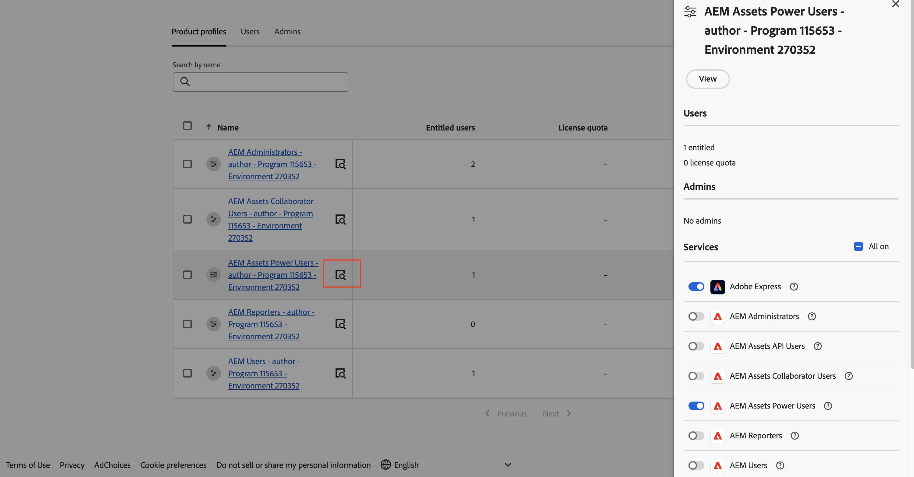

# [!DNL Assets]個as a Cloud ServicePrime  {#assets-prime}

| [搜尋最佳實務](/help/assets/search-best-practices.md) | [中繼資料最佳實務](/help/assets/metadata-best-practices.md) | [Content Hub](/help/assets/product-overview.md) | [具有 OpenAPI 功能的 Dynamic Media](/help/assets/dynamic-media-open-apis-overview.md) | [AEM Assets 開發人員文件](https://developer.adobe.com/experience-cloud/experience-manager-apis/) |
| ------------- | --------------------------- |---------|----|-----|

Assets as a Cloud Service Prime包含輕量版DAM，可讓您執行各種關鍵功能，例如：

* **資產管理和程式庫服務**&#x200B;：可讓使用者在集中式存放庫中擷取、儲存、編目、控制、管理及控管品牌數位資產的工具

* **搜尋、探索和Collaboration**：可讓使用者瀏覽、探索、共用及共同使用所需資產的工具，以建立豐富的客戶體驗。

* **安全性與Rights Management**：用來管理存取、許可權、許可權與安全性的工具，以確保遵循法規、一致性及品牌完整性。

* **Creative Cloud連線**：可讓行銷與創意團隊透過簡化的存取、評論、稽核和註解進行共同作業，以更新或完成數位資產的工具。

* **Experience Cloud連線**：支援從其他Experience Cloud應用程式和服務原生存取數位資產的工具。

* **沒有擴充性選項的分發入口網站體驗(Content Hub)**：工具可擴充對品牌已核准數位資產的存取權，以延伸利害關係人，以確保使用情況和品牌一致性。

* **整合**：與其他Adobe和非Adobe應用程式的整合。

* **Dynamic Media （附加元件）**：可轉換及傳遞影像、視訊和其他新興內容的工具，適用於任何大規模裝置的豐富互動式多媒體體驗。

然而，隨著您的DAM需求增長以及您需要更多功能，例如UI擴充性、API導向的自動化和自訂程式碼部署，您必須考慮升級至[Assets Ultimate](/help/assets/assets-ultimate-overview.md)。

本文提供啟用Assets as a Cloud Service Prime的端對端工作流程。

## 啟用Assets as a Cloud Service Prime{#enable-assets-prime}

使用Cloud Manager建立新計畫時啟用Assets Prime。 執行以下步驟：

1. 以系統管理員身分登入Cloud Manager。 確保您在登入時選取正確的組織。

   >[!NOTE]
   >
   >確定您已新增至適當的Cloud Manager產品設定檔，以新增程式。 如需詳細資訊，請參閱[Cloud Manager中的角色型許可權](/help/onboarding/cloud-manager-introduction.md#role-based-permissions)。

1. [建立新程式](/help/journey-onboarding/create-program.md)。

   建立新程式時，在&#x200B;**[!UICONTROL 解決方案和附加元件]**&#x200B;索引標籤中，選取&#x200B;**[!UICONTROL Assets Prime]**。 您也可以展開&#x200B;**[!UICONTROL Assets Prime]**，然後選取&#x200B;**[!UICONTROL Content Hub]**&#x200B;以啟用[Content Hub](/help/assets/product-overview.md)的資產發佈。

   

1. 按一下&#x200B;**[!UICONTROL 建立]**&#x200B;以建立程式。

1. 按一下程式卡，然後按一下&#x200B;**[!UICONTROL 新增環境]**。

1. 指定環境名稱、定義區域，然後按一下&#x200B;**[!UICONTROL 儲存]**&#x200B;以建立環境。

   

>[!NOTE]
>
>Assets Prime僅允許您建立生產環境。 成功建立生產環境後，「新增環境」選項就無法再使用。

Assets Prime現已啟用Experience Manager Assetsas a Cloud Service。

系統管理員會自動獲得AEM管理員的許可權，並會收到電子郵件以導航到Admin Console來管理產品設定檔。

Admin Console上的AEM as a Cloud Service執行個體包含下列產品設定檔：

* AEM管理員

* AEM 使用者

* [AEM Assets Collaborator使用者](#onboard-collaborator-users)

* [AEM Assets超級使用者](#onboard-power-users)

您可以開始將使用者或使用者群組新增至AEM Assets Collaborator使用者和AEM Assets超級使用者產品設定檔。 如需詳細資訊，請參閱[加入AEM Assets Collaborator使用者](#onboard-collaborator-users)和[加入AEM Assets超級使用者](#onboard-power-users)。

如果您已啟用適用於Assets的Content Hubas a Cloud Service，則在Admin Console的AEM Assetsas a Cloud Service中會建立一個新執行個體，並將`delivery`當作尾碼：

>[!NOTE]
>
>如果您在2024年8月14日之前布建Content Hub，則會建立以`contenthub`作為尾碼的新執行個體。

請注意，Content Hub的執行個體名稱中沒有`author`或`publish`。

按一下執行個體名稱以檢視`AEM Assets Limited Users` Content Hub產品設定檔。

您可以開始將使用者或使用者群組新增至此產品設定檔，以便讓他們存取Content Hub。

>[!NOTE]
>
>如果您在2024年8月14日之前布建Content Hub，Content Hub產品設定檔會在`Limited Users`之後提及`contenthub`，而非`delivery`。

## 上線AEM Assets Collaborator使用者 {#onboard-collaborator-users}

AEM Assets Collaborator使用者可以透過貴組織在其他Adobe產品和非Adobe應用程式中提供的Assets整合來使用Experience Manager的資產，使用內建Adobe Express和Firefly來建立和編輯資產(運用專業設計的範本、品牌套件、Adobe Stock資產等)，以及使用AEM Assets Content Hub入口網站存取和利用貴組織核准的資產。

若要加入Collaborator使用者：

1. 按一下Admin Console上產品清單中的Experience Manager Assets產品名稱，存取AEM as a Cloud Service產品設定檔。

1. 按一下AEM as a Cloud Service的生產製作例項：
   

1. 按一下Collaborators使用者產品設定檔，然後按一下&#x200B;**[!UICONTROL 新增使用者]**以將使用者新增至產品設定檔。
   

1. 按一下[儲存]儲存變更。****

您也可以存取及檢視指派給Collaborator使用者的服務，如下圖所示：

為Collaborator使用者提供

預設已啟用`Adobe Express`和`AEM Assets Collaborator Users`服務。 您可以視需要關閉和開啟切換按鈕，但Adobe建議使用為產品設定檔啟用的預設服務。

## 入門AEM Assets超級使用者 {#onboard-power-users}

AEM Assets進階使用者可存取所有AEM Assets功能，包括管理資產、許可權、中繼資料以及有關數位資產的整體控管和自動化、透過其他Adobe和非Adobe應用程式中提供給您組織的Assets整合來使用Experience Manager中的資產、使用內建Adobe Express和Firefly來建立和編輯資產(利用專業設計的範本、品牌套件、Adobe Stock資產等)，以及使用AEM Assets Content Hub入口網站存取和利用您組織中已核准的資產。

若要內建進階使用者：

1. 按一下Admin Console上產品清單中的Experience Manager Assets產品名稱，存取AEM as a Cloud Service產品設定檔。

1. 按一下AEM as a Cloud Service的生產製作例項：
   

1. 按一下Power users產品設定檔，然後按一下&#x200B;**[!UICONTROL 新增使用者]**以將使用者新增至產品設定檔。
   

1. 按一下[儲存]儲存變更。****

您也可以存取及檢視指派給超級使用者的服務，如下圖所示：

超級使用者的

預設已啟用`Adobe Express`和`AEM Assets Power Users`服務。 您可以視需要關閉和開啟切換按鈕，但Adobe建議使用為產品設定檔啟用的預設服務。
