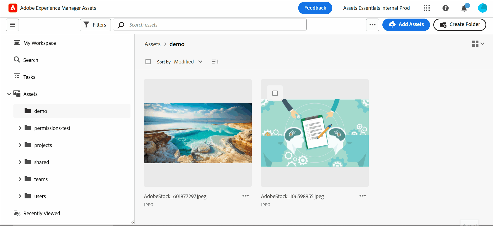

# Assets檢視簡介 {#assets-view}

在現今步調速迅的數位優先環境中，即時的內容創作和傳遞實屬不可或缺，針對下游行銷速度所設計的數位資產管理 (DAM) 體驗至關重要。Adobe運用其在增強行銷和創意專業人士能力方面的專業知識，推出改變遊戲規則的新使用者體驗。 此工作流程優先的方法革新了企業處理動態數位資產的方式，讓行銷人員有能力在尋找、共同作業、個人化與傳遞資產方面，將效率提升到極致。這些簡化的工作流程加快內容速度，並將行銷作業推升到新的高度。

若要進一步瞭解Assets as a Cloud Service可用的角色型體驗，請參閱[Assets as a Cloud Service簡介](/help/assets/overview.md#persona-based-experiences)。

## 如何存取 Assets 檢視？ {#access-assets-view}

您可以透過以下方式存取 Assets 檢視：

<!--

* **Toggle in Admin view**

    * Log into [!DNL Experience Manager] using Cloud Manager.
    * Navigate to **[!UICONTROL Assets]** > **[!UICONTROL Files]**.
    * Click the profile icon on the top right corner.
    * Click **[!UICONTROL Switch View]** from the **[!UICONTROL Profile Settings]** section.
    Repeat these steps to switch back to the Admin view.

* **Product Switcher**
    * Log into [!DNL Experience Manager] and click .
    * Select **[!UICONTROL Experience Manager Assets]** to access the Assets view.
    * Select **[!UICONTROL Experience Manager]** to access the Admin view.

* **Quick Links** 
    * Log into experience.adobe.com.
    * Click **[!UICONTROL Experience Manager Assets]** to access the Assets view.
    * Click **[!UICONTROL Experience Manager Assets]** to access the Assets view.

    -->

## 為什麼要使用 Assets 檢視？

Assets檢視提供下列「管理員」檢視中未提供的關鍵優點：

* [我的工作區儀表板提供簡化的體驗](#my-workspace-for-streamlined-experience)
* [搜尋優先方法可提高效率](#search-first)
* [做出資訊導向決策的深入解析](#insights-data)
* [Adobe Photoshop Express 整合可以加速共同作業](#accelerate-collaboration)
* [資料夾上傳以設定組織的階層式結構](#folder-uploads)
* [訂閱存放庫內容以進行高效率的資產管理](#subscribe-content)
* [軟刪除資產，為管理員提供更好的控制](#soft-delete-assets)

### 我的工作區儀表板提供簡化的體驗 {#my-workspace-for-streamlined-experience}

我們推出了明白各種組織角色不同需求的數位資產管理解決方案。時尚的Assets檢視注重易用性和速度，迎合行銷人員對視覺吸引力的偏好以及簡潔的工作區。 透過可自訂的使用者特定「我的工作區」儀表板，行銷人員能夠以驚人的效率迅速尋找、預覽、編輯、管理和傳遞資產。無須再耗費無窮盡的時間搜尋特定資產，迎接簡化的體驗，讓您的一切所需皆觸手可及。

<!--

### Insights to take data-driven decisions {#insights-data}

To keep pace with content velocity, actionable insights are essential. The Assets view offers advanced insights within the My Workspace, providing valuable data on asset performance, audience usage, and engagements. Marketers can make data-driven decisions, optimize content strategies, and refine their downstream delivery to achieve optimal results. With access to meaningful insights, businesses can stay ahead of the competition and drive exceptional outcomes.

-->

### Adobe Photoshop Express 整合可以加速共同作業 {#accelerate-collaboration}

新的體驗提供了一組強大的共同作業功能，包括使用內建的 Adobe Photoshop 功能、版本控制和註解工具進行即時編輯。這讓設計、創意、品牌化和行銷團隊之間能夠天衣無縫地共同作業，使他們能夠克服瓶頸並加速行銷營運流程。行銷人員現在可以隨心所欲使用強大的工具，加速專案的傳遞與提高整體的生產力。

觀看此視片以了解 Assets 檢視整合 Adobe Photoshop Express 的強大功能：

>[!VIDEO](https://video.tv.adobe.com/v/3420922)

即將發行的Assets as a Cloud Service版本也包含[透過Adobe Express的Adobe Firefly整合](https://firefly.adobe.com/?gclid=EAIaIQobChMIlZeKuNfj_wIVeyCtBh3e5g2cEAAYASAAEgL56_D_BwE&sdid=JM4FW6VL&mv=search&mv2=paidsearch&ef_id=EAIaIQobChMIlZeKuNfj_wIVeyCtBh3e5g2cEAAYASAAEgL56_D_BwE:G:s&s_kwcid=AL!3085!3!652077237594!e!!g!!adobe%20firefly!19870733758!148140507838)。

### 資料夾上傳以設定組織的階層式結構 {#folder-uploads}

透過上傳本機檔案系統上的資料夾，使用 Assets 檢視迅速設定組織的資料夾結構。您不需要在根資料夾下建立資料夾，然後手動將資產上傳到這些資料夾以維護邏輯階層結構。 根資料夾下的所有資料夾和資產都會自動上傳到 Experience Manager Assets。

### 搜尋優先方法可提高效率 {#search-first}

利用具有先進功能的搜尋，發揮組織數位資產庫的潛力。您可以對手動瀏覽無數檔案和資料夾的煩惱道個別。 任何使用者都可以立即找到所需的完美圖像、影片或文件，用來創作令人讚嘆的行銷活動、引人入勝的簡報和動人的內容。我們的搜尋優先引擎可讓您輕鬆導覽資產型別、中繼資料、智慧標籤，甚至內容本身，而不需要知道確切的關鍵字。 透過我們的搜尋優先迎接 DAM 的未來，並盡情發揮數位資產庫的全部潛力。

### 訂閱存放庫內容以進行高效率的資產管理 {#subscribe-content}

Assets檢視可讓您監視對存放庫中可用的資產、資料夾或集合執行的操作。 您需要選擇並訂閱將通知傳送給您的內容。您也可以配置事件類型，例如刪除已訂閱內容、修改已訂閱內容等。然後，僅針對這些事件類型發送通知給您。

### 軟刪除資產，為管理員提供更好的控制 {#soft-delete-assets}

Assets 檢視中的垃圾桶資料夾列出了從根 Assets 資料夾刪除的資產。您可以從「垃圾桶」資料夾中選取資產，將其還原到原始位置或永久刪除。您也可以指定關鍵字或套用標準或自訂篩選條件，以搜尋「垃圾桶」資料夾中的適當資產。

除了這些功能之外，Assets 檢視也讓您能夠執行管理員檢視中所沒有的以下功能：

* 將具有不同名稱的新版本資產，從本機檔案系統上傳到資產存放庫。上傳的資產將以名稱與原始資產相同的新版本提供。

* 重新命名存放庫中可用的資產和資料夾。

Assets檢視經過量身打造，可簡化工作流程、促進共同作業並加速資產交付。 透過採用內容速度，行銷人員可以釋放其數位資產的全部潛力，並釋放前所未有的創造力。

使用這些連結來快速開始使用Assets檢視：

* [我的 Workspace](/help/assets/my-workspace-assets-view.md)
* [開始使用Assets檢視](/help/assets/get-started-assets-view.md)
