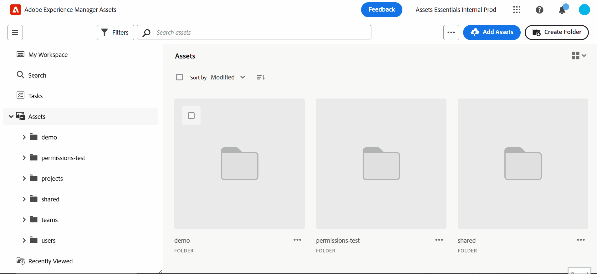

# 資產檢視簡介 {#assets-view}

在當今快節奏的數位優先環境中，即時內容的建立和交付至關重要，專為下遊行銷速度設計的數位資產管理(DAM)體驗至關重要。 Adobe運用其行銷和創意專業人員的專業能力，推出改變遊戲規則的新使用者體驗。 此工作流程優先的方法革新了企業處理動態數位資產的方式，讓行銷人員能夠最大限度地提高尋找、合作、個人化和提供資產的效率。 這些簡化的工作流程可加快內容速度，並將您的行銷工作推進到新的高度。

若要進一步瞭解資產as a Cloud Service的可用角色型體驗，請參閱 [as a Cloud Service介紹Assets](/help/assets/overview.md#persona-based-experiences).

## 如何存取資產檢視？ {#access-assets-view}

您可以透過下列方式存取「資產」檢視：

<!--

* **Toggle in Admin view**

    * Log into [!DNL Experience Manager] using Cloud Manager.
    * Navigate to **[!UICONTROL Assets]** > **[!UICONTROL Files]**.
    * Click the profile icon on the top right corner.
    * Click **[!UICONTROL Switch View]** from the **[!UICONTROL Profile Settings]** section.
    Repeat these steps to switch back to the Admin view.

* **Product Switcher**
    * Log into [!DNL Experience Manager] and click .
    * Select **[!UICONTROL Experience Manager Assets]** to access the Assets view.
    * Select **[!UICONTROL Experience Manager]** to access the Admin view.

* **Quick Links** 
    * Log into experience.adobe.com.
    * Click **[!UICONTROL Experience Manager Assets]** to access the Assets view.
    * Click **[!UICONTROL Experience Manager Assets]** to access the Assets view.

    -->

## 為何要檢視「資產」？

「資產」檢視提供下列「管理員」檢視中未提供的關鍵優點：

* [我的Workspace控制面板提供簡化的體驗](#my-workspace-for-streamlined-experience)
* [提升效率的搜尋優先方法](#search-first)
* [進行資料導向式決策的見解](#insights-data)
* [Adobe Photoshop Express整合可加速共同作業](#accelerate-collaboration)
* [資料夾上傳以設定組織的階層結構](#folder-uploads)
* [訂閱存放庫內容以實現有效的資產管理](#subscribe-content)
* [軟刪除資產，以便提供管理員更好的控制](#soft-delete-assets)

### 我的Workspace控制面板提供簡化的體驗 {#my-workspace-for-streamlined-experience}

請向數位資產管理解決方案問好，瞭解不同組織角色的各種需求。 時尚的新資產檢視以易用性和速度為優先考量，迎合行銷人員對視覺吸引力和簡潔工作區的偏好。 透過可自訂的使用者專屬My Workspace儀表板，行銷人員可以快速找到、預覽、編輯、管理和提供資產，並享有絕佳的效率。 告別花費在搜尋特定資產上的無窮無盡的時間，歡迎提供精簡的體驗，讓所有需要的事情觸手可及。

### 進行資料導向式決策的見解 {#insights-data}

為了跟上內容速度，可操作見解至關重要。 全新的資產檢視體驗在「我的工作區」中提供進階深入分析，提供關於資產效能、對象使用情況和參與的寶貴資料。 行銷人員可以制定資料導向式決策、最佳化內容策略，並調整其下游交付方式以獲得最佳結果。 透過獲得有意義的見解，企業可以保持競爭優勢，並推動卓越的成果。

### Adobe Photoshop Express整合可加速共同作業 {#accelerate-collaboration}

新體驗提供一組強大的共同作業功能，包括使用內建Adobe Photoshop功能、版本控制和註解工具進行即時編輯。 如此一來，設計、創意、品牌和行銷團隊之間便可緊密合作，克服瓶頸並加快行銷運作程式。 行銷人員現在擁有強大的工具，可以加速專案交付並提高整體生產力。

觀看此影片瞭解Assets檢視與Adobe Photoshop Express整合的強大功能：

>[!VIDEO](https://video.tv.adobe.com/v/3420922)

即將發行的Assetsas a Cloud Service版本還包括 [透過Adobe Express進行Adobe Firefly整合](https://firefly.adobe.com/?gclid=EAIaIQobChMIlZeKuNfj_wIVeyCtBh3e5g2cEAAYASAAEgL56_D_BwE&amp;sdid=JM4FW6VL&amp;mv=search&amp;mv2=paidsearch&amp;ef_id=EAIaIQobChMIlZeKuNfj_wIVeyCtBh3e5g2cEAAYASAAEgL56_D_BwE:G:s&amp;s_kwcid=AL!3085!3!652077237594！e!!g!!adobe%20firefly！19870733758!148140507838).

### 資料夾上傳以設定組織的階層結構 {#folder-uploads}

上傳本機檔案系統上存在的資料夾，使用「資產」檢視快速設定組織的資料夾結構。 您不需要在根資料夾下建立資料夾，然後手動將資產上傳到這些資料夾以維護邏輯階層結構。 根資料夾下的所有資料夾和資產會自動上傳至Experience Manager Assets。

### 提升效率的搜尋優先方法 {#search-first}

透過尖端功能的搜尋功能，釋放貴組織數位資產庫的潛力。 您可以對手動篩選無數檔案和資料夾的麻煩道別。 任何使用者都可以立即找到您需要的完美影像、影片或檔案，以建立令人驚歎的行銷活動、吸引人的簡報和引人入勝的內容。 我們的搜尋優先引擎可讓您輕鬆瀏覽資產型別、中繼資料、智慧標籤，甚至內容本身，而不需要知道確切的關鍵字。 以我們的「搜尋優先」擁抱DAM的未來，並釋放您數位資產庫的完整潛能。

### 訂閱存放庫內容以實現有效的資產管理 {#subscribe-content}

Assets檢視可讓您監視對存放庫中可用的資產、資料夾或集合執行的操作。 您需要選擇並訂閱將通知傳送給您的內容。您也可以設定事件型別，例如刪除訂閱內容、修改訂閱內容等。 之後，系統只會針對這些事件型別傳送通知給您。

### 軟刪除資產，以便提供管理員更好的控制 {#soft-delete-assets}

「資產」檢視中可用的「垃圾桶」資料夾會列出從根「資產」資料夾中刪除的資產。 您可以從垃圾桶資料夾中選取資產，將其還原至原始位置或永久刪除。 您也可以指定關鍵字或套用標準或自訂篩選器，以搜尋垃圾桶資料夾中的適當資產。

除了這些功能外，「資產」檢視也可讓您執行下列在「管理員」檢視中無法使用的功能：

* 從您的本機檔案系統上傳具有不同名稱的資產新版本至資產存放庫。 上傳的資產可用為新版本，名稱與原始資產的名稱相同。

* 重新命名存放庫中可用的資產和資料夾。

## 結論 {#conclusion}

數位優先的時代已經到來，是時候改造我們的行銷工具，以支援不斷變化的業務環境。 新的Adobe Experience Manager資產檢視經過量身打造，可簡化工作流程、促進共同作業並加速資產交付。 透過採用內容速度，行銷人員可以釋放其數位資產的全部潛力，並釋放出前所未有的創造力。 準備好利用Adobe新的資產檢視體驗的強大功能，並在您的行銷活動中推動卓越的成效。 是時候擁抱DAM的未來，並推動您的企業向前邁進了。

