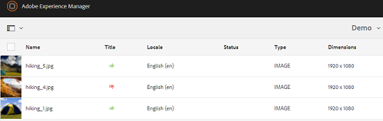

# 檢閱資料夾和系列中的資產 {#review-folder-assets-and-collections}

使用Adobe Experience Manager(AEM)Assets，您可以針對位於檔案夾或系列中的資產設定臨機審核工作流程。 您可以與審核者或創意合作夥伴分享，以尋求他們的意見回應。 您可以將審核工作流與項目關聯，也可以建立獨立的審核任務。

共用資產後，審核者可以核准或拒絕資產。 通知會在工作流程的不同階段傳送，以通知預期的收件者有關完成各種工作的資訊。 例如，當您共用資料夾或系列時，審核者會收到資料夾／系列已共用以供審核的通知。

審核者完成審核（批准或拒絕資產）後，您會收到審核完成通知。

## 為資料夾建立審核任務 {#creating-a-review-task-for-folders}

1. 從「資產」使用者介面中，選取您要為其建立審核工作的檔案夾。
1. 從工具列中點選/按一下「建 **[!UICONTROL 立檢閱工作]** 」圖示，以開啟「 **** 檢閱工作」頁面。如果您在工具列中看不到圖示，請點選/按一下「更 **[!UICONTROL 多]** 」，然後選取圖示。

   

1. （可選）從「項 **[!UICONTROL 目]** 」清單中，選擇要與審閱任務關聯的項目。 預設情況下，選 **[!UICONTROL 擇「無]** 」選項。 如果不想將任何項目與審閱任務關聯，請保留此選項。

   >[!NOTE]
   >
   >只有您具有編輯者層級權限（或更高）的專案才會顯示在「專案」清 **[!UICONTROL 單中]** 。

1. 輸入複查任務的名稱，然後從「分配給」清單中選擇 **[!UICONTROL 審批人]** 。

   >[!NOTE]
   >
   >在「分配給」( **[!UICONTROL Assign To]** )清單中，選定項目的成員／組可作為批准者。

1. 輸入複查任務的說明、任務優先順序和到期日。

   

1. 在「高級」頁籤中，輸入要用於建立URI的標籤。

   

1. 點選/按一 **[!UICONTROL 下提交]**，然後點選/按一 **[!UICONTROL 下完成]** ，以關閉確認訊息。新任務的通知將發送給批准者。
1. 以核准者身分登入AEM Assets，並導覽至「資產」UI。 若要核准資產，請按一下／點選「 **[!UICONTROL 通知]** 」圖示，然後從清單中選取審核工作。

   

1. 在「復 **[!UICONTROL 查任務]** 」頁中，檢查複查任務的詳細資訊，然後點選/按一下「 **[!UICONTROL 複查」]**。
1. 在「復 **[!UICONTROL 核任務]** 」頁面中，選擇資產，並點選/按一下「核准/拒絕 **** 」圖示以視情況核准或拒絕。

   

1. Tap/click the **[!UICONTROL Complete]** icon from the toolbar. 在對話方塊中，輸入註解並點選／按一下「 **[!UICONTROL 完成]** 」以確認。
1. 導覽至「資產」UI，並開啟檔案夾。 資產的核准狀態圖示會同時出現在「卡片」和「清單」檢視中。

   **卡片檢視**

   

   **清單檢視**

   

## 為系列建立審閱任務 {#creating-a-review-task-for-collections}

1. 從「系列」頁面中，選擇要為其建立審閱任務的系列。
1. 從工具列中點選/按一下「建 **[!UICONTROL 立檢閱工作]** 」圖示，以開啟「 **** 檢閱工作」頁面。如果您在工具列中看不到圖示，請點選/按一下「更 **[!UICONTROL 多]** 」，然後選取圖示。

   

1. （可選）從「項 **[!UICONTROL 目]** 」清單中，選擇要與審閱任務關聯的項目。 預設情況下，選 **[!UICONTROL 擇「無]** 」選項。 如果不想將任何項目與審閱任務關聯，請保留此選項。

   >[!NOTE]
   >
   >只有您具有編輯者層級權限（或更高）的專案才會顯示在「專案」清 **[!UICONTROL 單中]** 。

1. 輸入複查任務的名稱，然後從「分配給」清單中選擇 **[!UICONTROL 審批人]** 。

   >[!NOTE]
   >
   >在「分配給」( **[!UICONTROL Assign To]** )清單中，選定項目的成員／組可作為批准者。

1. 輸入複查任務的說明、任務優先順序和到期日。

   

1. 點選/按一 **[!UICONTROL 下提交]**，然後點選/按一 **[!UICONTROL 下完成]** ，以關閉確認訊息。新任務的通知將發送給批准者。
1. 以核准者身分登入AEM Assets，並導覽至「資產」主控台。 若要核准資產，請點選／按一 **[!UICONTROL 下「通知]** 」圖示，然後從清單中選取審核工作。
1. 在「復 **[!UICONTROL 查任務]** 」頁中，檢查複查任務的詳細資訊，然後點選/按一下「 **[!UICONTROL 複查」]**。
1. 系列中的所有資產都會顯示在檢閱頁面上。 選取資產，並點選／按一下「 **[!UICONTROL 核准／拒絕]** 」圖示以核准或拒絕資產。

   

1. Tap/click the **[!UICONTROL Complete]** icon from the toolbar. 在對話方塊中，輸入註解並點選／按一下「 **[!UICONTROL 完成]** 」以確認。
1. 導覽至「系列」主控台，然後開啟系列。 資產的核准狀態圖示會同時出現在「卡片」和「清單」檢視中。

   **卡片檢視**

   

   **清單檢視**

   

