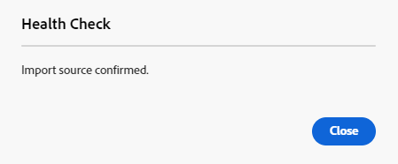

# 使用 Assets 檢視大量匯入資產  {#bulk-import-assets-view}

AEM Assets 檢視中的大量匯入能讓管理員將大量資產從資料來源匯入到 AEM Assets。管理員不再需要將單個資產或資料夾上傳到 AEM Assets。

>[!NOTE]
>
>Assets 視圖大量匯入工具器使用的後端與管理員視圖大量匯入工具相同。 但是，它提供了更多可供匯入的資料來源和更簡化的使用者體驗。

您可以從以下資料來源匯入資產：

* Azure
* AWS
* Google 雲端
* Dropbox
* OneDrive

## 先決條件 {#prerequisites}

| 資料來源 | 先決條件 |
|-----|------|
| Azure | <ul> <li>Azure 儲存體帳戶 </li> <li> Azure Blob 容器 <li> 根據驗證模式的 Azure 存取金鑰或 SAS 權杖 </li></ul> |
| AWS | <ul> <li>AWS 區域 </li> <li> AWS 儲存貯體 <li> AWS 存取金鑰 </li><li> AWS 存取密碼 </li></ul> |
| Google 雲端 | <ul> <li>GCP 貯體 </li> <li> GCP 服務帳戶電子郵件 <li> GCP 服務帳戶私密金鑰</li></ul> |
| Dropbox | <ul> <li>Dropbox使用者端ID （應用程式金鑰） </li> <li> Dropbox使用者端密碼（應用程式密碼）</li></ul> |
| OneDrive | <ul> <li>OneDrive 租用戶 ID  </li> <li> OneDrive 用戶端 ID</li><li> OneDrive 用戶端密碼</li></ul> |

除了這些根據資料來源的先決條件之外，您也必須了解資料來源中可用的來源資料夾名稱，其中包含需要匯入到 AEM Assets 的所有資產。

## 設定 Dropbox 開發人員應用程式 {#dropbox-developer-application}

在將 Dropbox 帳戶中的資產匯入到 AEM Assets 之前，請先建立並設定 Dropbox 開發人員應用程式。

執行以下步驟：

1. 登入您的 [Dropbox 帳戶](https://www.dropbox.com/developers)並按一下「**[!UICONTROL 建立應用程式]**」。 如果您使用 Enterprise Dropbox 帳戶，則需要具有內容管理員角色的存取權。

1. 在「**[!UICONTROL 選擇 API]**」區段中，選取唯一可用的選項按鈕。

1. 在「**[!UICONTROL 選擇您需要的存取類型]**」區段中，選取以下其中一個選項：

   * 如果您需要存取在 Dropbox 帳戶中應用程式內建立的單一資料夾，請選取「**[!UICONTROL 應用程式資料夾]**」。

   * 如果您需要存取 Dropbox 帳戶中的所有檔案和資料夾，請選取「**[!UICONTROL 完整 Dropbox]**」。

1. 指定應用程式的名稱，然後按一下「**[!UICONTROL 建立應用程式]**」。

1. 在應用程式的「**[!UICONTROL 設定]**」索引標籤中，將 https://experience.adobe.com 新增至「**[!UICONTROL 重新導向 URI]**」區段。

1. 複製「**[!UICONTROL 應用程式金鑰]**」和「**[!UICONTROL 應用程式密碼]**」欄位的值。在 AEM Assets 中設定大量匯入工具時需要這些值。

1. 在「**[!UICONTROL 權限]**」索引標籤，將以下權限新增到「**[!UICONTROL 個別範圍]**」區段。

   * account_info.read

   * files.metadata.read

   * files.content.read

   * files.content.write

1. 按一下「**[!UICONTROL 提交]**」以儲存變更。

## 設定 OneDrive 開發人員應用程式 {#onedrive-developer-application}

在將 OneDrive 帳戶中的資產匯入到 AEM Assets 之前，請先建立並設定 OneDrive 開發人員應用程式。

### 建立應用程式

1. 登入您的 [OneDrive 帳戶](https://portal.azure.com/#view/Microsoft_AAD_RegisteredApps/ApplicationsListBlade)，然後按一下「**[!UICONTROL 新註冊]**」。

1. 指定應用程式的名稱，從「**[!UICONTROL 支援的帳戶類型]**」中選取「**[!UICONTROL 僅此組織目錄中的帳戶 (僅限 Adobe - 單一租用戶)]**」。

1. 執行下列步驟以新增重新導向 URI：

   1. 在「**[!UICONTROL 選取平台]**」下拉式選單中，選取「**[!UICONTROL Web]**」。

   1. 將 https://experience.adobe.com 新增至「**[!UICONTROL 重新導向 URI]**」區段。
   <!-- Add the first URI and click **[!UICONTROL Configure]** to add it. You can add more by clicking **[!UICONTROL Add URI]** option available in the **[!UICONTROL Web]** section on the **[!UICONTROL Authentication]** page. -->

1. 按一下「**[!UICONTROL 註冊]**」。應用程式建立成功。

1. 複製「**[!UICONTROL 應用程式 (用戶端) ID]**」和「**[!UICONTROL 目錄 (租用戶) ID]**」欄位的值。在 AEM Assets 中設定大量匯入工具時需要這些值。

1. 按一下與「**[!UICONTROL 用戶端憑證]**」選項相對應的「**[!UICONTROL 新增憑證或密碼]**」。

1. 按一下「**[!UICONTROL 新用戶端密碼]**」，提供用戶端密碼描述和有效期限，然後點選「**[!UICONTROL 新增]**」。

1. 建立用戶端密碼後，複製「**[!UICONTROL 值]**」欄位 (不要複製「密碼 ID」欄位)。在 AEM Assets 中設定大量匯入工具時需要此值。

### 新增 API 權限

執行下列步驟以新增應用程式的 API 權限：

1. 按一下左窗格中的「**[!UICONTROL API 權限]**」，然後按一下「**[!UICONTROL 新增權限]**」。
1. 按一下「**[!UICONTROL Microsoft Graph]** > **[!UICONTROL 委派的權限]**」。「**[!UICONTROL 選取權限]**」區段會顯示可用權限。
1. 從 `OpenId permissions` 選取 `offline_access` 權限，從 `Files` 選取 `Files.ReadWrite.All` 權限。
1. 按一下「**[!UICONTROL 新增權限]**」以儲存更新。

## 建立大量匯入設定 {#create-bulk-import-configuration}

執行以下步驟在 [!DNL Experience Manager Assets] 中建立大量匯入設定：

1. 按一下左窗格中的「**[!UICONTROL 大量匯入]**」，然後點選「**[!UICONTROL 建立匯入]**」。
1. 選取資料來源。可用選項包括「**[!UICONTROL Azure]**」、「**[!UICONTROL AWS]**」、「**[!UICONTROL Google Cloud]**」、「**[!UICONTROL Dropbox]**」和「**[!UICONTROL OneDrive]**」。
1. 在「**[!UICONTROL 名稱]**」欄位中為大量匯入設定指定名稱。
1. 指定資料來源特定的認證，如[先決條件](#prerequisites)中所述。
1. 在「**[!UICONTROL 來源資料夾]**」欄位中，提供包含資料來源中資產的根資料夾名稱。

   >[!NOTE]
   >
   >如果您使用 Dropbox 作為資料來源，請依照下列規則來指定來源資料夾路徑：
   >* 如果您在建立 Dropbox 應用程式時選取「**完整 Dropbox**」，並且包含資產的資料夾位於 `https://www.dropbox.com/home/bulkimport-assets`，則在「**[!UICONTROL 來源資料夾]**」欄位中指定 `bulkimport-assets`。
   >* 如果您在建立 Dropbox 應用程式時選取「**應用程式資料夾**」，並且包含資產的資料夾位於 `https://www.dropbox.com/home/Apps/BulkImportAppFolderScope/bulkimport-assets`，則在「**[!UICONTROL 來源資料夾]**」欄位中指定 `bulkimport-assets`，其中 `BulkImportAppFolderScope` 是指應用程式的名稱。在這種情況下，`Apps` 會自動加在 `home` 後面。

   >[!NOTE]
   >
   >如果您使用OneDrive做為資料來源，請根據下列規則指定來源資料夾路徑：
   >* 僅指定根資料夾名稱，不含網域。 如果資料夾的完整URL路徑為`https://my.sharepoint.com/my?id=/personal/user/Documents/Importfolder/`，請在&#x200B;**[!UICONTROL Source資料夾]**&#x200B;欄位中指定`/Importfolder/`。
   >* 如果資料夾名稱包含多個以空格分隔的字詞，請在「大量匯入」組態中指定包含空格的名稱。
   >* 來源資料夾必須位於根目錄。 不支援資料夾路徑。

1. (可選) 選取「**[!UICONTROL 匯入後刪除來源檔案]**」選項，在檔案匯入到 Experience Manager Assets 後，從來源資料存放區中刪除原始檔案。
1. 選取「**[!UICONTROL 匯入模式]**」。選取「**[!UICONTROL 跳過]**」、「**[!UICONTROL 取代]**」或「**[!UICONTROL 建立版本]**」。跳過模式是預設值，在此模式下，擷取工具會跳過匯入資產 (如果已存在)。
   

1. (選用) 在「**[!UICONTROL 中繼資料檔案]**」欄位中指定要匯入的中繼資料檔案 (以 CSV 格式提供)。中繼資料來源檔案必須位於來源資料夾中。按一下「**[!UICONTROL 下一步]**」，導覽至「**[!UICONTROL 位置和篩選器]**」。

   >[!NOTE]
   >
   >根據您組織的安全性規則，您可能需要管理員同意才能讓此應用程式連線到大量匯入工具。 如果需要，管理員必須先提供同意，然後才能儲存大量匯入設定。

1. 要使用「**[!UICONTROL 資產目標資料夾]**」欄位在所要匯入資產的 DAM 中定義位置，請指定路徑。 例如，`/content/dam/imported_assets`。
1. (可選) 在「**[!UICONTROL 選擇篩選器]**」區段中，提供資產的檔案大小下限 (以 MB 為單位)，以便將它們包含在「**[!UICONTROL 按大小下限篩選]**」欄位中的擷取程序中。
1. (可選) 提供資產的檔案大小上限 (以 MB 為單位)，以納入「**[!UICONTROL 按大小上限篩選]**」欄位的擷取程序。
1. (可選) 使用「**[!UICONTROL 包含 MIME 類型]**」欄位選取要包含在擷取程序中的 MIME 類型。您可以在此欄位中選取多種 MIME 類型。如果您未定義值，則所有 MIME 類型都將包含在擷取程序中。

1. (可選) 使用「**[!UICONTROL 排除 MIME 類型]**」欄位選取要在擷取程序中排除的 MIME 類型。您可以在此欄位中選取多種 MIME 類型。如果您未定義值，則所有 MIME 類型都將包含在擷取程序中。

   

1. 按一下「**[!UICONTROL 下一步]**」。根據偏好選取下列其中一個選項：

   * 「**[!UICONTROL 儲存匯入]**」：暫時儲存設定，以便稍後執行。
   * 「**[!UICONTROL 儲存並執行匯入]**」：儲存設定並執行大量匯入。
   * 「**[!UICONTROL 儲存並安排匯入]**」：儲存設定，以便稍後安排大量匯入。您可以選擇大量匯入的頻率，並設定匯入的日期和時間。 大量匯入將在設定的日期和時間以選取的頻率執行。

   

1. 按一下「**[!UICONTROL 儲存]**」執行所選選項。

### 大量匯入期間處理檔名 {#filename-handling-bulkimport-assets-view}

當您大量匯入資產或資料夾時，[!DNL Experience Manager Assets] 會匯入存在於匯入來源中的整個結構。 [!DNL Experience Manager] 會遵循資產和資料夾名稱中內建的特殊字元規則，因此這些檔名需要經過清理。 對於資料夾名稱和資產名稱，使用者定義的標題保持不變，並且儲存在 `jcr:title` 中。

在大量匯入期間，[!DNL Experience Manager] 會尋找現有資料夾以避免重複匯入資產和資料夾，並確認在發生匯入的父資料夾中已套用清理規則。 如果已在父資料夾中套用清理規則，則相同的規則也將套用於匯入來源。 對於新匯入，將套用以下清理規則來管理資產和資料夾的檔名。

如需大量匯入期間禁止的名稱、處理資產名稱和處理資料夾名稱的詳細資訊，請參閱[在管理員視圖中大量匯入期間處理檔名](add-assets.md##filename-handling-bulkimport)。

## 檢視現有的大量匯入設定 {#view-import-configuration}

若要查看現有的大量匯入，請選取左窗格中的「**[!UICONTROL 大量匯入]**」選項。系統會顯示大量匯入頁面，其中包含「**[!UICONTROL 已執行的匯入]**」清單。 
您也可以透過下拉式選項中查看「**[!UICONTROL 已儲存的匯入]**」和「**[!UICONTROL 已排定的匯入]**」。

## 編輯大量匯入設定 {#edit-import-configuration}

若要編輯設定詳細資訊，請按一下設定名稱相對應的「」，然後點選「**[!UICONTROL 編輯]**」。執行編輯操作時無法編輯設定的標題和匯入資料來源。您可以使用「已執行」、「已排定」或「已儲存的匯入」標籤來編輯設定。

## 安排單次或定期匯入的排程 {#schedule-imports}

要安排單次或定期大量匯入的排程，請執行以下步驟：

1. 按一下「**[!UICONTROL 已執行的匯入]**」或「**[!UICONTROL 已儲存的匯入]**」標籤中可用設定名稱相對應的「」，然後點選「**[!UICONTROL 排程]**」。您也可以透過瀏覽到「**[!UICONTROL 已排定的匯入]**」標籤並按一下「**[!UICONTROL 排程]**」重新排程現有已排定的匯入。

1. 設定單次擷取或排定每小時、每天或每週排程。按一下「**[!UICONTROL 提交]**」。

   

## 執行匯入健康情況檢查 {#import-health-check}

若要驗證與資料來源的連線，請按一下設定名稱相對應的「」，然後點選「**[!UICONTROL 檢查]**」。如果連線成功，Experience Manager Assets 會顯示以下訊息：

## 在執行匯入之前執行試執行 {#dry-run-bulk-import}

按一下設定名稱相對應的「」，然後點選「**[!UICONTROL 試執行]**」以叫用大量匯入作業的測試執行。Experience Manager Assets 會顯示以下有關該大量匯入作業的詳細資訊：

## 執行大量匯入 {#run-bulk-import}

如果您在建立設定時已儲存匯入，則可以導覽至「已儲存的匯入」標籤，按一下設定相對應的「」，然後點選「**[!UICONTROL 執行]**」。

同樣地，如果您需要執行已執行的匯入，請導覽至「已執行的匯入」標籤，按一下設定名稱相對應的「」，然後點選「**[!UICONTROL 執行]**」。

## 停止或排程進行中的匯入 {#schedule-stop-ongoing-report}

您可以使用匯入期間，顯示在大量匯入首頁上的大量匯入狀態對話框進行排程或停止進行中的大量匯入。

您也可以透過按一下「**[!UICONTROL 檢視資產]**」檢視目標資料夾中已匯入的資產。

## 刪除大量匯入設定 {#delete-bulk-import-configuration}

按一下「**[!UICONTROL 已執行的匯入]**」、「**[!UICONTROL 已排定的匯入]**」或「**[!UICONTROL 已儲存的匯入]**」標籤中設定名稱相對應的』」，然後點選「**[!UICONTROL 刪除]**」以刪除大量匯入設定。

## 執行大量匯入後瀏覽至資產 {#view-assets-after-bulk-import}

若要檢視執行大量匯入作業後匯入資產的資產目標位置，請按一下設定名稱相對應的「」，然後點選「**[!UICONTROL 檢視資產]**」。

## 影片：使用Assets檢視大量匯入資產

>[!VIDEO](https://video.tv.adobe.com/v/3428012)
