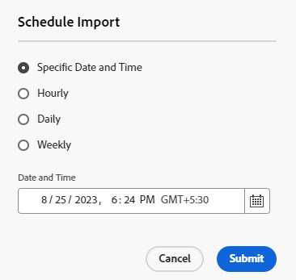

# 使用 Assets 檢視大量匯入資產  {#bulk-import-assets-view}

AEM Assets 檢視中的大量匯入能讓管理員將大量資產從資料來源匯入到 AEM Assets。管理員不再需要將單個資產或資料夾上傳到 AEM Assets。

>[!NOTE]
>
>資產檢視大量匯入工具使用與管理員檢視大量匯入工具相同的後端。 不過，它可提供更多可匯入的資料來源，以及更簡化的使用者體驗。

您可以從以下資料來源匯入資產：

* Azure
* AWS
* Google 雲端
* Dropbox

## 先決條件 {#prerequisites}

| 資料來源 | 先決條件 |
|-----|------|
| Azure | <ul> <li>Azure 儲存體帳戶 </li> <li> Azure Blob 容器 <li> 根據驗證模式的 Azure 存取金鑰或 SAS 權杖 </li></ul> |
| AWS | <ul> <li>AWS 區域 </li> <li> AWS 儲存貯體 <li> AWS 存取金鑰 </li><li> AWS 存取密碼 </li></ul> |
| Google 雲端 | <ul> <li>GCP 貯體 </li> <li> GCP 服務帳戶電子郵件 <li> GCP 服務帳戶私密金鑰</li></ul> |
| Dropbox | <ul> <li>Dropbox 用戶端 ID </li> <li> Dropbox 用戶端密碼</li></ul> |

除了這些根據資料來源的先決條件之外，您也必須了解資料來源中可用的來源資料夾名稱，其中包含需要匯入到 AEM Assets 的所有資產。

## 建立大量匯入設定 {#create-bulk-import-configuration}

執行以下步驟以建立大量匯入設定：

1. 瀏覽到「**[!UICONTROL 設定]** > **[!UICONTROL 大量匯入]**」，並按一下「**[!UICONTROL 建立匯入]**」。
1. 選取資料來源。可用選項包括 Azure、AWS、Google 雲端和 Dropbox。
1. 在「**[!UICONTROL 名稱]**」欄位中為大量匯入設定指定名稱。
1. 指定資料來源特定的認證，如[先決條件](#prerequisites)中所述。
1. 在「**[!UICONTROL 來源資料夾]**」欄位中提供包含資料來源中資產的根資料夾名稱。
1. (可選) 選取「**[!UICONTROL 匯入後刪除來源檔案]**」選項，在檔案匯入到 Experience Manager Assets 後，從來源資料存放區中刪除原始檔案。
1. 選取「**[!UICONTROL 匯入模式]**」。選取「**[!UICONTROL 跳過]**」、「**[!UICONTROL 取代]**」或「**[!UICONTROL 建立版本]**」。跳過模式是預設值，在此模式下，擷取工具會跳過匯入資產 (如果已存在)。
   

1. (可選) 在中繼資料檔案欄位中指定要匯入的中繼資料檔案 (以 CSV 格式提供)，然後按一下「**[!UICONTROL 下一步]**」，瀏覽至「**[!UICONTROL 位置和篩選器]**」。
1. 要使用「**[!UICONTROL 資產目標資料夾]**」欄位在所要匯入資產的 DAM 中定義位置，請指定路徑。 例如，`/content/dam/imported_assets`。
1. (可選) 在「**[!UICONTROL 選擇篩選器]**」區段中，提供資產的檔案大小下限 (以 MB 為單位)，以便將它們包含在「**[!UICONTROL 按大小下限篩選]**」欄位中的擷取程序中。
1. (可選) 提供資產的檔案大小上限 (以 MB 為單位)，以納入「**[!UICONTROL 按大小上限篩選]**」欄位的擷取程序。
1. (可選) 使用「**[!UICONTROL 包含 MIME 類型]**」欄位選取要包含在擷取程序中的 MIME 類型。您可以在此欄位中選取多種 MIME 類型。如果您未定義值，則所有 MIME 類型都將包含在擷取程序中。

1. (可選) 使用「**[!UICONTROL 排除 MIME 類型]**」欄位選取要在擷取程序中排除的 MIME 類型。您可以在此欄位中選取多種 MIME 類型。如果您未定義值，則所有 MIME 類型都將包含在擷取程序中。

   

1. 按一下「**[!UICONTROL 下一步]**」。選取「**[!UICONTROL 儲存並執行匯入]**」以儲存設定並執行大量匯入。選取「**[!UICONTROL 儲存匯入]**」暫時儲存設定，以便稍後執行。

   

1. 按一下「**[!UICONTROL 儲存]**」執行所選選項。

### 在大量匯入期間處理檔案名稱 {#filename-handling-bulkimport-assets-view}

當您大量匯入資產或資料夾時， [!DNL Experience Manager Assets] 匯入存在於匯入來源中的完整結構。 [!DNL Experience Manager] 會遵循資產和檔案夾名稱中特殊字元的內建規則，因此這些檔案名稱需要清除。 對於資料夾名稱和資產名稱，使用者定義的標題會保持不變，並會儲存在 `jcr:title`.

大量匯入期間， [!DNL Experience Manager] 尋找現有資料夾以避免重新匯入資產和資料夾，同時也驗證匯入發生所在的父資料夾中套用的清理規則。 如果在父資料夾中套用清理規則，則相同的規則會套用到匯入來源。 針對新的匯入，會套用以下清理規則來管理資產和資料夾的檔案名稱。

如需有關大量匯入期間不允許的名稱、處理資產名稱及處理資料夾名稱的詳細資訊，請參閱 [在管理員檢視中大量匯入時處理檔案名稱](add-assets.md##filename-handling-bulkimport).

## 檢視現有的大量匯入設定 {#view-import-configuration}

如果您在建立設定後選擇儲存設定，則該設定會顯示在「**[!UICONTROL 已儲存的匯入]**」標籤中。

如果您選擇儲存並執行匯入，則匯入設定會顯示在「**[!UICONTROL 已執行的匯入]**」標籤中。

如果您安排了匯入的排程，它會顯示在「**[!UICONTROL 已排定的匯入]**」標籤中。

## 編輯大量匯入設定 {#edit-import-configuration}

若要編輯設定詳細資訊，請按一下設定名稱相對應的 ...，然後按一下「**[!UICONTROL 編輯]**」。執行編輯操作時無法編輯設定的標題和匯入資料來源。您可以使用「已執行」、「已排定」或「已儲存的匯入」標籤來編輯設定。

## 安排單次或定期匯入的排程 {#schedule-imports}

要安排單次或定期大量匯入的排程，請執行以下步驟：

1. 按一下「**[!UICONTROL 已執行的匯入]**」或「**[!UICONTROL 已儲存的匯入]**」標籤中可用設定名稱相對應的 ...，並按一下「**[!UICONTROL 排程]**」。您也可以透過瀏覽到「**[!UICONTROL 已排定的匯入]**」標籤並按一下「**[!UICONTROL 排程]**」重新排程現有已排定的匯入。

1. 設定單次擷取或排定每小時、每天或每週排程。按一下「**[!UICONTROL 提交]**」。

   

## 執行匯入健康情況檢查 {#import-health-check}

要驗證與資料來源的連線，請按一下設定名稱相對應的 ...，然後按一下「**[!UICONTROL 檢查]**」。如果連線成功，Experience Manager Assets 會顯示以下訊息：

## 在執行匯入之前執行試執行 {#dry-run-bulk-import}

按一下設定名稱相對應的 ...，然後按一下「**[!UICONTROL 試執行]**」以叫用大量匯入作業的測試執行。Experience Manager Assets 會顯示以下有關該大量匯入作業的詳細資訊：

## 執行大量匯入 {#run-bulk-import}

如果您在建立設定時已儲存匯入，則可以瀏覽至「已儲存的匯入」標籤，按一下設定相對應的 ...，然後按一下「**[!UICONTROL 試執行]**」。

同樣地，如果您需要執行已執行的匯入，請瀏覽至「已執行的匯入」標籤，按一下設定名稱相對應的 ...，然後按一下「**[!UICONTROL 試執行]**」。

## 停止或排程進行中的匯入 {#schedule-stop-ongoing-report}

您可以使用匯入期間，顯示在大量匯入首頁上的大量匯入狀態對話框進行排程或停止進行中的大量匯入。

您也可以透過按一下「**[!UICONTROL 檢視資產]**」檢視目標資料夾中已匯入的資產。

## 刪除大量匯入設定 {#delete-bulk-import-configuration}

按一下「**[!UICONTROL 已執行的匯入]**」、「**[!UICONTROL 已排定的匯入]**」或「**[!UICONTROL 已儲存的匯入]**」標籤中設定名稱相對應的 ...，並按一下「**[!UICONTROL 刪除]**」以刪除大量匯入設定。

## 執行大量匯入後瀏覽至資產 {#view-assets-after-bulk-import}

要檢視執行大量匯入作業後匯入資產的資產目標位置，請按一下設定名稱相對應的 ...，然後按一下「**[!UICONTROL 檢視資產]**」。

