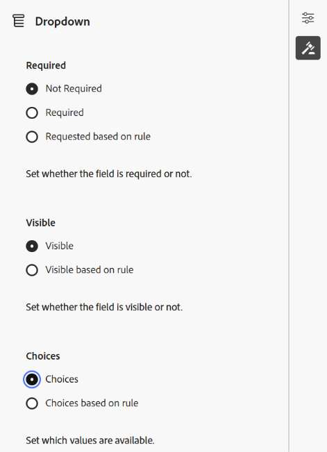
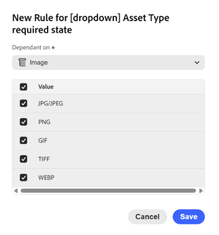
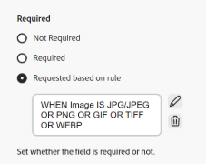
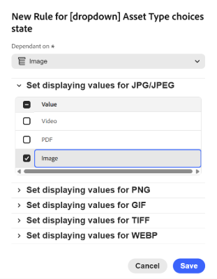

# 階層式中繼資料Assets檢視{#cascading-metadata-assets-view}

擷取資產的中繼資料資訊時，使用者會在各種可用欄位中提供資訊。 您可以根據在其他欄位中選取的選項，顯示特定的中繼資料欄位或欄位值。 這類條件式顯示中繼資料稱為階層式中繼資料。 換言之，您可以在特定中繼資料欄位/值與一或多個欄位及/或其值之間建立相依性。

使用中繼資料Forms來定義顯示階層式中繼資料的規則。 例如，如果您的中繼資料表單包含資產型別欄位，您可以根據使用者選取的資產型別定義要顯示的相關欄位集。

以下是您可以定義階層式中繼資料的一些使用案例：

* 需要使用者位置時，根據使用者對國家/地區和州的選擇顯示相關城市名稱。
* 根據使用者選擇的產品類別，在清單中載入相關品牌名稱。
* 根據在另一個欄位中指定的值切換特定欄位的可見度。 例如，如果使用者希望以不同的地址運送出貨，則顯示個別的出貨位址列位。
* 根據在其他欄位中指定的值，將欄位指定為必填欄位。
* 根據在其他欄位中指定的值變更針對特定欄位顯示的選項。
* 根據在其他欄位中指定的值，在特定欄位中設定預設中繼資料值。

>[!IMPORTANT]
>
>階層式中繼資料功能以「有限可用性」功能提供。 您可以[建立並提交 Adobe 客戶支援案例](https://helpx.adobe.com/tw/enterprise/using/support-for-experience-cloud.html)，以針對您的部署將其啟用。

## 在[!DNL Experience Manager]中設定階層式中繼資料 {#configure-cascading-metadata-in-aem}

假設您想根據選取的資產型別顯示階層式中繼資料。 例如 — 

* 對於視訊，會顯示適用的欄位，例如格式、轉碼器、持續時間等。
* 對於Word或PDF檔案，顯示欄位，例如頁數、作者等。

我們使用名為`Image`的下拉欄位作為範例，依據檔案的影像型別加以分類。 下拉式清單包含代表受支援影像擴充功能的選項（例如JPG/JPEG、GIF等）。 為確保資料一致性並防止選擇或處理不支援的格式，將驗證規則套用至此欄位。 規則會評估選取的下拉式清單值，並強制實施與接受的影像格式一致的限制。

>[!IMPORTANT]
>
>您只能根據下拉式欄位建立規則。

無論選擇的資產型別為何，都會將版權資訊顯示為必填欄位。 您可以使用[預先定義的中繼資料元件](metadata-assets-view.md#property-components)和[將中繼資料指派給資料夾](metadata-assets-view.md#assign-metadata-form-folder)。

### 建立中繼資料Forms {#build-metadata-schema-forms}

請考慮下列步驟以建立新的中繼資料表單：

1. 選取[!DNL Experience Manager]標誌，然後前往&#x200B;**[!UICONTROL 設定]** > **[!UICONTROL 中繼資料Forms]** > **[!UICONTROL 建立]**。

1. 從&#x200B;**[!UICONTROL 型別]**&#x200B;下拉式清單中，選取適當的表單型別： **[!UICONTROL 檔案]**、**[!UICONTROL 資料夾]**&#x200B;或&#x200B;**[!UICONTROL 集合]**。

1. 在&#x200B;**[!UICONTROL 名稱]**&#x200B;欄位中指定中繼資料表單的標題。

1. 或者，您也可以從&#x200B;**[!UICONTROL 從現有表單範本選擇]**&#x200B;下拉式清單中選擇現有的中繼資料表單範本。

1. 出現空白的中繼資料表單。 新增索引標籤。

   

   * **A：**&#x200B;在[!UICONTROL 編輯]或[!UICONTROL 預覽]之間切換
   * **B：** [中繼資料表單的元件](metadata-assets-view.md#property-components)
   * **C：**&#x200B;切換到其他中繼資料表單
   * **D：**&#x200B;新增索引標籤
   * **E：**&#x200B;畫布
   * **F：**&#x200B;選取元件的一般設定
   * **G：**&#x200B;規則標籤
   * **H：**&#x200B;元件屬性

觀看此影片以檢視步驟順序，[設定中繼資料Forms](https://video.tv.adobe.com/v/341275)。

### 修改現有的中繼資料表單 {#modify-existing-metadata-form}

若要修改現有的中繼資料表單，請遵循下列步驟：

1. 開啟現有的中繼資料表單，並導覽至您要新增至表單的[預先定義元件](metadata-assets-view.md#property-components)，並將元素拖放到畫布上。

   根據&#x200B;**影像**&#x200B;的使用案例，新增下拉欄位以定義影像資產型別。 在&#x200B;**設定**&#x200B;中指定名稱和屬性路徑，並選擇性地將欄位設定為&#x200B;**[!UICONTROL 唯讀]**&#x200B;或&#x200B;**[!UICONTROL 多重選擇]**。

1. 手動輸入、指定JSON路徑或匯入CSV檔案，提供下拉式清單的鍵值選項。

   * 若要手動指定值，請選取&#x200B;**[!UICONTROL 選擇]**&#x200B;下的&#x200B;**[!UICONTROL 手動新增]**，然後按一下`Add`並指定選項標籤和值。 例如，指定視訊、PDF和影像資產型別。

     

   * 若要從JSON路徑擷取值，請選取&#x200B;**[!UICONTROL 透過JSON路徑新增]**&#x200B;並指定JSON檔案的路徑。

     >[!NOTE]
     >
     >請務必將JSON檔案儲存在所有DAM編輯人員和作者都可存取的共用位置。

     

   * 若要從CSV動態擷取值，請按一下&#x200B;**[!UICONTROL 匯入CSV]**，並提供CSV檔案的路徑。 當表單呈現給使用者時，[!DNL Experience Manager]會即時擷取機碼值組。

     

   >[!NOTE]
   > 
   >您無法從CSV檔案匯入選項並手動編輯它們，因為這兩個選項是互斥的。

1. 若要在[影像]欄位與其他欄位之間建立相依性，請選取相依欄位並開啟&#x200B;**[!UICONTROL 規則]**&#x200B;標籤。 每個元件都支援一組特定的規則。 對於此使用案例，系統會使用「影像資產型別」選項來定義規則邏輯。

   <!---->

   <!---->

1. 在「**[!UICONTROL 必要]**」下，根據新規則&#x200B;**[!UICONTROL 選項選擇「]**&#x200B;必要」。 按一下以新增規則。

   

   在目前的使用案例中，當影像資產格式為JPG/JPEG、PNG、GIF、TIFF或WEBP時，需要「資產型別」欄位。 此外，按一下以重新定義規則，或按一下以刪除定義的規則。

   

1. 在&#x200B;**[!UICONTROL 可見度]**&#x200B;下，根據新規則&#x200B;**[!UICONTROL 選項選擇]**&#x200B;可見度。 按一下以新增規則。

   >[!NOTE]
   >
   >您可以套用&#x200B;**[!UICONTROL 需求]**&#x200B;條件和&#x200B;**[!UICONTROL 可見度]**&#x200B;條件，它們彼此獨立。

   

   在目前的使用案例中，當影像資產格式為JPG/JPEG、PNG或GIF時，會顯示資產型別欄位。 此外，按一下以重新定義規則，或按一下以刪除定義的規則。

   

1. 選取&#x200B;**[!UICONTROL 根據規則]**&#x200B;的選擇以建立相依性並定義規則。 按一下以新增規則。

   

   若要設定「資產型別」下拉式清單的規則型選項，請建立規則並將「影像」設為相依欄位。 接著，選取JPG/JPEG、PNG、GIF和TIFF的「影像」，再選取WEBP的「視訊」，定義每種影像格式的顯示值，確保只檢查每種格式的預期值，以動態顯示相關選項。 此外，按一下以重新定義規則，或按一下以刪除定義的規則。

   

1. 同樣地，請重複這些步驟，在[!UICONTROL Asset Type]欄位中的其他資產（例如PDF和Word）與欄位（例如[!UICONTROL Page Count]和[!UICONTROL Author]）之間建立相依性。

1. 按一下「**[!UICONTROL 儲存]**」。將中繼資料表單套用至資料夾。

1. 導覽至您套用中繼資料表單的資料夾，並開啟資產的屬性頁面。 視您在「資產型別」欄位中的選擇而定，會顯示相關的階層式中繼資料欄位。

   

## 後續步驟 {#next-steps}

* [觀看在Assets檢視中管理中繼資料表單的相關影片](https://experienceleague.adobe.com/docs/experience-manager-learn/assets-essentials/configuring/metadata-forms.html?lang=zh-Hant)

* 使用資產檢視使用者介面所提供的[!UICONTROL 意見回饋]選項提供產品意見回饋

* 若要提供文件意見回饋，請使用右側邊欄提供的[!UICONTROL 編輯此頁面]或[!UICONTROL 記錄問題]

* 聯絡[客戶服務](https://experienceleague.adobe.com/zh-hant?support-solution=General#support)
