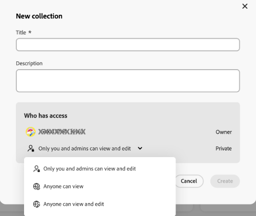
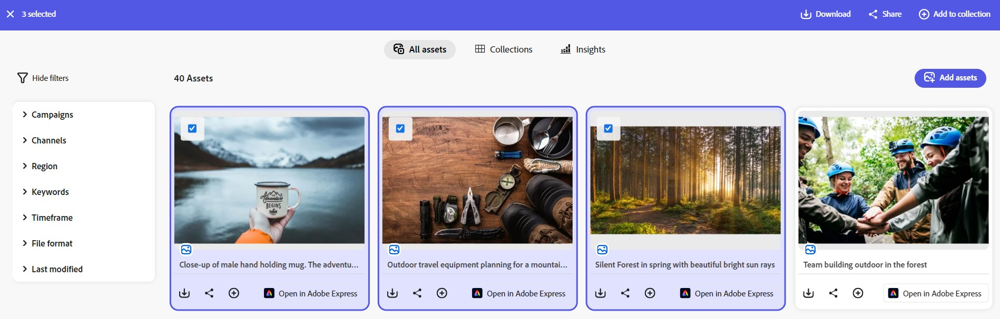
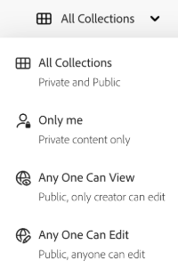
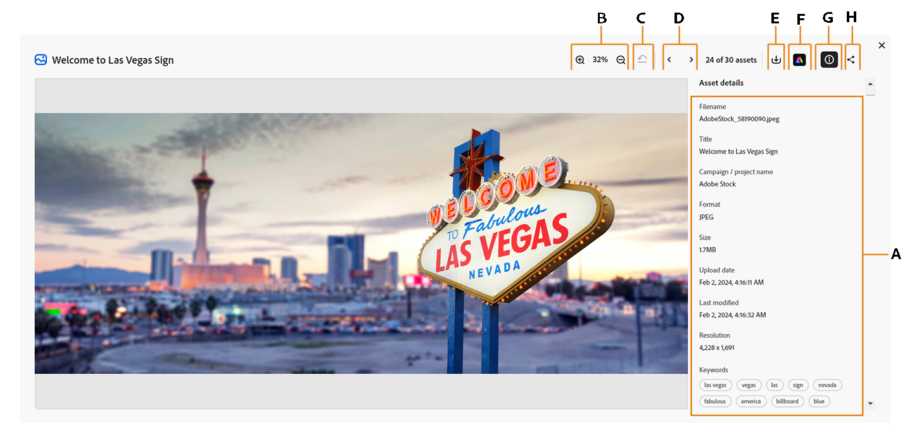

# 管理[!DNL Content Hub]中的集合 {#manage-collections}

<table>

    <tr>

        <td>

            <i>全新</i><a href="/help/assets/dynamic-media/dm-prime-ultimate.md"><b>Dynamic Media Prime 與 Ultimate</b></a>

        </td>

        <td>

            <i>全新</i><a href="/help/assets/assets-ultimate-overview.md"><b>AEM Assets Ultimate</b></a>

        </td>

        <td>

            <i>全新</i><a href="/help/assets/integrate-aem-assets-edge-delivery-services.md"><b>AEM Assets 與 Edge Delivery Services 整合</b></a>

        </td>

        <td>

            <i>全新</i><a href="/help/assets/aem-assets-view-ui-extensibility.md"><b>使用者介面可擴充性</b></a>

        </td>

          <td>

            <i>全新</i><a href="/help/assets/dynamic-media/enable-dynamic-media-prime-and-ultimate.md"><b>啟用 Dynamic Media Prime 與 Ultimate</b></a>

        </td>

    </tr>

    <tr>

        <td>

            <a href="/help/assets/search-best-practices.md"><b>搜尋最佳實務</b></a>

        </td>

        <td>

            <a href="/help/assets/metadata-best-practices.md"><b>中繼資料最佳實務</b></a>

        </td>

        <td>

            <a href="/help/assets/product-overview.md"><b>Content Hub</b></a>

        </td>

        <td>

            <a href="/help/assets/dynamic-media-open-apis-overview.md"><b>具有 OpenAPI 功能的 Dynamic Media</b></a>

        </td>

        <td>

            <a href="https://developer.adobe.com/experience-cloud/experience-manager-apis/"><b>AEM Assets 開發人員文件</b></a>

        </td>

    </tr>

</table>

<!--  -->

>[!AVAILABILITY]
>
>現已提供 PDF 格式的 Content Hub 指南。下載完整指南，並使用 Adobe Acrobat AI 助理來回答您的查詢問題。
>
>[!BADGE Content Hub 指南 PDF]{type=Informative url="https://helpx.adobe.com/tw/content/dam/help/en/experience-manager/aem-assets/content-hub.pdf"}

集合是指可在使用者之間共用的一組資產。 收藏集可以包含來自不同位置的資產，同時維護其參考完整性。

[!DNL Content Hub]可讓您建立公開集合。 這些集合可供所有授權使用者存取，並建立一個讓多位使用者能夠有效地存取及利用內容的共用空間。 收藏集可促進合作使用資源，以提高效率和便利性。 在集合瀏覽頁面中，您可以：

* **建立**：建立一或多個集合。
* **檢視**：檢視資產及其屬性。
* **共用**：以連結方式與其他人共用資產。
* **下載**：下載資產。
* **移除**：從集合中移除特定資產。
* **刪除**：刪除整個集合。

它可協助使用者輕鬆存取和管理[!DNL Content Hub]中可用的各種資產。

## 先決條件 {#prerequisites}

[Content Hub使用者](deploy-content-hub.md#onboard-content-hub-users)可以執行本文所述的動作。

## 建立集合{#create-collections}

您可以選擇[建立新的集合](#create-new-collection)，或在管理治理時[將資產新增至現有的集合](#add-assets-to-existing-collection)。

### 建立新的集合{#create-new-collection}

執行以下步驟，在建立集合時控制存取：

1. 移至&#x200B;**[!DNL Collections]**&#x200B;標籤，然後按一下&#x200B;**[!UICONTROL 建立集合]**。 「新建集合」視窗會出現。

1. 新增集合的&#x200B;**[!UICONTROL 標題]**&#x200B;和&#x200B;**[!UICONTROL 描述]**。

   

1. 在&#x200B;**[!UICONTROL 誰可以存取]**&#x200B;下拉式清單下>選取存取控制型別。 下列選項可供使用：

   | 存取方法 | 存取類型 | 說明 |
   |---|---|---|
   | **只有您和系統管理員可以編輯** | 私人 | 只有建立者和管理員可以編輯和存取此集合。 |
   | **任何人都可以檢視** | 公用 | 所有人都可以存取此集合，但只有建立者和管理員可以編輯。 |
   | **任何人都可以檢視和編輯** | 公用 | 此集合對所有人開放，可授予完整存取及編輯許可權，不受限制。 |

   >[!NOTE]
   >
   > [!DNL Content Hub]管理員可以檢視&#x200B;**[!UICONTROL 誰可以存取]**&#x200B;下拉式清單下所有可用的選項，而對於一般使用者，您需要[指定並設定](configure-content-hub-ui-options.md)他們可以存取的選項。

1. 按一下「**[!UICONTROL 建立]**」。完成後，您可以[將資產新增至集合](#add-assets-to-existing-collection)。

>[!VIDEO](https://video.tv.adobe.com/v/3463336)

<!--
>[!NOTE]
>
>Collections governance is a limited availability feature. You can get it enabled  by creating a support ticket. Once enabled, you need to [Configure Collections in Content Hub](configure-content-hub-ui-options.md#configure-collections-content-hub).-->

<!--To create a new collection, navigate to the **[!UICONTROL Collections]** tab and click **[!UICONTROL Create new collection]**. Enter the **[!UICONTROL Title]** and provide an optional **[!UICONTROL Description]** for the assets. Click **[!UICONTROL Create]**.
          
-->

### 將資產新增至現有集合{#add-assets-to-existing-collection}

若要將資產新增至現有集合，請選取您需要新增至集合的資產。 按一下&#x200B;**[!UICONTROL 新增至集合]**。 系統會提示您選取集合。

選擇您要新增資產的集合。 您也可以使用搜尋列來搜尋現有集合。  選取您需要新增資產的集合，然後按一下&#x200B;**[!UICONTROL [新增至集合]]**。

## 檢視集合{#view-collections}

瀏覽至&#x200B;**[!UICONTROL 集合]**&#x200B;索引標籤，並搜尋集合名稱。 您可以透過選取特定條件，使用篩選器來縮小搜尋結果，協助您快速找到最相關的集合。

若要檢視收藏集中可用的資產清單，請按一下收藏集名稱。 您也可以在集合中套用篩選器，以縮小資產結果的範圍。 按一下您需要在集合中檢視的資產。 [!DNL Content Hub]顯示資產的詳細檢視。 [檢視資產詳細資料](asset-properties-content-hub.md)。

### 篩選集合檢視 {#filter-collections-view}

Content Hub可讓您篩選集合檢視，根據您的偏好縮小選項，輕鬆找出您要尋找的確切內容。 確定Content Hub[&#128279;](configure-content-hub-ui-options.md#configure-collections-content-hub)中集合的設定。

若要篩選集合檢視，請前往&#x200B;**[!DNL Collections]**&#x200B;索引標籤，並導覽至「集合」下拉式清單。 從下列選項中選擇：

* **[!UICONTROL 所有集合]：**&#x200B;選取此選項可檢視與您共用的私人集合。
* **[!UICONTROL 只有我]：**&#x200B;選取此選項可檢視您有存取權的集合。
* **[!UICONTROL 任何人都可以檢視]：**&#x200B;此選項可讓您篩選每個人都可存取但只有建立者可編輯的集合。
* **[!UICONTROL 任何人都可以編輯]：**&#x200B;選取此選項以篩選每個人都可以存取及編輯的集合。

  

此外，若要根據存取許可權篩選集合檢視，請移至&#x200B;**[!DNL Collections]**&#x200B;索引標籤，並導覽至下列其中一個選項：

* **[!UICONTROL 由任何人建立]：**&#x200B;此篩選器限制您檢視任何使用者建立的集合。

* **[!UICONTROL 由我建立]：**&#x200B;此篩選器限制您檢視由您建立的集合。

  

<!--

* **A**: Details and metadata of the asset 
* **B**: Zoom In or Zoom Out the asset 
* **C**: Reset Zoom view 
* **D**: View the previous or next asset 
* **E**: Download the asset 
* **F**: Open the asset in Adobe Express 
* **G**: Hide the metadata of the asset 
* **H**: Share the asset as a link 
-->

## 下載收藏集中可用的資產{#download-assets-within-collection}

若要下載收藏集中可用的資產，請導覽至&#x200B;**[!UICONTROL 收藏集]**&#x200B;索引標籤。\
按一下收集卡上的圖示。

已下載收藏集中的所有資產。

您也可以開啟收藏集以個別下載資產。 按一下包含您需要下載之資產的集合。 選取資產並按一下&#x200B;**[!UICONTROL 下載]**。

瞭解如何[從 [!DNL Content Hub]](download-assets-content-hub.md)下載資產。

## 共用收藏集中可用的資產 {#share-assets-available-within-collection}

您也可以共用收藏集中可用的資產。 請確定[在Content Hub](configure-content-hub-ui-options.md#enable-public-link-sharing)中啟用公用連結共用。 瀏覽至&#x200B;**[!UICONTROL 集合]**&#x200B;索引標籤。 選取集合卡上的圖示。 會複製共用連結。 您可以與收件者共用複製的連結。 深入瞭解[在 [!DNL Content Hub]](share-assets-content-hub.md)中共用資產。

Content Hub集合提供全方位的控管工具，包括可自訂的共用許可權和共同作業功能，以有效管理資產。 從唯讀存取到完整管理控制，這些設定支援對資產散佈進行精細治理。 單獨或作為集合的一部分共用資產時，存取範圍由指派給使用者的集合當前存取層級決定。 或者，您無法共用私人集合。

## 編輯集合的詳細資料 {#edit-details-of-collection}

若要編輯集合的&#x200B;**[!UICONTROL Title]**&#x200B;和&#x200B;**[!UICONTROL Description]**，請按一下集合名稱，然後按一下圖示。 顯示[!UICONTROL 集合詳細資料]畫面，可讓您編輯集合的&#x200B;**[!UICONTROL 標題]**&#x200B;和&#x200B;**[!UICONTROL 描述]**。 按一下&#x200B;**[!UICONTROL 儲存變更]**&#x200B;以確認修改。 此外，您可以根據設定，透過「編輯系列」對話方塊更新系列存取權。

## 從集合移除資產{#remove-assets-from-a-collection}

下列使用者可以從集合中移除單一或多個資產：

* 管理員
* 集合的擁有者
* 具有編輯許可權的非管理員使用者

若要從集合中移除資產，請按一下需要移除資產的集合、選取資產，然後按一下[從集合中移除]。**&#x200B;**

系統會提示您確認資產移除操作。 按一下&#x200B;**[!UICONTROL 移除]**。\
選取的資產已成功從集合中移除。

## 刪除集合{#delete-collection}

只有管理員和建立者可以刪除集合。 若要刪除集合，請導覽至&#x200B;**[!UICONTROL 集合]**&#x200B;索引標籤，然後按一下您要刪除的集合。 按一下圖示以刪除集合。

