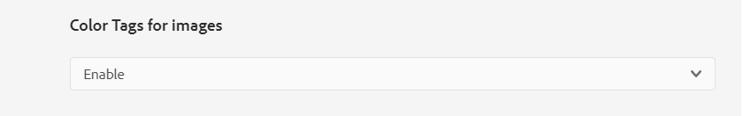

# 影像的顏色標籤 {#color-tag-images}

Experience Manager Assets使用Adobe Sensei AI功能來區分影像中的顏色，並在擷取時自動將這些顏色套用為標籤。 這些標籤可根據影像色彩構成啟用增強的搜尋體驗。

您可以配置在1到40之間的範圍內被標籤到影像的顏色數，以便以後可以根據這些顏色搜索影像。 Experience Manager Assets會根據影像中的色彩涵蓋範圍套用標籤。 您也可以設定顏色標籤的顯示格式。

下圖說明您在Experience Manager Assets中設定和管理影像的顏色標籤時所執行的工作順序：

## 支援的檔案格式 {#supported-file-formats-color-tags}

| 檔案格式 | 副檔名 | MIME類型 | 輸入色域 | 最大支援源檔案大小 | 支援的最大檔案大小解析度 |
|---|---|---|---|---|---|
| JPEG | .jpg, .jpeg | image/jpeg | sRGB | 15GB | 20000px X 20000px |
| PNG | .PNG | image/png | sRGB | 15GB | 20000px X 20000px |
| TIFF | .tif, .tiff | image/tiff | sRGB | 4GB（受格式規格限制） | 20000px X 20000px |
| PSD | .psd | image/vnd.adobe.photoshop | sRGB | 2GB（受格式規格限制） | 20000px X 20000px |
| GIF | .gif | image/gif | sRGB | 15GB | 20000px X 20000px |
| BMP | .bmp | image/bmp | sRGB | 4GB（受格式規格限制） | 20000px X 20000px |

## 管理顏色標籤屬性 {#manage-color-tagging-properties}

要管理影像的顏色標籤屬性，請執行以下操作：

1. 導覽至 **[!UICONTROL 工具>資產>顏色標籤]**.

   

1. 指定 **[!UICONTROL 顯示格式]** 欄位。 可能的選項包括顏色名稱、RGB或HEX格式。

1. 指定要標籤的影像顏色數 **[!UICONTROL 限制]** 欄位。 當您檢視影像的屬性時，會顯示這些顏色。  您可以在此欄位中定義介於1到40之間的數字。 此欄位的預設值為10色。

1. 指定最小色彩涵蓋百分比，以在 **[!UICONTROL 覆蓋/支配閾值%]** 欄位。 例如，如果影像中紅色的覆蓋率為10%，而您在此欄位中定義了9%，則當您搜索具有紅色的影像時，將包括該影像。 但是，如果影像中紅色的覆蓋率為10%，並且您在此欄位中定義了11%，則搜索具有紅色的影像時不會包括該影像。

   您可以在此欄位中指定介於5到00之間的任何數字。 預設值為11。

   >[!NOTE]
   >
   >Adobe建議在此欄位中使用接近預設值的值。 為此欄位設定高數字值（例如，大於25）可能會傳回極少的搜尋結果。 同樣地，設定低數值（例如，小於6）可能會傳回太多搜尋結果，但這可能沒有用。

1. 按一下「**[!UICONTROL 儲存]**」。

   >[!VIDEO](https://video.tv.adobe.com/v/340108)

### 停用顏色標籤 {#disable-color-tagging}

預設會啟用影像的色彩標籤。 您可以在資料夾層級停用顏色標籤。 所有子資料夾都會從父資料夾繼承顏色標籤屬性。

要在資料夾級別禁用顏色標籤：

1. 導覽至 **[!UICONTROL Adobe Experience Manager >資產>檔案]**.

1. 選取資料夾，然後按一下 **[!UICONTROL 屬性]**.

1. 在 **[!UICONTROL 資產處理]** 頁簽，導航到 **[!UICONTROL 影像的顏色標籤]** 檔案夾。 從下拉式清單中選取下列其中一個值：

   * 繼承 — 資料夾繼承父資料夾的啟用或禁用選項。

   * 啟用 — 為所選資料夾啟用顏色標籤。

   * 禁用 — 禁用所選資料夾的顏色標籤。

   

## 配置元資料結構以添加智慧顏色標籤元件 {#configure-metadata-schema}

中繼資料結構包含要填入之特定資訊的特定欄位。 它也包含版面資訊，以方便使用的方式顯示中繼資料欄位。 中繼資料屬性包括標題、說明、MIME類型、標籤等。 您可以使用 [!UICONTROL 中繼資料結構Forms] 編輯器來修改現有結構或新增自訂中繼資料結構。

>[!NOTE]
>
>預設中繼資料結構中提供「智慧顏色標籤」欄位。 如果您使用自訂中繼資料結構，請設定您的結構以新增智慧顏色標籤欄位。

要將智慧顏色標籤元件添加到元資料結構表單編輯器中，請執行以下操作：

1. 導覽至 **[!UICONTROL 工具>資產>中繼資料結構]**.

1. 選擇架構名稱，然後按一下 **[!UICONTROL 編輯]**.

1. 拖曳 **[!UICONTROL 智慧色標籤]** 從 **[!UICONTROL 建置表單]** 標籤 **[!UICONTROL 中繼資料結構表單編輯器]**.

1. 按一下 **[!UICONTROL 智慧顏色標籤欄位]** 在 **[!UICONTROL 中繼資料結構表單編輯器]**.

1. 在 **[!UICONTROL 欄位標籤]** 欄位 **[!UICONTROL 設定]**  標籤。

1. 按一下「**[!UICONTROL 儲存]**」。

   >[!VIDEO](https://video.tv.adobe.com/v/340124)

## DAM中現有影像的色彩標籤 {#color-tags-existing-images}

DAM中現有的影像不會自動加上顏色標籤。 您需要 [!UICONTROL 重新處理資產] 手動產生顏色標籤。

若要為資產存放庫中已存在的資產的影像或資料夾（包括子資料夾）加色，請遵循下列步驟：

1. 選取 [!DNL Adobe Experience Manager] 標誌，然後從中選取資產 [!UICONTROL 導覽] 頁面。

1. 選擇 [!UICONTROL 檔案] 顯示「資產」介面。

1. 導覽至您要套用顏色標籤的資料夾。

1. 選取整個資料夾或特定影像。

1. 選擇  [!UICONTROL 重新處理資產] 圖示並選取 [!UICONTROL 完整流程] 選項。

程式完成後，導覽至 [!UICONTROL 屬性] 資料夾內任何影像的頁面。 自動新增的標籤會顯示在 [!UICONTROL 智慧色標籤] 區段 [!UICONTROL 基本] 標籤。

## 查看影像的智慧顏色標籤 {#view-color-tags}

要查看影像的智慧顏色標籤，請執行以下操作：

1. 導覽至 **[!UICONTROL Adobe Experience Manager >資產>檔案]**.

1. 按一下適當的資料夾並選取影像。

1. 選擇 **[!UICONTROL 屬性]** 並檢視 **[!UICONTROL 智慧色標籤]** 欄位。

   

   將滑鼠移至顏色標籤上，即可檢視 **[!UICONTROL 覆蓋/支配閾值%]** 在影像中的顏色。

## 設定AEM Assets色彩述詞 {#configure-search-predicate}

您可以設定影像的搜尋篩選。 然後，您可以根據特定顏色來篩選結果。

>[!NOTE]
>
>只有在您未使用預設搜尋表單時，才設定AEM Assets顏色述詞。

若要設定搜尋篩選，請使用「資產管理搜尋邊欄」建立「資產顏色述詞」。

要配置搜索篩選器：

1. 導覽至 **[!UICONTROL 工具>一般>搜尋Forms]**.

1. 選擇 **[!UICONTROL Assets管理搜尋邊欄]** 按一下 **[!UICONTROL 編輯]**.

1. 拖曳 **[!UICONTROL 資產色彩述詞]** 從 **[!UICONTROL 選擇謂詞]** 標籤 **[!UICONTROL 搜尋表單編輯器]**.

1. 在 **[!UICONTROL 欄位標籤]** 欄位 **[!UICONTROL 設定]**  標籤。

1. 按一下 **[!UICONTROL 完成]** 以儲存設定。

   >[!VIDEO](https://video.tv.adobe.com/v/340110)

## 根據顏色搜索影像 {#search-images-based-on-colors}

>[!VIDEO](https://video.tv.adobe.com/v/340761)

配置所有顏色標籤屬性後， [設定資產色彩述詞](#search-images-based-on-colors)，您可以根據顏色作為篩選條件來搜尋影像。

要根據顏色搜索影像，請執行以下操作：

1. 導覽至 **[!UICONTROL 資產>檔案]**.

1. 選擇 **[!UICONTROL 篩選]** 從下拉式清單。
   

1. 選取 [AEM Assets色彩述詞](#configure-search-predicate).

1. 拖曳檢色器以選取適當的顏色。 所選顏色顯示在檢色器下方的唯讀欄位中。 您可以選取RGB或十六進位作為顏色的顯示格式。

   

   您可以根據選取的一種顏色來篩選影像。 將所選顏色作為智慧顏色標籤之一且位於 [覆蓋/支配閾值%](#manage-color-tagging-settings) 顯示在右窗格中。

1. 按一下搜尋列中的x以清除篩選器。
