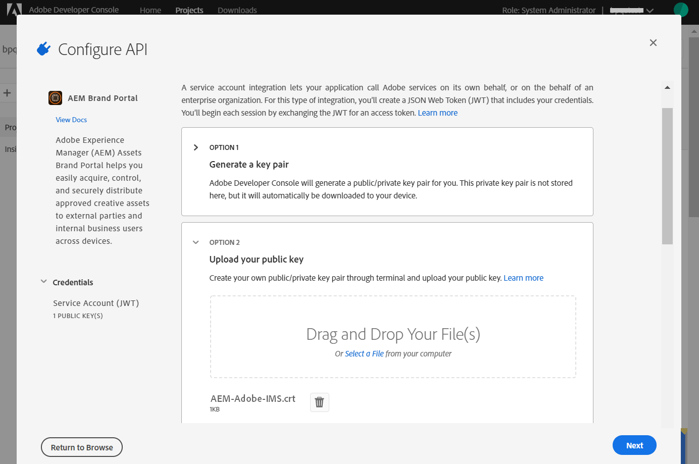
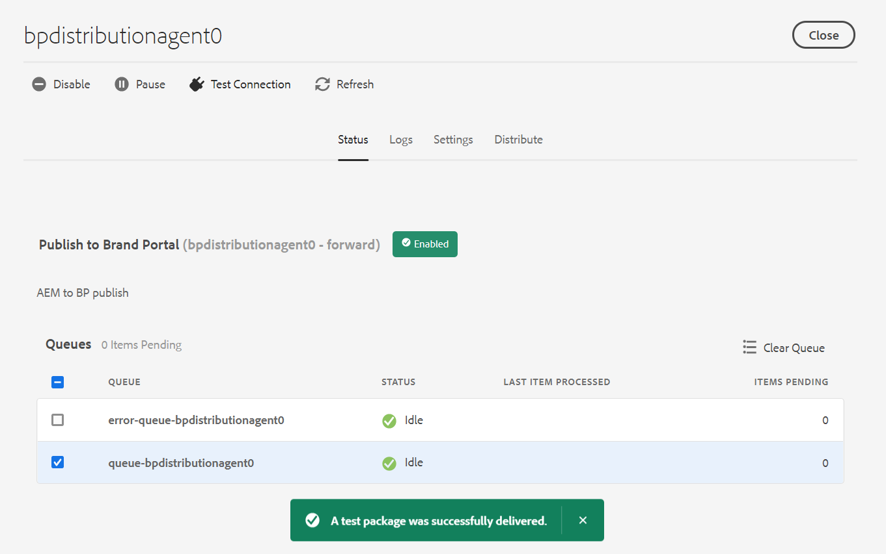

# 使用 Brand Portal 設定 AEM Assets {#configure-aem-assets-with-brand-portal}

Adobe Experience Manager(AEM)Assets是透過Adobe Developer Console以品牌入口網站設定，Adobe Developer Console會購買IMS Token以授權您的品牌入口網站租用戶。

**設定如何運作？**

使用您的品牌入口網站租用戶（組織）設定AEM Assets雲端例項是多步驟程式，需要在AEM Assets雲端例項和Adobe Developer Console中進行設定。

1. 在AEM Assets雲端例項中，建立IMS帳戶並產生公用憑證（公用金鑰）。
1. 在Adobe Developer Console中，為您的品牌入口網站租用戶（組織）建立專案。
1. 在專案下，使用公開金鑰來設定API，以建立服務帳戶(JWT)連線。
1. 獲取服務帳戶憑據和JWT裝載資訊。
1. 在AEM Assets雲端例項中，使用服務帳戶認證和JWT裝載來設定IMS帳戶。
1. 在AEM Assets雲端例項中，使用IMS帳戶和品牌入口端端點（組織URL）來設定品牌入口網站雲端服務。
1. 將資產從AEM Assets雲端例項發佈至品牌入口網站，以測試設定。

>[!NOTE]
>>品牌入口網站租戶只能設定一個AEM Assets雲端例項。
>>請勿設定具有多個AEM Assets雲端例項的品牌入口網站租用戶。
>

## 必備條件 {#prerequisites}

您需要下列項目才能使用 Brand Portal 設定 AEM Assets：

* 已開始運作的 AEM Assets 雲端例項。
* Brand Portal 租用戶 URL。
* 在 Brand Portal 租用戶的 IMS 組織具有系統管理員權限的使用者。

**請連絡客戶服務** ，以取得進一步的查詢。

## 建立設定 {#create-new-configuration}

在指定的序列中執行下列步驟，以使用品牌入口網站設定AEM Assets雲端例項。

1. [取得公開憑證](#public-certificate)
1. [建立服務帳戶(JWT)連接](#createnewintegration)
1. [設定IMS帳戶](#create-ims-account-configuration)
1. [設定雲端服務](#configure-the-cloud-service)
1. [測試設定](#test-configuration)

### 建立 IMS 設定 {#create-ims-configuration}

IMS 設定會以 AEM Assets 作者例項驗證您的 Brand Portal 租用戶。

IMS 設定包括兩個步驟：

* [取得公開憑證](#public-certificate)
* [設定IMS帳戶](#create-ims-account-configuration)

### 取得公開憑證 {#public-certificate}

公開憑證可讓您在Adobe Developer Console上驗證您的個人檔案。

1. 登入您的AEM Assets雲端例項。

1. From **tool**  panel, navigate to **[!UICONTROL Security]** > **[!UICONTROL Adobe IMS Configurations]**.

   

1. 在「Adobe IMS設定」頁面中，按一下「 **[!UICONTROL 建立]**」。

1. 您已重新導向至「 **[!UICONTROL Adobe IMS技術帳戶設定」頁面]** 。 By default, the **Certificate** tab opens.

   選取雲端解決方 **[!UICONTROL 案Adobe Brand Portal]**。

1. Mark the check box **[!UICONTROL Create new certificate]** and specify an **alias** for the certificate. 別名的作用是對話方塊的名稱。

1. 按一下&#x200B;**[!UICONTROL 建立憑證]**。然後，在對 **[!UICONTROL 話方塊中]** ，按一下「確定」以產生公用憑證。

   

1. Click **[!UICONTROL Download Public Key]** and save the certificate (.crt) file on your machine.

   此憑證檔案將用於進一步步驟，以針對您的品牌入口網站租用戶設定API，並在Adobe Developer Console中產生服務帳戶認證。

   

1. 按一下&#x200B;**[!UICONTROL 下一步]**。

   在「帳 **戶** 」標籤中，您建立Adobe IMS帳戶，但您需要在Adobe Developer Console中產生的服務帳戶認證。 暫時保持此頁面開啟。

   在Adobe Developer Console中開啟新 [標籤並建立服務帳戶(JWT)連線](#createnewintegration) ，以取得用於設定IMS帳戶的認證和JWT裝載。

### 建立服務帳戶(JWT)連接 {#createnewintegration}

在Adobe Developer Console中，專案和API是在組織（品牌入口網站租用戶）層級設定。 設定API會在Adobe Developer Console中建立服務帳戶(JWT)連線。 有兩種方法可用來設定API：產生金鑰對（私用和公開金鑰）或上傳公開金鑰。 若要使用Brand Portal設定AEM Assets雲端例項，您必須在AEM Assets雲端例項中產生公用憑證（公用金鑰），並透過上傳公用金鑰在Adobe Developer Console中建立認證。 此公開金鑰用來設定所選品牌入口網站組織的API，並產生服務帳戶的認證和JWT裝載。 這些認證可進一步用來設定AEM Assets雲端例項中的IMS帳戶。 在設定IMS帳戶後，您就可以在AEM Assets雲端例項中設定品牌入口網站雲端服務。

執行以下步驟以生成服務帳戶憑據和JWT裝載：

1. 以IMS組織（品牌入口網站租用戶）的系統管理員權限登入Adobe Developer Console。 預設URL為

   [https://www.adobe.com/go/devs_console_ui](https://www.adobe.com/go/devs_console_ui)

   >[!NOTE]
   >
   >請確定您已從右上角的下拉式清單（組織清單）中選取正確的IMS組織（品牌入口網站租用戶）。

1. Click **[!UICONTROL Create new project]**. 系統會為您的組織建立空白專案。

   按一 **[!UICONTROL 下「編輯專案]** 」以更新「 **[!UICONTROL 專案標題]** 」和「說 **[!UICONTROL 明」]**，然後按 ****&#x200B;一下「儲存」。

   

1. 在「專案概述」標籤中，按一下「 **[!UICONTROL 新增API」]**。

   

1. 在「新增API」視窗中，選取「 **[!UICONTROL AEM品牌入口網站」]** ，然後按一 **[!UICONTROL 下「下一步]**」。

   請確定您擁有AEM品牌入口網站服務的存取權。

1. 在「設定API」視窗中，按一下「 **[!UICONTROL 上傳公開金鑰」]**。 然後，按一 **[!UICONTROL 下「選取檔案]** 」，並上傳您已在取得公用憑證區段中下載的公 [用憑證(.crt](#public-certificate) 檔案)。

   按一下&#x200B;**[!UICONTROL 下一步]**。

   

1. 驗證公共證書並按一下「 **[!UICONTROL Next（下一步）]**」。

1. 在品牌入口網站中，會為每個組織建立預設的描述檔。 「產品設定檔」是在管理控制台中建立，以指派使用者至群組（根據角色和權限）。 若是使用品牌入口網站進行設定，OAuth Token會在組織層級建立。 因此，您必須為您的組織設定預設的產品設定檔。

   選取預設產品設定檔 **[!UICONTROL 資產品牌入口網站]**。

   

1. 在設定API後，您會重新導向至API概觀。 在左邊導覽的「憑 **[!UICONTROL 據」下]**，單 **[!UICONTROL 擊「服務帳戶(JWT)」]**。

   >[!NOTE]
   >
   >您可以視需要檢視憑證並執行其他動作（產生JWT Token、複製憑證詳細資訊、擷取用戶端機密等）。

1. 從「客 **[!UICONTROL 戶端認證]** 」標籤複製 **[!UICONTROL 客戶端ID]**。

   Click **[!UICONTROL Retrieve Client Secret]** and copy the **[!UICONTROL client secret]**.

   

1. Navigate to the **[!UICONTROL Generate JWT]** tab and copy the **[!UICONTROL JWT Payload]**.

您現在可以使用用戶端ID（API金鑰）、用戶端密碼和JWT裝載，在 [AEM Assets雲端例項中設定IMS](#create-ims-account-configuration) 帳戶。

<!--
1. Click **[!UICONTROL Create Integration]**.

1. Select **[!UICONTROL Access an API]**, and click **[!UICONTROL Continue]**.

   

1. Create a new integration page opens. 
   
   Select your organization from the drop-down list.

   In **[!UICONTROL Experience Cloud]**, Select **[!UICONTROL AEM Brand Portal]** and click **[!UICONTROL Continue]**. 

   If the Brand Portal option is disabled for you, ensure that you have selected correct organization from the drop-down box above the **[!UICONTROL Adobe Services]** option. If you do not know your organization, contact your administrator.

   

1. Specify a name and description for the integration. Click **[!UICONTROL Select a File from your computer]** and upload the `AEM-Adobe-IMS.crt` file downloaded in the [obtain public certificates](#public-certificate) section.

1. Select the profile of your organization. 

   Or, select the default profile **[!UICONTROL Assets Brand Portal]** and click **[!UICONTROL Create Integration]**. The integration is created.

1. Click **[!UICONTROL Continue to integration details]** to view the integration information. 

   Copy the **[!UICONTROL API Key]** 
   
   Click **[!UICONTROL Retrieve Client Secret]** and copy the Client Secret key.

   

1. Navigate to **[!UICONTROL JWT]** tab, and copy the **[!UICONTROL JWT payload]**.

   The API Key, Client Secret key, and JWT payload information will be used to create IMS account configuration.

-->

### 設定IMS帳戶 {#create-ims-account-configuration}

請確認您已執行下列步驟：

* [取得公開憑證](#public-certificate)
* [建立服務帳戶(JWT)連接](#createnewintegration)

執行下列步驟以設定您在取得公用憑證時所建立 [的IMS帳戶](#public-certificate)。

1. 開啟「IMS設定」並導覽至「帳 **[!UICONTROL 戶]** 」標籤。 您在取得公開證書時 [仍保持頁面開啟](#public-certificate)。

1. 指定 IMS 帳戶的&#x200B;**[!UICONTROL 標題]**。

   在&#x200B;**[!UICONTROL 授權伺服器]**，輸入 URL：[https://ims-na1.adobelogin.com/](https://ims-na1.adobelogin.com/)

   將用戶端ID貼入您建立服務帳戶(JWT)連線時複製的API金鑰、用戶 [端密碼和JWT裝載中](#createnewintegration)。

   按一下&#x200B;**[!UICONTROL 建立]**。

   已設定IMS帳戶。

   

1. Select the IMS account configuration and click **[!UICONTROL Check Health]**.

   在對 **[!UICONTROL 話方塊中]** ，按一下「勾選」。 成功設定時，會顯示訊息，指出 *Token已成功擷取*。

   

>[!CAUTION]
>
>您只能有一個IMS設定。 請勿建立多個 IMS 組態。
>
>確保IMS配置通過健康檢查。 如果配置未通過健康檢查，則無效。 您必須刪除它並建立新的有效設定。

### 設定雲端服務 {#configure-the-cloud-service}

執行下列步驟以設定品牌入口網站雲端服務：

1. 登入您的AEM Assets雲端例項。

1. From **tool**  panel, navigate to **[!UICONTROL Cloud Services]** > **[!UICONTROL AEM Brand Portal]**.

1. 在「品牌入口網站設定」頁面中，按一下「 **[!UICONTROL 建立]**」。

1. 指定設定的&#x200B;**[!UICONTROL 標題]**。

   選取您在設定IMS帳戶時所建 [立的IMS設定](#create-ims-account-configuration)。

   In the **[!UICONTROL Service URL]**, enter your Brand Portal tenant (organization URL).

   

1. 按一下&#x200B;**[!UICONTROL 儲存並關閉]**。雲端設定此時已建立。您的 AEM Assets 雲端例項現在已經以 Brand Portal 租用戶完成設定。

### 測試設定 {#test-configuration}

執行以下步驟以驗證配置：

1. 登入您的AEM Assets雲端例項。

1. From **tool**  panel, navigate to **[!UICONTROL Deployment]** > **[!UICONTROL Distribution]**.

   

1. 在「分發」頁面中，您可以看到已建立品牌入口網站的分 `bpdistributionagent0` 發代理，以 **[!UICONTROL 便發佈至品牌入口網站]**。

   按一下&#x200B;**[!UICONTROL 發佈至 Brand Portal]**。

   

   >[!NOTE]
   >
   >依預設，系統會為 Brand Portal 租用戶建立一個發佈代理程式。

1. 在Distribution Agent頁中，您可以在「狀態」頁籤下看到 **[!UICONTROL Distribution]** queues。

   發佈代理程式包含兩個佇列：
   * **processing-queue**: 將資產分發至品牌入口網站。

   * **error-queue**: 對於分發失敗的資產。
   >[!NOTE]
   >
   >建議您檢閱失敗，並定期清 **除錯誤佇列** 。

   

1. 若要驗證 AEM Assets 和 Brand Portal 之間的連線，請按一下&#x200B;**[!UICONTROL 測試連線]**。

   

   頁面底部會顯示訊息，指出您的測試封裝已成功傳送。

   >[!NOTE]
   >
   >請避免停用發佈代理程式，因為可能導致在佇列中執行的資產發佈失敗。

您的 AEM Assets 雲端例項已成功以 Brand Portal 完成設定，您現在可以：

* [從 AEM Assets 發佈資產到 Brand Portal](publish-to-brand-portal.md)
* [從 AEM Assets 發佈資料夾到 Brand Portal](publish-to-brand-portal.md#publish-folders-to-brand-portal)
* [從 AEM Assets 發佈集合到 Brand Portal](publish-to-brand-portal.md#publish-collections-to-brand-portal)

除了上述操作，您也可以從 AEM Assets 將中繼資料結構、影像預設集、搜尋 Facet 和標籤發佈至 Brand Portal。

* [將預設集、結構和 Facet 發佈至 Brand Portal](https://docs.adobe.com/content/help/zh-Hant/experience-manager-brand-portal/using/publish/publish-schema-search-facets-presets.html)
* [將標記發佈至 Brand Portal](https://docs.adobe.com/content/help/zh-Hant/experience-manager-brand-portal/using/publish/brand-portal-publish-tags.html)

如需詳細資訊，請參閱 [Brand Portal 文件](https://docs.adobe.com/content/help/zh-Hant/experience-manager-brand-portal/using/home.html)。

## 發佈記錄檔 {#distribution-logs}

您可以檢查日誌，以瞭解有關分發代理執行的操作的詳細資訊。

例如，我們已將資產從AEM Assets發佈至品牌入口網站，以驗證設定。

1. Follow the steps (from 1 to 4) as shown in **[!UICONTROL Test Connection]** and navigate to the distribution agent page.

1. 按一下&#x200B;**[!UICONTROL 記錄檔]**&#x200B;以檢視發佈記錄檔。您可在此查看處理和錯誤記錄。

   

發佈代理程式會產生以下記錄檔：

* 資訊： 這是系統生成的日誌，在成功配置時觸發，用於啟用分發代理。
* DSTRQ1（請求1）: 測試連線時的觸發器。

發佈資產時，會產生下列請求和回應記錄檔：

**發佈代理程式請求**：
* DSTRQ2 (請求 2)：觸發資產發佈請求。
* DSTRQ3（請求3）: 系統會觸發另一個請求來發佈資產所在的資料夾，並複製品牌入口網站中的資料夾。

**發佈代理程式回應**：
* queue-bpdistributionagent0 (DSTRQ2)：資產已發佈至 Brand Portal。
* queue-bpdistributionagent0 (DSTRQ3)：系統會複製含有 Brand Portal 中的資產的資料夾。

在上述範例中，會觸發額外的請求和回應。 系統無法在品牌入口網站中找到父資料夾（亦即新增路徑），因為資產是首次發佈，因此會觸發在發佈資產的品牌入口網站中建立同名父資料夾的額外請求。

>[!NOTE]
>
>如果父資料夾不存在上述例子的 Brand Portal 中，或父資料夾已在 AEM Assets 中經過修改，系統會產生其他請求。

<!--

## Additional information {#additional-information}

Go to `/system/console/slingmetrics` for statistics related to the distributed content:

1. **Counter metrics**
   * sling: `mac_sync_request_failure`
   * sling: `mac_sync_request_received`
   * sling: `mac_sync_request_success`

1. **Time metrics**
   * sling: `mac_sync_distribution_duration`
   * sling: `mac_sync_enqueue_package_duration`
   * sling: `mac_sync_setup_request_duration`

-->

<!--
   Comment Type: draft

   <li> </li>
   -->

<!--
   Comment Type: draft

   <li>Step text</li>
   -->
