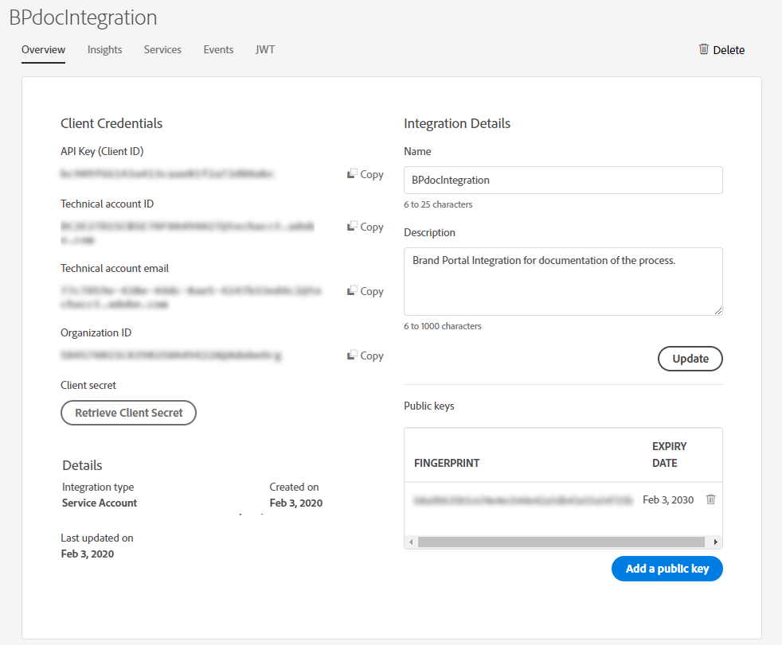

# 透過 Brand Portal 設定 Experience Manager Assets {#configure-aem-assets-with-brand-portal}

| 版本 | 文章連結 |
| -------- | ---------------------------- |
| AEM 6.5 | [按一下這裡](https://experienceleague.adobe.com/docs/experience-manager-65/assets/brandportal/configure-aem-assets-with-brand-portal.html?lang=zh-Hant) |
| AEM as a Cloud Service  | 本文 |

配置Adobe Experience Manager Assets Brand Portal允許您將批准的品牌資產從Adobe Experience Manager資產發佈為 [!DNL Cloud Service] 例如給Brand Portal，並分發給Brand Portal用戶。

## 使用雲管理器激活Brand Portal {#activate-brand-portal}

雲管理器用戶將Experience Manager Assets的Brand Portal激活為 [!DNL Cloud Service] 實例。 激活工作流在後端建立所需的配置(授權令牌、IMS配置和Brand Portal雲服務)，並反映雲管理器中Brand Portal租戶的狀態。 激活Brand Portal使Experience Manager Assets用戶能夠向Brand Portal發佈資產，並將資產分發給Brand Portal用戶。

**必備條件**

您需要以下程式將Experience Manager Assets上的Brand Portal激活為 [!DNL Cloud Service] 實例：

* 一個把Experience Manager Assets當成 [!DNL Cloud Service] 實例。
* 有權訪問Cloud Manager的用戶，該用戶已分配給Cloud Manager產品的配置檔案。 請參閱 [訪問雲管理器](https://experienceleague.adobe.com/docs/experience-manager-cloud-service/security/ims-support.html#accessing-cloud-manager) 的子菜單。

>[!NOTE]
>
>將配置的生產環境作為 [!DNL Cloud Service] 與Brand Portal租戶連接的實例。

**激活Brand Portal的步驟**

您可以在為Experience Manager Assets建立生產環境時激活Brand Portal, [!DNL Cloud Service] 實例或單獨。 讓我們假設環境已建立，現在需要您激活Brand Portal。

1. 登錄到Adobe雲管理器並導航到 **[!UICONTROL 環境]**。

   的 **[!UICONTROL 環境]** 頁顯示所有現有環境的清單。

1. 從清單中選擇環境（逐個）以查看環境詳細資訊。

   Brand Portal有權享有其中一個現有環境，並反映在 **[!UICONTROL 環境資訊]**。

   找到與Brand Portal關聯的環境後，按一下 **[!UICONTROL 激活Brand Portal]** 按鈕開始激活工作流。

   

1. 激活工作流在後端建立所需配置時，激活Brand Portal租戶只需幾分鐘。 激活Brand Portal租戶後，狀態將更改為「已激活」。

   

>[!NOTE]
>
>Brand Portal必須與Experience Manager Assets一樣，在同一個網際網路管理系統組織上啟動 [!DNL Cloud Service] 實例。
>
>如果您有現有的Brand Portal雲配置([使用Adobe Developer控制台手動配置](#manual-configuration))和您的Experience Manager Assets [!DNL Cloud Service] 實例為另一個IMS組織(org2-new)配置，從雲管理器激活Brand Portal會將Brand PortalIMS組織重置為 `org2-new`。 儘管手動配置的雲配置 `org1-existing` 將在Experience Manager Assets作者實例中可見，但在從雲管理器激活Brand Portal後將不再使用。
>
>如果現有的Brand Portal雲配置和Experience Manager Assets [!DNL Cloud Service] 實例使用的IMSorg(org1)相同，您只需從雲管理器激活Brand Portal。
>
>不要修改任何自動生成的設定。

**另請參閱**:

* [在Experience Manager Assetsas a Cloud Service添加用戶和角色](https://experienceleague.adobe.com/docs/experience-manager-cloud-manager/using/requirements/setting-up-users-and-roles.html)

* [在雲管理器中管理環境](https://experienceleague.adobe.com/docs/experience-manager-cloud-service/implementing/using-cloud-manager/manage-environments.html#adding-environments)

**登錄到您的Brand Portal租戶**:

在雲管理器中激活您的Brand Portal租戶後，您可以從Admin Console或直接使用租戶URL登錄到Brand Portal。

您的Brand Portal租戶的預設URL為： `https://<tenant-id>.brand-portal.adobe.com/`。

其中，租戶ID為IMS組織。

如果不確定Brand PortalURL，請執行以下步驟：

1. 登錄到 [Admin Console](https://adminconsole.adobe.com/) 導航 **[!UICONTROL 產品]**。
1. 從左面板中，選擇 **[!UICONTROL Adobe Experience Manager Brand Portal-Brand Portal]**。
1. 按一下 **[!UICONTROL 轉到Brand Portal]** 在瀏覽器中直接開啟Brand Portal。

   或從中複製Brand Portal租戶URL **[!UICONTROL 轉到Brand Portal]** 連結並貼上到瀏覽器中以開啟Brand Portal介面。

   

**Test連接**

執行以下步驟驗證您的Experience Manager Assets與 [!DNL Cloud Service] 實例和Brand Portal租戶：

1. 登錄Experience Manager Assets。

1. 從 **工具** 面板，導航至 **[!UICONTROL 部署]** > **[!UICONTROL 分佈]**。

   

   Brand Portal分銷代理(**[!UICONTROL bp分佈代理0]**) **[!UICONTROL 發佈到Brand Portal]**。

   

1. 按一下 **[!UICONTROL 發佈到Brand Portal]** 開啟分發代理。

   您可以在 **[!UICONTROL 狀態]** 頁籤。

   發佈代理程式包含兩個佇列：
   * **處理隊列**:把資產分給Brand Portal。

   * **錯誤隊列**:分配失敗的資產。
   >[!NOTE]
   >
   >建議查看故障並清除 **錯誤隊列** 定期。

   

1. 驗證Experience Manager Assets與 [!DNL Cloud Service] Brand Portal，點擊 **[!UICONTROL Test連接]** 表徵圖

   

   出現一條消息， *test包已成功交付*。

   >[!NOTE]
   >
   >請避免停用發佈代理程式，因為可能導致在佇列中執行的資產發佈失敗。

驗證您的Experience Manager Assets與 [!DNL Cloud Service] 實例和Brand Portal租戶，將資產從Experience Manager Assets發佈到Brand Portal。 如果連接成功，則發佈的資產在Brand Portal介面中可見。

您現在可以：

* [發佈從Experience Manager Assets到Brand Portal的資產](publish-to-brand-portal.md)
* [發佈從Experience Manager Assets到Brand Portal的資料夾](publish-to-brand-portal.md#publish-folders-to-brand-portal)
* [發佈從Experience Manager Assets到Brand Portal的收藏](publish-to-brand-portal.md#publish-collections-to-brand-portal)
* [發佈從Brand Portal到Experience Manager Assets的資產](https://experienceleague.adobe.com/docs/experience-manager-brand-portal/using/asset-sourcing-in-brand-portal/brand-portal-asset-sourcing.html) -Brand Portal資產來源補充
* [將預設集、結構和 Facet 發佈至 Brand Portal](https://experienceleague.adobe.com/docs/experience-manager-brand-portal/using/publish/publish-schema-search-facets-presets.html)
* [將標記發佈至 Brand Portal](https://experienceleague.adobe.com/docs/experience-manager-brand-portal/using/publish/brand-portal-publish-tags.html)

請參閱 [Brand Portal文檔](https://experienceleague.adobe.com/docs/experience-manager-brand-portal/using/home.html) 的子菜單。

**發佈記錄檔**

您可以監視資產發佈工作流的分發代理日誌。

現在，讓我們發佈一項從Experience Manager Assets到Brand Portal的資產，並查看日誌。

1. 按照中所示的步驟（從1到4）執行 **Test連接** 部分並導航至分發代理頁。
1. 按一下 **[!UICONTROL 日誌]** 查看處理日誌和錯誤日誌。

   

分發代理已生成以下日誌：

* 資訊：它是系統生成的日誌，在成功配置分發代理時觸發。
* DSTRQ1（請求1）:觸發test連接。

發佈資產時，會產生下列請求和回應記錄檔：

**發佈代理程式請求**：

* DSTRQ2 (請求 2)：觸發資產發佈請求。
* DSTRQ3（請求3）:系統觸發發佈Experience Manager Assets資料夾（其中存在資產）的另一請求，並複製Brand Portal的資料夾。

**發佈代理程式回應**：

* queue-bpdistributionagent0 (DSTRQ2)：資產已發佈至 Brand Portal。
* queue-bpdistributionagent0(DSTRQ3):系統複製Brand Portal的Experience Manager Assets資料夾（包含資產）。

在上例中，觸發附加請求和響應。 系統在Brand Portal找不到父資料夾（添加路徑），因為資產是首次發佈的，因此它觸發了在資產發佈地Brand Portal建立同名父資料夾的附加請求。

>[!NOTE]
>
>如果父資料夾在Brand Portal不存在或在Experience Manager Assets已修改，則會生成其他請求。

與自動化工作流一起，在Experience Manager Assets激活Brand Portal [!DNL Cloud Service]，存在另一種方法將Experience Manager Assets手動配置為 [!DNL Cloud Service] Brand Portal使用Adobe Developer控制台，不再推薦。

>[!NOTE]
>
>如果您在激活Brand Portal租戶時遇到任何問題，請與客戶支援聯繫。

## 使用Adobe Developer控制台進行手動配置 {#manual-configuration}

下節介紹如何將Experience Manager Assets手動配置為 [!DNL Cloud Service] Brand Portal使用Adobe Developer控制台。

之前，Experience Manager Assets [!DNL Cloud Service] 通過Adobe Developer控制台手動配置Brand Portal，該控制台為Brand Portal租戶獲取AdobeIdentity Management服務(IMS)帳戶令牌。 它需要在Experience Manager Assets和Adobe Developer控制台中進行配置。

1. 在Experience Manager Assets，建立IMS帳戶並生成公鑰（證書）。
1. 在Adobe Developer控制台中，為您的Brand Portal租戶（組織）建立項目。
1. 在項目下，使用公鑰配置API以建立服務帳戶連接。
1. 獲取服務帳戶憑據和JSON Web令牌(JWT)負載資訊。
1. 在Experience Manager Assets，使用服務帳戶憑據和JWT負載配置IMS帳戶。
1. 在Experience Manager Assets，使用IMS帳戶和Brand Portal端點（組織URL）配置Brand Portal雲服務。
1. Test配置，將資產從Experience Manager Assets發佈到Brand Portal。

>[!NOTE]
>
>Experience Manager Assets [!DNL Cloud Service] 實例只應配置一個Brand Portal租戶。

**必備條件**

您需要以下元件將Experience Manager Assets配置為Brand Portal:

* 一個把Experience Manager Assets當成 [!DNL Cloud Service] 實例
* Brand Portal租戶URL
* 對Brand Portal租戶的IMS組織具有系統管理員權限的用戶

## 建立設定 {#create-new-configuration}

按指定順序執行以下步驟，將Experience Manager Assets配置為Brand Portal。

1. [取得公開憑證](#public-certificate)
1. [建立服務帳戶(JWT)連接](#createnewintegration)
1. [配置IMS帳戶](#create-ims-account-configuration)
1. [設定雲端服務](#configure-the-cloud-service)

### 建立 IMS 設定 {#create-ims-configuration}

IMS配置將您的Experience Manager Assets驗證為 [!DNL Cloud Service] 與Brand Portal租客的關係。

IMS 設定包括兩個步驟：

* [取得公開憑證](#public-certificate)
* [配置IMS帳戶](#create-ims-account-configuration)

### 取得公開憑證 {#public-certificate}

公鑰（證書）在Adobe Developer控制台上驗證您的配置檔案。

1. 登錄Experience Manager Assets。
1. 從 **工具** 面板，導航至 **[!UICONTROL 安全]** > **[!UICONTROL Adobe IMS配置]**。
1. 在「Adobe IMS配置」頁中，按一下 **[!UICONTROL 建立]**。 它將重定向到 **[!UICONTROL Adobe IMS技術帳戶配置]** 的子菜單。 預設情況下， **證書** 的子菜單。
1. 選擇 **[!UICONTROL AdobeBrand Portal]** 的 **[!UICONTROL 雲解決方案]** 下拉清單。
1. 選擇 **[!UICONTROL 建立新證書]** 複選框並指定 **別名** 公鑰。 別名用作公鑰的名稱。
1. 按一下&#x200B;**[!UICONTROL 建立憑證]**。然後，按一下 **[!UICONTROL 確定]** 生成公鑰。

   

1. 按一下 **[!UICONTROL 下載公鑰]** 表徵圖並將公鑰(CRT)檔案保存在電腦上。

   稍後將使用公鑰為您的Brand Portal租戶配置API並在Adobe Developer控制台中生成服務帳戶憑據。

   

1. 按一下&#x200B;**[!UICONTROL 下一步]**。

   在 **帳戶** 頁籤，建立Adobe IMS帳戶，它需要在Adobe Developer控制台中生成的服務帳戶憑據。 暫時保持此頁面開啟。

   開啟新頁籤並 [在Adobe Developer控制台中建立服務帳戶(JWT)連接](#createnewintegration) 獲取用於配置IMS帳戶的憑據和JWT負載。

### 建立服務帳戶(JWT)連接 {#createnewintegration}

在Adobe Developer控制台中，項目和API在Brand Portal租戶（組織）級別配置。 配置API可建立服務帳戶(JWT)連接。 通過生成密鑰對（私鑰和公鑰）或上載公鑰來配置API有兩種方法。 要將Experience Manager Assets配置為Brand Portal，必須在Experience Manager Assets中生成公鑰（證書），並通過上載公鑰在Adobe Developer控制台中建立憑據。 配置Experience Manager Assets的IMS帳戶需要這些憑據。 一旦配置了IMS帳戶，您就可以在Experience Manager Assets配置Brand Portal雲服務。

執行以下步驟以生成服務帳戶憑據和JWT負載：

1. 使用IMS組織(Brand Portal租戶)的系統管理員權限登錄Adobe Developer控制台。 預設URL為 [https://www.adobe.com/go/devs_console_ui](https://www.adobe.com/go/devs_console_ui)。

   >[!NOTE]
   >
   >確保從右上角的下拉（組織）清單中選擇了正確的IMS組織(Brand Portal租戶)。

1. 按一下 **[!UICONTROL 建立新項目]**。 系統會為您的組織建立一個空項目，其名稱為系統生成。

   按一下 **[!UICONTROL 編輯項目]** 更新 **[!UICONTROL 項目標題]** 和 **[!UICONTROL 說明]**，然後按一下 **[!UICONTROL 保存]**。

1. 在 **[!UICONTROL 項目概述]** 按鈕 **[!UICONTROL 添加API]**。

1. 在 **[!UICONTROL 添加API窗口]**&#x200B;選中 **[!UICONTROL AEM Brand Portal]** 按一下 **[!UICONTROL 下一個]**。

   確保您有權訪問Experience ManagerBrand Portal服務。

1. 在 **[!UICONTROL 配置API]** 窗口，按一下 **[!UICONTROL 上載公鑰]**。 然後，按一下 **[!UICONTROL 選擇檔案]** 並上載您已在 [獲取公共證書](#public-certificate) 的子菜單。

   按一下&#x200B;**[!UICONTROL 下一步]**。

   

1. 驗證公鑰並按一下 **[!UICONTROL 下一個]**。

1. 選擇 **[!UICONTROL Assets Brand Portal]** 作為預設產品配置檔案，然後按一下 **[!UICONTROL 保存已配置的API]**。

   

1. 配置API後，您將重定向到「API概述」頁。 從左導航下 **[!UICONTROL 憑據]**，按一下 **[!UICONTROL 服務帳戶(JWT)]** 的雙曲餘切值。

   >[!NOTE]
   >
   >您可以查看憑據並執行諸如生成JWT令牌、複製憑據詳細資訊、檢索客戶端機密等操作。

1. 從 **[!UICONTROL 客戶端憑據]** 頁籤，複製 **[!UICONTROL 客戶端ID]**。

   按一下 **[!UICONTROL 檢索客戶端密鑰]** 複製 **[!UICONTROL 客戶端機密]**。

   

1. 導航到 **[!UICONTROL 生成JWT]** 頁籤並複製 **[!UICONTROL JWT負載]** 的下界。

現在，您可以使用客戶端ID（API密鑰）、客戶端密鑰和JWT負載 [配置IMS帳戶](#create-ims-account-configuration) 在Experience Manager Assets。

<!--
1. Click **[!UICONTROL Create Integration]**.

1. Select **[!UICONTROL Access an API]**, and click **[!UICONTROL Continue]**.

   

1. Create a new integration page opens. 
   
   Select your organization from the drop-down list.

   In **[!UICONTROL Experience Cloud]**, Select **[!UICONTROL AEM Brand Portal]** and click **[!UICONTROL Continue]**. 

   If the Brand Portal option is disabled for you, ensure that you have selected correct organization from the drop-down box above the **[!UICONTROL Adobe Services]** option. If you do not know your organization, contact your administrator.

   

1. Specify a name and description for the integration. Click **[!UICONTROL Select a File from your computer]** and upload the `AEM-Adobe-IMS.crt` file downloaded in the [obtain public certificates](#public-certificate) section.

1. Select the profile of your organization. 

   Or, select the default profile **[!UICONTROL Assets Brand Portal]** and click **[!UICONTROL Create Integration]**. The integration is created.

1. Click **[!UICONTROL Continue to integration details]** to view the integration information. 

   Copy the **[!UICONTROL API Key]** 
   
   Click **[!UICONTROL Retrieve Client Secret]** and copy the Client Secret key.

   

1. Navigate to **[!UICONTROL JWT]** tab, and copy the **[!UICONTROL JWT payload]**.

   The API Key, Client Secret key, and JWT payload information will be used to create IMS account configuration.

-->

### 配置IMS帳戶 {#create-ims-account-configuration}

請確認您已執行下列步驟：

* [取得公開憑證](#public-certificate)
* [建立服務帳戶(JWT)連接](#createnewintegration)

執行以下步驟來配置IMS帳戶。

1. 開啟IMS配置並導航到 **[!UICONTROL 帳戶]** 頁籤。 你一直開啟這頁 [獲取公共證書](#public-certificate)。

1. 指定 IMS 帳戶的&#x200B;**[!UICONTROL 標題]**。

   在 **[!UICONTROL 授權伺服器]** 欄位，指定URL: [https://ims-na1.adobelogin.com/](https://ims-na1.adobelogin.com/)

   在 **[!UICONTROL API密鑰]** 欄位， **[!UICONTROL 客戶端密碼]**, **[!UICONTROL 負載]** （JWT負載） [建立服務帳戶(JWT)連接](#createnewintegration)。

   按一下&#x200B;**[!UICONTROL 建立]**。

   已配置IMS帳戶。

   

1. 選擇IMS帳戶配置，然後按一下 **[!UICONTROL 檢查運行狀況]**。

   按一下 **[!UICONTROL 檢查]** 的子菜單。 成功配置時，將顯示一條消息， *已成功檢索令牌*。

   

>[!CAUTION]
>
>您必須只有一個IMS配置。
>
>確保IMS配置通過運行狀況檢查。 如果配置未通過運行狀況檢查，則該配置無效。 必須刪除它並建立新的有效配置。

### 設定雲端服務 {#configure-the-cloud-service}

執行以下步驟來配置Brand Portal雲服務：

1. 登錄Experience Manager Assets。

1. 從 **工具** 面板，導航至 **[!UICONTROL Cloud Services]** > **[!UICONTROL AEM Brand Portal]**。

1. 在「Brand Portal配置」頁中，按一下 **[!UICONTROL 建立]**。

1. 指定設定的&#x200B;**[!UICONTROL 標題]**。

   選擇在建立時建立的IMS配置 [配置IMS帳戶](#create-ims-account-configuration)。

   在 **[!UICONTROL 服務URL]** 欄位，指定您的Brand Portal租戶（組織）URL。

   

1. 按一下&#x200B;**[!UICONTROL 「儲存並關閉」]**。雲端設定此時已建立。

   你的Experience Manager Assets [!DNL Cloud Service] 實例現在已與Brand Portal租戶配置。

現在，您可以通過檢查分發代理並將資產發佈到Brand Portal來test配置。

**如果啟用了安全預覽，則允許列出SPS中的出口IP**
如果使用Dynamic Media-Scene7 [啟用安全預覽](#https://experienceleague.adobe.com/docs/dynamic-media-classic/using/upload-publish/testing-assets-making-them-public.html?lang=en) )，則建議Scene7公司管理員 [允許列出公用出口IP](#https://experienceleague.adobe.com/docs/dynamic-media-classic/using/upload-publish/testing-assets-making-them-public.html?lang=en#testing-the-secure-testing-service) 用於使用SPS(Scene7發佈系統)快閃記憶體UI的相應區域。
輸出IP如下：

| **區域** | **出口IP** |
|--- |--- |
| 不適用 | 130.248.160.68, 20.94.203.130 |
| 歐洲、中東和非洲 | 51.132.146.75, 130.248.244.202, 130.248.244.203, 130.248.244.204, 130.248.244.210, 130.248.244.211, 130.248.244.212 |
| APAC | 63.140.44.54 |

<!--
### Test configuration {#test-configuration}

Perform the following steps to validate the configuration:

1. Login to AEM Assets.

1. From the **Tools** panel, navigate to **[!UICONTROL Deployment]** > **[!UICONTROL Distribution]**.

    

   A Brand Portal distribution agent (**[!UICONTROL bpdistributionagent0]**) is created under **[!UICONTROL Publish to Brand Portal]**.

   

1. Click **[!UICONTROL Publish to Brand Portal]** to open the distribution agent. 

   You can see the distribution queues under the **[!UICONTROL Status]** tab. 
   
   A distribution agent contains two queues: 
   * **processing-queue**: for the distribution of assets to Brand Portal. 

   * **error-queue**: for the assets where distribution has failed. 
   
   >[!NOTE]
   >
   >It is recommended to review the failures and  clear the **error-queue** periodically.  

   

1. To verify the connection between AEM Assets as a [!DNL Cloud Service] and Brand Portal, click on the **[!UICONTROL Test Connection]** icon.

   

   A message appears that your *test package is successfully delivered*.

   >[!NOTE]
   >
   >Avoid disabling the distribution agent, as it can cause the distribution of the assets (running-in-queue) to fail.

You can now:

* [Publish assets from AEM Assets to Brand Portal](publish-to-brand-portal.md)
* [Publish folders from AEM Assets to Brand Portal](publish-to-brand-portal.md#publish-folders-to-brand-portal)
* [Publish collections from AEM Assets to Brand Portal](publish-to-brand-portal.md#publish-collections-to-brand-portal)
* [Publish assets from Brand Portal to AEM Assets](https://experienceleague.adobe.com/docs/experience-manager-brand-portal/using/asset-sourcing-in-brand-portal/brand-portal-asset-sourcing.html) - Asset Sourcing in Brand Portal
* [Publish presets, schemas, and facets to Brand Portal](https://experienceleague.adobe.com/docs/experience-manager-brand-portal/using/publish/publish-schema-search-facets-presets.html)
* [Publish tags to Brand Portal](https://experienceleague.adobe.com/docs/experience-manager-brand-portal/using/publish/brand-portal-publish-tags.html)

See [Brand Portal documentation](https://experienceleague.adobe.com/docs/experience-manager-brand-portal/using/home.html) for more information.

## Distribution logs {#distribution-logs}

You can monitor the distribution agent logs for the asset publishing workflow. 

For example, we have published an asset from AEM Assets to Brand Portal to validate the configuration. 

1. Follow the steps (from 1 to 4) as shown in the [Test Configuration](#test-configuration) section and navigate to the distribution agent page.
1. Click **[!UICONTROL Logs]** to view the processing and error logs.

   

The distribution agent has generated the following logs:

* INFO: This is a system-generated log that triggers on successful configuration of the distribution agent. 
* DSTRQ1 (Request 1): Triggers on test connection.

On publishing the asset, the following request and response logs are generated:

**Distribution agent request**:

* DSTRQ2 (Request 2): The asset publishing request is triggered.
* DSTRQ3 (Request 3): The system triggers another request to publish the AEM Assets folder (in which the asset exists) and replicates the folder in Brand Portal.

**Distribution agent response**:

* queue-bpdistributionagent0 (DSTRQ2): The asset is published to Brand Portal.
* queue-bpdistributionagent0 (DSTRQ3): The system replicates the AEM Assets folder (containing the asset) in Brand Portal.

In the above example, an additional request and response is triggered. The system could not find the parent folder (Add Path) in Brand Portal because the asset was published for the first time, therefore, it triggered an additional request to create a parent folder with the same name in Brand Portal where the asset is published.  

>[!NOTE]
>
>Additional request is generated in case the parent folder does not exist in Brand Portal or has been modified in AEM Assets. 
-->

<!--

## Additional information {#additional-information}

Go to `/system/console/slingmetrics` for statistics related to the distributed content:

1. **Counter metrics**
   * sling: `mac_sync_request_failure`
   * sling: `mac_sync_request_received`
   * sling: `mac_sync_request_success`

1. **Time metrics**
   * sling: `mac_sync_distribution_duration`
   * sling: `mac_sync_enqueue_package_duration`
   * sling: `mac_sync_setup_request_duration`

-->

<!--
   Comment Type: draft

   <li> </li>
   -->

<!--
   Comment Type: draft

   <li>Step text</li>
-->

**另請參閱**

* [翻譯資產](translate-assets.md)
* [Assets HTTP API](mac-api-assets.md)
* [資產支援的檔案格式](file-format-support.md)
* [搜尋資產](search-assets.md)
* [連接的資產](use-assets-across-connected-assets-instances.md)
* [資產報表](asset-reports.md)
* [中繼資料結構描述](metadata-schemas.md)
* [下載資產](download-assets-from-aem.md)
* [管理中繼資料](manage-metadata.md)
* [搜尋 Facet](search-facets.md)
* [管理收藏集](manage-collections.md)
* [大量中繼資料匯入](metadata-import-export.md)