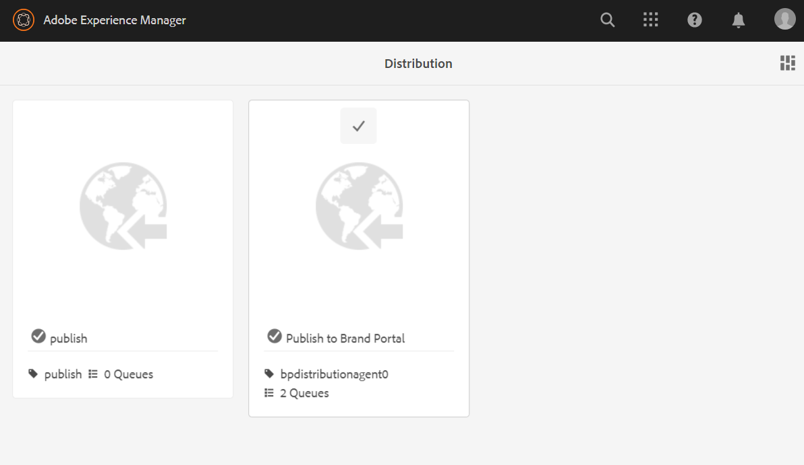

# 透過 Brand Portal 設定 Experience Manager Assets {#configure-aem-assets-with-brand-portal}

| 版本 | 文章連結 |
| -------- | ---------------------------- |
| AEM 6.5 | [按一下這裡](https://experienceleague.adobe.com/docs/experience-manager-65/assets/brandportal/configure-aem-assets-with-brand-portal.html?lang=zh-Hant) |
| AEM as a Cloud Service  | 本文章 |

設定Adobe Experience Manager Assets Brand Portal可讓您從Adobe Experience Manager Assets as a發佈核准的品牌資產 [!DNL Cloud Service] 執行個體傳送至Brand Portal，並分發給Brand Portal使用者。

## 使用Cloud Manager啟動Brand Portal {#activate-brand-portal}

Cloud Manager使用者為Experience Manager Assets as a啟用Brand Portal [!DNL Cloud Service] 執行個體。 啟動工作流程會在後端建立所需的設定(授權權杖、IMS設定和Brand Portal雲端服務)，並在Cloud Manager中反映Brand Portal租使用者的狀態。 啟用Brand Portal可讓Experience Manager Assets使用者將資產發佈至Brand Portal，並分發給Brand Portal使用者。

**必備條件**

您需要下列專案，才能在您的Experience Manager Assets as a上啟用Brand Portal [!DNL Cloud Service] 例項：

* 已開始運作的Experience Manager Assets as a [!DNL Cloud Service] 執行個體。
* 有權存取Cloud Manager的使用者，已指派給Cloud Manager產品的設定檔。 另請參閱 [存取Cloud Manager](https://experienceleague.adobe.com/docs/experience-manager-cloud-service/security/ims-support.html#accessing-cloud-manager) 以取得詳細資訊。

>[!NOTE]
>
>Experience Manager Assets as a需要已設定的生產環境 [!DNL Cloud Service] 執行個體以與Brand Portal租使用者連線。

**啟動Brand Portal的步驟**

在為您的Experience Manager Assets as a建立生產環境時，您可以啟用Brand Portal [!DNL Cloud Service] 執行個體，或單獨執行。 假設環境已建立，您現在必須啟用Brand Portal。

1. 登入AdobeCloud Manager並瀏覽至 **[!UICONTROL 環境]**.

   此 **[!UICONTROL 環境]** 頁面顯示所有現有環境的清單。

1. 從清單中選取環境（一個接一個）以檢視環境詳細資訊。

   Brand Portal有權使用其中一個可用環境，並反映在 **[!UICONTROL 環境資訊]**.

   找到與Brand Portal相關的環境後，按一下 **[!UICONTROL 啟動Brand Portal]** 按鈕以開始啟動工作流程。

   

1. 啟動Brand Portal租使用者需要幾分鐘的時間，因為啟動工作流程會在後端建立所需的設定。 Brand Portal租使用者啟動後，狀態會變更為「已啟用」。

   

>[!NOTE]
>
>Brand Portal必須在與Experience Manager Assets as a相同的IMS組織上啟動 [!DNL Cloud Service] 執行個體。
>
>如果您有現有的Brand Portal雲端設定([使用Adobe Developer Console手動設定](#manual-configuration))和Experience Manager Assets as a [!DNL Cloud Service] 已為另一個IMS組織(org2-new)設定執行個體，從Cloud Manager啟用Brand Portal會將Brand Portal IMS組織重設為 `org2-new`. 雖然手動設定的雲端設定在 `org1-existing` 會顯示在Experience Manager Assets編寫執行個體中，但在從Cloud Manager啟動Brand Portal後將不再使用。
>
>如果現有Brand Portal雲端設定和Experience Manager Assets as a [!DNL Cloud Service] 執行個體使用相同的IMS組織(org1)，您只需要從Cloud Manager啟動Brand Portal即可。
>
>請勿修改任何自動產生的設定。

**另請參閱**:

* [在Experience Manager Assetsas a Cloud Service中新增使用者和角色](https://experienceleague.adobe.com/docs/experience-manager-cloud-manager/using/requirements/setting-up-users-and-roles.html)

* [在Cloud Manager中管理環境](https://experienceleague.adobe.com/docs/experience-manager-cloud-service/implementing/using-cloud-manager/manage-environments.html#adding-environments)

**登入您的Brand Portal租使用者**：

在Cloud Manager中啟用Brand Portal租使用者後，您可以從Admin Console登入Brand Portal，或直接使用租使用者URL登入。

Brand Portal租使用者的預設URL為： `https://<tenant-id>.brand-portal.adobe.com/`.

其中，租使用者ID是IMS組織。

如果您不確定Brand Portal URL，請執行以下步驟：

1. 登入 [Admin Console](https://adminconsole.adobe.com/) 並導覽至 **[!UICONTROL 產品]**.
1. 從左側面板中選取 **[!UICONTROL ADOBE EXPERIENCE MANAGER BRAND PORTAL - BRAND PORTAL]**.
1. 按一下 **[!UICONTROL 前往Brand Portal]** 直接在瀏覽器中開啟Brand Portal。

   或是從複製Brand Portal租使用者URL **[!UICONTROL 前往Brand Portal]** 在瀏覽器中連結並貼上，以開啟Brand Portal介面。

   

**測試連線**

執行以下步驟，驗證Experience Manager Assets as a [!DNL Cloud Service] 例項和Brand Portal租使用者：

1. 登入Experience Manager Assets。

1. 從 **工具** 面板，導覽至 **[!UICONTROL 部署]** > **[!UICONTROL 分佈]**.

   

   Brand Portal發佈代理程式(**[!UICONTROL bpdistributionagent0]**)建立於 **[!UICONTROL 發佈至Brand Portal]**.

   

1. 按一下 **[!UICONTROL 發佈至Brand Portal]** 以開啟發佈代理程式。

   您可以在底下看到發佈佇列 **[!UICONTROL 狀態]** 標籤。

   發佈代理程式包含兩個佇列：
   * **processing-queue**：用於將資產發佈至Brand Portal。

   * **error-queue**：用於發佈失敗的資產。

   >[!NOTE]
   >
   >建議您檢閱失敗並清除 **error-queue** 定期進行。

   

1. 驗證Experience Manager Assets as a之間的連線 [!DNL Cloud Service] 和Brand Portal，按一下 **[!UICONTROL 測試連線]** 圖示。

   

   系統會顯示訊息，指出 *測試封裝已成功傳遞*.

   >[!NOTE]
   >
   >請避免停用發佈代理程式，因為可能導致在佇列中執行的資產發佈失敗。

驗證Experience Manager Assets as a之間的連線 [!DNL Cloud Service] 例項和Brand Portal租使用者，將資產從Experience Manager Assets發佈到Brand Portal。 如果連線成功，已發佈的資產會顯示在Brand Portal介面中。

您現在可以：

* [從Experience Manager Assets發佈資產到Brand Portal](publish-to-brand-portal.md)
* [從Experience Manager Assets發佈資料夾到Brand Portal](publish-to-brand-portal.md#publish-folders-to-brand-portal)
* [從Experience Manager Assets發佈集合到Brand Portal](publish-to-brand-portal.md#publish-collections-to-brand-portal)
* [從Brand Portal發佈資產到Experience Manager Assets](https://experienceleague.adobe.com/docs/experience-manager-brand-portal/using/asset-sourcing-in-brand-portal/brand-portal-asset-sourcing.html) - Brand Portal中的Asset Sourcing
* [將預設集、結構和 Facet 發佈至 Brand Portal](https://experienceleague.adobe.com/docs/experience-manager-brand-portal/using/publish/publish-schema-search-facets-presets.html)
* [將標記發佈至 Brand Portal](https://experienceleague.adobe.com/docs/experience-manager-brand-portal/using/publish/brand-portal-publish-tags.html)

另請參閱 [Brand Portal檔案](https://experienceleague.adobe.com/docs/experience-manager-brand-portal/using/home.html) 以取得詳細資訊。

**發佈記錄檔**

您可以監視資產發佈工作流程的分發代理程式記錄。

現在，讓我們從Experience Manager Assets發佈資產到Brand Portal並檢視記錄。

1. 請依照下列步驟（從1到4）操作： **測試連線** 區段，並導覽至發佈代理程式頁面。
1. 按一下 **[!UICONTROL 記錄檔]** 以檢視處理和錯誤記錄檔。

   

發佈代理程式已產生下列記錄：

* INFO：這是系統產生的記錄，會在成功設定發佈代理程式時觸發。
* DSTRQ1 （請求1）：測試連線上的觸發程式。

發佈資產時，會產生下列請求和回應記錄檔：

**發佈代理程式請求**：

* DSTRQ2 (請求 2)：觸發資產發佈請求。
* DSTRQ3 （請求3）：系統會觸發另一個請求，以發佈Experience Manager Assets資料夾（資產位於其中）並複製Brand Portal中的資料夾。

**發佈代理程式回應**：

* queue-bpdistributionagent0 (DSTRQ2)：資產已發佈至 Brand Portal。
* queue-bpdistributionagent0 (DSTRQ3)：系統會複製Brand Portal中的Experience Manager Assets資料夾（包含資產）。

在上述範例中，系統會觸發其他請求和回應。 由於資產是首次發佈，系統在Brand Portal中找不到父資料夾（新增路徑），因此觸發了額外的請求，要在Brand Portal中建立發佈資產的同名父資料夾。

>[!NOTE]
>
>如果父資料夾不存在於Brand Portal中或在Experience Manager Assets中經過修改，則會產生其他請求。

以及在Experience Manager Assets as a上啟動Brand Portal的自動化工作流程 [!DNL Cloud Service]，有其他方法可手動設定Experience Manager Assets as a [!DNL Cloud Service] 使用Adobe Developer Console的Brand Portal不再建議使用。

>[!NOTE]
>
>如果您在啟用Brand Portal租使用者時遇到任何問題，請聯絡客戶支援。

## 使用Adobe Developer Console手動設定 {#manual-configuration}

下節將說明如何手動設定Experience Manager Assets as a [!DNL Cloud Service] 使用Adobe Developer Console搭配Brand Portal使用。

舊版Experience Manager Assets as a [!DNL Cloud Service] 是透過Brand Portal主控台手動設定的，這可取得AdobeIdentity Management的Adobe Developer Services (IMS)帳戶Token以授權Brand Portal租使用者。 它需要在Experience Manager Assets和Adobe Developer Console中進行設定。

1. 在Experience Manager Assets中，建立IMS帳戶並產生公開金鑰（憑證）。
1. 在Adobe Developer主控台中，為您的Brand Portal租使用者（組織）建立專案。
1. 在專案下，使用公開金鑰設定API以建立服務帳戶連線。
1. 取得服務帳戶憑證和JSON Web權杖(JWT)裝載資訊。
1. 在Experience Manager Assets中，使用服務帳戶憑證和JWT裝載設定IMS帳戶。
1. 在Experience Manager Assets中，使用IMS帳戶和Brand Portal端點（組織URL）設定Brand Portal雲端服務。
1. 從Experience Manager Assets發佈資產到Brand Portal以測試設定。

>[!NOTE]
>
>An Experience Manager Assets as a [!DNL Cloud Service] 執行個體只能設定為一個Brand Portal租使用者。

**必備條件**

您需要下列專案才能使用Brand Portal設定Experience Manager Assets：

* 已開始運作的Experience Manager Assets as a [!DNL Cloud Service] 例項
* Brand Portal租使用者URL
* 在Brand Portal租使用者的IMS組織具有系統管理員許可權的使用者

## 建立設定 {#create-new-configuration}

以指定順序執行下列步驟，使用Brand Portal設定Experience Manager Assets。

1. [取得公開憑證](#public-certificate)
1. [建立服務帳戶(JWT)連線](#createnewintegration)
1. [設定IMS帳戶](#create-ims-account-configuration)
1. [設定雲端服務](#configure-the-cloud-service)

### 建立 IMS 設定 {#create-ims-configuration}

IMS設定會驗證您的Experience Manager Assets as a [!DNL Cloud Service] Brand Portal租使用者的例項。

IMS 設定包括兩個步驟：

* [取得公開憑證](#public-certificate)
* [設定IMS帳戶](#create-ims-account-configuration)

### 取得公開憑證 {#public-certificate}

公開金鑰（憑證）會在Adobe Developer Console上驗證您的設定檔。

1. 登入Experience Manager Assets。
1. 從 **工具** 面板，導覽至 **[!UICONTROL 安全性]** > **[!UICONTROL Adobe IMS設定]**.
1. 在Adobe IMS設定頁面中，按一下 **[!UICONTROL 建立]**. 它會重新導向至 **[!UICONTROL Adobe IMS技術帳戶設定]** 頁面。 根據預設， **憑證** 標籤開啟。
1. 選取 **[!UICONTROL AdobeBrand Portal]** 在 **[!UICONTROL 雲端解決方案]** 下拉式清單。
1. 選取 **[!UICONTROL 建立新憑證]** 核取方塊並指定 **別名** 以取得公開金鑰。 別名的作用是公開金鑰的名稱。
1. 按一下&#x200B;**[!UICONTROL 建立憑證]**。然後，按一下 **[!UICONTROL 確定]** 以產生公開金鑰。

   

1. 按一下 **[!UICONTROL 下載公開金鑰]** 圖示並將公開金鑰(CRT)檔案儲存在電腦上。

   公開金鑰稍後將用於設定Brand Portal租使用者的API，以及在Adobe Developer主控台中產生服務帳戶認證。

   

1. 按一下&#x200B;**[!UICONTROL 下一步]**。

   在 **帳戶** 索引標籤中的「 」建立後，Adobe IMS帳戶需要在Adobe Developer主控台中產生的服務帳戶認證。 暫時保持此頁面開啟。

   開啟新標籤並 [在Adobe Developer主控台中建立服務帳戶(JWT)連線](#createnewintegration) 以取得用於設定IMS帳戶的認證和JWT裝載。

### 建立服務帳戶(JWT)連線 {#createnewintegration}

在Adobe Developer主控台中，專案和API是在Brand Portal租使用者（組織）層級設定。 設定API會建立服務帳戶(JWT)連線。 有兩種方式可設定API：產生金鑰組（私密金鑰和公開金鑰）或上傳公開金鑰。 若要使用Brand Portal設定Experience Manager Assets，您必須在Experience Manager Assets中產生公開金鑰（憑證），並透過上傳公開金鑰在Adobe Developer Console中建立憑證。 在Experience Manager Assets中設定IMS帳戶需要這些認證。 設定IMS帳戶後，您可以在Experience Manager Assets中設定Brand Portal雲端服務。

執行以下步驟來產生服務帳戶憑證和JWT裝載：

1. 以IMS組織(Adobe Developer租使用者)的系統管理員許可權登入Brand Portal主控台。 預設URL為 [https://www.adobe.com/go/devs_console_ui](https://www.adobe.com/go/devs_console_ui).

   >[!NOTE]
   >
   >確保您已從右上角的下拉式清單（組織）中選取正確的IMS組織(Brand Portal租使用者)。

1. 按一下 **[!UICONTROL 建立新專案]**. 系統會為您的組織建立名稱由系統產生的空白專案。

   按一下 **[!UICONTROL 編輯專案]** 更新 **[!UICONTROL 專案標題]** 和 **[!UICONTROL 說明]**，然後按一下 **[!UICONTROL 儲存]**.

1. 在 **[!UICONTROL 專案概述]** 標籤，按一下 **[!UICONTROL 新增API]**.

1. 在 **[!UICONTROL 新增API視窗]**，選取 **[!UICONTROL AEM Brand Portal]** 並按一下 **[!UICONTROL 下一個]**.

   確保您有權存取Experience ManagerBrand Portal服務。

1. 在 **[!UICONTROL 設定API]** 視窗，按一下 **[!UICONTROL 上傳您的公開金鑰]**. 然後，按一下 **[!UICONTROL 選取檔案]** 並上傳您在中下載的公開金鑰（.crt檔案） [取得公開憑證](#public-certificate) 區段。

   按一下「**[!UICONTROL 下一步]**」。

   

1. 驗證公開金鑰並按一下 **[!UICONTROL 下一個]**.

1. 選取 **[!UICONTROL Assets Brand Portal]** 作為預設產品設定檔，然後按一下 **[!UICONTROL 儲存已設定的API]**.

   

1. 設定API後，您會重新導向至API概觀頁面。 從左側導覽列於 **[!UICONTROL 認證]**，按一下 **[!UICONTROL 服務帳戶(JWT)]** 選項。

   >[!NOTE]
   >
   >您可以檢視認證並執行產生JWT權杖、複製認證詳細資料、擷取使用者端密碼等動作。

1. 從 **[!UICONTROL 使用者端認證]** 標籤，複製 **[!UICONTROL 使用者端ID]**.

   按一下 **[!UICONTROL 擷取使用者端密碼]** 並複製 **[!UICONTROL 使用者端密碼]**.

   

1. 導覽至 **[!UICONTROL 產生JWT]** 標籤並複製 **[!UICONTROL JWT裝載]** 資訊。

您現在可以將使用者端ID （API金鑰）、使用者端密碼和JWT裝載使用至 [設定IMS帳戶](#create-ims-account-configuration) 在Experience Manager Assets中。

<!--
1. Click **[!UICONTROL Create Integration]**.

1. Select **[!UICONTROL Access an API]**, and click **[!UICONTROL Continue]**.

   

1. Create a new integration page opens. 
   
   Select your organization from the drop-down list.

   In **[!UICONTROL Experience Cloud]**, Select **[!UICONTROL AEM Brand Portal]** and click **[!UICONTROL Continue]**. 

   If the Brand Portal option is disabled for you, ensure that you have selected correct organization from the drop-down box above the **[!UICONTROL Adobe Services]** option. If you do not know your organization, contact your administrator.

   

1. Specify a name and description for the integration. Click **[!UICONTROL Select a File from your computer]** and upload the `AEM-Adobe-IMS.crt` file downloaded in the [obtain public certificates](#public-certificate) section.

1. Select the profile of your organization. 

   Or, select the default profile **[!UICONTROL Assets Brand Portal]** and click **[!UICONTROL Create Integration]**. The integration is created.

1. Click **[!UICONTROL Continue to integration details]** to view the integration information. 

   Copy the **[!UICONTROL API Key]** 
   
   Click **[!UICONTROL Retrieve Client Secret]** and copy the Client Secret key.

   

1. Navigate to **[!UICONTROL JWT]** tab, and copy the **[!UICONTROL JWT payload]**.

   The API Key, Client Secret key, and JWT payload information is used to create IMS account configuration.

-->

### 設定IMS帳戶 {#create-ims-account-configuration}

請確認您已執行下列步驟：

* [取得公開憑證](#public-certificate)
* [建立服務帳戶(JWT)連線](#createnewintegration)

執行以下步驟來設定IMS帳戶。

1. 開啟IMS設定並導覽至 **[!UICONTROL 帳戶]** 標籤。 您保持頁面開啟的時間 [取得公開憑證](#public-certificate).

1. 指定 IMS 帳戶的&#x200B;**[!UICONTROL 標題]**。

   在 **[!UICONTROL 授權伺服器]** 欄位，指定URL： [https://ims-na1.adobelogin.com/](https://ims-na1.adobelogin.com/)

   在中指定使用者端ID **[!UICONTROL API金鑰]** 欄位， **[!UICONTROL 使用者端密碼]**、和 **[!UICONTROL 裝載]** （JWT裝載）您已複製的時間 [建立服務帳戶(JWT)連線](#createnewintegration).

   按一下&#x200B;**[!UICONTROL 建立]**。

   已設定IMS帳戶。

   

1. 選取IMS帳戶設定並按一下 **[!UICONTROL 檢查健康狀態]**.

   按一下 **[!UICONTROL 檢查]** 在對話方塊中。 成功設定時，系統會顯示訊息，指出 *Token擷取成功*.

   

>[!CAUTION]
>
>您必須只有一個IMS設定。
>
>確保IMS設定通過健康狀態檢查。 如果設定未通過健康狀態檢查，則為無效。 您必須刪除它並建立新的有效組態。

### 設定雲端服務 {#configure-the-cloud-service}

執行以下步驟來設定Brand Portal雲端服務：

1. 登入Experience Manager Assets。

1. 從 **工具** 面板，導覽至 **[!UICONTROL Cloud Service]** > **[!UICONTROL AEM Brand Portal]**.

1. 在Brand Portal設定頁面中，按一下 **[!UICONTROL 建立]**.

1. 指定設定的&#x200B;**[!UICONTROL 標題]**。

   選取您建立的IMS設定，同時 [設定IMS帳戶](#create-ims-account-configuration).

   在 **[!UICONTROL 服務URL]** 欄位中，指定您的Brand Portal租使用者（組織） URL。

   

1. 按一下&#x200B;**[!UICONTROL 「儲存並關閉」]**。雲端設定此時已建立。

   您的Experience Manager Assets as a [!DNL Cloud Service] 執行個體現在已透過Brand Portal租使用者完成設定。

您現在可以檢查發佈代理程式，並將資產發佈到Brand Portal以測試設定。

**SPS中的允許清單輸出IP （如果已啟用安全預覽）**
如果搭配使用Dynamic Media-Scene7 [已啟用安全預覽](#https://experienceleague.adobe.com/docs/dynamic-media-classic/using/upload-publish/testing-assets-making-them-public.html?lang=en) 若為公司)，則建議Scene7公司管理員 [允許列出公開輸出IP](#https://experienceleague.adobe.com/docs/dynamic-media-classic/using/upload-publish/testing-assets-making-them-public.html?lang=en#testing-the-secure-testing-service) 適用於使用SPS (Scene7 Publishing System) Flash UI的個別地區。
輸出IP如下：

| **區域** | **輸出IP** |
|--- |--- |
| 不適用 | 130.248.160.68, 20.94.203.130 |
| EMEA | 51.132.146.75, 130.248.244.202, 130.248.244.203, 130.248.244.204, 130.248.244.210, 130.248.244.211, 130.248.244.212 |
| APAC | 63.140.44.54 |

<!--
### Test configuration {#test-configuration}

Perform the following steps to validate the configuration:

1. Login to AEM Assets.

1. From the **Tools** panel, navigate to **[!UICONTROL Deployment]** > **[!UICONTROL Distribution]**.

    

   A Brand Portal distribution agent (**[!UICONTROL bpdistributionagent0]**) is created under **[!UICONTROL Publish to Brand Portal]**.

   

1. Click **[!UICONTROL Publish to Brand Portal]** to open the distribution agent. 

   You can see the distribution queues under the **[!UICONTROL Status]** tab. 
   
   A distribution agent contains two queues: 
   * **processing-queue**: for the distribution of assets to Brand Portal. 

   * **error-queue**: for the assets where distribution has failed. 
   
   >[!NOTE]
   >
   >It is recommended to review the failures and  clear the **error-queue** periodically.  

   

1. To verify the connection between AEM Assets as a [!DNL Cloud Service] and Brand Portal, click the **[!UICONTROL Test Connection]** icon.

   

   A message appears that your *test package is successfully delivered*.

   >[!NOTE]
   >
   >Avoid disabling the distribution agent, as it can cause the distribution of the assets (running-in-queue) to fail.

You can now:

* [Publish assets from AEM Assets to Brand Portal](publish-to-brand-portal.md)
* [Publish folders from AEM Assets to Brand Portal](publish-to-brand-portal.md#publish-folders-to-brand-portal)
* [Publish collections from AEM Assets to Brand Portal](publish-to-brand-portal.md#publish-collections-to-brand-portal)
* [Publish assets from Brand Portal to AEM Assets](https://experienceleague.adobe.com/docs/experience-manager-brand-portal/using/asset-sourcing-in-brand-portal/brand-portal-asset-sourcing.html) - Asset Sourcing in Brand Portal
* [Publish presets, schemas, and facets to Brand Portal](https://experienceleague.adobe.com/docs/experience-manager-brand-portal/using/publish/publish-schema-search-facets-presets.html)
* [Publish tags to Brand Portal](https://experienceleague.adobe.com/docs/experience-manager-brand-portal/using/publish/brand-portal-publish-tags.html)

See [Brand Portal documentation](https://experienceleague.adobe.com/docs/experience-manager-brand-portal/using/home.html) for more information.

## Distribution logs {#distribution-logs}

You can monitor the distribution agent logs for the asset publishing workflow. 

For example, we have published an asset from AEM Assets to Brand Portal to validate the configuration. 

1. Follow the steps (from 1 to 4) as shown in the [Test Configuration](#test-configuration) section and navigate to the distribution agent page.
1. Click **[!UICONTROL Logs]** to view the processing and error logs.

   

The distribution agent has generated the following logs:

* INFO: This is a system-generated log that triggers on successful configuration of the distribution agent. 
* DSTRQ1 (Request 1): Triggers on test connection.

On publishing the asset, the following request and response logs are generated:

**Distribution agent request**:

* DSTRQ2 (Request 2): The asset publishing request is triggered.
* DSTRQ3 (Request 3): The system triggers another request to publish the AEM Assets folder (in which the asset exists) and replicates the folder in Brand Portal.

**Distribution agent response**:

* queue-bpdistributionagent0 (DSTRQ2): The asset is published to Brand Portal.
* queue-bpdistributionagent0 (DSTRQ3): The system replicates the AEM Assets folder (containing the asset) in Brand Portal.

In the above example, an additional request and response is triggered. The system could not find the parent folder (Add Path) in Brand Portal because the asset was published for the first time, therefore, it triggered an additional request to create a parent folder with the same name in Brand Portal where the asset is published.  

>[!NOTE]
>
>Additional request is generated in case the parent folder does not exist in Brand Portal or has been modified in AEM Assets. 
-->

<!--

## Additional information {#additional-information}

Go to `/system/console/slingmetrics` for statistics related to the distributed content:

1. **Counter metrics**
   * sling: `mac_sync_request_failure`
   * sling: `mac_sync_request_received`
   * sling: `mac_sync_request_success`

1. **Time metrics**
   * sling: `mac_sync_distribution_duration`
   * sling: `mac_sync_enqueue_package_duration`
   * sling: `mac_sync_setup_request_duration`

-->

<!--
   Comment Type: draft

   <li> </li>
   -->

<!--
   Comment Type: draft

   <li>Step text</li>
-->

**另請參閱**

* [翻譯資產](translate-assets.md)
* [Assets HTTP API](mac-api-assets.md)
* [資產支援的檔案格式](file-format-support.md)
* [搜尋資產](search-assets.md)
* [連接的資產](use-assets-across-connected-assets-instances.md)
* [資產報表](asset-reports.md)
* [中繼資料結構描述](metadata-schemas.md)
* [下載資產](download-assets-from-aem.md)
* [管理中繼資料](manage-metadata.md)
* [搜尋 Facet](search-facets.md)
* [管理收藏集](manage-collections.md)
* [大量中繼資料匯入](metadata-import-export.md)
