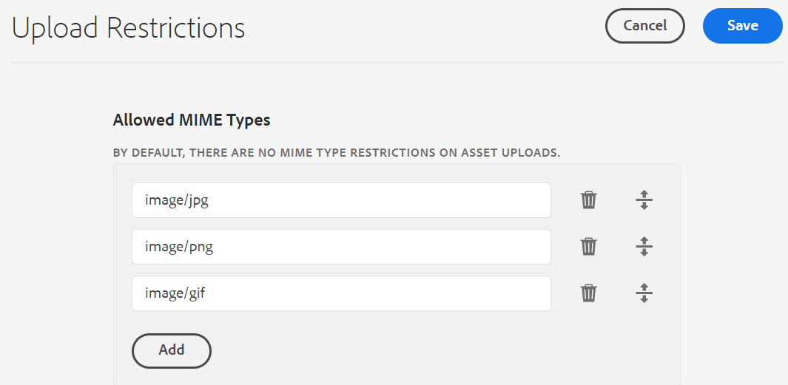

# 設定資產上傳限制 {#configure-asset-upload-restrictions}

您可以設定Adobe Experience Manager Assets，以根據MIME類型限制使用者可上傳的資產類型。

>[!IMPORTANT]
>
>依預設，Experience Manager Assets可讓使用者上傳所有MIME類型的資產。 不過，您可以配置設定，限制使用者僅上傳特定MIME類型的檔案。

## 必備條件 {#prerequisites-asset-upload-restrictions}

您必須擁有管理員權限才能設定資產上傳限制。

## 對資產上傳套用限制 {#apply-restrictions-asset-uploadsssssss}

配置 [!DNL Experience Manager] 要限制用戶上載特定MIME類型的檔案，請執行以下操作：

1. 導覽至 **[!UICONTROL 工具>資產>資產設定]**.

1. 按一下 **[!UICONTROL 上傳限制]**.

1. 按一下 **[!UICONTROL 新增]** 定義允許的MIME類型。

1. 在文本框中指定MIME類型。 您可以按一下 **[!UICONTROL 新增]** 再次指定更多允許的MIME類型。 您也可以按一下  從清單中刪除任何MIME類型。

1. 按一下「**[!UICONTROL 儲存]**」。

**範例1:允許將所有影像和PDF檔案上傳至Experience Manager Assets**

若要允許將所有格式的影像和PDF檔案上傳至Experience Manager Assets，請執行下列設定：

`image/*` 因為MIME類型允許以所有格式上傳影像。 `application/pdf` 因為MIME類型允許將PDF檔案上傳至Experience Manager Assets。

**範例2:允許將特定影像格式上傳至Experience Manager Assets**

若要將特定影像格式新增至允許的MIME類型，並限制上傳所有其他資產格式，請執行下列設定：

根據影像中所示的設定，您可以將。JPG、.PNG和。GIF格式的影像上傳至Experience Manager Assets。
