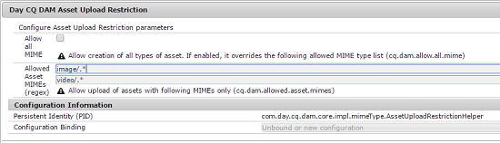

# 設定資產上傳限制 {#configuring-asset-upload-restrictions}

您可以設定Adobe Experience Manager(AEM)Assets，以限制使用者可上傳的資產（檔案）類型。 此功能可協助您避免使用者以不想要的格式上傳資產或上傳任何惡意檔案。 此服 `Day CQ DAM Asset Upload Restriction` 務可讓您控制使用者可上傳的檔案類型。 依預設，AEM Assets可讓使用者上傳所有MIME類型的資產。 不過，您可以設定服務，限制使用者僅上傳特定MIME類型的檔案。

1. 開啟Configuration Manager web控制台。 存取 `https://[aem_server]:[port]/system/console/configMgr`.
1. 在編輯模 **[!UICONTROL 式中開啟「日CQ DAM資產上傳限制]** 」服務。 依預設，會選 **取「允許所有MIME** 」選項，可讓使用者上傳所有MIME類型的檔案。

   

1. 若要限制使用者僅上傳某些MIME類型的檔案，請取消選取 **[!UICONTROL llow all MIME]** (llow all MIME **[!UICONTROL )選項，並使用規則運算式在「允許的資產MIME(regex)]** 」欄位中指定允許的MIME類型。

   

1. 按一下／點選「 **[!UICONTROL 儲存]** 」以儲存變更。 如果您為允許的MIME類型指定MIME字串，則對於任何MIME類型不符合這些欄位中已設定之MIME字串的資產，上傳作業會失敗。

