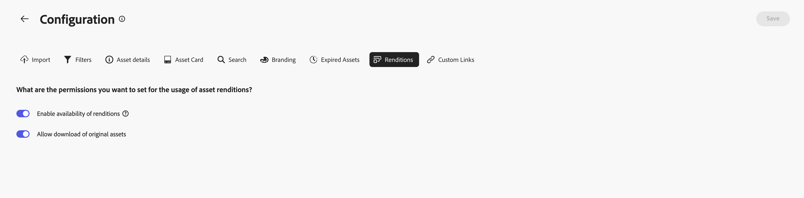

# 設定 Content Hub 使用者介面 {#configure-content-hub-user-interface}

<table>
    <tr>
        <td>
            <i>新</i> <a href="/help/assets/dynamic-media/dm-prime-ultimate.md"><b>Dynamic Media Prime和Ultimate</b></a>
        </td>
        <td>
            <i>新</i> <a href="/help/assets/assets-ultimate-overview.md"><b>AEM Assets Ultimate</b></a>
        </td>
        <td>
            <i>新</i> <a href="/help/assets/integrate-aem-assets-edge-delivery-services.md"><b>AEM Assets與Edge Delivery Services整合</b></a>
        </td>
        <td>
            <i>新</i> <a href="/help/assets/aem-assets-view-ui-extensibility.md"><b>UI擴充性</b></a>
        </td>
          <td>
            <i>新</i> <a href="/help/assets/dynamic-media/enable-dynamic-media-prime-and-ultimate.md"><b>啟用Dynamic Media Prime和Ultimate</b></a>
        </td>
    </tr>
    <tr>
        <td>
            <a href="/help/assets/search-best-practices.md"><b>搜尋最佳實務</b></a>
        </td>
        <td>
            <a href="/help/assets/metadata-best-practices.md"><b>中繼資料最佳實務</b></a>
        </td>
        <td>
            <a href="/help/assets/product-overview.md"><b>Content Hub</b></a>
        </td>
        <td>
            <a href="/help/assets/dynamic-media-open-apis-overview.md"><b>具有 OpenAPI 功能的 Dynamic Media</b></a>
        </td>
        <td>
            <a href="https://developer.adobe.com/experience-cloud/experience-manager-apis/"><b>AEM Assets 開發人員文件</b></a>
        </td>
    </tr>
</table>

>[!CONTEXTUALHELP]
>id="configure_content_hub"
>title="設定 Content Hub 使用者介面"
>abstract="Experience Manager Assets 可讓管理員設定 Content Hub 使用者介面上的可用選項。根據管理員選取的設定選項，Content Hub 使用者可以查看 Content Hub 上的欄位。設定選項包括匯入資產時的中繼資料、篩選器、資產屬性、搜尋資產時的中繼資料、個人化品牌和任何自訂連結。"
>additional-url="https://images-tv.adobe.com/mpcv3/4477/74a81d1c-0cfe-41f4-8a06-18ff70604e45_1732023385.854x480at800_h264.mp4" text="觀看影片"

<!--  -->

>[!AVAILABILITY]
>
>現已提供 PDF 格式的 Content Hub 指南。下載完整指南，並使用 Adobe Acrobat AI 助理來回答您的查詢問題。
>
>[!BADGE Content Hub 指南 PDF]{type=Informative url="https://helpx.adobe.com/tw/content/dam/help/en/experience-manager/aem-assets/content-hub.pdf"}

Experience Manager Assets 可讓管理員設定 Content Hub 使用者介面上的可用選項。根據管理員選取的設定選項，Content Hub 使用者可以查看 Content Hub 上的欄位。組態選項包括：

* 使用者在搜尋資產時可使用的篩選器。

* 每個資產的可用資產詳細資訊或屬性。

* 將資產新增至Content Hub時，使用者可用的中繼資料欄位。

* 可在Content Hub上搜尋的資產中繼資料欄位。

* 您需要為組織顯示的品牌化內容。

* 除了資產、集合和深入分析之外，您還需要在Content Hub中加入的任何自訂連結。

## 先決條件 {#prerequisites-configuration-ui}

[Content Hub管理員](/help/assets/deploy-content-hub.md#step-3-onboard-content-hub-administrator)可以為您組織內的其他使用者設定組態選項。

## 存取Content Hub上的設定選項 {#access-configuration-options-content-hub}

若要存取Content Hub上的設定選項：

1. 按一下右窗格中的使用者圖示。

1. 在&#x200B;**[!UICONTROL 產品設定]**&#x200B;區段中，選取&#x200B;**[!UICONTROL 組態]**。

   在Content Hub上

## 在Content Hub上管理設定選項 {#manage-configuration-options}

以管理員身分，管理使用者的下列組態選項：

* [匯入](#configure-import-options-content-hub)

* [篩選條件](#configure-filters-content-hub)

* [資產詳細資料](#configure-asset-details-content-hub)
* [資產卡](#asset-card)

* [搜尋](#configure-metadata-search-content-hub)

* [品牌元素](#configure-branding-content-hub)

* [已到期的資產](#expired-assets-content-hub)

* [轉譯](#renditions-content-hub)

* [自訂連結](#configure-custom-links-content-hub)

### 匯入 {#configure-import-options-content-hub}

您可以將資產上傳或匯入至Content Hub入口網站時（例如行銷活動名稱、關鍵字、管道、時間範圍、地區等），設定顯示給使用者的中繼資料欄位。 若要如此做，請執行以下步驟：

1. 在[組態](#access-configuration-options-content-hub)使用者介面上，按一下&#x200B;**[!UICONTROL 匯入]**。

1. 按一下&#x200B;**[!UICONTROL 新增中繼資料]**。

1. 指定屬性的標籤，使用&#x200B;**[!UICONTROL 中繼資料]**&#x200B;欄位將其對應到屬性，然後選取新資產中繼資料的輸入型別。

1. 按一下&#x200B;**[!UICONTROL 必要欄位]**&#x200B;切換按鈕，讓上傳新資產時，必須讓使用者指定新的中繼資料欄位。

1. 按一下&#x200B;**[!UICONTROL 確認]**。 新的中繼資料會顯示在現有資產屬性清單中。

1. 按一下[儲存]以套用變更。**&#x200B;**

同樣地，您可以按一下每個可用屬性旁的，以編輯標籤，在使用&#x200B;**[!UICONTROL 必要欄位]**&#x200B;切換上傳資產時，讓這些欄位成為使用者強制或非強制的欄位，或按一下「刪除」圖示以刪除任何中繼資料屬性。

如果您需要自動核准新增至Experience Manager Assets存放庫的所有資產，以便這些資產能立即在Content Hub中使用，請按一下&#x200B;**[!UICONTROL 自動核准]**&#x200B;切換按鈕。 否則，DAM作者或管理員需要手動核准資產，才能在Content Hub上使用。 切換預設會設定為「關閉」狀態。

完成所有修改以套用變更後，按一下&#x200B;**[!UICONTROL 儲存]**。

在Content Hub上

在設定使用者介面上啟用的中繼資料會顯示在資產上傳頁面上：

在Content Hub上

### 篩選條件 {#configure-filters-content-hub}

Content Hub可讓管理員設定在搜尋資產時顯示的篩選器。 執行以下步驟以新增篩選器：

1. 在[組態](#access-configuration-options-content-hub)使用者介面上，按一下&#x200B;**[!UICONTROL 篩選器]**。

1. 按一下&#x200B;**[!UICONTROL 新增篩選器]**。

1. 指定篩選的標籤，使用&#x200B;**[!UICONTROL 中繼資料]**&#x200B;欄位將其對應到屬性，然後選取新篩選的輸入型別。
1. 按一下&#x200B;**[!UICONTROL 確認]**。 新篩選器會顯示在現有篩選器的清單中。

1. 按一下&#x200B;**[!UICONTROL 儲存]**&#x200B;以套用變更，以便在篩選資產時新篩選器顯示在搜尋頁面上。

   >[!NOTE]
   >
   >只有在存放庫中有另一個資產符合篩選條件時，新篩選器才會顯示在「搜尋」頁面上。

同樣地，您可以按一下每個可用篩選器旁的來編輯標籤，或按一下刪除圖示來刪除任何現有的篩選器。 完成所有修改以套用變更後，按一下&#x200B;**[!UICONTROL 儲存]**。

在Content Hub上設定使用者介面篩選器

在「組態使用者介面」上啟用的篩選器會顯示在「搜尋」頁面上：

在Content Hub上

### 資產詳細資料 {#configure-asset-details-content-hub}

您也可以設定為每個資產顯示的資產屬性，例如檔案名稱、標題、格式、大小等。 若要如此做，請執行以下步驟：

1. 在[組態](#access-configuration-options-content-hub)使用者介面上，按一下&#x200B;**[!UICONTROL 資產詳細資料]**。

1. 按一下&#x200B;**[!UICONTROL 新增中繼資料]**。

1. 指定屬性的標籤，使用&#x200B;**[!UICONTROL 中繼資料]**&#x200B;欄位將其對應到屬性，然後選取新資產中繼資料的輸入型別。
1. 按一下&#x200B;**[!UICONTROL 確認]**。 新的中繼資料會顯示在現有資產屬性清單中。

1. 按一下[儲存]&#x200B;**[!UICONTROL 以套用變更，讓新屬性顯示在資產詳細資訊頁面上。]**

同樣地，您可以按一下每個可用屬性旁的來編輯標籤，或按一下刪除圖示來刪除任何現有的資產詳細資訊。 完成所有修改以套用變更後，按一下&#x200B;**[!UICONTROL 儲存]**。

在Content Hub上

「組態使用者介面」上啟用的特性會顯示在「資產詳細資訊」頁面上：

在Content Hub上

### 資產卡 {#asset-card}

您也可以設定需要顯示在&#x200B;**資產卡**&#x200B;上的關鍵中繼資料欄位，最多可顯示6個欄位。 若要如此做，請執行以下步驟：

1. 在[組態](#access-configuration-options-content-hub)使用者介面上，按一下&#x200B;**資產卡**。
2. 按一下&#x200B;**新增中繼資料**。 **新增資產卡中繼資料**&#x200B;對話方塊隨即顯示。
3. 在&#x200B;**標籤**&#x200B;欄位中指定中繼資料名稱，並在&#x200B;**中繼資料**&#x200B;欄位中選取中繼資料屬性。
4. 按一下&#x200B;**確認**，然後按一下&#x200B;**儲存**&#x200B;以套用變更，讓新屬性顯示在資產詳細資訊頁面上。
   

同樣地，按一下每個可用屬性旁邊可用的，以進行任何必要的修改，或按一下，刪除任何現有的中繼資料屬性。 完成所有修改以套用變更後，按一下&#x200B;**儲存**。

### 搜尋 {#configure-metadata-search-content-hub}

管理員可定義當使用者在Content Hub上指定搜尋條件時所搜尋的中繼資料欄位。 執行以下步驟：

1. 在[組態](#access-configuration-options-content-hub)使用者介面上，按一下&#x200B;**[!UICONTROL 新增中繼資料]**。

1. 指定中繼資料欄位並按一下&#x200B;**[!UICONTROL 確認]**。

1. 按一下[儲存]&#x200B;**[!UICONTROL 以套用變更，讓新的中繼資料屬性顯示在中繼資料欄位清單中。]**

同樣地，您可以按一下每個可用中繼資料屬性旁的來編輯屬性，或按一下刪除圖示來刪除任何現有的屬性。 完成所有修改以套用變更後，按一下&#x200B;**[!UICONTROL 儲存]**。

在Content Hub上

### 品牌元素 {#configure-branding-content-hub}

管理員也可以根據您的品牌需求，個人化Content Hub入口網站橫幅上的標題和內文。 若要如此做，請執行以下步驟：

1. 在[組態](#access-configuration-options-content-hub)使用者介面上，按一下&#x200B;**[!UICONTROL 品牌]**。

1. 指定橫幅&#x200B;**的**&#x200B;[!UICONTROL &#x200B;標題文字和橫幅&#x200B;]&#x200B;**欄位的**&#x200B;正文文字。

1. 按一下[儲存]以套用變更。**&#x200B;**

在Content Hub上建立

在「設定」使用者介面中啟用的品牌更新會顯示在Content Hub入口網站的橫幅上：

在Content Hub上建立

### 過期資產{#expired-assets-content-hub}

管理員可控制是否需要在Content Hub上顯示過期的資產。 如果要在上面顯示過期資產，這些資產還可以定義使用者是否可以下載資產。

Content Hub預設不會顯示過期的資產。

若要如此做，請執行以下步驟：

1. 在[組態](#access-configuration-options-content-hub)使用者介面上，按一下&#x200B;**[!UICONTROL 過期的Assets]**。

1. 在&#x200B;**[!UICONTROL 可見]**&#x200B;區段中，啟用&#x200B;**[!UICONTROL 允許使用者檢視過期的資產]**&#x200B;切換按鈕，讓所有過期的資產在Content Hub上可見。

1. 啟用資產可見性後，您可以使用&#x200B;**[!UICONTROL 允許使用者下載過期的資產]**&#x200B;切換來啟用或停用下載過期的資產的功能。

1. 按一下[儲存]以套用變更。**&#x200B;**

   

啟用資產的可見度後，您可以在Content Hub上檢視過期的資產，如下圖所示：

如果管理員已啟用下載，Content Hub使用者也可以下載，如影像中反白顯示的內容。

如果已啟用過期資產的可見度，Content Hub也會使用資產卡上的`Expiring in n days`訊息，強調在未來15天內過期的資產。

### 轉譯 {#renditions-content-hub}

轉譯是數位資產（例如影像、檔案等）的自訂版本，專為不同裝置和平台而設計，可確保最佳效能。 檢視更多有關Adobe Experience Manager Assets[&#128279;](https://experienceleague.adobe.com/zh-hant/docs/experience-manager-cloud-service/content/assets/assets-view/renditions)中轉譯的資訊。

若要如此做，請執行以下步驟：

在[組態](#access-configuration-options-content-hub)使用者介面上，按一下&#x200B;**[!UICONTROL 轉譯]**。 下列選項可供使用：

* 啟用[!UICONTROL 啟用轉譯可用性]切換按鈕，讓所有轉譯都顯示在Content Hub上。

* 啟用或停用&#x200B;**[!UICONTROL 允許使用者下載原始資產]**&#x200B;切換功能，以控制下載原始資產的可用性。

  

如需如何在Content Hub中檢視及下載轉譯的詳細資訊，請參閱[在Content Hub中下載資產](/help/assets/download-assets-content-hub.md)。

### 自訂連結 {#configure-custom-links-content-hub}

除了橫幅正下方的Content Hub入口網站上的標準&#x200B;**[!UICONTROL 所有Assets]**、**[!UICONTROL 集合]**&#x200B;和&#x200B;**[!UICONTROL 深入分析]**&#x200B;標籤之外，您還可以新增自訂標籤。 若要如此做，請執行以下步驟：

1. 在[組態](#access-configuration-options-content-hub)使用者介面上，按一下&#x200B;**[!UICONTROL 自訂連結]**。

1. 按一下&#x200B;**[!UICONTROL 新增連結]**。

1. 在&#x200B;**[!UICONTROL 標籤]**&#x200B;和&#x200B;**[!UICONTROL URL]**&#x200B;欄位中指定文字。 您定義的標籤會顯示為標籤，當您按一下標籤時，您會導覽至&#x200B;**[!UICONTROL URL]**&#x200B;欄位中定義的URL。

1. 按一下&#x200B;**[!UICONTROL 確認]**。

1. 按一下[儲存]以套用變更。**&#x200B;**

同樣地，您可以按一下每個URL旁邊的來編輯連結，或按一下刪除圖示來刪除任何現有的URL。 完成所有修改以套用變更後，按一下&#x200B;**[!UICONTROL 儲存]**。

在Content Hub上

自訂連結在Content Hub首頁的「深入分析」標籤旁邊會顯示為新標籤。

