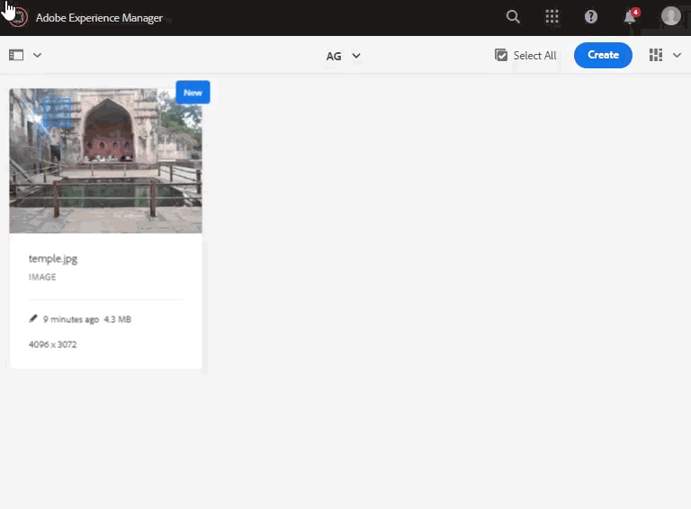

# 生成僅用於放置的Adobe InDesign格式副本 {#fpo-renditions}

當將大規模資產從Experience Manager放入Adobe InDesign文檔時，創意專業人士必須等待一段相當長的時間 [放置資產](https://helpx.adobe.com/indesign/using/placing-graphics.html)。 同時，阻止用戶使用InDesign。 這會中斷創意流，並對用戶體驗造成負面影響。 Adobe允許臨時將小型格式副本放在InDesign文檔中以開始。 當需要最終輸出時，原始的全解析度資產將替換後台的臨時格式副本。 背景中的非同步更新加快了設計過程以提高生產效率，並且不會妨礙創造過程。

資產提供僅用於放置(FPO)的格式副本。 這些FPO格式副本的檔案大小較小，但長寬比相同。 如果FPO格式副本不可用於資產，Adobe InDesign將改用原始資產。 此回退機制確保創作工作流不中斷即可繼續。

Experience Manageras a Cloud Service提供雲本地資產處理功能以生成FPO格式副本。 使用資產微服務生成格式副本。 您可以配置新上載的資產和Experience Manager中存在的資產的格式副本生成。

以下是生成FPO格式副本的步驟：

1. [建立處理配置檔案](#create-processing-profile)。

1. 配置Experience Manager以使用此配置檔案 [處理新資產](#generate-renditions-of-new-assets)。
1. 使用配置檔案 [處理現有資產](#generate-renditions-of-existing-assets)。

## 建立處理配置檔案 {#create-processing-profile}

要生成FPO格式副本，請建立 **[!UICONTROL 處理配置檔案]**。 配置檔案使用雲本地資產微服務進行處理。 有關說明，請參見 [建立資產微服務的處理配置檔案](asset-microservices-configure-and-use.md)。

選擇 **[!UICONTROL 建立FPO格式副本]** 生成FPO格式副本。 （可選）按一下 **[!UICONTROL 添加新]** 將其他格式副本設定添加到同一配置檔案。

## 生成新資產的格式副本 {#generate-renditions-of-new-assets}

要生成新資產的FPO格式副本，請應用 **[!UICONTROL 處理配置檔案]** 資料夾屬性中的資料夾。 在資料夾的「屬性」頁中，按一下 **[!UICONTROL 資產處理]** 頁籤 **[!UICONTROL FPO配置檔案]** 作為 **[!UICONTROL 處理配置檔案]**，並保存更改。 所有上載到資料夾的新資產都使用此配置檔案進行處理。

## 生成現有資產的格式副本 {#generate-renditions-of-existing-assets}

要生成格式副本，請選擇資產並執行以下步驟。

## 查看FPO格式副本 {#view-fpo-renditions}

在工作流完成後，您可以檢查生成的FPO格式副本。 在Experience Manager Assets用戶介面中，按一下資產以開啟大型預覽。 開啟左滑軌並選擇 **[!UICONTROL 格式副本]**。 或者，使用鍵盤快捷鍵 `Alt + 3` 的子菜單。

按一下 **[!UICONTROL FPO格式副本]** 載入其預覽。 或者，可以按一下右鍵格式副本並將其保存到檔案系統。 檢查左滑軌中的可用格式副本。

