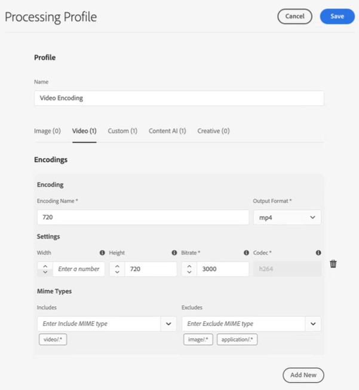

# 在 [!DNL Experience Manager Assets] {#configure-transcription-service}

轉錄是使用語音識別技術將音頻從音頻或視頻檔案翻譯成文本（語音到文本）的過程。
[!DNL Adobe Experience Manager Assets] 已配置 [!DNL Azure Media Services] 它以WebVTT(.vtt)格式在支援的音頻或視頻檔案中自動生成口語的文本記錄。 在中處理音頻或視頻資產時 [!DNL Experience Manager Assets]，轉錄服務自動生成音頻或視頻資產的文本記錄格式副本，並將其儲存在原始資產所在的Assets儲存庫中的同一位置。 的 [!DNL Experience Manager Assets] 轉錄服務使營銷人員能夠通過增加文本內容的可發現性來有效管理其音頻和視頻內容，並通過支援輔助功能和本地化來增加這些資產的ROI。

筆錄是口語內容的文本；例如，您正在任何OTT平台上觀看的影片，通常包含字幕或字幕，以幫助輔助輔助工具或使用其他語言的內容。 或任何用於營銷、學習或娛樂目的的音頻或視頻檔案。 這些體驗從一個轉錄開始，然後根據需要格式化或翻譯。 在手動執行時，轉錄音頻或視頻是一個耗時且容易出錯的過程。 鑑於對音頻視頻內容的需求日益增長，對手動過程進行擴展也是一個挑戰。 [!DNL Experience Manager Assets] 使用Azure的基於AI的轉錄，該轉錄允許對音頻和視頻資產進行大規模處理，並生成文本轉錄（.vtt檔案）以及時間戳詳細資訊。 除了Assets外，轉錄功能也受Dynamic Media支援。

此轉錄功能可用，而不需在 [!DNL Experience Manager Assets]。 但是，管理員需要用戶的Azure憑據來在 [!DNL Experience Manager Assets]。 您也可以 [獲取試用證書](https://azure.microsoft.com/en-us/pricing/details/media-services/) 直接從Microsoft®體驗「資產」中的音頻或視頻轉錄功能。

## 轉錄先決條件 {#prerequisites}

1. 啟動並運行 [!DNL Experience Manager Assets as a Cloud Service] 實例。
1. 在中進行配置需要以下Azure憑據 [!DNL Experience Manager Assets]:

   * 客戶端ID（API密鑰）
   * 客戶端密鑰
   * 租戶終結點（域）
   * 媒體帳戶
   * 資源組
   * 訂閱ID

   請參閱 [Azure文檔](https://docs.microsoft.com/en-us/azure/media-services/latest/access-api-howto?tabs=portal) 獲取訪問Azure媒體服務API的憑據。

1. 確保Azure帳戶具有足夠的信用以處理新請求。

## 在 [!DNL Experience Manager Assets] {#configure-transcription}

以下是在中啟用轉錄功能所需的配置 [!DNL Experience Manager Assets]:

1. [配置Azure媒體服務](#configure-azure-media-service)
1. [配置音頻/視頻轉錄的處理配置檔案](#configure-processing-profile-for-transcription)

### 配置Azure媒體服務 {#configure-azure-media-services}

[!DNL Experience Manager Assets] 使用 [!DNL Azure Media Services] 自動生成語言的文本記錄 [支援的音頻或視頻檔案](#supported-file-formats-for-transcription) 格式。 管理員可以配置 [!DNL Azure Media Services] 在 [!DNL Experience Manager Assets] 使用Azure憑據。 的 [轉錄條件](#transcription-prerequisites) 清單 [!DNL Azure] 配置所需的憑據。 如果你沒有 [!DNL Azure] 帳戶和憑據，請參閱 [Azure媒體服務文檔](https://azure.microsoft.com/en-us/pricing/details/media-services/) 來獲取試用證書。

轉到 **[!UICONTROL 工具]** > **[!UICONTROL Cloud Services]** > **[!UICONTROL Azure媒體服務配置]**。 從左滑軌中選擇一個資料夾（位置），然後按一下 [!UICONTROL 建立] 按鈕來配置與 [!DNL Azure] 帳戶。 此資料夾是您 [!DNL Azure] 雲配置儲存在Experience Manager Assets。 輸入 [!DNL Azure] 按一下 **[!UICONTROL 保存並關閉]**。

### 配置轉錄的處理配置檔案 {#configure-processing-profile}

一旦 [!DNL Azure Media Services] 在Experience Manager Assets配置，下一步是建立資產處理配置檔案，用於生成基於AI的音頻和視頻資產的轉錄。 基於AI的處理簡檔生成 [支援的音頻或視頻資產](#supported-file-formats-for-transcription) 以格式副本的形式儲存在Experience Manager Assets，並將記錄（.vtt檔案）儲存在原始資產所在的資料夾中。 因此，用戶更容易搜索和定位資產及其記錄格式副本。

轉到 **[!UICONTROL 工具]** > **[!UICONTROL 資產]** > **[!UICONTROL 處理配置檔案]** 按一下 **[!UICONTROL 建立]** 按鈕建立基於AI的處理配置檔案，以生成音頻和視頻檔案的轉錄。 預設情況下，處理配置檔案頁只反映三個頁籤（影像、視頻和自定義）。 但是， **[!UICONTROL 內容AI]** 頁籤 [!DNL Azure Media Services] 在 [!DNL Experience Manager Assets] 實例。 驗證 [!DNL Azure] 憑據 **[!UICONTROL 內容AI]** 頁籤。

在 **[!UICONTROL 內容AI]** 的 **[!UICONTROL 添加新]** 按鈕來配置轉錄。 在此，您可以通過從下拉清單中選擇檔案類型來包括和排除用於生成成績單的檔案格式（MIME類型）。 在下圖中，所有支援的音頻和視頻檔案都包括在內，文本檔案也被排除。

啟用 **[!UICONTROL 在同一目錄中建立VTT記錄]** 切換以在原始資產所在的同一資料夾中建立和儲存記錄格式副本（.vtt檔案）。 其他格式副本也由預設的DAM資產處理工作流生成，而不管此設定如何。

下圖詳細說明了在Experience Manager Assets建立的自定義視頻配置檔案。

視頻配置檔案還包含以下自定義配置。 請參閱 [處理配置檔案文檔](/help/assets/asset-microservices-configure-and-use.md) 有關如何建立自定義處理配置檔案的詳細資訊。

現在，讓我們在此視頻配置檔案中配置轉錄。 導航到 **[!UICONTROL 內容AI]** ，然後按一下 **[!UICONTROL 添加新]** 按鈕 包括所有音頻和視頻檔案，並排除影像和應用程式檔案。 啟用 **[!UICONTROL 在同一目錄中建立VTT記錄]** 切換並保存配置。

一旦將處理配置檔案配置為轉錄音頻和視頻檔案，您就可以使用以下方法之一將此處理配置檔案應用於資料夾：

* 在中選擇處理配置檔案定義 **[!UICONTROL 工具]** > **[!UICONTROL 資產]** > **[!UICONTROL 處理配置檔案]**，使用 **[!UICONTROL 將配置檔案應用到資料夾]** 操作。 內容瀏覽器允許您導航到特定資料夾、選擇資料夾並確認配置檔案的應用程式。
* 在「資產」用戶介面中選擇一個資料夾，然後按一下 **[!UICONTROL 屬性]** 開啟資料夾屬性的操作。 按一下 **[!UICONTROL 資產處理]** ，然後從 **[!UICONTROL 處理配置檔案]** 清單框。 要保存更改，請按一下 **[!UICONTROL 保存並關閉]**。

   

* 用戶可以在「資產」用戶介面中選擇資料夾或特定資產以應用處理配置檔案，然後選擇 **[!UICONTROL 重新處理資產]** 的上界。

>[!TIP]
>只能將一個處理配置檔案應用於資料夾。
>
>在將處理配置檔案應用於資料夾後，將使用此資料夾或其任何子資料夾中上載（或更新）的所有新資產都使用配置的附加處理配置檔案進行處理。 此處理是標準預設配置檔案的補充。

>[!NOTE]
>
>應用於資料夾的處理配置檔案適用於整個樹，但是，可以使用應用於子資料夾的其他配置檔案進行過載。
>
>當資產上載到資料夾時，Experience Manager會與包含資料夾的屬性通信以標識處理配置檔案。 如果未應用任何檔案，則會檢查層次結構中的父資料夾以應用處理配置檔案。

## 生成音頻或視頻資產的轉錄 {#generate-transcription}

處理視頻資產時， [基於AI的加工輪廓](#configure-processing-profile-for-transcription) 自動將記錄（.vtt檔案）與同一資料夾中的原始資產一起生成為格式副本。

通過訪問原始視頻資產的「格式副本」，您還可以查看記錄格式副本。 訪問 **[!UICONTROL 格式副本]** 面板，選擇原始視頻資產並開啟左滑軌。 您可以看到記錄格式副本（.vtt檔案）在 **[!UICONTROL 轉錄]** 頭。

您可以直接將記錄（.vtt文本檔案）作為單獨的資產格式副本從資料夾下載，或從 **[!UICONTROL 格式副本]** 下載資產的所有格式副本，即可顯示原始資產的面板。

目前，Experience Manager不支援VTT檔案的全文預覽或本機編輯。 但是，您可以下載記錄格式副本，並使用任何文本編輯器編輯或驗證記錄。 該轉錄本在視頻中的給定時間戳上以該轉錄的置信度分數（準確度）將口語作為文本進行反映。

## 在Dynamic Media {#using-transcription-in-dynamic-media}

如果 [配置Dynamic Media](/help/assets/dynamic-media/config-dm.md) 在您的Experience Manager Assets實例中，您可以將資產（音頻或視頻檔案）及其記錄（.vtt檔案）發佈到Dynamic Media。 這樣，原始資產（音頻或視頻檔案）及其轉錄格式副本（.vtt檔案）將在同一資料夾中發佈到Dynamic Media。 Dynamic Media管理員 [啟用CC隱藏字幕體驗](/help/assets/dynamic-media/video.md#adding-captions-to-video) 用於使用記錄格式副本（.vtt檔案）的音頻或視頻檔案。

另請參閱:

* [如何將CC隱藏標題添加到Dynamic Media視頻的視頻教程](https://experienceleague.adobe.com/docs/experience-manager-learn/assets/dynamic-media/dynamic-media-overview-feature-video-use.html#add-cc-closed-captioning-to-dynamic-media-video)
* [將Dynamic Media視頻發佈到YouTube](/help/assets/dynamic-media/video.md#publishing-videos-to-youtube)

在下圖中，URL反映了引用記錄（.vtt檔案）的標題部分。 視頻將口語（轉錄的文本）反映為 **[!UICONTROL 隱藏標題]** 在視頻中的時間戳。 用戶可以使用 **[!UICONTROL 抄送]** 按鈕

## 支援的用於轉錄的檔案格式 {#supported-file-format}

支援以下音頻和視頻檔案格式進行轉錄：

| 支援的音頻/視頻格式 | 擴展 |
|----|----|
| FLV（帶H.264和AAC編解碼器） | (.flv) |
| MXF | (.mxf) |
| MPEG2-PS、MPEG2-TS、3GP | (.ts、.ps、.3gp、.3gpp、.mpg) |
| Windows Media Video(WMV)/ASF | (.wmv、.asf) |
| AVI（未壓縮8位/10位） | (.avi) |
| MP4 | (.mp4、.m4a、.m4v) |
| Microsoft®數字視頻錄制(DVR-MS) | (.dvr-ms) |
| 馬特羅斯卡/WebM | (.mkv) |
| 波/波 | (.wav) |
| 快速時間 | (.mov) |

>[!NOTE]
>
>不支援轉錄應用程式類型的資產（音頻或視頻檔案）。

## 已知限制 {#known-limitations}

* 對於持續時間最長為10分鐘的視頻，支援轉錄功能。
* 視頻標題的長度必須小於80個字元。
* 支援的檔案大小高達15 GB。
* 支援的最大處理持續時間為60分鐘。
* 在有報酬 [!DNL Azure] 帳戶，您每分鐘最多可以上傳50部電影。 但是，在試用帳戶中，您每分鐘最多可以上傳五部電影。

## 故障排除提示 {#troubleshooting}

登錄到 [!DNL Azure Media Services] 具有相同憑據（您用於配置）的帳戶來驗證請求狀態。 聯繫人 [!DNL Azure] 支援。

