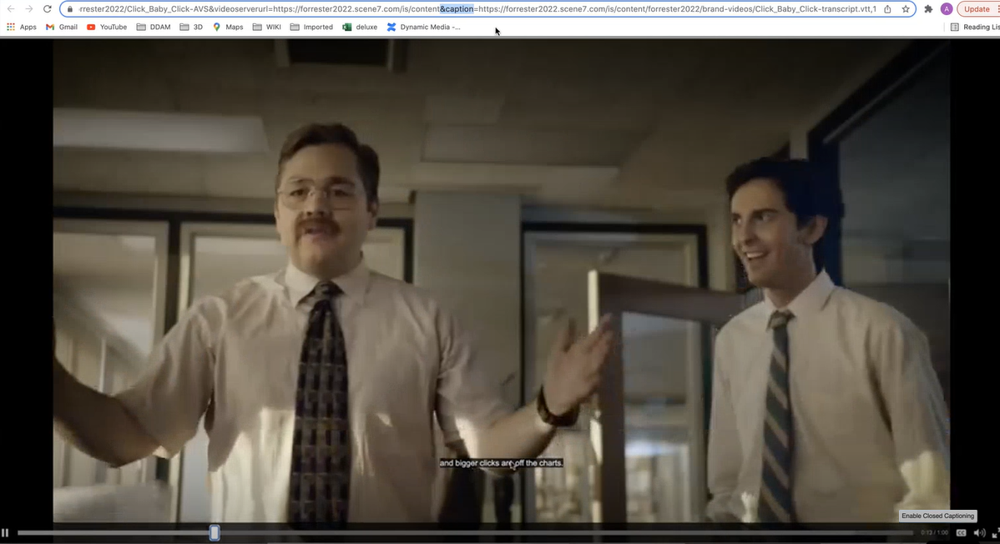

# 在 [!DNL Experience Manager Assets] {#configure-transcription-service}

轉錄是使用語音識別技術將音頻從音頻或視頻檔案轉換為文本（語音到文本）的過程。
[!DNL Adobe Experience Manager Assets] 已設定為 [!DNL Azure Media Services] 它以WebVTT(.vtt)格式自動生成支援的音頻或視頻檔案中的口語文本記錄。 在中處理音訊或視訊資產時 [!DNL Experience Manager Assets]，轉譯服務會自動產生音訊或視訊資產的文字轉譯本，並將其儲存在原始資產所在的Assets存放庫中的相同位置。 此 [!DNL Experience Manager Assets] 轉錄服務可讓行銷人員透過新增的可探索文字內容功能，有效管理其音訊和視訊內容，並支援協助工具和本地化，借此提高這些資產的投資報酬率。

筆錄是口述內容的文本版本；例如，您正在任何OTT平台上觀看的影片，通常包含字幕或字幕，以協助協助存取工具或使用其他語言的內容。 或任何用於行銷、學習或娛樂目的的音訊或視訊檔案。 這些體驗從轉錄開始，然後視需要格式化或翻譯。 手動執行時，轉錄音訊或視訊是耗時且容易出錯的程式。 由於對音訊 — 視訊內容的需求日益增加，調整手動流程也是一項挑戰。 [!DNL Experience Manager Assets] 使用Azure的基於AI的轉錄，允許對音頻和視頻資產進行大規模處理，並生成文本記錄（.vtt檔案）和時間戳詳細資訊。 除了Assets外，轉錄功能也支援Dynamic Media。

此轉錄功能可供使用，無需支付 [!DNL Experience Manager Assets]. 不過，管理員需要使用者的Azure憑證，才能在 [!DNL Experience Manager Assets]. 您也可以 [獲取試用憑據](https://azure.microsoft.com/en-us/pricing/details/media-services/) 直接從Microsoft®體驗Assets中的音訊或視訊轉錄功能。

## 轉錄先決條件 {#prerequisites}

1. 啟動並運行 [!DNL Experience Manager Assets as a Cloud Service] 例項。
1. 下列Azure憑證是 [!DNL Experience Manager Assets]:

   * 用戶端ID（API金鑰）
   * 用戶端密碼金鑰
   * 租戶端點（域）
   * 媒體帳戶
   * 資源組
   * 訂閱ID

   請參閱 [Azure檔案](https://docs.microsoft.com/en-us/azure/media-services/latest/access-api-howto?tabs=portal) 獲取訪問Azure Media Services API的憑據。

1. 請確定Azure帳戶有足夠的評分來處理新請求。

## 在 [!DNL Experience Manager Assets] {#configure-transcription}

以下是啟用轉錄功能所需的設定，位於 [!DNL Experience Manager Assets]:

1. [配置Azure媒體服務](#configure-azure-media-service)
1. [設定音訊/視訊轉錄的處理設定檔](#configure-processing-profile-for-transcription)

### 配置Azure媒體服務 {#configure-azure-media-services}

[!DNL Experience Manager Assets] 使用 [!DNL Azure Media Services] 自動生成語言文字記錄 [支援的音頻或視頻檔案](#supported-file-formats-for-transcription) (.vtt)格式。 管理員可 [!DNL Azure Media Services] in [!DNL Experience Manager Assets] 使用Azure憑證。 此 [轉錄先決條件](#transcription-prerequisites) 列出 [!DNL Azure] 配置所需的憑據。 如果您沒有 [!DNL Azure] 帳戶和憑證，請參閱 [Azure媒體服務文檔](https://azure.microsoft.com/en-us/pricing/details/media-services/) 以取得試用認證。

前往 **[!UICONTROL 工具]** > **[!UICONTROL Cloud Services]** > **[!UICONTROL Azure媒體服務配置]**. 從左側邊欄選取資料夾（位置），然後按一下 [!UICONTROL 建立] 按鈕來配置與 [!DNL Azure] 帳戶。 此資料夾是 [!DNL Azure] 雲端設定會儲存在Experience Manager Assets中。 輸入 [!DNL Azure] 憑據，按一下 **[!UICONTROL 儲存並關閉]**.

### 設定轉錄的處理設定檔 {#configure-processing-profile}

一旦 [!DNL Azure Media Services] 是在Experience Manager Assets中設定，下一步是建立資產處理設定檔，以產生以AI為基礎的音訊和視訊資產轉錄。 基於AI的處理配置檔案生成 [支援的音訊或視訊資產](#supported-file-formats-for-transcription) 作為Experience Manager Assets中的轉譯，並將轉譯記錄（.vtt檔案）儲存在原始資產所在的相同資料夾中。 因此，使用者可更輕鬆地搜尋及尋找資產及其記錄檔轉譯。

前往 **[!UICONTROL 工具]** > **[!UICONTROL 資產]** > **[!UICONTROL 處理設定檔]** 並按一下 **[!UICONTROL 建立]** 按鈕來建立以AI為基礎的處理設定檔，以產生音訊和視訊檔案的轉錄。 依預設，處理設定檔頁面只會反映三個標籤（影像、視訊和自訂）。 不過，a **[!UICONTROL Content AI]** 標籤 [!DNL Azure Media Services] 在 [!DNL Experience Manager Assets] 例項。 驗證 [!DNL Azure] 如果您沒有看到 **[!UICONTROL Content AI]** 標籤。

在 **[!UICONTROL Content AI]** ，按一下 **[!UICONTROL 新增]** 按鈕來配置轉錄。 在此，您可以從下拉式清單中選取檔案類型，以包含並排除用於產生轉譯本的檔案格式（MIME類型）。 在下圖中，包含所有支援的音訊和視訊檔案，並排除文字檔案。

啟用 **[!UICONTROL 在同一目錄中建立VTT記錄]** 切換，在原始資產所在的同一資料夾中建立並儲存轉譯記錄（.vtt檔案）。 其他轉譯也會由預設的DAM資產處理工作流程產生，而不論此設定為何。

下圖詳細說明在Experience Manager Assets中建立的自訂視訊設定檔。

視訊設定檔也包含下列自訂設定。 請參閱 [處理設定檔檔案](/help/assets/asset-microservices-configure-and-use.md) 以取得如何建立自訂處理設定檔的詳細資訊。

現在，讓我們在此視頻配置檔案中配置轉錄。 導覽至 **[!UICONTROL Content AI]** ，然後按一下 **[!UICONTROL 新增]** 按鈕。 包含所有音訊和視訊檔案，並排除影像和應用程式檔案。 啟用 **[!UICONTROL 在同一目錄中建立VTT記錄]** 切換並儲存設定。

一旦將處理設定檔設定為轉錄音訊和視訊檔案，您就可以使用下列其中一種方法將此處理設定檔套用至資料夾：

* 在中選取處理設定檔定義 **[!UICONTROL 工具]** > **[!UICONTROL 資產]** > **[!UICONTROL 處理設定檔]**，以及使用 **[!UICONTROL 將配置檔案應用到資料夾]** 動作。 內容瀏覽器可讓您導覽至特定資料夾、選取資料夾並確認設定檔的應用程式。
* 在「資產」使用者介面中選取資料夾，然後按一下 **[!UICONTROL 屬性]** 操作以開啟資料夾屬性。 按一下 **[!UICONTROL 資產處理]** ，然後從 **[!UICONTROL 處理設定檔]** 清單。 若要儲存變更，請按一下 **[!UICONTROL 儲存並關閉]**.

   

* 使用者可以在「資產」使用者介面中選取資料夾或特定資產，以套用處理設定檔，然後選取 **[!UICONTROL 重新處理資產]** 選項。

>[!TIP]
>只能將一個處理設定檔套用至資料夾。
>
>將處理設定檔套用至資料夾後，此資料夾或其任何子資料夾中已上傳（或更新）的所有新資產都會使用設定的其他處理設定檔進行處理。 此處理方式除了標準預設設定檔之外。

>[!NOTE]
>
>套用至資料夾的處理設定檔適用於整個樹狀結構，但套用至子資料夾的另一個設定檔可能會過度使用。
>
>當資產上傳至資料夾時，Experience Manager會與容納資料夾的屬性通訊，以識別處理設定檔。 如果未套用任何資料夾，則會檢查階層中的父資料夾以套用處理設定檔。

## 產生音訊或視訊資產的轉錄 {#generate-transcription}

處理視訊資產時， [基於AI的處理配置檔案](#configure-processing-profile-for-transcription) 自動將記錄（.vtt檔案）與同一資料夾中的原始資產一起生成為格式副本。

您也可以存取原始視訊資產的「轉譯」 ，以查看轉譯本轉譯。 若要存取 **[!UICONTROL 轉譯]** 面板，選取原始視訊資產並開啟左側邊欄。 您可以看到記錄檔轉譯（.vtt檔案）顯示在 **[!UICONTROL TRICKPTVT]** 頭。

您可以直接從資料夾下載記錄（.vtt文字檔案），作為個別的資產轉譯，或從 **[!UICONTROL 轉譯]** 原始資產的面板，方法是下載資產的所有轉譯。

目前，Experience Manager不支援以原生方式預覽或編輯VTT檔案的全文。 但是，您可以下載轉譯記錄，並使用任何文本編輯器來編輯或驗證轉譯記錄。 記錄會在視訊的指定時間戳記上，以轉錄的信賴分數（正確性）反映口述語言為文字。

## 在Dynamic Media中使用轉錄 {#using-transcription-in-dynamic-media}

若您有 [已設定Dynamic Media](/help/assets/dynamic-media/config-dm.md) 在您的Experience Manager Assets例項中，您可以將資產（音訊或視訊檔案）及其記錄檔（.vtt檔案）發佈至Dynamic Media。 如此一來，原始資產（音訊或視訊檔案）及其轉錄的轉譯（.vtt檔案）會發佈至相同資料夾中的Dynamic Media。 Dynamic Media管理員可 [啟用CC隱藏式字幕體驗](/help/assets/dynamic-media/video.md#adding-captions-to-video) 使用轉錄格式副本（.vtt檔案）的音頻或視頻檔案。

另請參閱:

* [有關如何將CC隱藏式字幕新增至Dynamic Media影片的教學課程影片](https://experienceleague.adobe.com/docs/experience-manager-learn/assets/dynamic-media/dynamic-media-overview-feature-video-use.html#add-cc-closed-captioning-to-dynamic-media-video)
* [將Dynamic Media影片發佈至YouTube](/help/assets/dynamic-media/video.md#publishing-videos-to-youtube)

在下圖中，URL反映了引用記錄（.vtt檔案）的標題部分。 視頻將口語（轉錄的文本）反映為 **[!UICONTROL 隱藏式字幕]** 在視訊中指定的時間戳記。 使用者可使用 **[!UICONTROL CC]** 按鈕。

## 支援的轉錄檔案格式 {#supported-file-format}

支援以下音頻和視頻檔案格式進行轉錄：

| 支援的音頻/視頻格式 | 擴充功能 |
|----|----|
| FLV（含H.264和AAC編解碼器） | (.flv) |
| MXF | (.mxf) |
| MPEG2-PS、MPEG2-TS、3GP | (.ts, .ps, .3gp, .3gpp, .mpg) |
| Windows Media Video(WMV)/ASF | (.wmv, .asf) |
| AVI（未壓縮8位/10位） | (.avi) |
| MP4 | (.mp4, .m4a, .m4v) |
| Microsoft®數位視訊錄制(DVR-MS) | (.dvr-ms) |
| 馬特羅斯卡/WebM | (.mkv) |
| 波/波 | (.wav) |
| QuickTime | (.mov) |

>[!NOTE]
>
>不支援轉錄應用程式類型的資產（音訊或視訊檔案）。

## 已知限制 {#known-limitations}

* 長達10分鐘的視訊支援轉錄功能。
* 視訊標題的長度必須少於80個字元。
* 支援的檔案大小高達15 GB。
* 支援的最大處理持續時間為60分鐘。
* 在付費 [!DNL Azure] 帳戶，您每分鐘最多可上傳50部電影。 不過，在試用帳戶中，您每分鐘可上傳最多5部影片。

## 疑難排解提示 {#troubleshooting}

登入 [!DNL Azure Media Services] 帳戶具有的憑證與您用於設定的憑證相同，可驗證請求狀態。 連絡人 [!DNL Azure] 如果未成功處理您的請求，則支援。
