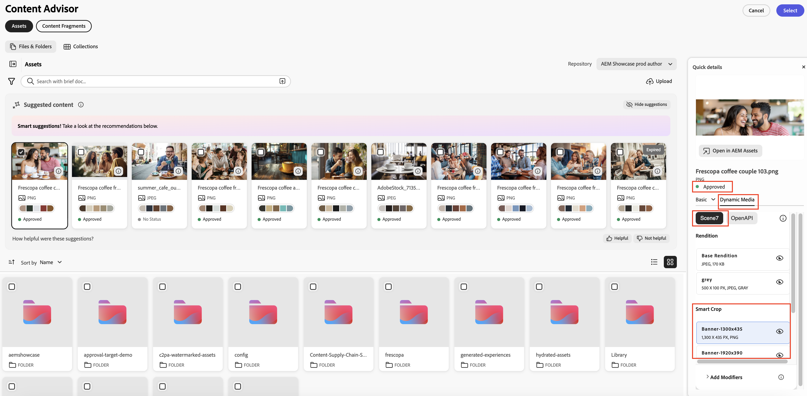

# 使用內容建議程式存取Adobe應用程式中的AEM內容{#content-advisor-aem-assets-adobe-applications}

Content Advisor可跨Adobe應用程式提供統一的內容探索體驗。 Content Advisor與Adobe Workfront、AJO B2C （即將推出）、AEM Sites等應用程式原生整合，將內容（資產和內容片段）整合在單一智慧型介面中。 它可讓您在工作流程中輕鬆地探索、瀏覽及重複使用最相關的內容，因此您可以在不中斷內容的情況下更快速地移動。

>[!IMPORTANT]
> 
> 內容片段藥丸目前尚未推出，很快將支援適當的Adobe應用程式。

Content Advisor將智慧型內容感知探索直接匯入撰寫體驗中，協助您根據自己的意圖，快速找到相關且經過核准的內容。 藉由智慧建議、Dynamic Media轉譯和詳細資產中繼資料等功能，您能夠在不離開應用程式介面的情況下，有效評估和重複使用內容，進而加快內容建立速度，同時維持品牌一致性。

Adobe Experience Manager (AEM) Assets也與Adobe Express原生整合，可讓您使用「內容顧問」，直接在Express介面中探索、存取及使用AEM Assets的資產。 如需詳細資訊，請參閱[在Adobe Express中使用內容警告器來存取AEM Assets](/help/assets/native-integration-adobe-express.md)。

## 先決條件 {#prerequisites}

* 存取AEM Assets as a Cloud Service環境。

* 使用編寫的內容片段存取AEM Sites環境（僅在使用內容片段時才需要）。 存取二進位資產或AEM Assets時，不需要執行此動作。

## 使用Content Advisor智慧型資產探索 {#intelligent-asset-discovery-content-advisor}

內容警告器會根據您的主機Adobe應用程式內容或行銷活動簡報，使用智慧型、內容感知的建議來協助您探索相關內容。 它也可讓您選取已針對使用案例最佳化的頻道Dynamic Media轉譯。

>[!IMPORTANT]
> 
>請確定您從&#x200B;**存放庫**&#x200B;下拉式清單中選取&#x200B;**作者**&#x200B;存放庫。 **傳遞**&#x200B;存放庫未顯示「內容建議程式」功能。
>
> 此外，**傳遞**&#x200B;存放庫沒有在資料夾和集合中組織的內容。 內容會以平面結構顯示在根層級。

「內容建議程式」提供下列主要功能：

* [更聰明地探索資產的AI 搜尋](#content-advisor-ai-search)

* [根據內容和意圖的智慧型建議](#smart-suggestions-content-advisor)

* [探索相關資產的Campaign簡介](#campaign-briefs-content-advisor)

* [可供使用的Dynamic Media資產轉譯](#dynamic-media-renditions-content-advisor)

* [與內容片段無縫整合](#content-fragments-integration-content-advisor)

* [存取與Assets檢視一致的資產中繼資料](#asset-metadata-content-advisor)

* [存取與Assets檢視一致的篩選器](#filters-content-advisor)

* [存取及重複使用最近和儲存的搜尋](#saved-searches-content-advisor)

* [在集合間和集合內搜尋資產](#search-collections-content-advisor)

### 更聰明地探索資產的AI 搜尋 {#content-advisor-ai-search}

「內容建議程式」使用進階搜尋功能，可瞭解使用者查詢的意義與意圖，而非依賴精確的關鍵字比對。 它使用人工智慧(AI)和機器學習，提供更準確且內容感知的結果。

傳統關鍵字式搜尋會尋找精確字詞，而AI 搜尋則解譯字詞、概念和使用者意圖之間的關係。 這可確保使用者找到他們要尋找的內容 — 即使他們的查詢用詞不同、包含拼寫錯誤或使用另一種語言。

內容警告器AI 搜尋

如果其主要優點包括：

* 多語言支援：可跨多種語言搜尋，不需要精確翻譯。 使用者無論查詢語言為何，都能找到相關內容。

* 處理拼字錯誤：解譯拼字錯誤和拼字錯誤，確保即使輸入不完美也能產生準確的結果。

* 瞭解同義字：提供相關辭彙和片語的結果，因此使用者不需要猜測正確的關鍵字。

* 內容感知搜尋：辨識查詢背後的目的，而不只是確切的字詞。

>[!IMPORTANT]
> 
>* 存取「內容建議程式」中的AI 搜尋所需的最低AEM發行版本為`21994`
>* 即將對內容片段提供AI 搜尋支援。

### 根據內容和意圖的智慧型建議 {#smart-suggestions-content-advisor}

「內容建議程式」會根據主機Adobe應用程式的內容，顯示智慧型建議。 這可協助您快速探索及使用符合內容需求的資產，而不需要費時的手動搜尋。

>[!IMPORTANT]
> 
>* 您必須簽署GenAI附加程式才能在「內容警告程式」中存取此功能。 若要簽署GenAI附加條款，請聯絡您的Adobe代表。
>* 存取此功能所需的最低AEM發行版本為`21994`。
>* 「內容建議程式」會根據主機Adobe應用程式中可用內容的內容與意圖，顯示智慧型建議。 它不會根據影像顯示結果。 如需支援此功能的Adobe應用程式清單，請參閱[Adobe應用程式中的](#content-advisor-feature-support-adobe-applications)內容警告器功能支援。

### 探索相關資產的Campaign簡介 {#campaign-briefs-content-advisor}

內容警告器可讓您上傳行銷活動摘要檔案，以探索相關資產，而不需手動輸入搜尋關鍵字。 「內容建議程式」會分析行銷活動簡介中的資訊，以瞭解行銷活動的目的，並建議AEM Assets中可用的相關資產。

>[!IMPORTANT]
>
>* 「內容建議程式」會分析行銷活動簡報中文字形式的可用資訊，以建議相關資產。 它不會分析行銷活動簡報中作為影像可用的資訊。
>* 您可以上傳作為行銷活動簡短的支援檔案型別包括PDF、DOCX和TXT檔案。
>* 您必須簽署GenAI附加程式才能在「內容警告程式」中存取此功能。 若要簽署GenAI附加條款，請聯絡您的Adobe代表。
>* 存取此功能所需的最低AEM發行版本為`21994`。
>* 即將針對內容片段提供上傳行銷活動簡訊支援。

### 可供使用的Dynamic Media資產轉譯 {#dynamic-media-renditions-content-advisor}

Dynamic Media轉譯提供立即可用且通道最佳化的資產版本，包括[影像預設集](/help/assets/dynamic-media/managing-image-presets.md)、[智慧型裁切](/help/assets/dynamic-media/image-profiles.md)、格式型別和色彩設定檔。 這些轉譯有助於確保所選資產符合管道和設計需求，而無需手動編輯或資產複製。

您也可以套用Dynamic Media修飾元，在選取主機Adobe應用程式的轉譯之前，即時預覽調整，以便更快速地選取最適當的轉譯，同時維持資產一致性和品質。

按一下資產卡上的圖示，然後選取&#x200B;**[!UICONTROL Dynamic Media]**&#x200B;索引標籤以檢視資產的可用轉譯。 您可以選擇檢視[Dynamic Media Scene7](/help/assets/dynamic-media/dynamic-media.md)轉譯或具有OpenAPI的[Dynamic Media](/help/assets/dynamic-media-open-apis-overview.md)轉譯。 當您為資產選取&#x200B;**[!UICONTROL OpenAPI]**&#x200B;時，只有當資產獲得核准且可用於具有OpenAPI的Dynamic Media時，才會顯示可用的轉譯。

您必須具備有效的AEM Dynamic Media授權才能檢視Dynamic Media索引標籤。

按一下圖示以預覽轉譯，或按一下轉譯名稱，然後按一下&#x200B;**[!UICONTROL 選取]**&#x200B;讓轉譯可在您的主機應用程式中使用。

按一下&#x200B;**[!UICONTROL 新增修飾元]**，在文字方塊中指定修飾元，然後按Enter鍵以即時套用轉換至所有資產轉譯。 同樣地，您可以將多個修飾元新增至轉譯並預覽這些轉換。 按一下轉譯名稱，然後按一下&#x200B;**[!UICONTROL 選取]**，讓轉譯可在您的主機應用程式中使用。 套用這些修飾元後的轉譯不會儲存。 檢視[Dynamic Media Scene7](https://experienceleague.adobe.com/zh-hant/docs/dynamic-media-developer-resources/image-serving-api/image-serving-api/http-protocol-reference/command-reference/c-command-reference)和[Dynamic Media with OpenAPI](https://developer.adobe.com/experience-cloud/experience-manager-apis/api/stable/assets/delivery/#operation/getAssetSeoFormat)支援的修飾元清單。

### 探索內容片段 {#content-fragments-discovery-content-advisor}

Content Advisor提供內容片段探索功能，讓您輕鬆瀏覽片段，並將片段合併至支援的Adobe應用程式中。 搜尋內容片段清單，並選取最相關的內容，而不需離開您目前的工作流程。

每個內容片段都會呈現為卡片，其內容會產生即時縮圖預覽，協助您快速識別正確的片段。 卡片也會顯示標題和狀態（草稿、已修改或已發佈）等關鍵細節。 如需更深入的深入分析，請按一下「圖示，以檢視詳細的屬性、其他內容片段的參考資料以及可用的變數，確保明智的內容選擇和重複使用。

>[!IMPORTANT]
> 
>* 內容警告器中的內容片段尚不支援AI 搜尋、智慧建議、上傳行銷活動簡介和預覽功能。

### 存取與Assets檢視一致的資產中繼資料 {#asset-metadata-content-advisor}

內容警告器可讓您存取AEM Assets中定義的資產屬性，包括Assets檢視中可用的中繼資料。 「內容建議程式」會使用與「Assets檢視」相同的中繼資料組態，複製「Assets檢視資產詳細資訊」頁面中的中繼資料標籤和內容清單。 這可讓您在選取資產之前，先檢閱重要資產詳細資訊，例如標題、說明、格式、大小和其他中繼資料。 存取資產屬性可協助您為內容選擇正確且已核准的資產。

按一下資產卡上的圖示，然後選取&#x200B;**[!UICONTROL 基本]**&#x200B;索引標籤以檢視資產中繼資料。 您也可以檢視與Assets檢視中存在的資產中繼資料一致的其他資產中繼資料標籤，例如「產品」、「促銷活動」和「標籤」。

「內容建議程式」會以唯讀檢視顯示檔案的屬性（中繼資料）。 集合和資料夾不會顯示屬性。

### 存取與Assets檢視一致的篩選器 {#filters-content-advisor}

「內容建議程式」在主機Adobe應用程式中提供與Assets檢視中相同的篩選功能，可讓您使用預先定義的篩選器來調整資產。 Assets檢視中提供的相同篩選功能也適用於特定於內容型別的篩選器，例如檔案、資料夾和集合。 這可確保一致的資產探索體驗，並協助您在主機Adobe應用程式中有效率地找到相關資產。

如果您未透過篩選器結構描述在Assets檢視中設定篩選器，內容警告器會顯示立即可用的篩選器，包括檔案型別、檔案格式、資產狀態、檔案大小、影像寬度、影像高度、修改日期和建立日期。

Assets （檔案）支援自訂篩選結構描述，但是資料夾和集合尚不支援。

### 存取及重複使用最近和儲存的搜尋 {#saved-searches-content-advisor}

您也可以使用在Assets檢視中建立的已儲存搜尋，讓您重複使用預先定義的搜尋條件。 已儲存的搜尋在Assets檢視和內容警告器之間在各種瀏覽器上運作一致。 這可協助您使用在AEM Assets和其他Adobe應用程式中一致的搜尋模式，有效率地找到資產。

若要使用「內容建議程式」儲存您經常使用的搜尋：

1. 指定搜尋字詞（選擇性），按一下篩選器圖示，然後根據您的要求選取選項以建立搜尋查詢。

1. 按一下&#x200B;**管理已儲存的搜尋** > **建立新的已儲存搜尋**。

1. 指定搜尋的名稱，然後按一下以儲存。 搜尋會顯示在專案清單中。

   

若要套用任何儲存的搜尋專案，請從&#x200B;**[!UICONTROL 儲存的搜尋]**&#x200B;下拉式清單中選取搜尋專案。 「內容建議程式」會根據搜尋查詢顯示結果。

「內容建議程式」會儲存您最近的搜尋，並可讓您儲存常用的搜尋以供日後快速存取。 Assets檢視和「內容建議程式」之間最近的搜尋清單不一致。 相同使用者在Assets檢視和「內容警告器」中可以有不同的一組最近搜尋。 如果您使用無痕模式來存取「內容建議程式」，則無法使用最近的搜尋清單。 此外，最近使用的搜尋不會跨相同使用者的不同瀏覽器共用，且會因AEM環境而異。

「內容建議程式」中尚未提供Assets檢視中提供的「預設儲存的搜尋」功能。

### 在集合間和集合內搜尋資產 {#search-collections-content-advisor}

內容警告器可讓您搜尋所有集合中的資產或集合，或將搜尋限制在特定集合中。 這可協助您快速找到並使用已組織集合中的資產，同時保留其預期組織內容。

## 跨Adobe應用程式提供內容警告器功能支援 {#content-advisor-feature-support-adobe-applications}

下表說明跨Adobe應用程式的「內容建議程式」功能支援。

>[!IMPORTANT]
> 
> 隨著「內容建議程式」擴充至其他Adobe應用程式，此表格將會更新以反映最新的支援。

| 應用程式 | 支援搜尋Assets的簡短上傳 | 搜尋Assets時支援建議的內容面板 | 搜尋Assets時支援Dynamic Media面板 | 支援搜尋內容片段 |
|--------------------------------------|----------------------------------------------|-----------------------------------------------------------|--------------------------------------------------------|------------------------------------------|
| [AEM Sites — 檔案製作](https://www.aem.live/docs/authoring-guide#document-authoring) | ✓ | ✓ | ✓ | − |
| [AEM Sites — 通用編輯器](https://www.aem.live/docs/authoring-guide#universal-editor-in-aem-sites) | ✓ | ✓ | ✓ | − |
| AEM Sites - [GoogleDrive](https://www.aem.live/docs/authoring-guide#google-drive)/[Sharepoint製作](https://www.aem.live/docs/authoring-guide#microsoft-sharepoint) | ✓ | − | ✓ | − |
| AEM Sites （內容片段編輯器） | ✓ | ✓ | ✓ | − |
| Adobe Workfront工作流程 | ✓ | ✓ | − | ✓ |
| Adobe Workfront規劃 | ✓ | ✓ | − | ✓ |
