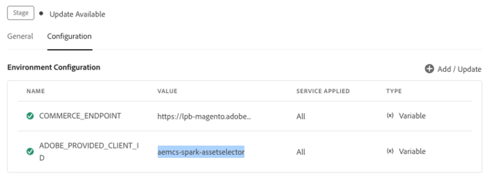

# Content Advisor安裝和屬性 {#content-advisor-installation-properties}

Content Advisor也可與非Adobe （協力廠商）應用程式整合，將智慧型資產探索延伸至Adobe應用程式之外。 協力廠商整合支援相同的豐富功能集，包括AI支援的搜尋、內容感知建議、行銷活動簡訊式探索、存取動態媒體轉譯、內容片段探索、篩選器和資產中繼資料。

## 先決條件{#prereqs}

您必須確保以下通訊方式：

* 該主機應用程式於 HTTPS 上執行。
* 您無法於 `localhost` 上執行該應用程式。 如果您想要在本機電腦上整合內容警告程式，您必須建立自訂網域，例如`[https://<your_campany>.localhost.com:<port_number>]`，並在`redirectUrl list`中新增此自訂網域。
* 您可以使用相應的 `imsClientId` 設定並新增 clientID 至 AEM Cloud Service 環境變數中。
<!--
* You can configure and add `ADOBE_PROVIDED_CLIENT_ID` into the AEM Cloud Service environment variable with the respective `imsClientId`.

-->
* IMS 範圍清單需要在環境設定中進行定義。
* 應用程式的 URL 位於 IMS 用戶端的重新導向 URL 允許清單中。
* IMS 登入流程是使用網頁瀏覽器上的快顯視窗進行設定和轉譯。 因此，應在目標瀏覽器上啟用或允許快顯視窗。

如果您需要Content Advisor的IMS驗證工作流程，請使用上述先決條件。 或者，如果您已透過 IMS 工作流程進行驗證，則可以改為新增 IMS 資訊。

>[!IMPORTANT]
>
> 此存放庫旨在作為補充檔案，說明整合內容警告器的可用API和使用範例。 在嘗試安裝或使用「內容建議程式」之前，請確定貴組織已布建對「內容建議程式」的存取權，作為Experience Manager Assets as a Cloud Service設定檔的一部分。 如果您尚未佈建，則無法整合或使用這些元件。 若要要求佈建，您的程式管理員應從 Admin Console 提出標記為 P2 的支援服務單，並包含以下資訊：
>
>* 託管整合應用程式的網域名稱。
>* 布建後，您的組織將獲得`imsClientId`、`imsScope`，以及對應到設定內容顧問所需必要環境的`redirectUrl`。 如果沒有這些有效屬性，您就無法執行安裝步驟。

## 安裝 {#content-advisor-installation}

內容警告器可透過ESM CDN （例如[esm.sh](https://esm.sh/)/[skypack](https://www.skypack.dev/)）和[UMD](https://github.com/umdjs/umd)版本使用。

在使用 **UMD 版** 的瀏覽器中 (建議)：

```
<script src="https://experience.adobe.com/solutions/CQ-assets-selectors/static-assets/resources/assets-selectors.js"></script>

<script>
  const { renderAssetSelector } = PureJSSelectors;
</script>
```

在具備 `import maps` 支援並使用 **ESM CDN 版**&#x200B;的瀏覽器中：

```
<script type="module">
  import { AssetSelector } from 'https://experience.adobe.com/solutions/CQ-assets-selectors/static-assets/resources/@assets/selectors/index.js'
</script>
```

在使用 **ESM CDN 版**&#x200B;的 Deno/Webpack Module Federation 中：

```
import { AssetSelector } from 'https://experience.adobe.com/solutions/CQ-assets-selectors/static-assets/resources/@assets/selectors/index.js'
```

## 內容警告器屬性 {#content-advisor-propertiess}

您可以使用「內容建議程式」屬性來自訂「內容建議程式」的呈現方式。 下表列出可用於自訂及使用「內容建議程式」的特性。

| 屬性 | 類型 | 必要 | 預設 | 說明 |
|---|---|---|---|---|
| *rail* | 布林值 | 否 | 假 | 如果標籤為`true`，內容警告器會在左側邊欄檢視中轉譯。 如果標示為`false`，內容警告器會在強制回應檢視中呈現。 |
| *imsOrg* | 字串 | 是 | | Adobe Identity Management System (IMS) ID 是在為您的組織佈建 [!DNL Adobe Experience Manager] as a [!DNL Cloud Service] 時所指派的。 `imsOrg`金鑰是驗證您所存取的組織是否位於Adobe IMS下的必要專案。 |
| *imsToken* | 字串 | 否 | | 用於身份驗證的 IMS 持有人語彙基元。 如果您使用[!DNL Adobe]應用程式進行整合，則需要`imsToken`。 |
| *apiKey* | 字串 | 否 | | 用於存取 AEM Discovery 服務的 API 金鑰。 如果您使用[!DNL Adobe]應用程式整合，則需要`apiKey`。 |
| *externalBrief* | 字串 | 否 | | 可讓您上傳行銷活動摘要檔案以探索相關資產，而不需手動輸入搜尋關鍵字。 「內容建議程式」會分析行銷活動簡介中的資訊，以瞭解行銷活動的目的，並建議AEM Assets中可用的相關資產。 |
| *filterSchema* | 陣列 | 否 | | 用於設定篩選器屬性的模式。 當您想要限制「內容建議程式」中的某些篩選選項時，這會很有用。 |
| *filterFormProps* | 物件 | 否 | | 指定用於調整搜尋所需的篩選器屬性。 針對！ 例如，MIME型別JPG、PNG、GIF。 |
| *selectedAssets* | 陣列 `<Object>` | 否 |                 | 在轉譯「內容建議程式」時，指定選取的Assets 。 需要包含資產的 id 屬性的物件陣列。 例如，在目前的目錄中必須可以使用 `[{id: 'urn:234}, {id: 'urn:555'}]` 資產。 如果您需要使用不同的目錄，請為該 `path` 屬性提供一個值。 |
| *acvConfig* | 物件 | 否 | | 包含要覆寫預設值之自訂設定的物件的資產集合檢視屬性。 此外，此屬性會與`rail`屬性搭配使用，以啟用資產檢視器的邊欄檢視。 |
| *i18nSymbols* | `Object<{ id?: string, defaultMessage?: string, description?: string}>` | 否 |                 | 如果OOTB轉譯不足以滿足您的應用程式需求，您可以公開介面，讓您透過`i18nSymbols` prop傳遞自己的自訂本地化值。 透過此介面傳遞的值會覆寫已提供的預設翻譯，並改為使用您自己的翻譯。 若要執行覆寫，您必須傳遞一個有效的 [Message Descriptor](https://formatjs.io/docs/react-intl/api/#message-descriptor) 物件至您想要覆寫的 `i18nSymbols` 金鑰。 |
| *intl* | 物件 | 否 | | 「內容建議程式」提供預設的OOTB翻譯。 您可以透過 `intl.locale`prop 提供有效的語言環境字串，以選擇翻譯語言。 例如： `intl={{ locale: "es-es" }}` </br></br>支援的地區設定字串會遵循[ISO 639 — 代表語言標準名稱的程式碼](https://www.iso.org/iso-639-language-codes.html)。</br></br> 支援的地區設定清單：英文 — &#39;en-us&#39; （預設）西班牙文 — &#39;es-es&#39;德文 — &#39;de-de&#39;法文 — &#39;fr-fr&#39;義大利文 — &#39;it-it&#39;日文 — &#39;ja-jp&#39;韓文 — &#39;ko-kr&#39;葡萄牙文 — &#39;pt-br&#39;中文（繁體） - &#39;zh-cn&#39;中文（台灣） - &#39;zh-tw&#39; |
| *repositoryId* | 字串 | 否 | &#39;&#39; | 「內容建議程式」載入內容的存放庫。 |
| *additionalAemSolutions* | `Array<string>` | 否 | [ ] | 它可讓您新增其他AEM存放庫的清單。 如果此屬性未提供任何資訊，則僅考慮媒體資料庫或 AEM Assets 存放庫。 |
| *hideTreeNav* | 布林值 | 否 |  | 指定顯示或隱藏資產樹導覽側邊欄。 那僅用於模組視圖，因此，此屬性在邊欄視圖中沒有影響。 |
| *onDrop* | 函數 | 否 | | 「依序放置」功能可用來將資產拖曳並釋放至指定的放置區域。 它提供互動式使用者介面，可讓您順暢地移動和處理資產。 |
| *dropOptions* | `{allowList?: Object}` | 否 | | 使用 &#39;allowList&#39; 設定放置選項。 |
| *佈景主題* | 字串 | 否 | 預設 | 套用主題至`default`到`express`之間的內容建議程式應用程式。 它也支援`@react-spectrum/theme-express`。 |
| *handleSelection* | 函數 | 否 | | 在選取資產並按一下`Select`模組上的按鈕時，叫用資產項目陣列。 此函數僅在模組視圖中叫用。 對於邊欄視圖，請使用 `handleAssetSelection`或`onDrop` 函數。 範例： <pre>handleSelection=（資產：資產[]）=> {...}</pre> 如需詳細資訊，請參閱[選取的資產](/help/assets/content-advisor-customization.md#selection-of-assets)。 |
| *handleAssetSelection* | 函數 | 否 | | 在選擇或取消選擇資產時，以項目陣列叫用。 當您想要在使用者選擇資產時進行監聽，這是十分實用的功能。 範例： <pre>handleAssetSelection=（資產：資產[]）=> {...}</pre> 如需詳細資訊，請參閱[選取的資產](/help/assets/content-advisor-customization.md#selection-of-assets)。 |
| *onClose* | 函數 | 否 | | 在按下`Close`模組視圖中的按鈕時叫用。 這只在`modal`視圖中呼叫，而在`rail`視圖中忽略。 |
| *onFilterSubmit* | 函數 | 否 | | 當使用者變更不同的篩選條件時，以篩選項目叫用。 |
| *selectionType* | 字串 | 否 | 單身 | 一次設定`single`或`multiple`資產選擇方式。 |
| *dragOptions.allowList* | 布林值 | 否 | | 屬性可用來允許或拒絕拖曳無法選取的資產。 請參閱[dragOptions屬性](/help/assets/content-advisor-customization.md#drag-options-property) |
| *aemTierType* | 字串 | 否 |  | 它可讓您選取是否要顯示傳送層級、作者層級或兩者的資產。<br><br> 語法： `aemTierType: "author"  "delivery"` <br><br>例如，如果同時使用`["author","delivery"]`，則存放庫切換器會顯示製作和傳遞的選項。 |
| *handleNavigateToAsset* | 函數 | 否 | | 這是一個Callback函式，可處理資產的選取專案。 |
| *noWrap* | 布林值 | 否 | | *noWrap*&#x200B;屬性可防止內容警告器包裝在對話方塊中。 如果未提及此屬性，預設會轉譯&#x200B;*對話方塊檢視*。 |
| *dialogSize* | S， M， L，全熒幕，全熒幕接管 | 字串 | 選用 | 您可以使用指定的選項指定版面大小，以控制版面。 |
| *colorScheme* | 字串（淺色、深色） | 否 | | 此屬性用於設定「內容建議程式」應用程式的主題。 您可以選擇淺色或深色主題。 |
| *filterRepoList* | 函數 | 否 | | 接收存放庫清單並傳回篩選清單的函式。 |
| *expiryOptions* | 函數 | | | 您可以在下列兩個屬性之間使用： **getExpiryStatus**，它提供過期資產的狀態。 函式會根據您提供的資產到期日傳回`EXPIRED`、`EXPIRING_SOON`或`NOT_EXPIRED`。 請參閱[自訂過期的資產](/help/assets/content-advisor-customization.md#customize-expired-assets)。 此外，您可以使用&#x200B;**allowSelectionAndDrag**，函式值可以是`true`或`false`。 當值設定為`false`時，無法在畫布上選取或拖曳過期的資產。 |
| *showToast* | | 否 | | 它可讓「內容建議程式」顯示已過期資產的自訂快顯通知訊息。 |
| *uploadConfig* | 物件 | | | 此物件包含上傳的自訂設定。 請參閱[上傳組態](#content-advisor-customization.md#upload-config)以瞭解可用性。 |
| *uploadConfig* > *metadataSchema* | 陣列 | 否 | | 此屬性巢狀於`uploadConfig`屬性之下。 新增您提供的欄位陣列，以從使用者收集中繼資料。 使用此屬性，您也可以使用自動指派給資產但使用者不可見的隱藏中繼資料。 |
| *uploadConfig* > *onMetadataFormChange* | 回呼函式 | 否 | | 此屬性巢狀於`uploadConfig`屬性之下。 它包含`property`和`value`。 `Property`等於從值正在更新的&#x200B;*metadataSchema*&#x200B;傳遞之欄位的&#x200B;*mapToProperty*。 而提供`value`等於新值作為輸入。 |
| *uploadConfig* > *targetUploadPath* | 字串 |  | `"/content/dam"` | 此屬性巢狀於`uploadConfig`屬性之下。 預設為資產存放庫根的檔案目標上傳路徑。 |
| *uploadConfig* > *hideUploadButton* | 布林值 | | 假 | 這可確保內部上傳按鈕是否隱藏。 此屬性巢狀於`uploadConfig`屬性之下。 |
| *uploadConfig* > *onUploadStart* | 函數 | 否 |  | 這是一個回呼函式，用來在Dropbox、OneDrive或本機之間傳遞上傳來源。 語法為`(uploadInfo: UploadInfo) => void`。 此屬性巢狀於`uploadConfig`屬性之下。 |
| *uploadConfig* > *匯入設定* | 函數 | | | 如此可支援從第三方來源匯入資產。 `sourceTypes`使用您要啟用的匯入來源陣列。 支援的來源為Onedrive和Dropbox。 語法為`{ sourceTypes?: ImportSourceType[]; apiKey?: string; }`。 此外，此屬性是巢狀位於`uploadConfig`屬性下。 |
| *uploadConfig* > *onUploadComplete* | 函數 | 否 | | 這是一個回呼函式，用來傳遞成功、失敗或重複之間的檔案上傳狀態。 語法為`(uploadStats: UploadStats) => void`。 此外，此屬性是巢狀位於`uploadConfig`屬性下。 |
| *uploadConfig* > *onFilesChange* | 函數 | 否 | | 此屬性巢狀於`uploadConfig`屬性之下。 這是一個回呼函式，用來顯示檔案變更時上傳的行為。 它會傳遞擱置上傳的新檔案陣列以及上傳的來源型別。 如果發生錯誤，Source型別可以是null。 語法為`(newFiles: File[], uploadType: UploadType) => void` |
| *uploadConfig* > *uploadingPlaceholder* | 字串 | | | 這是預留位置影像，可在啟動資產上傳時取代中繼資料表單。 語法為`{ href: string; alt: string; }`，此外，此屬性是巢狀位於`uploadConfig`屬性下。 |
| *功能集* | 陣列 | 字串 | | `featureSet:[ ]`屬性是用來啟用或停用「內容建議程式」應用程式中的特定功能。 若要啟用元件或功能，您可以在陣列中傳遞字串值，或讓陣列保持空白以停用新增的功能，而僅具備基本功能。 例如，您想在「內容警告器」中啟用上載功能，請使用語法`featureSet:["upload"]`。 同樣地，您可以使用`featureSet:["content-fragments"]`在內容警告器中啟用內容片段。 若要同時使用多個功能，語法為featureSet：[&quot;upload&quot;、&quot;content-fragments&quot;]。 |

<!--
| *selectedRendition* | Object | | | This property allows users to define and control which renditions of an asset are displayed when the panel is accessed. This customization enhances user experience by filtering out unnecessary renditions and showcasing only the most relevant renditions. For example, `CopyUrlHref` allows you to use Dynamic Media renditions in your Asset Selector application (delivery URL). |
| *featureSet* | Array | String | | The `featureSet:[ ]` property is used to enable or disable a particular functionaly in the Asset Selector application. To enable the component or a feature, you can pass a string value in the array or leave the array empty to disable that component. For example, you want to enable upload functionality in the Asset Selector, use the syntax `featureSet:[0:"upload"]`. Similarly, you can use `featureSet:[0:"collections"]` to enable collections in the Asset Selector. Addidionally, use `featureSet:[0:"detail-panel"]` to enable [details panel](overview-asset-selector.md#asset-details-and-metadata) of an asset. Also, `featureSet:[0:"dm-renditions"]` to show Dynamic Media renditions of an asset.|
| *rootPath* | String | No | /content/dam/ | Folder path from which Asset Selector displays your assets. `rootPath` can also be used in the form of encapsulation. For example, given the following path, `/content/dam/marketing/subfolder/`, Asset Selector does not allow you to traverse through any parent folder, but only displays the children folders. |
| *path* | String | No | | Path that is used to navigate to a specific directory of assets when the Asset Selector is rendered. |
| *expirationDate* | Function | No | | This function is used to set the usability period of an asset. |
| *disableDefaultBehaviour* | Boolean | No | False | It is a function that is used to enable or disable the selection of an expired asset. You can customize the default behavior of an asset that is set to expire. See [customize expired assets](/help/assets/asset-selector-customization.md#customize-expired-assets). |
-->

### ImsAuthProps {#ims-auth-props}

`ImsAuthProps`屬性定義內容顧問用來取得`imsToken`的驗證資訊和流程。 藉由設定這些屬性，您可以控制驗證流程應該如何行為並註冊各種驗證事件的接聽程式。

| 屬性名稱 | 說明 |
|---|---|
| `imsClientId` | 代表用於驗證目的之IMS使用者端ID的字串值。 此值由Adobe提供，且為您的Adobe AEM CS組織專用。 |
| `imsScope` | 說明用於驗證的範圍。 範圍會決定應用程式對貴組織資源的存取層級。 多個範圍可以用逗號分隔。 |
| `redirectUrl` | 代表驗證後重新導向使用者的URL。 此值通常設定為應用程式目前的URL。 如果未提供`redirectUrl`，`ImsAuthService`會使用用來登入`imsClientId`的redirectUrl |
| `modalMode` | 表示驗證流程是否應該顯示在強制回應視窗（快顯視窗）中的布林值。 如果設為`true`，驗證流程會以快顯視窗顯示。 如果設為`false`，則驗證流程會以全頁重新載入顯示。 _Note :_若要獲得較好的UX，您可以在使用者停用瀏覽器快顯視窗時動態控制此值。 |
| `onImsServiceInitialized` | Adobe IMS驗證服務初始化時呼叫的回呼函式。 此函式接受一個引數`service`，此引數是代表Adobe IMS服務的物件。 如需詳細資訊，請參閱[`ImsAuthService`](#imsauthservice-ims-auth-service)。 |
| `onAccessTokenReceived` | 從Adobe IMS驗證服務收到`imsToken`時所呼叫的回呼函式。 此函式接受一個引數`imsToken`，該引數是代表存取權杖的字串。 |
| `onAccessTokenExpired` | 當存取權杖過期時所呼叫的回呼函式。 此函式通常用於觸發新的驗證流程，以取得新的存取權杖。 |
| `onErrorReceived` | 驗證期間發生錯誤時所呼叫的回呼函式。 此函式採用兩個引數：錯誤型別和錯誤訊息。 錯誤型別是代表錯誤型別的字串，而錯誤訊息是代表錯誤訊息的字串。 |

### ImsAuthService {#ims-auth-service}

`ImsAuthService`類別會處理內容警告器的驗證流程。 其負責從Adobe IMS驗證服務取得`imsToken`。 `imsToken`可用來驗證使用者，並授權以[!DNL Cloud Service] Assets存放庫身分存取[!DNL Adobe Experience Manager]。 ImsAuthService使用`ImsAuthProps`屬性來控制驗證流程並註冊各種驗證事件的接聽程式。 您可以使用方便的[`registerAssetsSelectorsAuthService`](#purejsselectorsregisterassetsselectorsauthservice)函式，向內容顧問註冊&#x200B;_ImsAuthService_&#x200B;執行個體。 `ImsAuthService`類別上有以下可用函式。 不過，如果您使用&#x200B;_registerAssetsSelectorsAuthService_&#x200B;函式，則不需要直接呼叫這些函式。

| 函式名稱 | 說明 |
|---|---|
| `isSignedInUser` | 判斷使用者目前是否已登入服務並據此傳回布林值。 |
| `getImsToken` | 擷取目前登入使用者的驗證`imsToken`，此驗證可用於驗證其他服務的要求，例如產生資產_rendition。 |
| `signIn` | 起始使用者的登入程式。 此函式使用`ImsAuthProps`在快顯視窗或整頁重新載入中顯示驗證 |
| `signOut` | 將使用者登出服務，讓其驗證Token失效，並要求他們再次登入以存取受保護的資源。 叫用此函式將會重新載入目前頁面。 |
| `refreshToken` | 重新整理目前登入使用者的驗證Token，避免其到期並確保受保護資源的存取不中斷。 傳回可用於後續請求的新驗證Token。 |

### contentFragmentSelectorProps {#content-fragment-selector-properties}

`contentFragmentSelectorProps`可讓您設定如何存取內容片段，以及如何在內容警告器中顯示。 透過啟用`featureSet`中的內容片段功能並提供所需的設定，您可以順暢地整合內容片段選擇與資產。 這可讓使用者在相同的統一介面中瀏覽、搜尋和選取內容片段，確保跨資產和結構化內容的一致內容選取體驗。

```
const assetSelectorProps = {
     featureSet: [
       'upload',            /* Include upload or other featureSet values to ensure no missing functionality */
       'content-fragments', /* Content Fragments pill will be shown */
     ],
     contentFragmentSelectorProps: {
       /* Configures the Content Fragments Pill experience */
       /* ...props @aem-sites/content-fragment-selector MFE supports */
    }
}

<AssetSelector {...assetSelectorProps} />
```

在`contentFragmentSelectorProps`中，您可以提及[內容片段選擇器屬性](/help/headless/content-fragment-selector/properties.md)中可用的任何屬性。

如需如何將「內容建議程式」與Angular、React和JavaScript應用程式整合的相關資訊，請參閱[內容建議程式整合範例](https://github.com/adobe/aem-assets-selectors-mfe-examples/tree/consolidate-docs-to-experience-league/examples)。


