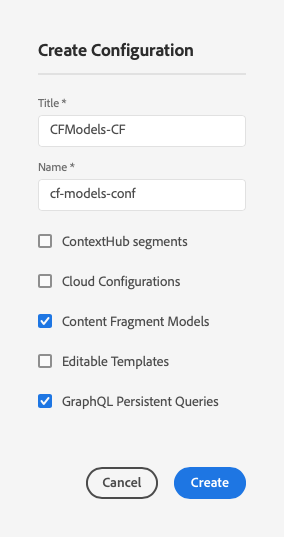

# 內容片段 — 設定瀏覽器{#content-fragments-configuration-browser}

了解如何在設定瀏覽器中啟用特定內容片段功能，以運用AEM強大的無頭傳送功能。

## 為您的執行個體啟用內容片段功能 {#enable-content-fragment-functionality-instance}

使用內容片段之前，您需要使用&#x200B;**設定瀏覽器**&#x200B;以啟用：

* **內容片段模型**  — 必填
* **GraphQL持久查詢**  — 可選

>[!CAUTION]
>
>如果未啟用&#x200B;**內容片段模型**:
>
>* 建立新模型時將無法使用&#x200B;**建立**&#x200B;選項。
>* 您將無法[選擇Sites配置以建立相關的端點](/help/assets/content-fragments/graphql-api-content-fragments.md#enabling-graphql-endpoint)。

若要啟用內容片段功能，您需要：

* 透過設定瀏覽器啟用內容片段功能的使用
* 將設定套用至資產資料夾

### 在設定瀏覽器中啟用內容片段功能 {#enable-content-fragment-functionality-in-configuration-browser}

若要[使用某些內容片段功能](#creating-a-content-fragment-model)，您&#x200B;**必須**&#x200B;先透過&#x200B;**設定瀏覽器**&#x200B;啟用它們：

>[!NOTE]
>
>有關詳細資訊，另請參閱[配置瀏覽器：](/help/implementing/developing/introduction/configurations.md#using-configuration-browser)。

>[!CAUTION]
>
>不支援與內容片段搭配使用子設定（巢狀配置內的設定）。

1. 導覽至「 **工具**」、「 **一般**」，然後開啟「 **設定瀏覽器**」。

1. 使用&#x200B;**Create**&#x200B;開啟對話方塊，其中：

   1. 指定&#x200B;**Title**。
   1. 啟用其使用選擇
      * **內容片段模型**
      * **GraphQL持久查詢**

      

1. 選擇&#x200B;**建立**&#x200B;以保存定義。

<!-- 1. Select the location appropriate to your website. -->

### 將設定套用至資產資料夾 {#apply-the-configuration-to-your-assets-folder}

為內容片段功能啟用設定&#x200B;**global**&#x200B;時，則套用至任何「資產」資料夾。

若要搭配可比的「資產」檔案夾使用其他設定 (例如排除全域)，您必須定義連線。若要這麼做，請在適當資 **料夾的「資料夾屬性** 」的「雲端服務 **」標籤** 中選取適當的「設定 **** 」。

