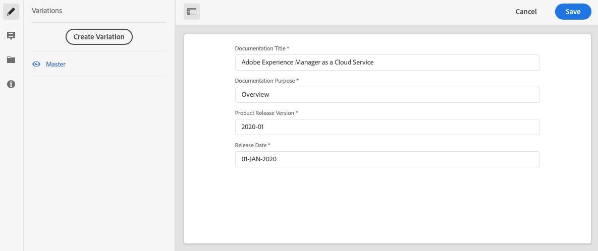

# 管理內容片段{#managing-content-fragments}

內容片段會儲存為 **資產**，因此主要是從資產主控台 **管理** 。

>[!NOTE]
>
>然後內容片段會用於編寫頁面； 請參 [閱使用內容片段編寫頁面](/help/sites-cloud/authoring/fundamentals/content-fragments.md)。

## 建立內容片段 {#creating-content-fragments}

### 建立內容模型 {#creating-a-content-model}

[在使用結構化內容](/help/assets/content-fragments/content-fragments-models.md) ，建立內容片段模型之前，可以先啟用和建立內容片段模型。

### 建立內容片段 {#creating-a-content-fragment}

建立內容片段的方法為：

1. 導覽至您 **要建立** 片段的「資產」檔案夾。
2. 依序選 **擇「建立**」、「 **內容片段** 」以開啟精靈。
3. 嚮導的第一步要求您指定新片段的基礎。

   * [模型](/help/assets/content-fragments/content-fragments-models.md) -用於建立需要結構化內容的片段； 例如 **Adventure** model

      * 將顯示所有可用的型號。

   選取後，請使 **用** 「下一步」繼續。

   

4. 在「屬 **性** 」步驟中指定：

   * **基本**

      * **標題**

         片段標題。

         必要.

      * **說明**

      * **標記**
   * **進階**

      * **名稱**

         姓名； 將用於形成URL。

         強制； 將會自動從標題衍生，但可以更新。

5. 選擇 **Create**  (建立) 以完成操作，然後選擇 **Open** the fragment for editing (開啟片段以進行編輯) 或返回控制 **台完成**。

## 內容片段的動作 {#actions-for-a-content-fragment}

在 **Assets** Console中，您的內容片段可使用一系列動作：

* 從工具列； 在選擇片段後，所有適當的動作都可供使用。
* 快 [速行動](/help/sites-cloud/authoring/getting-started/basic-handling.md#quick-actions); 個別片段卡可用動作的子集。

選取片段以顯示包含適用動作的工具列：

* **建立**
* **下載**

   * 將片段儲存為ZIP檔案； 您可以定義是否要包含元素、變數、中繼資料。

* **結帳**
* **屬性**

   * 可讓您檢視和／或編輯片段的中繼資料。

* **編輯**

   * 可讓您開啟 [片段以編輯內容](/help/assets/content-fragments/content-fragments-variations.md) ，以及其元素、變數、相關內容和中繼資料。

* **管理標記**
* **至集合**

   * 將片段新增至系列。
   * 您也可以在將系列與 [片段關聯時執行此動作](/help/assets/content-fragments/content-fragments-assoc-content.md#adding-associated-content)。

* **複製**/貼&#x200B;**上**

* **移動**
* **快速發佈**
* **管理發佈**
* **刪除**

>[!NOTE]
>
>其中許多是 [Assets和](/help/assets/manage-digital-assets.md) /或 [AEM案頭應用程式的標準動作](https://helpx.adobe.com/experience-manager/desktop-app/aem-desktop-app.html)。

## 開啟片段編輯器 {#opening-the-fragment-editor}

要開啟片段進行編輯：

>[!CAUTION]
>
>若要編輯內容片段，您需 [要適當權限](/help/implementing/developing/extending/content-fragments-customizing.md#asset-permissions)。 如果您遇到問題，請與系統管理員聯繫。

>[!CAUTION]
>
>若要編輯內容片段，您需要適當的權限。 如果您遇到問題，請與系統管理員聯繫。

1. 使用 **Assets** 主控台導覽至內容片段的位置。
2. 開啟片段以進行編輯，方法為：

   * 按一下／點選片段連結（這取決於控制台檢視）。
   * 選取片段，然後從工 **具列** 「編輯」。

   片段編輯器將開啟：

   

   >[!NOTE]
   >
   >1. 當內容頁面上已參考片段時，會顯示訊息。
      >
      >
      >

   2. 使用「切換側面板」圖示可隱藏／顯 **示側面板** 。

3. 使用側面板中的圖示，在三種模式中導覽：

   * 變化： [編輯內容](#editing-the-content-of-your-fragment) , [管理變數](#creating-and-managing-variations-within-your-fragment)

   * [註解](/help/assets/content-fragments/content-fragments-variations.md#annotating-a-content-fragment)
   * [相關聯的內容](#associating-content-with-your-fragment)
   * [中繼資料](#viewing-and-editing-the-metadata-properties-of-your-fragment)

   

4. 進行變更後，請視需 **要使用** 「 **儲存** 」或「取消」。

   >[!NOTE]
   >
   >「儲 **存** 」和「取 **消」都會退出編輯器——請參閱「** 儲存」、「取消」和「版本」，以取得有關這兩個選項如何對內容片段運作的完整資訊。

## 儲存、取消和版本 {#save-cancel-and-versions}

>[!NOTE]
>
>您也可以從時 [間軸建立、比較和回復版本](/help/assets/content-fragments/content-fragments-managing.md#timeline-for-content-fragments)。

編輯器有兩個選項：

* **儲存**

   將保存最新更改並退出編輯器。

   >[!CAUTION]
   >
   >若要編輯內容片段，您需 [要適當權限](/help/implementing/developing/extending/content-fragments-customizing.md#asset-permissions)。 如果您遇到問題，請與系統管理員聯繫。

   >[!NOTE]
   >
   >在選擇「保存」之前，可以保留在編輯器中，進行一系列 **更改**。

   >[!CAUTION]
   >
   >除了簡單地保存更改外， **「保存** 」還會更新任何引用，並確保調度程式根據需要刷新。 這些變更可能需要時間處理。 因此，對於大型／複雜／重負載系統，效能可能會受到影響。
   >
   >
   >使用「儲存」後，請記住 **這一點** ，然後快速重新輸入片段編輯器以進行並儲存進一步的變更。

* **取消**

   將退出編輯器，而不保存最新的更改。

編輯您的內容片段時，AEM會自動建立版本，以確保在您取消變更時，可以還原 **先的** 內容：

1. 當開啟內容片段以進行編輯時，AEM會檢查是否存在以Cookie為基礎的Token，以指出編輯 *工作階段* :

   1. 如果找到代號，則片段會視為現有編輯工作階段的一部分。
   2. 如果Token不 *可用* ，且使用者開始編輯內容，則會建立版本，並傳送此新編輯工作階段的Token給用戶端，並儲存在Cookie中。

2. 雖然有作用中 *編輯作業* ，但所編輯的內容會每600秒（預設值）自動儲存一次。

   >[!NOTE]
   >
   >自動保存間隔可使用該機制 `/conf` 配置。
   >
   >預設值，請參閱：
   >  `/libs/settings/dam/cfm/jcr:content/autoSaveInterval`

3. 如果用戶選擇取 **消編輯** ，則恢復在編輯會話開始時建立的版本，並刪除令牌以結束編輯會話。
4. 如果使用者選擇「 **儲存** 」編輯，更新的元素／變數會持續存留，並移除代號以結束編輯工作階段。

## 編輯片段內容 {#editing-the-content-of-your-fragment}

開啟片段後，您就可以使用「變 [數](/help/assets/content-fragments/content-fragments-variations.md) 」標籤來製作內容。

## 在片段中建立和管理變數 {#creating-and-managing-variations-within-your-fragment}

建立主版內容後，您就可以建立及管理該 [內容](/help/assets/content-fragments/content-fragments-variations.md) 的變數。

## 將內容與片段關聯 {#associating-content-with-your-fragment}

您也可以將 [內容與片段](/help/assets/content-fragments/content-fragments-assoc-content.md) 建立關聯。 這提供了一種連接，使得資產（即影像）在添加到內容頁面時可（可選）與片段一起使用。

## 檢視和編輯片段的中繼資料（屬性） {#viewing-and-editing-the-metadata-properties-of-your-fragment}

您可以使用「中繼資料」標籤來檢視和編輯片段 [的屬](/help/assets/content-fragments/content-fragments-metadata.md) 性。

## 內容片段時間軸 {#timeline-for-content-fragments}

除了標準選項外， [Timeline](/help/assets/manage-digital-assets.md#timeline) 還提供內容片段的資訊和動作：

* 檢視版本、注釋和註解的相關資訊
* 版本動作

   * **[還原為此版本](#reverting-to-a-version)**（選擇現有片段，然後選擇特定版本）

   * **[與目前比較](#comparing-fragment-versions)**（選擇現有片段，然後選擇特定版本）

   * 新增標 **簽** 和／或 **注釋** （選取現有片段，然後選取特定版本）

   * **另存為版本** （選擇現有片段，然後在時間軸底部向上箭頭）

* 注釋操作

   * **刪除**

>[!NOTE]
備注如下：
* 所有資產的標準功能
* 在時間軸中製作
* 與片段資產相關

註解（適用於內容片段）包括：
* 在片段編輯器中輸入
* 特定於片段內選取的文字區段

例如：

## 比較片段版本 {#comparing-fragment-versions}

在您 **選取特定版本後** ,「時間軸」( [Timeline](/help/assets/content-fragments/content-fragments-managing.md#timeline-for-content-fragments) )中會提供「與目前比較」(Compare to Current)動作。

此選項將開啟：

* 目 **前** （最新）版本（左）

* 所選 **版本v&lt;*x.y*>** （右）

它們將並排顯示，其中：

* 會反白顯示任何差異

   * 已刪除的文字——紅色
   * 插入的文本——綠色
   * 已取代文字——藍色

* 全螢幕圖示可讓您自行開啟任一版本； 然後切換回平行檢視
* 您可以 **回復** 到特定版本
* **完成** ，將返回控制台

>[!NOTE]
比較片段時，無法編輯片段內容。

## 回復為版本  {#reverting-to-a-version}

您可以回復到特定版本的片段：

* 直接從時間 [軸](/help/assets/content-fragments/content-fragments-managing.md#timeline-for-content-fragments)。

   選擇所需的版本，然後執 **行「還原為此版本** 」操作。

* 將版 [本與當前版本進行比較時](/help/assets/content-fragments/content-fragments-managing.md#comparing-fragment-versions) ，可 **以「還原** 」到選定版本。

## 發佈和參照片段 {#publishing-and-referencing-a-fragment}

>[!CAUTION]
如果您的片段是以模型為基礎，則應確定 [模型已發佈](/help/assets/content-fragments/content-fragments-models.md#publishing-a-content-fragment-model)。
如果您發佈模型尚未發佈的內容片段，則選擇清單會指出此點，而模型將會隨片段一起發佈。

必須發佈內容片段才能在發佈環境中使用。 可發佈：

* 建立後； 從「資 **產** 」主控台。
* 當您發 [布使用片段的頁面時](/help/sites-cloud/authoring/fundamentals/content-fragments.md#publishing); 片段將列在頁面參考中。

>[!CAUTION]
發佈和／或參考片段後，當作者開啟片段以進行重新編輯時，AEM會顯示警告。 這會警告對片段所做的變更也會影響參照的頁面。

## 刪除片段 {#deleting-a-fragment}

要刪除片段：

1. 在「資 **產** 」主控台中，導覽至內容片段的位置。
2. 選擇片段。

   >[!NOTE]
   「刪 **除** 」(Delete)動作不提供快速動作。

3. 從工 **具列中** ，選取「刪除」。
4. 確認「刪 **除** 」動作。

   >[!CAUTION]
   如果片段已在頁面中參考，您會看到警告訊息，並需要確認您要繼續執行強制刪 **除**。片段及其內容片段元件將會從任何內容頁面中刪除。
