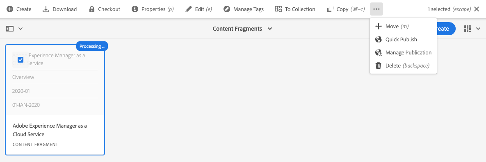

# 管理內容片段 {#managing-content-fragments}

了解如何使用Assets主控台管理您的AEM內容片段，這是無頭內容的基礎。

定義[內容片段模型](#creating-a-content-model)後，您可以將這些模型用於[建立內容片段](#creating-a-content-fragment)。

[內容片段編輯器](#opening-the-fragment-editor)提供各種[模式](#modes-in-the-content-fragment-editor)，讓您能夠：

* [編輯內容](#editing-the-content-of-your-fragment) 並管 [理變數](#creating-and-managing-variations-within-your-fragment)
* [為片段加上注釋](/help/assets/content-fragments/content-fragments-variations.md#annotating-a-content-fragment)
* [將內容與您的片段關聯](#associating-content-with-your-fragment)
* [設定中繼資料](#viewing-and-editing-the-metadata-properties-of-your-fragment)
* [查看結構樹](/help/assets/content-fragments/content-fragments-structure-tree.md)
* [預覽JSON表示法](/help/assets/content-fragments/content-fragments-json-preview.md)

>[!NOTE]
>
>可使用內容片段：
>
>* 編寫頁面時；請參閱使用內容片段進行頁面編寫](/help/sites-cloud/authoring/fundamentals/content-fragments.md)。[
>* 針對[使用內容片段搭配GraphQL](/help/assets/content-fragments/content-fragments-graphql.md)的無周邊內容傳送。

>[!NOTE]
>
>內容片段會儲存為&#x200B;**Assets**，因此主要是從&#x200B;**Assets**&#x200B;主控台管理。

## 建立內容片段 {#creating-content-fragments}

### 建立內容模型 {#creating-a-content-model}

[在建立具](/help/assets/content-fragments/content-fragments-models.md) 有結構化內容的內容片段之前，請啟用並建立內容片段模型。

### 建立內容片段 {#creating-a-content-fragment}

建立內容片段的方法為：

1. 導覽至您 **要建立** 片段的「資產」檔案夾。
1. 依序選 **擇「建立**」、「 **內容片段** 」以開啟精靈。
1. 嚮導的第一步要求您指定新片段的基礎。

   * [模型](/help/assets/content-fragments/content-fragments-models.md)  — 用於建立需要結構化內容的片段；比如冒險 **** 模型

      * 將顯示所有可用模型。

   選取後，使用&#x200B;**Next**&#x200B;繼續。

   

1. 在「屬 **性** 」步驟中指定：

   * **基本**

      * **標題**

         片段標題。

         必要.

      * **說明**

      * **標記**
   * **進階**

      * **名稱**

         名稱；將用來形成URL。

         強制；會自動從標題衍生出，但可更新。

1. 選擇 **Create**  (建立) 以完成操作，然後選擇 **Open** the fragment for editing (開啟片段以進行編輯) 或返回控制 **台完成**。

   >[!NOTE]
   >在控制台的&#x200B;**清單**&#x200B;模式中，您可以更新&#x200B;**檢視設定**&#x200B;以啟用&#x200B;**內容片段模型**&#x200B;欄。

## 資產主控台中內容片段的動作 {#actions-for-a-content-fragment-assets-console}

在&#x200B;**Assets**&#x200B;主控台中，一系列動作可供內容片段使用，包括：

* 從工具列；選取片段後，所有適當的動作皆可使用。
* 作為[快速操作](/help/sites-cloud/authoring/getting-started/basic-handling.md#quick-actions);個別片段卡片可用的動作子集。

選取片段以顯示包含適用動作的工具列：

* **重新處理資產**
* **建立**
* **下載**

   * 將片段儲存為ZIP檔案；您可以定義是否要包含元素、變數、中繼資料。

* **結帳**
* **屬性**

   * 可讓您檢視和/或編輯片段的中繼資料。

* **編輯**

   * 可讓您[開啟片段以編輯內容](/help/assets/content-fragments/content-fragments-variations.md)及其元素、變異、相關內容和中繼資料。

* **快速發佈**
* **管理發佈**
* **管理標記**
* **至集合**
* **複製** (並 **貼上**)
* **移動**
* **刪除**

>[!NOTE]
>
>其中許多是[資產](/help/assets/manage-digital-assets.md)和/或[AEM案頭應用程式](https://helpx.adobe.com/tw/experience-manager/desktop-app/aem-desktop-app.html)的標準動作。

## 開啟片段編輯器 {#opening-the-fragment-editor}

若要開啟片段以進行編輯：

>[!CAUTION]
>
>若要編輯內容片段，您需要[適當的權限](/help/implementing/developing/extending/content-fragments-customizing.md#asset-permissions)。 如果您遇到問題，請與系統管理員聯繫。

>[!CAUTION]
>
>若要編輯內容片段，您需要適當的權限。 如果您遇到問題，請與系統管理員聯繫。

1. 使用&#x200B;**Assets**&#x200B;控制台導覽至內容片段的位置。
1. 開啟片段以進行編輯，方法為：

   * 按一下/點選片段或片段連結（取決於主控台檢視）。
   * 選取片段，然後從工具列中選取&#x200B;**編輯**。

1. 片段編輯器將會開啟。 視需要進行變更：

   

1. 進行更改後，根據需要使用&#x200B;**Save**、**Save &amp; close**&#x200B;或&#x200B;**Close**。

   >[!NOTE]
   >
   >**可透過「儲** 存」下拉式清單使 **** 用儲存與關閉。

   >[!NOTE]
   >
   >**Save &amp; Close**&#x200B;和&#x200B;**Close**&#x200B;都將退出編輯器 — 請參閱[Save、Close和Versions](#save-close-and-versions)以了解有關內容片段的各種選項如何運作的完整資訊。

## 內容片段編輯器中的模式和動作 {#modes-actions-content-fragment-editor}

內容片段編輯器提供多種模式和動作。

### 內容片段編輯器中的模式 {#modes-in-the-content-fragment-editor}

使用側面板中的圖示，導覽各種模式：

* 變數：[編輯內容](#editing-the-content-of-your-fragment)和[管理變數](#creating-and-managing-variations-within-your-fragment)

* [註解](/help/assets/content-fragments/content-fragments-variations.md#annotating-a-content-fragment)
* [相關聯的內容](#associating-content-with-your-fragment)
* [中繼資料](#viewing-and-editing-the-metadata-properties-of-your-fragment)
* [樹狀結構](/help/assets/content-fragments/content-fragments-structure-tree.md)
* [預覽](/help/assets/content-fragments/content-fragments-json-preview.md)

### 內容片段編輯器中的工具列動作 {#toolbar-actions-in-the-content-fragment-editor}

頂端工具列中的部分功能提供多種模式：

* 內容頁面上已參考片段時，會顯示訊息。 您可以&#x200B;**關閉**&#x200B;訊息。

* 可使用&#x200B;**切換側面板**&#x200B;表徵圖隱藏/顯示側面板。

* 在片段名稱下方，您可以看到用於建立當前片段的[內容片段模型](/help/assets/content-fragments/content-fragments-models.md)的名稱：

   * 名稱也是將開啟模型編輯器的連結。

* 查看片段的狀態；例如，關於建立、修改或發佈時間的資訊。 狀態也會以色彩標示：

   * **新增**:灰色
   * **草稿**:藍色
   * **已發佈**:綠色
   * **已修改**:橙色
   * **停用**:紅色

* **** Save提供對「保存和關 **閉」選項** 的訪問。

* 三個點(**...**)下拉式清單提供其他動作的存取：
   * **更新頁面參考**
      * 這會更新任何頁面參考。
   * **[快速發佈](#publishing-and-referencing-a-fragment)**
   * **[管理發佈](#publishing-and-referencing-a-fragment)**

<!--
This updates any page references and ensures that the Dispatcher is flushed as required. -->

## 儲存、關閉和版本 {#save-close-and-versions}

>[!NOTE]
>
>也可以從時間軸](/help/assets/content-fragments/content-fragments-managing.md#timeline-for-content-fragments)建立、比較和還原版本。[

編輯器有各種選項：

* **** 儲存並 **儲存並關閉**

   * **** Save將儲存最新變更並保留在編輯器中。
   * **儲存並關** 閉會儲存最新變更並退出編輯器。

   >[!CAUTION]
   >
   >若要編輯內容片段，您需要[適當的權限](/help/implementing/developing/extending/content-fragments-customizing.md#asset-permissions)。 如果您遇到問題，請與系統管理員聯繫。

   >[!NOTE]
   >
   >您可以在儲存前保留在編輯器中，進行一系列變更。

   >[!CAUTION]
   >
   >除了僅儲存您的變更外，動作也會更新任何參考，並確保Dispatcher會視需要刷新。 這些變更可能需要時間處理。 因此，對於大型/複雜/重載的系統，可能會產生效能影響。
   >
   >使用&#x200B;**儲存並關閉**，然後快速重新輸入片段編輯器以進行和儲存進一步變更時，請記住這一點。

* **關閉**

   將退出編輯器，而不保存最新更改（即自最後&#x200B;**Save**&#x200B;以來所做的更改）。

編輯內容片段AEM時，會自動建立版本，以確保在您取消變更時（使用&#x200B;**關閉**&#x200B;而不儲存），可還原先前的內容：

1. 開啟內容片段以編輯AEM時，會檢查是否有Cookie型Token，指出是否存在&#x200B;*編輯工作階段*:

   1. 如果找到代號，則會將片段視為現有編輯工作階段的一部分。
   2. 如果代號為&#x200B;*不可用，且使用者開始編輯內容，則會建立版本，並將此新編輯工作階段的代號傳送至用戶端，並儲存於Cookie中。*

2. 雖然有&#x200B;*作用中*&#x200B;編輯工作階段，但每600秒就會自動儲存所編輯的內容（預設值）。

   >[!NOTE]
   >
   >可使用`/conf`機制配置自動保存間隔。
   >
   >預設值，請參閱：
   >  `/libs/settings/dam/cfm/jcr:content/autoSaveInterval`

3. 如果使用者取消編輯，則會還原在編輯工作階段開始時建立的版本，並移除代號以結束編輯工作階段。
4. 如果使用者選取&#x200B;**Save**&#x200B;編輯，則更新的元素/變數會持續存在，並移除代號以結束編輯工作階段。

## 編輯片段的內容 {#editing-the-content-of-your-fragment}

開啟片段後，您可以使用[Variations](/help/assets/content-fragments/content-fragments-variations.md)標籤來製作內容。

## 在片段中建立和管理變體 {#creating-and-managing-variations-within-your-fragment}

建立主內容後，您就可以建立和管理該內容的[變體](/help/assets/content-fragments/content-fragments-variations.md)。

## 將內容與您的片段關聯 {#associating-content-with-your-fragment}

您也可以[將內容](/help/assets/content-fragments/content-fragments-assoc-content.md)與片段關聯。 這會提供連線，讓資產（即影像）在新增至內容頁面時，可（選擇性）與片段搭配使用。

## 檢視和編輯片段的中繼資料（屬性） {#viewing-and-editing-the-metadata-properties-of-your-fragment}

您可以使用[Metadata](/help/assets/content-fragments/content-fragments-metadata.md)索引標籤來檢視和編輯片段的屬性。

## 內容片段時間軸 {#timeline-for-content-fragments}

除了標準選項外，[時間軸](/help/assets/manage-digital-assets.md#timeline)還提供內容片段的特定資訊和動作：

* 查看有關版本、注釋和注釋的資訊
* 版本動作

   * **[回復到此版本](#reverting-to-a-version)** （選擇現有片段，然後選擇特定版本）

   * **[與目前的](#comparing-fragment-versions)** 比較（選取現有片段，然後選取特定版本）

   * 新增&#x200B;**Label**&#x200B;及/或&#x200B;**Comment**（選取現有片段，然後選取特定版本）

   * **另存為版本** （選取現有片段，然後是時間軸底部的向上箭頭）

* 註解動作

   * **刪除**

>[!NOTE]
評論包括：
* 所有資產的標準功能
* 在時間軸中製作
* 與片段資產相關

註解（適用於內容片段）包括：
* 在片段編輯器中輸入
* 特定於片段內選取的文字區段

例如：

## 比較片段版本 {#comparing-fragment-versions}

在您選取特定版本後，可從[時間軸](/help/assets/content-fragments/content-fragments-managing.md#timeline-for-content-fragments)中使用&#x200B;**Compare to Current**&#x200B;動作。

此選項將開啟：

* **目前**（最新）版本（左）

* 所選版本&#x200B;**v&lt;*x.y*>**（右）

它們會並排顯示，其中：

* 會強調顯示任何差異

   * 已刪除的文本 — 紅色
   * 插入的文本 — 綠色
   * 已更換文字 — 藍色

* 全螢幕圖示可讓您自行開啟任一版本；然後切換回平行檢視
* 您可以&#x200B;**還原**&#x200B;到特定版本
* **** Donewill會將您傳回主控台

>[!NOTE]
比較片段時無法編輯片段內容。

## 回復為版本  {#reverting-to-a-version}

您可以還原為片段的特定版本：

* 直接從[時間軸](/help/assets/content-fragments/content-fragments-managing.md#timeline-for-content-fragments)。

   選擇所需的版本，然後選擇&#x200B;**還原為此版本**&#x200B;操作。

* 當[將版本與當前版本](/help/assets/content-fragments/content-fragments-managing.md#comparing-fragment-versions)比較時，您可以&#x200B;**還原**&#x200B;到所選版本。

## 發佈和參考片段 {#publishing-and-referencing-a-fragment}

>[!CAUTION]
如果您的片段是以模型為基礎，則應確定[模型已發佈](/help/assets/content-fragments/content-fragments-models.md#publishing-a-content-fragment-model)。
如果您發佈的內容片段尚未發佈模型，則選取清單會指出此點，且模型將會隨片段發佈。

內容片段必須發佈以便在發佈環境中使用。 可發佈：

* 建立後；使用「資產」主控台](#actions-for-a-content-fragment-assets-console)中可用的[動作。
* 從[內容片段編輯器](#toolbar-actions-in-the-content-fragment-editor)。
* 當您[發佈使用片段](/help/sites-cloud/authoring/fundamentals/content-fragments.md#publishing)的頁面時；片段會列在頁面參考中。

>[!CAUTION]
發佈和/或參考片段後，製作者開啟片段並再次編輯時AEM會顯示警告。 這將警告對片段的變更也會影響參考的頁面。

## 刪除片段 {#deleting-a-fragment}

刪除片段：

1. 在&#x200B;**Assets**&#x200B;主控台中，導覽至內容片段的位置。
2. 選取片段。

   >[!NOTE]
   **Delete**&#x200B;動作無法作為快速動作使用。

3. 從工具欄中選擇&#x200B;**刪除**。
4. 確認&#x200B;**Delete**&#x200B;動作。

   >[!CAUTION]
   如果片段已在頁面中參考，您會看到警告訊息，並需要確認您要繼續執行強制刪 **除**。片段及其內容片段元件將會從任何內容頁面中刪除。
