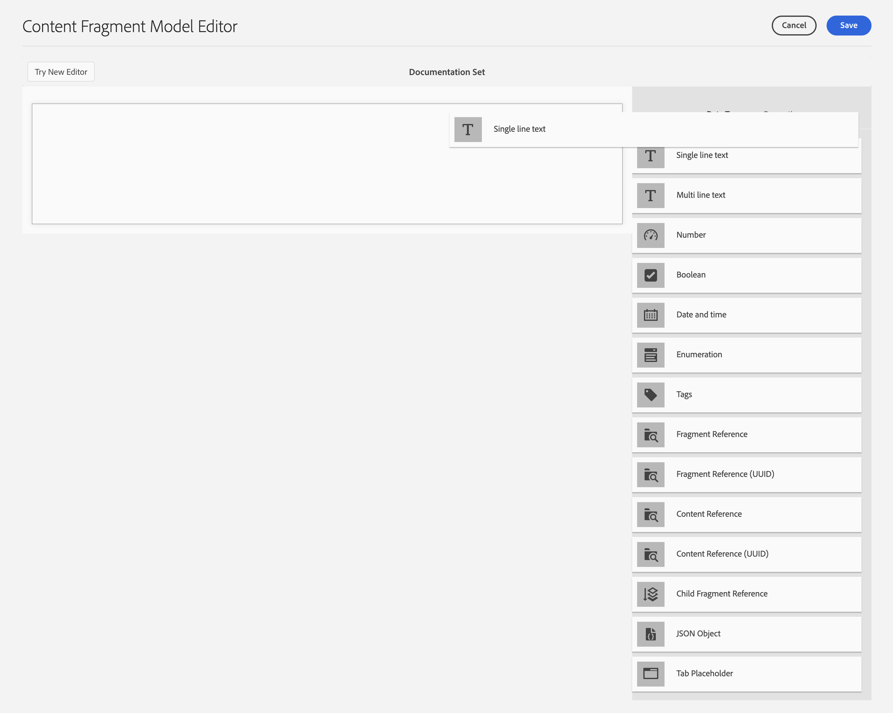

# 內容片段模型{#content-fragment-models}

內容片段模型可定義內容片段的 [內容結構](/help/assets/content-fragments/content-fragments.md)。

## 啟用內容片段模型 {#enable-content-fragment-models}

>[!CAUTION]
>
>如果未啟用「內 **容片段模型** 」，則「 **建立** 」選項將不可用於建立新模型。

若要啟用內容片段模型，您必須：

* 在配置管理器中啟用內容片段模型
* 將設定套用至您的「資產」檔案夾

### 在Configuration manager中啟用內容片段模型 {#enable-content-fragment-models-in-configuration-manager}

若要 [建立新的內容片段模型](#creating-a-content-fragment-model) , **您必須先使用「設定管理員** 」加以啟用：

1. 導覽至「 **工具**」、「 **一般**」，然後開啟「 **設定瀏覽器**」。
2. 選擇適合您網站的位置。
3. 使用 **「建立** 」(Create)開啟對話框，您可在其中：

   1. 指定 **標題**。
   2. 選取「 **內容片段模型** 」以啟用其使用。
   

4. 選擇「 **建立** 」(Create)以保存定義。

### 將設定套用至您的資產資料夾 {#apply-the-configuration-to-your-assets-folder}

當為內容 **片段模型** 啟用設定全域時，使用者建立的任何模型都可用於任何「資產」檔案夾。

若要搭配可比的「資產」檔案夾使用其他設定（例如排除全域），您必須定義連線。 若要這麼做，請在適當資 **料夾的「資料夾屬性** 」的「雲端服務 **」標籤** 中選取適當的「設定 **** 」。

## 建立內容片段模型 {#creating-a-content-fragment-model}

1. 導覽至「 **工具**」、「資 **產」**，然後開啟「 **內容片段模型」**。
1. 導覽至適合您設定的資 [料夾](#enable-content-fragment-models)。
1. 使用 **「建立** 」開啟嚮導。

   >[!CAUTION]
   >
   >如果 [未啟用內容片段模型的使用](#enable-content-fragment-models)，將無 **法使用「建立** 」選項。

1. 指定「模 **型標題」**。 您也可以視需要 **新增「說** 明」。

   

1. 使用「 **建立** 」(Create)保存空模型。 一條消息將指示操作成功，您可以選擇「開啟」( **Open** )以立即編輯模型，或選擇「完成」( **Done** )以返回控制台。

## 定義內容片段模型 {#defining-your-content-fragment-model}

內容片段模型有效地定義了所產生內容片段的結構。 使用模型編輯器可以添加和配置必填欄位：

>[!CAUTION]
>
>編輯現有的內容片段模型可能會影響相依片段。

1. 導覽至「 **工具**」、「資 **產」**，然後開啟「 **內容片段模型」**。

1. 導覽至包含內容片段模型的檔案夾。
1. 開啟「編輯」( **Edit)所需的模型**;使用快速動作，或從工具列中選取模型和動作。

   開啟模型編輯器後，會顯示：

   * 左：欄位已定義
   * 右：資 **料類型** ，可用於建立欄位( **和屬性** ，以供建立欄位後使用)
   >[!NOTE]
   >
   >當欄位為「必 **要**」時，左側窗格中指出的「標籤 **」將會標示為字元(** *****)。

   

1. **要添加欄位**

   * 將必要的資料類型拖曳至欄位的必要位置：
   

   * 將欄位添加到模型後，右側面板將顯示可為該特定資料類型定義的 **Properties** 。 您可以在這裡定義該欄位的必要項目。 例如：
   

   >[!NOTE]
   對於「多行」 **資料類型** ，可將「預設類型 **** 」定義為：
   * **RTF**
   * **Markdown**
   * **純文字**
   如果未指定，則此欄位會使 **用預設值Rich Text** 。
   在內容 **片段模型中變更「預設類型** 」，只會在編輯器中開啟並儲存該片段後，對現有、相關的內容片段生效。

1. **刪除欄位**

   選取必要欄位，然後按一下／點選垃圾桶圖示。 系統會要求您確認動作。

   

1. 新增所有必填欄位並定義屬性後，請使 **用「儲存** 」來保存定義。 例如：

   

## 刪除內容片段模型 {#deleting-a-content-fragment-model}

>[!CAUTION]
刪除內容片段模型可能會影響相依片段。

要刪除內容片段模型：

1. 導覽至「 **工具**」、「資 **產」**，然後開啟「 **內容片段模型」**。

1. 導覽至包含內容片段模型的檔案夾。
1. 選擇模型，然後從工具 **欄中** 「刪除」(Delete)。

   >[!NOTE]
   如果模型被參照，則會發出警告。 採取適當行動。

## 發佈內容片段模型 {#publishing-a-content-fragment-model}

內容片段模型必須在發佈任何相依內容片段時／之前發佈。

若要發佈內容片段模型：

1. 導覽至「 **工具**」、「資 **產」**，然後開啟「 **內容片段模型」**。

1. 導覽至包含內容片段模型的檔案夾。
1. 選擇模型，然後從工具 **欄中** 「發佈」(Publish)。

   >[!NOTE]
   如果您發佈模型尚未發佈的內容片段，則選擇清單會指出此點，而模型將會隨片段一起發佈。
