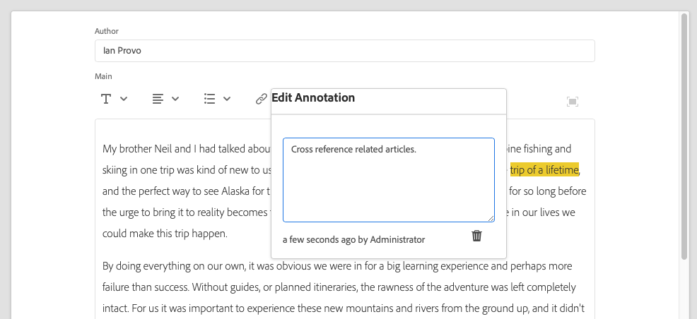
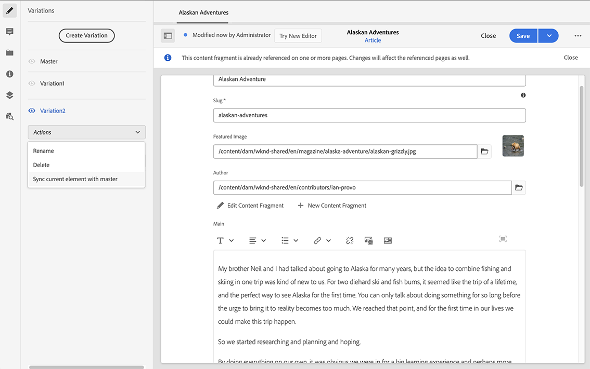

# 變化 - 編寫片段內容{#variations-authoring-fragment-content}

 變數是AEM內容片段的重要功能，因為可讓您建立和編輯主要內容的復本，以用於特定頻道和/或情境，讓無頭式內容傳送更具彈性。

從&#x200B;**Variations**&#x200B;標籤，您可以：

* [輸入](#authoring-your-content) 片段的內容，
* [建立和管](#managing-variations) 理Mastercontent的變 **** 數、

根據要編輯的資料類型執行一系列其他動作；例如：

* [將視覺化資產插入您的片段](#inserting-assets-into-your-fragment) （影像）

* 在[RTF](#rich-text)、[純文字](#plain-text)和[Markdown](#markdown)之間進行編輯

* [上傳內容](#uploading-content)

* [檢視索引鍵統計](#viewing-key-statistics) （關於多行文字）

* [摘要文字](#summarizing-text)

* [將變數與主內容同步](#synchronizing-with-master)

>[!CAUTION]
>
>發佈和/或參考片段後，製作者開啟片段並再次編輯時AEM會顯示警告。 這將警告對片段的變更也會影響參考的頁面。

## 編寫內容 {#authoring-your-content}

當您開啟內容片段進行編輯時，**Variations**&#x200B;標籤將依預設開啟。 您可以在此為「主版」或您擁有的任何變體製作內容。 結構化片段包含內容模型中定義之各種資料類型的各種欄位。

例如：

輯器您可以：

* 直接在&#x200B;**Valiations**&#x200B;標籤中進行編輯

   * 每種資料類型提供不同的編輯選項

* 對於&#x200B;**多行文本**&#x200B;欄位，您也可以開啟[全螢幕編輯器](#full-screen-editor)以：

   * 選擇[Format](#formats)
   * 查看更多編輯選項（[ RTF](#rich-text)格式）
   * 存取[actions](#actions)的範圍

* 對於&#x200B;**片段參考**&#x200B;欄位，視模型定義而定，**[編輯內容片段](#fragment-references-edit-content-fragment)**&#x200B;選項可供使用。

### 全螢幕編輯器 {#full-screen-editor}

編輯多行文本欄位時，可以開啟全螢幕編輯器；點選或按一下實際文字，然後選取下列動作圖示：

這會開啟全螢幕文字編輯器：

全螢幕文字編輯器提供：

* 存取各種[動作](#actions)
* 視[format](#formats)，其他格式選項([RTF](#rich-text))而定

### 動作 {#actions}

當全螢幕編輯器（即多行文字）開啟時，下列動作也可用（適用於所有[formats](#formats)）:

* 選取[format](#formats)（[Rtf](#rich-text), [純文字，](#plain-text) [Markdown](#markdown)）

* [上傳內容](#uploading-content)

* [顯示文本統計資訊](#viewing-key-statistics)

* [與主版同步](#synchronizing-with-master) （編輯變數時）

* [摘要文字](#summarizing-text)

### 格式 {#formats}

用於編輯多行文本的選項取決於所選的格式：

* [RTF](#rich-text)
* [純文字](#plain-text)
* [Markdown](#markdown)

全螢幕編輯器時可選取格式。

### RTF {#rich-text}

RTF編輯可讓您設定格式：

* 粗體
* 斜體
* 底線
* 對齊方式：左，中，右
* 項目符號清單
* 編號清單
* 縮排：增加，減少
* 建立/中斷超連結
* 貼上文字/來自字詞
* 插入表格
* 段落樣式：第1/2/3段
* [插入資產](#inserting-assets-into-your-fragment)
* 開啟全螢幕編輯器，其中提供下列格式選項：
   * 搜尋
   * 尋找/取代
   * 拼字檢查程式
   * [註解](/help/assets/content-fragments/content-fragments-variations.md#annotating-a-content-fragment)
* [插入內容片段](#inserting-content-fragment-into-your-fragment);當「多行」 **文字欄** 位設定為「允許片段 **參考」時可用**。

也可從全螢幕編輯器存取[actions](#actions)。

### 純文字 {#plain-text}

純文字檔案允許快速輸入內容，而不需格式設定或標籤資訊。 您也可以開啟全螢幕編輯器，以進一步[actions](#actions)。

>[!CAUTION]
>
>如果您選取「純 **文字** 」 **，可能會遺失您已插入「豐富文字」或「標籤文字」的任何格式、標籤和/或資產******。

### Markdown {#markdown}

>[!NOTE]
>
>如需完整資訊，請參閱[Markdown](/help/assets/content-fragments/content-fragments-markdown.md)檔案。

這可讓您使用Markdown來設定文字格式。 您可以定義：

* 標題
* 段落和分行
* 連結
* 影像
* 塊引號
* 清單
* 強調
* 程式碼區塊
* 反斜線逸出

您也可以開啟全螢幕編輯器，以進一步[actions](#actions)。

>[!CAUTION]
>
>如果您在 **Rich Text** 和 **** Markdown之間切換，可能會在區塊引號和程式碼區塊中遇到意外的效果，因為這兩種格式在處理方式上可能會有差異。

### 片段參考 {#fragment-references}

如果內容片段模型包含片段參考，您的片段作者可能有其他選項：

* [編輯內容片段](#fragment-references-edit-content-fragment)
* [新內容片段](#fragment-references-new-content-fragment)

#### 編輯內容片段 {#fragment-references-edit-content-fragment}

選項&#x200B;**編輯內容片段**&#x200B;將在新編輯器索引標籤中（在相同的瀏覽器索引標籤中）開啟該片段。

再次選取原始標籤（例如&#x200B;**Little Pony Inc.**），將會關閉此次要標籤（在此例中為&#x200B;**Adam Smith**）。

#### 新內容片段 {#fragment-references-new-content-fragment}

選項&#x200B;**新內容片段**&#x200B;可讓您建立完全新的片段。 為此，將在編輯器中開啟建立內容片段精靈的變數。

然後，您將能夠通過以下方式建立新片段：

1. 導覽至，並選取所需的資料夾。
1. 選擇&#x200B;**Next**。
1. 指定屬性；例如&#x200B;**Title**。
1. 選擇&#x200B;**Create**。
1. 最後：
   1. **** Donewill會傳回（至原始片段）並參考新片段。
   1. **** Open將參考新片段，以及在新瀏覽器索引標籤中開啟新片段以進行編輯。

### 查看關鍵統計資訊 {#viewing-key-statistics}

當全螢幕編輯器開啟時，「文字統計 **資料** 」動作會顯示一系列有關文字的資訊。

例如：

### 上傳內容 {#uploading-content}

若要簡化製作內容片段的程式，您可以上傳在外部編輯器中準備的文字，並直接將其新增至片段。

### 摘要文字 {#summarizing-text}

摘要文字旨在協助使用者將文字長度縮短為預先定義的字數，同時保留關鍵點和整體意義。

>[!NOTE]
>
>在更為技術的層面上，系統保留其評分的句子，以根據特定算法提供資訊密度和唯一性的&#x200B;*最佳比例*。

>[!CAUTION]
>
>內容片段必須具備有效的語言資料夾（ISO代碼）作為上階；這可用來決定要使用的語言模型。
>
>例如，`en/`如下列路徑：
>
>  `/content/dam/my-brand/en/path-down/my-content-fragment`

>[!CAUTION]
英文是現成可用的。
其他語言則可從Package Share中作為語言模型包：
* [French(fr)](https://www.adobeaemcloud.com/content/marketplace/marketplaceProxy.html?packagePath=/content/companies/public/adobe/packages/cq630/product/smartcontent-model-fr)
* [German(de)](https://www.adobeaemcloud.com/content/marketplace/marketplaceProxy.html?packagePath=/content/companies/public/adobe/packages/cq630/product/smartcontent-model-de)
* [Italian(it)](https://www.adobeaemcloud.com/content/marketplace/marketplaceProxy.html?packagePath=/content/companies/public/adobe/packages/cq630/product/smartcontent-model-it)
* [Spanish(es)](https://www.adobeaemcloud.com/content/marketplace/marketplaceProxy.html?packagePath=/content/companies/public/adobe/packages/cq630/product/smartcontent-model-es)

1. 選擇&#x200B;**主版**&#x200B;或所需的變數。
1. 開啟全螢幕編輯器。

1. 從工具欄中選擇&#x200B;**摘要文本**。

   

1. 指定目標字數，然後選擇&#x200B;**Start**:
1. 原始文本與建議的總結並排顯示：

   * 任何要刪除的句子都以紅色突出顯示，並帶有字串。
   * 按一下任何醒目提示的句子，將其保留在摘要內容中。
   * 按一下任何未加亮的句子以將其刪除。

1. 選擇&#x200B;**匯總**&#x200B;以確認更改。

1. 原始文本與建議的總結並排顯示：

   * 任何要刪除的句子都以紅色突出顯示，並帶有字串。
   * 按一下任何醒目提示的句子，將其保留在摘要內容中。
   * 按一下任何未加亮的句子以將其刪除。
   * 顯示總結統計資訊：**實際**&#x200B;和&#x200B;**Target**-
   * 您可以&#x200B;**預覽**&#x200B;變更。

   

### 為內容片段加上註解 {#annotating-a-content-fragment}

若要注釋片段：

1. 選擇&#x200B;**主版**&#x200B;或所需的變數。

1. 開啟全螢幕編輯器。

1. 頂端工具列中提供&#x200B;**注釋**&#x200B;圖示。 您可以視需要選取一些文字。

   

1. 對話方塊將會開啟。 您可以在此輸入注釋。

   

1. 在對話框上選擇&#x200B;**應用**。

   

   如果將注釋應用於選定文本，則該文本將保持突出顯示。

   

1. 關閉全螢幕編輯器時，仍會強調顯示註解。 如果選中，將開啟一個對話框，以便您可以進一步編輯注釋。

1. 選擇&#x200B;**保存**。

1. 關閉全螢幕編輯器時，仍會強調顯示註解。 如果選中，將開啟一個對話框，以便您可以進一步編輯注釋。

   

### 查看、編輯、刪除注釋 {#viewing-editing-deleting-annotations}

註解:

* 在編輯器的全螢幕和一般模式中，以文字上的醒目提示指示。 然後，可通過按一下突出顯示的文本來查看、編輯和/或刪除注釋的完整詳細資訊，這將重新開啟對話框。

   >[!NOTE]
   如果已將多個註解套用至一個文字，則提供下拉式選取器。

* 刪除應用了注釋的整個文本時，注釋也會被刪除。

* 在片段編輯器中選取&#x200B;**Annotations**&#x200B;標籤，即可列出及刪除。

   

* 可在[時間軸](/help/assets/content-fragments/content-fragments-managing.md#timeline-for-content-fragments)中查看和刪除所選片段。

### 在片段中插入資產 {#inserting-assets-into-your-fragment}

若要簡化製作內容片段的程式，您可以直接將[Assets](/help/assets/manage-digital-assets.md)（影像）新增至片段。

這些檔案將添加到片段的段落序列中，而無需任何格式；在頁面](/help/sites-cloud/authoring/fundamentals/content-fragments.md)上使用/參考[片段時，可執行格式設定。

>[!CAUTION]
無法在參考頁面上移動或刪除這些資產，必須在片段編輯器中完成此操作。
不過，必須在[頁面編輯器](/help/sites-cloud/authoring/fundamentals/content-fragments.md)中完成資產的格式化（例如大小）。 片段編輯器中資產的表示純粹是為了編寫內容流程。

>[!NOTE]
有各種方法可將[images](/help/assets/content-fragments/content-fragments.md#fragments-with-visual-assets)新增至片段和/或頁面。

1. 將游標置於要添加影像的位置。
1. 使用「插 **入資產** 」圖示開啟搜尋對話方塊。

   

1. 在對話方塊中，您可以：

   * 導覽至DAM中的必要資產
   * 在DAM中搜尋資產

   找到後，按一下縮圖以選取所需的資產。

1. 使用 **「選取** 」將資產新增至目前位置之內容片段的段落系統。

   >[!CAUTION]
   如果新增資產後，您將格式變更為：
   * **純文字檔案**:資產將完全從碎片中丟失。
   * **Markdown**:資產將不可見，但當您返回 **Rich Text時，資產仍會存在**。

### 在片段中插入內容片段 {#inserting-content-fragment-into-your-fragment}

若要簡化編寫內容片段的程式，您也可以新增其他內容片段至您的片段。

它們會新增為參考，位於您片段的目前位置。

>[!NOTE]
當您的&#x200B;**多行文本**&#x200B;配置了&#x200B;**允許片段引用**&#x200B;時，此選項可用。

>[!CAUTION]
無法在參考頁面上移動或刪除這些資產，必須在片段編輯器中完成此操作。
不過，必須在[頁面編輯器](/help/sites-cloud/authoring/fundamentals/content-fragments.md)中完成資產的格式化（例如大小）。 片段編輯器中資產的表示純粹是為了編寫內容流程。

>[!NOTE]
有各種方法可將[images](/help/assets/content-fragments/content-fragments.md#fragments-with-visual-assets)新增至片段和/或頁面。

1. 將游標置於要添加片段的位置。
1. 使用&#x200B;**插入內容片段**&#x200B;圖示開啟搜尋對話方塊。

   

1. 在對話方塊中，您可以：

   * 導覽至「資產」資料夾中的必要片段
   * 搜尋片段

   找到後，按一下縮圖以選取所需的片段。

1. 使用&#x200B;**Select**&#x200B;將對所選內容片段的引用添加到當前內容片段（在當前位置）。

   >[!CAUTION]
   如果在將參考新增至另一個片段後，您將格式變更為：
   * **純文字**:引用將完全從片段中丟失。
   * **Markdown**:參考將保留。

## 管理變數 {#managing-variations}

### 建立變異 {#creating-a-variation}

變數可讓您取用&#x200B;**Master**&#x200B;內容，並根據用途（如有需要）加以變更。

要建立新變數：

1. 開啟您的片段，並確認側面板可見。
1. 從側面板的表徵圖欄中選擇&#x200B;**變異**。
1. 選擇&#x200B;**建立變異**。
1. 將會開啟對話方塊，指定新變 **數的****「標題」(Title)和「說明」(Description** )。
1. 選擇 **添加**;片段 **Master** 將會複製到新的變數，現在會開啟供編 [輯](#editing-a-variation)。

   >[!NOTE]
   建立新變異時，一律會複製&#x200B;**Master**，而非目前開啟的變異。

### 編輯變異 {#editing-a-variation}

您可以在下列任一項之後，變更變異內容：

* [建立您的變異](#creating-a-variation)。
* 開啟現有片段，然後從側面板選取所需的變數。

### 更名變數 {#renaming-a-variation}

要更名現有變數：

1. 開啟您的片段，然後從側面板選取&#x200B;**變體**。
1. 選取所需的變數。
1. 從&#x200B;**Actions**&#x200B;下拉式清單中選擇&#x200B;**Rename**。

1. 在產生的對 **話方塊中** ，輸入新的「 **** 標題」和/或「說明」。

1. 確認&#x200B;**Rename**&#x200B;動作。

>[!NOTE]
這只會影響變數&#x200B;**Title**。

### 刪除變數 {#deleting-a-variation}

要刪除現有變數：

1. 開啟您的片段，然後從側面板選取&#x200B;**變體**。
1. 選取所需的變數。
1. 從&#x200B;**Actions**&#x200B;下拉式清單中選擇&#x200B;**Delete**。

1. 確認對話方塊中的&#x200B;**Delete**&#x200B;動作。

>[!NOTE]
無法刪除&#x200B;**Master**。

### 與主伺服器同步 {#synchronizing-with-master}

**** Master是內容片段的必要部分，根據定義，它保留內容的主副本，而變數保留該內容的個別更新和定製版本。更新主版時，這些變更也可能與變更相關，因此需要傳播至變更。

編輯變體時，您可以存取動作，將變體的目前元素與主版同步。 這可讓您自動將對Master所做的變更複製到所需的變數。

>[!CAUTION]
同步僅可用於將更改從 *主&#x200B;**版複製**到變化*。
只會同步變數的目前元素。
同步只適用於多 **行文本** -資料類型。
將變 *更從變更傳輸&#x200B;**至Master*** ，不提供選項。

1. 在片段編輯器中開啟內容片段。 請確定已編輯&#x200B;**主版**。

1. 選擇特定變數，然後從以下任一項選擇適當的同步操作：

   * **Actions**&#x200B;下拉式選取器 — **與主版**&#x200B;同步目前元素

      

   * 全螢幕編輯器的工具列 — **與主版同步**

      

1. 主版和變異會並排顯示：

   * 綠色表示已新增的內容（至變數）
   * 紅色表示內容已移除（從變數中）
   * 藍色表示已替換的文字

   

1. 選擇&#x200B;**Synchronize**，將更新並顯示變數。
