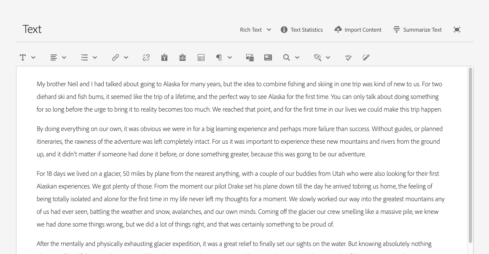
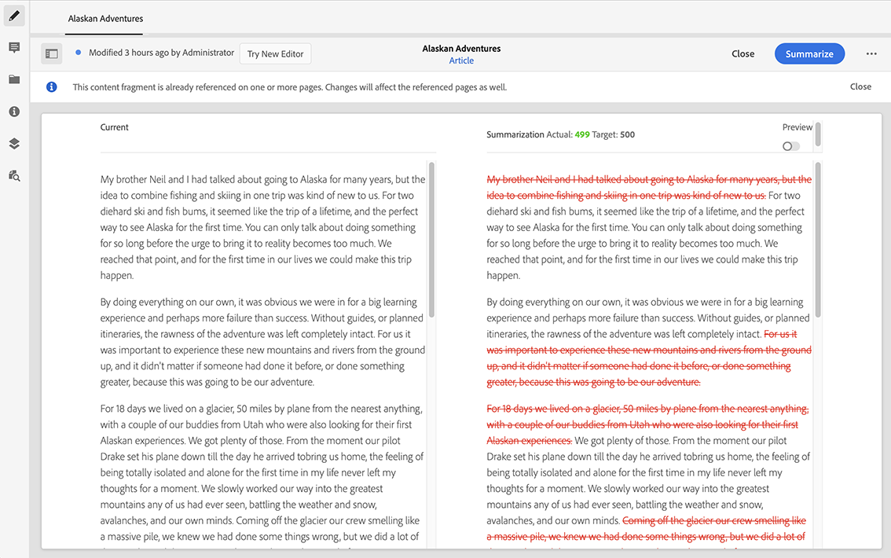

# 變化 - 編寫片段內容{#variations-authoring-fragment-content}

[變數](/help/assets/content-fragments/content-fragments.md#constituent-parts-of-a-content-fragment)是Adobe Experience Manager (AEM) as a Cloud Service中內容片段的重要功能。 這是因為它們可讓您建立和編輯&#x200B;**主要**&#x200B;內容的復本，以用於特定管道和情境。 尤其是，這可讓Headless內容傳送更靈活。

>[!NOTE]
>
>內容片段是 Sites 的一項功能，但儲存為&#x200B;**資產**。
>
>編寫內容片段有兩個編輯器 — 新編輯器和原始編輯器。 新編輯器為預設值。 雖然基本功能相同，但還是有一些差異。
>
>本節介紹原始編輯器。 這是透過新編輯器[開啟的](/help/assets/content-fragments/content-fragments-managing.md#opening-the-fragment-editor)。
>
>如需新編輯器的完整詳細資訊，請參閱Sites檔案[內容片段 — 製作](/help/sites-cloud/administering/content-fragments/authoring.md)。

您可以從&#x200B;**變數**&#x200B;標籤執行下列動作：

* [為您的片段輸入內容](#authoring-your-content)，
* [建立和管理](#managing-variations)主要&#x200B;**內容的變數**，

根據正在編輯的資料型別執行一系列其他動作；例如：

* [將視覺資產插入您的片段](#inserting-assets-into-your-fragment) （影像）

* 選取介於[RTF](#rich-text)、[純文字](#plain-text)和[Markdown](#markdown)之間以進行編輯

* [上傳內容](#uploading-content)

* [檢視索引鍵統計資料](#viewing-key-statistics) （關於多行文字）

* [摘要文字](#summarizing-text)

* [將變數與主要內容同步](#synchronizing-with-master)

>[!CAUTION]
>
>片段發佈和/或參考後，當作者再次開啟片段進行編輯時，AEM會顯示警告。 這是為了警告對片段所做的變更也會影響參照的頁面。

## 製作您的內容 {#authoring-your-content}

當您在原始編輯器中開啟要編輯的內容片段時，**變數**&#x200B;索引標籤預設為開啟。 您可以在此處為主要或任何變數創作內容。 結構化片段包含在內容模型中定義的各種資料型別的欄位。

例如：

您可以：

* 直接在&#x200B;**變數**&#x200B;索引標籤中對您的內容進行編輯；每種資料型別提供不同的編輯選項，例如：

   * 當在模型中設定為（多個）時，各種資料型別可讓您&#x200B;**新增**&#x200B;相關欄位的例項

   * 針對&#x200B;**多行文字**&#x200B;欄位，您也可以開啟[全熒幕編輯器](#full-screen-editor)以：

      * 選取[格式](#formats)
      * 檢視更多編輯選項（[RTF](#rich-text)格式）
      * 存取[個動作](#actions)的範圍

   * 對於&#x200B;**片段參考**&#x200B;欄位，[編輯內容片段](#fragment-references-edit-content-fragment)選項可用，視模型定義而定。

* 將&#x200B;**標籤**&#x200B;指派給目前的變數；標籤可以新增、更新及移除。

   * [標籤](/help/sites-cloud/authoring/sites-console/tags.md)在組織您的片段時功能強大，因為這些標籤可用於內容分類和分類法。 標籤可用於尋找內容（依標籤）並套用大量作業。

      * 搜尋標籤會傳回片段，並反白標籤變數。
      * 變數標籤也可用來將特定內容傳遞網路(CDN)設定檔（用於CDN快取）的變數分組，而不是使用變數名稱。

     例如，您可以將相關片段標籤為「聖誕節啟動」，以僅允許作為子集瀏覽這些片段，或複製這些片段以供日後在新資料夾中再次啟動時使用。

  >[!NOTE]
  >
  >**標籤**&#x200B;也可以新增為&#x200B;**中繼資料**&#x200B;的一部分（至[主要](/help/assets/content-fragments/content-fragments-metadata.md)變數）

* [建立和管理](#managing-variations)主版&#x200B;**內容的變數**。

>[!NOTE]
>
>根據基礎模型中的定義，欄位可能會受特定型別的[驗證](/help/assets/content-fragments/content-fragments-models.md#validation)的限制。

### 全熒幕編輯器 {#full-screen-editor}

編輯多行文字欄位時，您可以開啟全熒幕編輯器；在實際文字中選取，然後選取以下動作圖示：

如此將可開啟全熒幕文字編輯器：

全熒幕文字編輯器提供：

* 存取各種[動作](#actions)
* 根據[格式](#formats)，其他格式選項([RTF](#rich-text))

### 動作 {#actions}

全熒幕編輯器（即多行文字）開啟時，以下動作也可供使用（適用於所有[格式](#formats)）：

* 選取[格式](#formats) （[RTF](#rich-text)，[純文字](#plain-text)，[Markdown](#markdown)）

* [上傳內容](#uploading-content)

* [顯示文字統計資料](#viewing-key-statistics)

* [與主版同步](#synchronizing-with-master) （編輯變數時）

* [摘要文字](#summarizing-text)

### 格式 {#formats}

編輯多行文字的選項取決於所選的格式：

* [RTF 文字](#rich-text)
* [純文字](#plain-text)
* [Markdown](#markdown)

使用全熒幕編輯器時，可選取格式。

### RTF 文字 {#rich-text}

RTF編輯可讓您設定格式：

* 粗體
* 斜體
* 底線
* 對齊方式：左、中、右
* 專案符號清單
* 編號清單
* 縮排：增加、減少
* 建立/中斷超連結
* 貼上文字/從Word
* 插入表格
* 段落樣式：段落，標題1/2/3
* [插入資產](#inserting-assets-into-your-fragment)
* 開啟全熒幕編輯器，下列格式選項可供使用：
   * 搜尋
   * 尋找/取代
   * 拼字檢查
   * [註解](/help/assets/content-fragments/content-fragments-variations.md#annotating-a-content-fragment)
* [插入內容片段](#inserting-content-fragment-into-your-fragment)；當您的&#x200B;**多行文字**&#x200B;欄位設定為&#x200B;**允許片段參考**&#x200B;時可用。

也可以從全熒幕編輯器存取[動作](#actions)。

### 純文字 {#plain-text}

純文字可讓您快速輸入內容，而不需要格式化或Markdown資訊。 您也可以開啟全熒幕編輯器以進一步執行[動作](#actions)。

>[!CAUTION]
>
>如果您選取&#x200B;**純文字**，可能會遺失任何格式設定、標籤或您插入&#x200B;**RTF**&#x200B;或&#x200B;**標籤標籤**&#x200B;的資產。

### Markdown {#markdown}

>[!NOTE]
>
>如需完整資訊，請參閱[Markdown](/help/assets/content-fragments/content-fragments-markdown.md)檔案。

這可讓您使用Markdown設定文字格式。 您可以定義：

* 標題
* 段落和分行符號
* 連結
* 影像
* 區塊引號
* 清單
* 強調
* 程式碼片段
* 反斜線逸出

您也可以開啟全熒幕編輯器以進一步執行[動作](#actions)。

>[!CAUTION]
>
>如果您在 **Rich Text** 和 **** Markdown之間切換，可能會在區塊引號和程式碼區塊中遇到意外的效果，因為這兩種格式在處理方式上可能會有差異。

### 片段參考 {#fragment-references}

如果內容片段模型包含片段參考，您的片段作者可能有其他選項：

* [編輯內容片段](#fragment-references-edit-content-fragment)
* [新內容片段](#fragment-references-new-content-fragment)

#### 編輯內容片段 {#fragment-references-edit-content-fragment}

選項&#x200B;**編輯內容片段**&#x200B;會在新的編輯器標籤中開啟該片段（在相同瀏覽器標籤中）。

再次選取原始索引標籤（例如&#x200B;**Little Pony Inc.**）會關閉此次要索引標籤（在此案例中為&#x200B;**Adam Smith**）。

#### 新內容片段 {#fragment-references-new-content-fragment}

選項&#x200B;**新內容片段**&#x200B;可讓您建立片段。 為此，建立內容片段精靈的變數會在編輯器中開啟。

**若要建立內容片段：**

1. 導覽至並選取所需的資料夾。
1. 正在選取&#x200B;**下一步**。
1. 正在指定屬性；例如&#x200B;**Title**。
1. 正在選取&#x200B;**建立**。
1. 最後：
   1. **完成**：
      * 傳回（至原始片段）
      * 參考新片段
   1. **開啟**：
      * 參考新片段
      * 開啟新片段以在新的瀏覽器標籤中編輯

### 檢視關鍵統計資料 {#viewing-key-statistics}

當全熒幕編輯器開啟時，動作&#x200B;**文字統計資料**&#x200B;會顯示一系列有關文字的資訊。

例如：

### 上傳內容 {#uploading-content}

為了簡化編寫內容片段的流程，您可以上傳在外部編輯器中準備的文字，並將其直接新增到片段中。

### 摘要文字 {#summarizing-text}

摘要文字旨在協助使用者將其文字長度縮短至預先定義的字數，同時保留關鍵點和整體意義。

>[!NOTE]
>
>在更技術性的層面上，系統會根據特定演演算法，保留其評為提供&#x200B;*最佳資訊密度和唯一性比例*&#x200B;的句子。

>[!CAUTION]
>
>內容片段必須具備有效的語言資料夾（ISO代碼）做為祖先；這是用來決定要使用的語言模式。
>
>例如，`en/`如以下路徑：
>
>  `/content/dam/my-brand/en/path-down/my-content-fragment`

>[!CAUTION]
>
>英文是現成可用的。
>
>Software Distribution提供其他語言作為語言模型套件：
>
>* [法文(fr)](https://experience.adobe.com/#/downloads/content/software-distribution/en/aem.html?package=/content/software-distribution/en/details.html/content/dam/aem/public/adobe/packages/cq630/product/smartcontent-model-fr)
>* [德文(de)](https://experience.adobe.com/#/downloads/content/software-distribution/en/aem.html?package=/content/software-distribution/en/details.html/content/dam/aem/public/adobe/packages/cq630/product/smartcontent-model-de)
>* [義大利文(it)](https://experience.adobe.com/#/downloads/content/software-distribution/en/aem.html?package=/content/software-distribution/en/details.html/content/dam/aem/public/adobe/packages/cq630/product/smartcontent-model-it)
>* [西班牙文(es)](https://experience.adobe.com/#/downloads/content/software-distribution/en/aem.html?package=/content/software-distribution/en/details.html/content/dam/aem/public/adobe/packages/cq630/product/smartcontent-model-es)
>

1. 選取&#x200B;**主版**&#x200B;或必要的變數。
1. 開啟全熒幕編輯器。

1. 從工具列選取&#x200B;**摘要文字**。

   

1. 指定目標字數並選取&#x200B;**開始**：
1. 原始文字會與建議的摘要並排顯示：

   * 任何要刪除的句子都會以紅色醒目提示，並加上刪除線。
   * 按一下任何醒目提示的句子，以便將其保留在摘要內容中。
   * 按一下任何未醒目提示的句子，以便將其刪除。

1. 選取&#x200B;**摘要**&#x200B;以確認變更。

1. 原始文字會與建議的摘要並排顯示：

   * 任何要刪除的句子都會以紅色醒目提示，並加上刪除線。
   * 按一下任何醒目提示的句子，以便將其保留在摘要內容中。
   * 按一下任何未醒目提示的句子，以便將其刪除。
   * 顯示摘要統計資料： **實際**&#x200B;和&#x200B;**目標**-
   * 您可以&#x200B;**預覽**&#x200B;變更。

   

### 為內容片段加上註釋 {#annotating-a-content-fragment}

若要為片段加上註釋：

1. 選取&#x200B;**主版**&#x200B;或必要的變數。

1. 開啟全熒幕編輯器。

1. **註釋**&#x200B;圖示在頂端工具列中可供使用。 您可以視需要選取一些文字。

   

1. 對話方塊開啟。 您可以在此處輸入註解。

   

1. 在對話方塊上選取&#x200B;**套用**。

   

   如果註解已套用到選取的文字，則該文字會保持反白狀態。

   

1. 關閉全熒幕編輯器時，註解仍會反白顯示。 如果選取，會開啟一個對話方塊，以便您進一步編輯註釋。

1. 選取「**儲存**」。

1. 關閉全熒幕編輯器時，註解仍會反白顯示。 如果選取，會開啟一個對話方塊，以便您進一步編輯註釋。

   

>[!NOTE]
>
>註解功能不會顯示在新[內容片段編輯器](/help/sites-cloud/administering/content-fragments/authoring.md#commenting-on-your-fragment)中輸入的註解。

### 檢視、編輯和刪除註解 {#viewing-editing-deleting-annotations}

註解：

* 在編輯器的全熒幕和正常模式中，它們由文字上的反白顯示指示。 接著，您可以按一下反白文字，重新開啟對話方塊，以檢視、編輯和/或刪除註解的完整細節。

  >[!NOTE]
  >
  >如果有一段文字套用了多個註解，系統便會提供下拉式選取器。

* 當您刪除套用了註解的整個文字時，註解也會一併刪除。

* 您可以在片段編輯器中選取&#x200B;**註解**&#x200B;索引標籤，以列出或刪除它。

  

* 您可以在所選片段的[時間表](/help/assets/content-fragments/content-fragments-managing.md#timeline-for-content-fragments)中檢視及刪除它。

### 將Assets插入片段 {#inserting-assets-into-your-fragment}

若要簡化編寫內容片段的程式，您可以直接新增[Assets](/help/assets/manage-digital-assets.md) （影像）至片段。

將它們新增到片段的段落序列中，且不加任何格式；在頁面[上使用/參照](/help/sites-cloud/authoring/fragments/content-fragments.md)片段時，可以完成格式設定。

>[!CAUTION]
>
>無法在引用頁面上移動或刪除這些資產，這必須在片段編輯器中完成。
>
>不過，必須在[頁面編輯器](/help/sites-cloud/authoring/fragments/content-fragments.md)中設定資產格式（例如，大小）。 資產在片段編輯器中的呈現方式僅供編寫內容流程之用。

>[!NOTE]
>
>將[影像](/help/assets/content-fragments/content-fragments.md#fragments-with-visual-assets)新增到片段和/或頁面有多種方法。

1. 將游標放在您要新增影像的位置。
1. 使用「插 **入資產** 」圖示開啟搜尋對話方塊。

   

1. 在對話方塊中，您可以導覽至DAM中的所需資產，或在DAM中搜尋資產。

   找到時，按一下縮圖以選取所需資產。

1. 使用 **「選取** 」將資產新增至目前位置之內容片段的段落系統。

   >[!CAUTION]
   >
   >新增資產後，如果您將格式變更為：
   >
   >* **純文字**：資產從片段中遺失。
   >* **Markdown**：資產不可見，但當您返回&#x200B;**RTF格式**&#x200B;時，資產仍會存在。

### 將內容片段插入片段 {#inserting-content-fragment-into-your-fragment}

為了簡化編寫內容片段的流程，您也可以將另一個內容片段新增到片段中。

它們會新增為片段中目前位置的參考。

>[!NOTE]
>
>當您的&#x200B;**多行文字**&#x200B;設定為&#x200B;**允許片段參考**&#x200B;時，此選項可供使用。

>[!CAUTION]
>
>無法在引用頁面上移動或刪除這些資產，這必須在片段編輯器中完成。
>
>不過，必須在[頁面編輯器](/help/sites-cloud/authoring/fragments/content-fragments.md)中設定資產格式（例如，大小）。 資產在片段編輯器中的呈現方式僅供編寫內容流程之用。

>[!NOTE]
>
>將[影像](/help/assets/content-fragments/content-fragments.md#fragments-with-visual-assets)新增到片段和/或頁面有多種方法。

1. 將游標放在您要新增片段的位置。
1. 使用&#x200B;**插入內容片段**&#x200B;圖示開啟搜尋對話方塊。

   

1. 在對話方塊中，您可以導覽至Assets資料夾中的所需片段，或搜尋片段。

   找到時，按一下縮圖以選取所需片段。

1. 使用&#x200B;**Select**&#x200B;將所選內容片段的參考加入您目前內容片段（在目前位置）。

   >[!CAUTION]
   >
   >新增對其他片段的參考後，如果您將格式變更為：
   >
   >* **純文字**：參考從片段中遺失。
   >* **Markdown**：仍保留參考。

## 繼承 {#inheritance}

繼承是可自動將內容從一個片段推送到另一個片段的機制。 繼承的欄位和變數可以是[多網站管理](/help/assets/content-fragments/content-fragments-msm.md)的產品。

您可以取消（然後重新啟用）繼承。 根據內容，這可用於變數，或單個欄位，如果片段是即時副本的一部分。

例如：

* 取消先前設定

  

* 重新啟用繼承（如果繼承已取消）

  

<!--
* Rollout action is also available in Live Copy source

  
-->

## 管理變數 {#managing-variations}

### 建立變數 {#creating-a-variation}

變體可讓您取得&#x200B;**主要**&#x200B;內容，並根據不同目的加以改動（如有需要）。

**若要建立變數：**

>[!NOTE]
>
>變數會為內容片段增加處理時間、在製作環境中和傳送時。 建議您將變異數維持在可控的最低限度。
>
>最佳實務是每個內容片段不超過十個變數。

1. 開啟片段並確保側面板可見。
1. 從側面板的圖示列選取&#x200B;**變數**。
1. 選取&#x200B;**建立變數**。
1. 對話方塊會開啟，讓您為新變數指定&#x200B;**Title**&#x200B;和&#x200B;**Description**。
1. 選取&#x200B;**新增**；片段&#x200B;**Master**&#x200B;已複製到新的變數，現在會開啟以進行[編輯](#editing-a-variation)。

   >[!NOTE]
   >
   >建立變數時，一律會複製&#x200B;**Master**，而非開啟的變數。

   >[!NOTE]
   >
   >當您建立變數時，目前指派給&#x200B;**主要**&#x200B;變數的所有&#x200B;**標籤**&#x200B;都會複製到您的新變數。

### 編輯變數 {#editing-a-variation}

您可以在下列任一情況後變更變數內容：

* [正在建立您的變數](#creating-a-variation)。
* 開啟現有片段，然後從側面板選取所需的變數。

### 重新命名變數 {#renaming-a-variation}

1. 開啟您的片段，然後從側面板選取&#x200B;**變數**。
1. 選取所需的變數。
1. 從&#x200B;**動作**&#x200B;下拉式清單中選取&#x200B;**重新命名**。

1. 在產生的對 **話方塊中** ，輸入新的「 **** 標題」和/或「說明」。

1. 確認&#x200B;**重新命名**&#x200B;動作。

>[!NOTE]
>
>這只會影響變數&#x200B;**標題**。

### 刪除變數 {#deleting-a-variation}

1. 開啟您的片段，然後從側面板選取&#x200B;**變數**。
1. 選取所需的變數。
1. 從&#x200B;**動作**&#x200B;下拉式清單中選取&#x200B;**刪除**。

1. 確認對話方塊中的&#x200B;**刪除**&#x200B;動作。

>[!NOTE]
>
>您無法刪除&#x200B;**主版**。

### 與主版同步 {#synchronizing-with-master}

**Master**&#x200B;是內容片段的一部分，依定義它包含內容的主復本。 而變數則儲存該內容的個別更新及自訂版本。 更新「主版」時，這些變更也可能與變體相關，因此必須傳播至變體。

編輯變數時，您可以存取將變數的目前元素與主版同步的動作。 這可讓您自動將對主版所做的變更複製到所需的變數。

>[!CAUTION]
>
>同步僅可用於將更改從 *主&#x200B;**版複製**到變化*。
>
>只同步變數的目前元素。
>
>同步僅適用於&#x200B;**多行文字**&#x200B;資料型別。
>
>將變 *更從變更傳輸&#x200B;**至Master*** ，不提供選項。

1. 在片段編輯器中開啟您的內容片段。 確定已編輯&#x200B;**主版**。

1. 選取特定變數，然後從下列任一專案選取適當的同步化動作：

   * **動作**&#x200B;下拉式選取器 — **同步目前專案與主專案**

     

   * 全熒幕編輯器的工具列 — **與主版同步**

     

1. 主版和變數會並排顯示：

   * 綠色表示已新增內容（至變數）
   * 紅色表示內容已移除（從變數中）
   * 藍色表示取代的文字

   

1. 選取&#x200B;**同步**，變數會更新並顯示。
