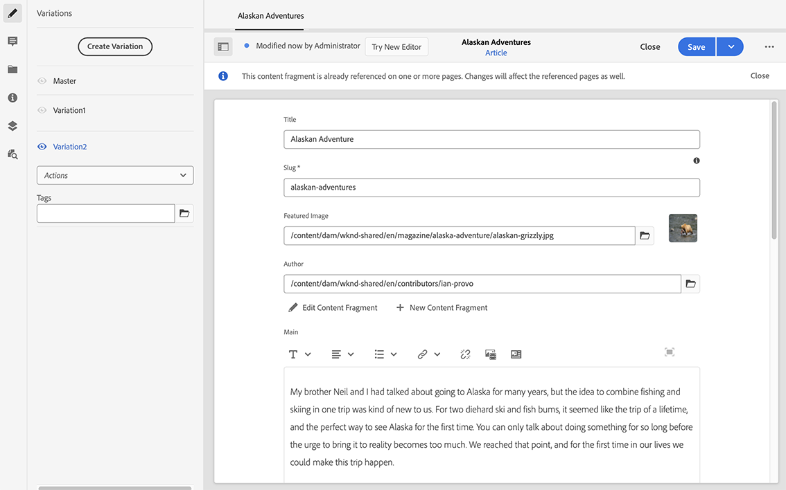

# 變化 - 編寫片段內容{#variations-authoring-fragment-content}

[變數](/help/assets/content-fragments/content-fragments.md#constituent-parts-of-a-content-fragment) 是AEM內容片段的一項重要功能，因為它們可讓您建立和編輯主要內容的副本，以用於特定頻道和/或情境，使headless內容傳送更靈活。

從 **變數** 標籤您可以：

* [輸入內容](#authoring-your-content) 對於您的片段，
* [建立和管理變數](#managing-variations) 的 **主版** 內容，

根據正在編輯的資料型別，執行一系列其他動作；例如：

* [將視覺資產插入片段](#inserting-assets-into-your-fragment) （影像）

* 選擇範圍 [RTF文字](#rich-text)， [純文字](#plain-text) 和 [Markdown](#markdown) 進行編輯

* [上傳內容](#uploading-content)

* [檢視關鍵統計資料](#viewing-key-statistics) （關於多行文字）

* [摘要文字](#summarizing-text)

* [將變數與主要內容同步](#synchronizing-with-master)

>[!CAUTION]
>
>片段發佈和/或參考後，當作者再次開啟片段進行編輯時，AEM將顯示警告。 這是為了警告，片段的變更也會影響參照的頁面。

## 製作您的內容 {#authoring-your-content}

當您開啟內容片段進行編輯時， **變數** 標籤預設為開啟。 您可以在此處為主要或任何變數創作內容。 結構化片段包含內容模型中定義的各種欄位，其資料型別也各不相同。

例如：

您可以：

* 直接在中編輯您的內容 **變數** 標籤；每個資料型別提供不同的編輯選項，例如：

   * 的 **多行文字** 欄位您也可以開啟 [全熒幕編輯器](#full-screen-editor) 至：

      * 選取 [格式](#formats)
      * 檢視更多編輯選項(適用於 [RTF文字](#rich-text) format)
      * 存取範圍 [動作](#actions)

   * 對象 **片段參考** 欄位 [編輯內容片段](#fragment-references-edit-content-fragment) 選項是否可用，取決於模型定義。

* 指派 **標籤** 至目前的變數；標籤可以新增、更新和移除

   * [標籤](/help/sites-cloud/authoring/features/tags.md) 在組織片段時特別強大，因為它們可用於內容分類和分類法。 標籤可用於尋找內容（依標籤）及套用大量作業。

      * 搜尋標籤將傳回片段，並反白標示標籤的變數。
      * 變數標籤也可用來將特定內容傳遞網路(CDN)設定檔的變數分組（用於CDN快取），而不是使用變數名稱。

     例如，您可以將相關片段標籤為「聖誕節啟動」，以僅允許作為子集瀏覽這些片段，或複製它們以供日後在新資料夾中再次啟動時使用。

  >[!NOTE]
  >
  >**標籤** 也可以新增(至 **主版** 變數)，作為 [中繼資料](/help/assets/content-fragments/content-fragments-metadata.md)

* [建立和管理變數](#managing-variations) 的 **主版** 內容。

### 全熒幕編輯器 {#full-screen-editor}

編輯多行文字欄位時，您可以開啟全熒幕編輯器；點選或按一下實際文字，然後選取以下動作圖示：

這將會開啟全熒幕文字編輯器：

全熒幕文字編輯器提供：

* 存取各種 [動作](#actions)
* 根據 [格式](#formats)，其他格式選項([RTF文字](#rich-text))

### 動作 {#actions}

以下動作也可供使用(針對所有 [格式](#formats))全熒幕編輯器（即多行文字）開啟時：

* 選取 [格式](#formats) ([RTF文字](#rich-text)， [純文字，](#plain-text) [Markdown](#markdown))

* [上傳內容](#uploading-content)

* [顯示文字統計資料](#viewing-key-statistics)

* [與主版同步](#synchronizing-with-master) （編輯變數時）

* [摘要文字](#summarizing-text)

### 格式 {#formats}

編輯多行文字的選項取決於所選的格式：

* [RTF](#rich-text)
* [純文字](#plain-text)
* [Markdown](#markdown)

使用全熒幕編輯器時，可選取格式。

### RTF {#rich-text}

RTF編輯可讓您設定格式：

* 粗體
* 斜體
* 底線
* 對齊方式：左、中、右
* 專案符號清單
* 編號清單
* 縮排：增加、減少
* 建立/中斷超連結
* 貼上文字/從Word
* 插入表格
* 段落樣式：段落，標題1/2/3
* [插入資產](#inserting-assets-into-your-fragment)
* 開啟全熒幕編輯器，其中提供下列格式選項：
   * 搜尋
   * 尋找/取代
   * 拼字檢查
   * [註解](/help/assets/content-fragments/content-fragments-variations.md#annotating-a-content-fragment)
* [插入內容片段](#inserting-content-fragment-into-your-fragment)；適用於您的 **多行文字** 欄位已設定為 **允許片段參考**.

此 [動作](#actions) 也可以從全熒幕編輯器存取。

### 純文字 {#plain-text}

純文字可讓您快速輸入內容，而不需要格式化或Markdown資訊。 您也可以開啟全熒幕編輯器以進一步瞭解 [動作](#actions).

>[!CAUTION]
>
>如果您選取「純 **文字** 」 **，可能會遺失您已插入「豐富文字」或「標籤文字」的任何格式、標籤和/或資產******。

### Markdown {#markdown}

>[!NOTE]
>
>如需完整資訊，請參閱 [Markdown](/help/assets/content-fragments/content-fragments-markdown.md) 說明檔案。

這可讓您使用Markdown設定文字格式。 您可以定義：

* 標題
* 段落和分行符號
* 連結
* 影像
* 區塊引號
* 清單
* 強調
* 程式碼區塊
* 反斜線逸出

您也可以開啟全熒幕編輯器以進一步瞭解 [動作](#actions).

>[!CAUTION]
>
>如果您在 **Rich Text** 和 **** Markdown之間切換，可能會在區塊引號和程式碼區塊中遇到意外的效果，因為這兩種格式在處理方式上可能會有差異。

### 片段參考 {#fragment-references}

如果內容片段模型包含片段參考，您的片段作者可能有其他選項：

* [編輯內容片段](#fragment-references-edit-content-fragment)
* [新內容片段](#fragment-references-new-content-fragment)

#### 編輯內容片段 {#fragment-references-edit-content-fragment}

選項 **編輯內容片段** 會在新的編輯器標籤中開啟該片段（在相同瀏覽器標籤中）。

再次選取原始索引標籤(例如， **小馬公司**)，將會關閉此次要索引標籤(在此情況下， **Adam Smith**)。

#### 新內容片段 {#fragment-references-new-content-fragment}

選項 **新內容片段** 將可讓您建立全新的片段。 為此，將在編輯器中開啟建立內容片段精靈的變體。

然後，您將能夠透過以下方式建立新片段：

1. 導覽至並選取所需的資料夾。
1. 選取 **下一個**.
1. 指定屬性；例如 **標題**.
1. 選取 **建立**.
1. 最後：
   1. **完成**:
      * 傳回（至原始片段）
      * 參考新片段
   1. **開啟**:
      * 參考新片段
      * 開啟新片段以在新的瀏覽器標籤中編輯

### 檢視關鍵統計資料 {#viewing-key-statistics}

當全螢幕編輯器開啟時，「文字統計 **資料** 」動作會顯示一系列有關文字的資訊。

例如：

### 上傳內容 {#uploading-content}

為了簡化編寫內容片段的流程，您可以上傳在外部編輯器中準備的文字，並將其直接新增到片段中。

### 摘要文字 {#summarizing-text}

摘要文字旨在協助使用者將其文字長度縮短至預先定義的字數，同時保留關鍵點和整體意義。

>[!NOTE]
>
>在較技術性的層面上，系統保留其評為提供的句子 *最佳資訊密度和唯一性比例* 根據特定演演算法。

>[!CAUTION]
>
>內容片段必須有有效的語言資料夾（ISO代碼）作為祖先；這用於決定要使用的語言模式。
>
>例如， `en/` 與以下路徑相同：
>
>  `/content/dam/my-brand/en/path-down/my-content-fragment`

>[!CAUTION]
>
英文是現成可用的。
>
Software Distribution提供其他語言作為語言模型套件：
>
* [French(fr)](https://experience.adobe.com/#/downloads/content/software-distribution/en/aem.html?package=/content/software-distribution/en/details.html/content/dam/aem/public/adobe/packages/cq630/product/smartcontent-model-fr)
* [German(de)](https://experience.adobe.com/#/downloads/content/software-distribution/en/aem.html?package=/content/software-distribution/en/details.html/content/dam/aem/public/adobe/packages/cq630/product/smartcontent-model-de)
* [Italian(it)](https://experience.adobe.com/#/downloads/content/software-distribution/en/aem.html?package=/content/software-distribution/en/details.html/content/dam/aem/public/adobe/packages/cq630/product/smartcontent-model-it)
* [Spanish(es)](https://experience.adobe.com/#/downloads/content/software-distribution/en/aem.html?package=/content/software-distribution/en/details.html/content/dam/aem/public/adobe/packages/cq630/product/smartcontent-model-es)
>

1. 選取 **主版** 或必要的變數。
1. 開啟全熒幕編輯器。

1. 選取 **摘要文字** （從工具列）。

   

1. 指定目標字數並選取 **開始**：
1. 原始文字會與建議的摘要並排顯示：

   * 任何要刪除的句子都會以紅色醒目提示，並加上刪除線。
   * 按一下任何醒目提示的句子，將其保留在摘要內容中。
   * 按一下任何未醒目提示的句子以將其刪除。

1. 選取 **摘要** 以確認變更。

1. 原始文字會與建議的摘要並排顯示：

   * 任何要刪除的句子都會以紅色醒目提示，並加上刪除線。
   * 按一下任何醒目提示的句子，將其保留在摘要內容中。
   * 按一下任何未醒目提示的句子以將其刪除。
   * 會顯示摘要統計資料： **實際** 和 **Target**-
   * 您可以 **預覽** 變更。

   

### 為內容片段加上註釋 {#annotating-a-content-fragment}

若要為片段加上註釋：

1. 選取 **主版** 或必要的變數。

1. 開啟全熒幕編輯器。

1. 此 **註釋** 圖示在頂端工具列中提供。 您可以視需要選取一些文字。

   

1. 將會開啟對話方塊。 您可以在此處輸入附註。

   

1. 選取 **套用** 在對話方塊上。

   

   如果將註解套用至選取的文字，則該文字將保持反白狀態。

   

1. 關閉全熒幕編輯器，註解仍會反白顯示。 如果選取，將會開啟對話方塊，以便您進一步編輯註釋。

1. 選取&#x200B;**儲存**。

1. 關閉全熒幕編輯器，註解仍會反白顯示。 如果選取，將會開啟對話方塊，以便您進一步編輯註釋。

   

### 檢視、編輯、刪除註解 {#viewing-editing-deleting-annotations}

註解:

* 在編輯器的全熒幕和正常模式中，由文字上的反白顯示指示。 接著，您可以按一下醒目提示的文字，以檢視、編輯和/或刪除註解的完整詳細資料，該文字將會重新開啟對話方塊。

  >[!NOTE]
  >
  如果有一段文字套用了多個註解，則會提供下拉式選擇器。

* 當您刪除套用了註解的整個文字時，註解也會一併刪除。

* 可透過選取 **註解** 索引標籤進行標籤。

  

* 可以在以下位置檢視和刪除： [時間表](/help/assets/content-fragments/content-fragments-managing.md#timeline-for-content-fragments) 用於選取的片段。

### 將資產插入片段 {#inserting-assets-into-your-fragment}

若要簡化編寫內容片段的程式，您可以新增 [資產](/help/assets/manage-digital-assets.md) （影像）直接放入片段。

將它們新增到片段的段落序列中，且不加任何格式；格式設定可在 [在頁面上使用/參考片段](/help/sites-cloud/authoring/fundamentals/content-fragments.md).

>[!CAUTION]
>
無法在引用頁面上移動或刪除這些資產，這必須在片段編輯器中完成。
>
不過，資產的格式（例如大小）必須在以下位置完成： [頁面編輯器](/help/sites-cloud/authoring/fundamentals/content-fragments.md). 資產在片段編輯器中的呈現方式僅供編寫內容流程之用。

>[!NOTE]
>
有多種新增方法 [影像](/help/assets/content-fragments/content-fragments.md#fragments-with-visual-assets) 至片段和/或頁面。

1. 將游標置於要添加影像的位置。
1. 使用「插 **入資產** 」圖示開啟搜尋對話方塊。

   

1. 在對話方塊中，您可以：

   * 導覽至DAM中的必要資產
   * 在DAM中搜尋資產

   找到後，按一下縮圖以選取所需的資產。

1. 使用 **「選取** 」將資產新增至目前位置之內容片段的段落系統。

   >[!CAUTION]
   >
   如果新增資產後，您將格式變更為：
   * **純文字**：資產從片段中完全遺失。
   * **Markdown**:資產將不可見，但當您返回 **Rich Text時，資產仍會存在**。

### 將內容片段插入片段 {#inserting-content-fragment-into-your-fragment}

為了簡化編寫內容片段的流程，您也可以將另一個內容片段新增到片段中。

它們將作為參考新增到片段中的目前位置。

>[!NOTE]
>
當您符合以下條件時，即可使用此選項： **多行文字** 已設定為 **允許片段參考**.

>[!CAUTION]
>
無法在引用頁面上移動或刪除這些資產，這必須在片段編輯器中完成。
>
不過，資產的格式（例如大小）必須在以下位置完成： [頁面編輯器](/help/sites-cloud/authoring/fundamentals/content-fragments.md). 資產在片段編輯器中的呈現方式僅供編寫內容流程之用。

>[!NOTE]
>
有多種新增方法 [影像](/help/assets/content-fragments/content-fragments.md#fragments-with-visual-assets) 至片段和/或頁面。

1. 將游標置於您要新增片段的位置。
1. 使用 **插入內容片段** 圖示以開啟搜尋對話方塊。

   

1. 在對話方塊中，您可以：

   * 導覽至「資產」資料夾中的所需片段
   * 搜尋片段

   找到後，按一下縮圖以選取所需的片段。

1. 使用 **選取** 將所選內容片段的參考新增至您目前內容片段（在目前位置）。

   >[!CAUTION]
   >
   如果在新增對其他片段的引用後，您將格式變更為：
   * **純文字**：參考從片段中完全遺失。
   * **Markdown**：會保留參考。

## 管理變數 {#managing-variations}

### 建立變數 {#creating-a-variation}

變數可讓您取得 **主版** 內容並根據不同目的（如有需要）而有所不同。

若要建立新的變數：

1. 開啟片段並確保側面板可見。
1. 選取 **變數** 從側面板的圖示列。
1. 選取 **建立變數**.
1. 將會開啟對話方塊，指定新變 **數的****「標題」(Title)和「說明」(Description** )。
1. 選取 **新增**；片段 **主版** 會複製到新的變數，該變數現在會針對 [編輯](#editing-a-variation).

   >[!NOTE]
   >
   建立新變數時，一律會進行 **主版** 而不是目前開啟的變數。

   >[!NOTE]
   >
   當您建立新的變數時，所有 **標籤** 目前指派給 **主版** 變數會複製到您的新變數中。

### 編輯變數 {#editing-a-variation}

您可以在下列任一情況後變更變數內容：

* [建立您的變數](#creating-a-variation).
* 開啟現有片段，然後從側面板中選取所需的變數。

### 重新命名變數 {#renaming-a-variation}

若要重新命名現有的變數，請執行下列動作：

1. 開啟您的片段並選取 **變數** 從側面板。
1. 選取所需的變數。
1. 選取 **重新命名** 從 **動作** 下拉式清單。

1. 在產生的對 **話方塊中** ，輸入新的「 **** 標題」和/或「說明」。

1. 確認 **重新命名** 動作。

>[!NOTE]
>
這只會影響變數 **標題**.

### 刪除變數 {#deleting-a-variation}

若要刪除現有變數，請執行下列動作：

1. 開啟您的片段並選取 **變數** 從側面板。
1. 選取所需的變數。
1. 選取 **刪除** 從 **動作** 下拉式清單。

1. 確認 **刪除** 動作。

>[!NOTE]
>
您無法刪除 **主版**.

### 與主版同步 {#synchronizing-with-master}

**主版** 是內容片段不可或缺的一部分，依定義它會儲存內容的主副本，而變數會儲存該內容的個別更新及自訂版本。 更新Master時，這些變更也可能與變數相關，因此需要傳播到變數。

編輯變數時，您有權存取動作，以將變數的目前元素與主版同步。 這可讓您自動將對主版所做的變更複製到所需的變數。

>[!CAUTION]
>
同步僅可用於將更改從 *主&#x200B;**版複製**到變化*。
>
只同步變數的目前元素。
>
同步只適用於多 **行文本** -資料類型。
>
將變 *更從變更傳輸&#x200B;**至Master*** ，不提供選項。

1. 在片段編輯器中開啟您的內容片段。 確保 **主版** 已編輯。

1. 選取特定變數，然後從下列任一專案選取適當的同步化動作：

   * 此 **動作** 下拉式選擇器 —  **將目前元素與主元素同步**

     

   * 全熒幕編輯器的工具列 —  **與主版同步**

     

1. 主版和變數會並排顯示：

   * 綠色表示已新增內容（至變數）
   * 紅色表示內容已移除（從變數中）
   * 藍色表示取代的文字

   

1. 選取 **同步**，則會更新並顯示變數。
