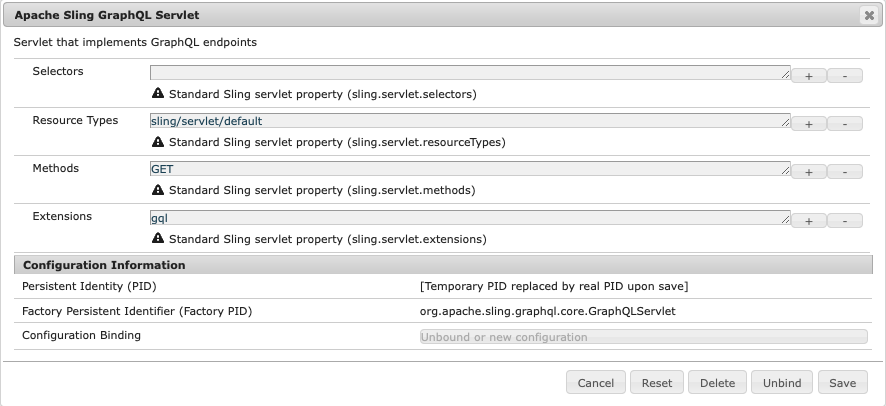

# AEM GraphQL API，用於內容片段{#graphql-api-for-use-with-content-fragments}

>[!CAUTION]
>
>AEM GraphQL API（針對內容片段傳送）將於2021年初發行。
>
>相關檔案已可供預覽使用。

與內容片段搭配使用的Adobe Experience Manager As a Cloud Service(AEM)GraphQL API，主要是以標準、開放原始碼的GraphQL API為基礎。

在AEM中使用GraphQL API，可在無頭CMS實作中，將內容片段有效率地傳送至JavaScript用戶端：

* 避免重複的API要求，就像REST一樣，
* 確保交付內容僅限於特定要求，
* 允許大量傳送回應單一API查詢所需的內容。

## GraphQL API {#graphql-api}

*「GraphQL是Facebook在2012年內部開發的資料查詢語言和規格，後來於2015年公開開放。它為基於REST的體系結構提供了替代方案，其目的是提高開發人員的生產力並將傳輸的資料量減至最少。 GraphQL由數百個各種規模的組織在生產中使用……&quot;*&#x200B;請參閱[ GraphQL Foundation](https://foundation.graphql.org/)。

有關GraphQL API的詳細資訊，請參見以下各節（以及其他許多資源）:

* 在[graphql.org](https://graphql.org):

   * [GraphQL簡介](https://graphql.org/learn)

   * [GraphQL規範](http://spec.graphql.org/)

* 在[graphql.com](https://graphql.com):

   * [參考線](https://www.graphql.com/guides/)

   * [教學課程](https://www.graphql.com/tutorials/)

   * [精彩案例](https://www.graphql.com/case-studies/)

適用於AEM實作的GraphQL是以標準GraphQL Java程式庫為基礎。 請參閱：

* [graphQL.org - Java](https://graphql.org/code/#java)

* [GraphQL Java at GitHub](https://github.com/graphql-java)

## 圖形QL介面{#graphiql-interface}

AEM Graph API包含標準[GraphiQL](https://graphql.org/learn/serving-over-http/#graphiql)介面的實作。 這可讓您直接輸入並測試查詢。

例如：

* `http://localhost:4502/content/graphiql.html`

它提供語法反白顯示、自動完成、自動建議等功能，以及歷史記錄和線上檔案：


## 作者和發佈環境的使用案例{#use-cases-author-publish-environments}

使用案例可視AEM的雲端服務環境類型而定：

* 發佈環境；用於：
   * JS應用程式的查詢資料（標準使用案例）

* 作者環境；用於：
   * 查詢資料以「進行內容管理」:
      * AEM中的GraphQL（雲端服務）目前是唯讀API。
      * REST API可用於CR(u)D操作。

## 方案生成{#schema-generation}

GraphQL是強式型別的API，這表示資料必須依類型清楚地結構化和組織。

GraphQL規範提供了一系列指引，說明如何建立用於查詢特定實例上資料的強穩API。 為此，客戶端需要讀取[Schema](#schema-generation)，該&lt;a0/>包含查詢所需的所有類型。

對於內容片段，GraphQL結構（結構和類型）基於[內容片段模型](/help/assets/content-fragments/content-fragments-models.md)及其資料類型。

例如，如果使用者建立名為`Article`的內容片段模型，AEM會產生類型為`ArticleModel`的物件`article`。 此類型中的欄位對應於模型中定義的欄位和資料類型。

1. 內容片段模型：

   

1. 對應的GraphQL模式（從GraphiQL自動文檔輸出i）:
   

   這表示產生的類型`ArticleModel`包含數個[欄位](#fields)。

   * 其中3個由用戶控制：`author`、`main`和`linked_article`。

   * AEM會自動新增其他欄位，並代表提供特定內容片段相關資訊的實用方法；在此範例中，`_path`、`_metadata`、`_variations`。 這些[幫助欄位](#helper-fields)標有前面的`_`，以區分由用戶定義的內容和已自動生成的內容。

1. 當使用者根據文章模型建立內容片段後，就可透過GraphQL進行詢問。 如需範例，請參閱[範例查詢](/help/assets/content-fragments/content-fragments-graphql-samples.md#graphql-sample-queries)（根據[範例內容片段結構，以便與GraphQL](/help/assets/content-fragments/content-fragments-graphql-samples.md#content-fragment-structure-graphql)搭配使用）。

在GraphQL for AEM中，架構是有彈性的。 這表示每次建立、更新或刪除內容片段模型時都會自動產生此片段。 更新內容片段模型時，也會重新整理資料結構快取。

Sites GraphQL服務會監聽（在背景）對內容片段模型所做的任何修改。 檢測到更新時，只會重新生成模式的該部分。 此最佳化可節省時間並提供穩定性。

例如，如果：

1. 安裝包含`Content-Fragment-Model-1`和`Content-Fragment-Model-2`的軟體包：

   1. 將生成`Model-1`和`Model-2`的GraphQL類型。

1. 然後修改`Content-Fragment-Model-2`:

   1. 只有`Model-2` GraphQL類型會更新。

   1. 而`Model-1`則保持不變。

>[!NOTE]
>
>請務必注意，以防您透過REST api或其他方式對內容片段模型進行大量更新。

模式通過與GraphQL查詢相同的端點服務，客戶端處理以`GQLschema`副檔名調用模式的事實。 例如，對`/content/graphql/endpoint.GQLschema`執行簡單的`GET`請求將導致輸出具有Content-type的架構：`text/x-graphql-schema;charset=iso-8859-1`。

## 欄位 {#fields}

在架構中，有兩個基本類別的個別欄位：

* 您產生的欄位。

   選擇[欄位類型](#field-types)會用來根據您的內容片段模型設定欄位。 欄位名稱取自&#x200B;**資料類型**&#x200B;的&#x200B;**屬性名稱**&#x200B;欄位。

   * 還有&#x200B;**Render As**&#x200B;屬性要考慮，因為用戶可以配置某些資料類型；例如，單行文字或多欄位。

* GraphQL for AEM也會產生許多[協助欄位](#helper-fields)。

   這些用來識別內容片段，或取得內容片段的詳細資訊。

### 欄位類型{#field-types}

GraphQL for AEM支援類型清單。 所有支援的內容片段模型資料類型和相應的GraphQL類型都表示：

| 內容片段模型——資料類型 | GraphQL類型 | 說明 |
|--- |--- |--- |
| 單行文字 | 字串、[字串] |  用於簡單字串，例如作者名稱、位置名稱等 |
| 多行文字 | 字串 |  用於輸出文字，例如文章的正文 |
| 數量 |  浮點、[浮點] | 用於顯示浮點數和常規數 |
| 布林值 (Boolean) |  布林函數 |  用於顯示複選框→簡單的true/false語句 |
| 日期和時間 | 日曆 |  用於以ISO 8086格式顯示日期和時間 |
| 列舉 |  String |  用於從建立模型時定義的選項清單中顯示選項 |
|  標記 |  [String] |  用於顯示代表AEM中使用之標籤之字串清單 |
| 內容參考資料 |  字串 |  用於在AEM中顯示指向其他資產的路徑 |
| 片段引用 |  *A模型類型* |  用於引用某個「模型類型」的另一個「內容片段」（在建立模型時定義） |

### 輔助欄位{#helper-fields}

除了使用者產生欄位的資料類型外，GraphQL for AEM也會產生許多&#x200B;*helper*&#x200B;欄位，以協助識別內容片段，或提供內容片段的其他資訊。

#### 路徑 {#path}

路徑欄位用作GraphQL中的標識符。 它代表AEM儲存庫內的「內容片段」資產路徑。 我們選擇此為內容片段的識別碼，因為它：

* 在AEM中是唯一的，
* 很容易被牽扯。

下列程式碼會顯示根據內容片段模型`Person`所建立之所有內容片段的路徑。

```xml
{
  persons {
    items {
      _path
    }
  }
}
```

若要擷取特定類型的單一內容片段，您還需要先決定其路徑。 例如：

```xml
{
    person(_path="/content/dam/path/to/fragment/john-doe") {
        _path
        name
        first-name
    }
}
```

請參閱[範例查詢——單一城市片段](/help/assets/content-fragments/content-fragments-graphql-samples.md#sample-single-city-fragment)。

#### 中繼資料 {#metadata}

AEM也透過GraphQL公開內容片段的中繼資料。 中繼資料是描述內容片段的資訊，例如內容片段的標題、縮圖路徑、內容片段的說明、建立日期等。

由於中繼資料是透過架構編輯器產生，因此沒有特定結構，因此`TypedMetaData` GraphQL類型已實作以公開內容片段的中繼資料。 `TypedMetaData` 公開按以下標量類型分組的資訊：

| 欄位 |
|--- |
| `stringMetadata:[StringMetadata]!` |
| `stringArrayMetadata:[StringArrayMetadata]!` |
| `intMetadata:[IntMetadata]!` |
| `intArrayMetadata:[IntArrayMetadata]!` |
| `floatMetadata:[FloatMetadata]!` |
| `floatArrayMetadata:[FloatArrayMetadata]!` |
| `booleanMetadata:[BooleanMetadata]!` |
| `booleanArrayMetadata:[booleanArrayMetadata]!`  |
| `calendarMetadata:[CalendarMetadata]!` |
| `calendarArrayMetadata:[CalendarArrayMetadata]!` |

每個標量類型代表單個名稱——值對或名稱——值對陣列，其中該對的值是其所分組的類型。

例如，如果您想要擷取內容片段的標題，我們知道此屬性是字串屬性，因此我們會查詢所有字串中繼資料：

要查詢元資料，請執行以下操作：

```xml
{
  person(_path: "/content/dam/path/to/fragment/john-doe") {
    _path
    _metadata {
      stringMetadata {
        name
        value
      }
    }
  }
}
```

如果查看生成的GraphQL模式，則可以查看所有元資料GraphQL類型。 所有型號類型都有相同的`TypedMetaData`。

>[!NOTE]
>
>**正常元資料和陣列元資料之間的差異**
>請記住，`StringMetadata`和`StringArrayMetadata`都引用儲存在儲存庫中的內容，而不是如何檢索它們。
>
>因此，例如，通過調用`stringMetadata`欄位，您將收到儲存在儲存庫中的所有元資料的陣列作為`String`，如果調用`stringArrayMetadata`，您將收到儲存在儲存庫中的所有元資料的陣列作為`String[]`。

請參閱[中繼資料的範例查詢——列出標題為GB](/help/assets/content-fragments/content-fragments-graphql-samples.md#sample-metadata-awards-gb)的獎項中繼資料。

#### 變數 {#variations}

`_variations`欄位已實作，以簡化查詢內容片段的變化。 例如：

```xml
{
  person(_path: "/content/dam/path/to/fragment/john-doe") {
    _variations
  }
}
```

請參閱[範例查詢——具有命名變數的所有城市](/help/assets/content-fragments/content-fragments-graphql-samples.md#sample-cities-named-variation)。

<!--
## Security Considerations {#security-considerations}
-->

## GraphQL變數{#graphql-variables}

GraphQL允許將變數放在查詢中。 有關詳細資訊，請參見GraphiQL的[GraphQL文檔。](https://graphql.org/learn/queries/#variables)

例如，要獲取具有特定變化的`Article`類型的所有內容片段，可以在GraphiQL中指定變數`variation`:


```xml
### query
query GetArticlesByVariation($variation: String!) {
    articles(variation: $variation) {
        items {
            _path
            author
        }
    }
}
 
### in query variables
{
    "variation": "uk"
}
```

## GraphQL指令{#graphql-directives}

在GraphQL中，有可能根據變數更改查詢，稱為GraphQL指令。

例如，您可以在查詢中根據變數`includePrice`包含`adventurePrice`欄位，以查詢所有`AdventureModels`。


```xml
query getAdventureByType($includePrice: Boolean!) {
  adventures {
    items {
      adventureType
      adventurePrice @include(if: $includePrice)
    }
  }
}
 
### in query variables
{
    "includePrice": true
}
```

## 持續查詢（快取）{#persisted-queries-caching}

在準備具有POST請求的查詢後，就可以使用GET請求執行，而HTTP快取或CDN可快取該查詢。

這是必要的，因為POST查詢通常不進行快取，而且如果將GET與查詢搭配使用，則參數對HTTP服務和中間產品而言變得過大的風險很大。

以下是保存給定查詢所需的步驟：

>[!NOTE]
>在此之前，**GraphQL持久性查詢**&#x200B;需要啟用，以便進行相應的配置。 如需詳細資訊，請參閱設定瀏覽器中的[啟用內容片段功能。](/help/assets/content-fragments/content-fragments-configuration-browser.md#enable-content-fragment-functionality-in-configuration-browser)

1. 將查詢PUTing到新的端點URL `/graphql/persist.json/<config>/<persisted-label>`來準備該查詢。

   例如，建立持續查詢：

   ```xml
   $ curl -X PUT \
       -H 'authorization: Basic YWRtaW46YWRtaW4=' \
       -H "Content-Type: application/json" \
       "http://localhost:4502/graphql/persist.json/wknd/plain-article-query" \
       -d \
   '{
     articleList {
       items{
           _path
           author
           main {
               json
           }
       }
     }
   }'
   ```

1. 此時，請檢查回應。

   例如，檢查是否成功：

   ```xml
   {
     "action": "create",
     "configurationName": "wknd",
     "name": "plain-article-query",
     "shortPath": "/wknd/plain-article-query",
     "path": "/conf/wknd/settings/graphql/persistentQueries/plain-article-query"
   }
   ```

1. 然後，您可以透過GETing the URL `/graphql/execute.json/<shortPath>`來重播持續查詢。

   例如，使用持續查詢：

   ```xml
   $ curl -X GET \
       http://localhost:4502/graphql/execute.json/wknd/plain-article-query
   ```

1. 將POSTing的持續查詢更新為現有的查詢路徑。

   例如，使用持續查詢：

   ```xml
   $ curl -X POST \
       -H 'authorization: Basic YWRtaW46YWRtaW4=' \
       -H "Content-Type: application/json" \
       "http://localhost:4502/graphql/persist.json/wknd/plain-article-query" \
       -d \
   '{
     articleList {
       items{
           _path
           author
           main {
               json
           }
         referencearticle {
           _path
         }
       }
     }
   }'
   ```

1. 建立包裝的普通查詢。

   例如：

   ```xml
   $ curl -X PUT \
       -H 'authorization: Basic YWRtaW46YWRtaW4=' \
       -H "Content-Type: application/json" \
       "http://localhost:4502/graphql/persist.json/wknd/plain-article-query-wrapped" \
       -d \
   '{ "query": "{articleList { items { _path author main { json } referencearticle { _path } } } }"}'
   ```

1. 使用快取控制建立包裝的純查詢。

   例如：

   ```xml
   $ curl -X PUT \
       -H 'authorization: Basic YWRtaW46YWRtaW4=' \
       -H "Content-Type: application/json" \
       "http://localhost:4502/graphql/persist.json/wknd/plain-article-query-max-age" \
       -d \
   '{ "query": "{articleList { items { _path author main { json } referencearticle { _path } } } }", "cache-control": { "max-age": 300 }}'
   ```

1. 使用參數建立持續查詢：

   例如：

   ```xml
   $ curl -X PUT \
       -H 'authorization: Basic YWRtaW46YWRtaW4=' \
       -H "Content-Type: application/json" \
       "http://localhost:4502/graphql/persist.json/wknd/plain-article-query-parameters" \
       -d \
   'query GetAsGraphqlModelTestByPath($apath: String!, $withReference: Boolean = true) {
     articleByPath(_path: $apath) {
       item {
         _path
           author
           main {
           plaintext
           }
           referencearticle @include(if: $withReference) {
           _path
           }
         }
       }
     }'
   ```

1. 使用參數執行查詢。

   例如：

   ```xml
   $ curl -X POST \
       -H 'authorization: Basic YWRtaW46YWRtaW4=' \
       -H "Content-Type: application/json" \
       "http://localhost:4502/graphql/execute.json/wknd/plain-article-query-parameters;apath=%2fcontent2fdam2fwknd2fen2fmagazine2falaska-adventure2falaskan-adventures;withReference=false"
   
   $ curl -X GET \
       "http://localhost:4502/graphql/execute.json/wknd/plain-article-query-parameters;apath=%2fcontent2fdam2fwknd2fen2fmagazine2falaska-adventure2falaskan-adventures;withReference=false"
   ```

1. 要在發佈時執行查詢，需要複製相關的持久樹

   * 使用POST進行複製：

      ```xml
      $curl -X POST   http://localhost:4502/bin/replicate.json \
        -H 'authorization: Basic YWRtaW46YWRtaW4=' \
        -F path=/conf/wknd/settings/graphql/persistentQueries/plain-article-query \
        -F cmd=activate
      ```

   * 使用包：
      1. 建立新包定義。
      1. 包括配置（例如`/conf/wknd/settings/graphql/persistentQueries`）。
      1. 建立套件。
      1. 複製包。
   * 使用複製／分發工具。
      1. 前往「散發」工具。
      1. 為配置選擇樹激活（例如`/conf/wknd/settings/graphql/persistentQueries`）。
   * 使用工作流（通過工作流啟動程式配置）:
      1. 定義工作流啟動程式規則，用於執行將複製不同事件（例如，建立、修改等）上的配置的工作流模型。


1. 在查詢設定開啟發佈後，就會套用相同的原則，只要使用發佈端點。

   >[!NOTE]
   >
   >對於匿名訪問，系統假定ACL允許「每個人」訪問查詢配置。
   >
   >如果不是這樣，它將無法執行。

   >[!NOTE]
   >
   >URL中的任何分號(&quot;;&quot;)都需要進行編碼。
   >
   >例如，如同在「執行持續查詢」的請求中：
   >
   >
   ```xml
   >curl -X GET \ "http://localhost:4502/graphql/execute.json/wknd/plain-article-query-parameters%3bapath=%2fcontent2fdam2fwknd2fen2fmagazine2falaska-adventure2falaskan-adventures;withReference=false"
   >```

## 從外部網站{#query-graphql-endpoint-from-external-website}查詢GraphQL端點

>[!NOTE]
>
>如需AEM中CORS資源共用原則的詳細概觀，請參閱[瞭解跨原始資源共用(CORS)](https://experienceleague.adobe.com/docs/experience-manager-learn/foundation/security/understand-cross-origin-resource-sharing.html?lang=en#understand-cross-origin-resource-sharing-(cors))。

若要允許協力廠商網站使用JSON輸出，必須在客戶Git儲存庫中設定CORS原則。 若要這麼做，請新增適當的OSGi CORS設定檔以用於所需端點。 此設定應指定應授與存取權的受信任網站名稱（或regex）。

* 訪問GraphQL端點：

   * alloworgin:[您的域]或alloworiginregexp:[您的網域regex]
   * 支援的方法：[POST]
   * 允許路徑：[&quot;/apps/graphql-enablement/content/endpoint.gql(/persigned)?&quot;]

* 訪問GraphQL持久查詢端點：

   * alloworgin:[您的域]或alloworiginregexp:[您的網域regex]
   * 支援的方法：[GET]
   * 允許路徑：[&quot;/graphql/execute.json/.*&quot;]

>[!CAUTION]
>
>客戶仍有責任：
>
>* 僅授與受信任網域的存取權
>* 不使用通配符[*]語法；這將使GraphQL端點向全世界公開。


## 篩選{#filtering}

您也可以在GraphQL查詢中使用篩選來傳回特定資料。

篩選使用基於邏輯運算子和運算式的語法。

如需範例，請參閱：

* [GraphQL for AEM extensions](/help/assets/content-fragments/content-fragments-graphql-samples.md#graphql-some-extensions)的詳細資訊

* [範例內容與結](/help/assets/content-fragments/content-fragments-graphql-samples.md#content-fragment-structure-graphql) 構已準備好供範例查詢使用

* [使用此示例內容和結構的示例查詢](/help/assets/content-fragments/content-fragments-graphql-samples.md#graphql-sample-queries-sample-content-fragment-structure)

* [基於WKND項目的示例查詢](/help/assets/content-fragments/content-fragments-graphql-samples.md#sample-queries-using-wknd-project)

## 權限 {#permission}

權限是存取「資產」所需的權限。

<!-- to be addressed later -->

<!-- 
## Authentication {#authentication}
-->

<!-- to be addressed later -->

<!-- 
## Caching {#caching}
-->

<!-- to be addressed later -->

<!--
## Sorting {#sorting}
-->

<!-- to be addressed later -->

<!--
## Paging {#paging}
-->

## 端點{#end-points}

端點是用來存取GraphQL for AEM的路徑。 您（或您的應用程式）可以使用此路徑：

* 訪問GraphQL模式，
* 發送您的GraphQL查詢，
* 接收響應（對您的GraphQL查詢）。

若要在AEM中存取GraphQL Servlet，您必須設定端點。 這還包括兩個OSGi配置。

1. 回應擷取GraphQL架構之請求的Sling架構servlet:

   

   * **選擇器** (`sling.servlet.selectors`)必須留空。

   * **資源類型** (`sling.servlet.resourceTypes`)定義GraphQL servlet應監聽的資源類型。例如：
      `graphql-enablement/components/endpoint`。

   * **方法** (`sling.servlet.methods^)

      servlet應監聽的HTTP方法；通常`GET`。

   * **擴充功能** (`sling.servlet.extensions`)

      指定方案Servlet應響應的副檔名。 在本例中，它是`GQLschema` ，與GraphQL規範相容。

2. 響應graphql請求的servlet:

   

   * **選擇器** (`sling.servlet.selectors`)必須留空。

   * **資源類型** (`sling.servlet.resourceTypes`)GraphQL servlet應響應的資源類型。例如，`graphql-enablement/components/endpoint`。

   * **方法** (`sling.servlet.methods`)GraphQL servlet應響應的HTTP方法，通常 `GET` 和 `POST`。

   * **Extensions** (`sling.servlet.extensions`)用於監聽GraphQL請求的擴展，通常 `gql`。

3. 您現在需要建立端點——這些組態中定義的sling:resourceType節點。
例如，要建立用於檢索GraphQL模式的端點，請在`/apps/<my-site>/graphql`下建立一個新節點：

   * 名稱: `endpoint`
   * 主要類型：`nt:unstructured`
   * sling:resourceType: `graphql-enablement/components/endpoint`

## 常見問題{#faqs}

出現的問題：

1. **問**:&quot;*GraphQL API for AEM與Query Builder API有何不同？*&quot;

   * **答**:「AEM *GraphQL API提供JSON輸出的完整控制，是查詢內容的業界標準。未來，AEM將計畫投資AEM GraphQL API。*&quot;