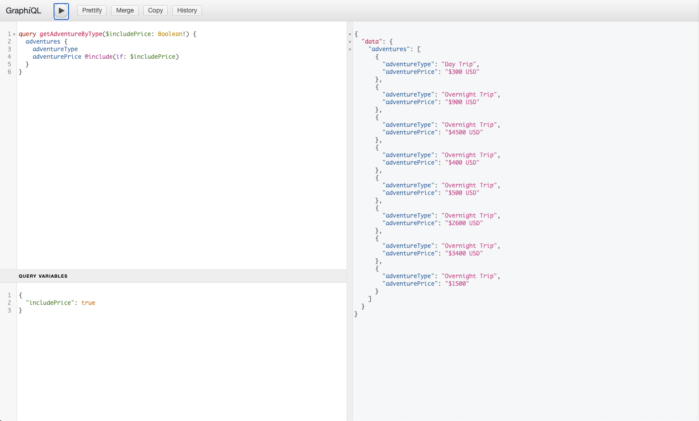

# AEM GraphQL API以用於內容片段{#graphql-api-for-use-with-content-fragments}

了解如何搭配AEM GraphQL API使用Adobe Experience Manager(AEM)中的內容片段作為Cloud Service，進行無周邊內容傳送。

AEM as aCloud Service與內容片段搭配使用的GraphQL API，大多以標準的開放原始碼GraphQL API為基礎。

在AEM中使用GraphQL API，可在無周邊CMS實作中，有效將內容片段傳送至JavaScript用戶端：

* 避免像REST一樣迭代API請求，
* 確保傳送內容僅限於特定需求，
* 允許大量傳送要呈現為單一API查詢回應所需的內容。

>[!NOTE]
>
>Adobe Experience Manager(AEM)中目前有兩個（個別）案例使用GraphQL作為Cloud Service:
>
>* [AEM商務會透過GraphQL從商務平台取用資料](/help/commerce-cloud/integrating/magento.md)。
>* AEM內容片段可與AEM GraphQL API（以標準GraphQL為基礎的自訂實作）搭配使用，提供結構化內容以供您的應用程式使用。


## GraphQL API {#graphql-api}

GraphQL為：

* &quot;*..API的查詢語言，以及使用您現有資料完成這些查詢的執行階段。 GraphQL提供API中資料的完整且易於理解的說明，讓用戶端能夠確切要求他們需要什麼，而不需要更多，使API隨著時間而更易於演變，並啟用功能強大的開發人員工具。*&quot;

   請參閱[GraphQL.org](https://graphql.org)

* &quot;*..靈活API層的開放規格。 將GraphQL放在您現有的後端，以比以往更快的速度構建產品…….*&quot;。

   請參閱[探索GraphQL](https://www.graphql.com)。

* *&quot;。..由Facebook於2012年在內部開發的資料查詢語言和規格，2015年公開開放。它提供了基於REST的體系結構的替代方案，其目的是提高開發人員的工作效率，並最大限度地減少資料傳輸量。 GraphQL用於生產，由數百個大小各異的組織使用……&quot;*

   請參閱[GraphQL Foundation](https://foundation.graphql.org/)。

<!--
"*Explore GraphQL is maintained by the Apollo team. Our goal is to give developers and technical leaders around the world all of the tools they need to understand and adopt GraphQL.*". 
-->

如需GraphQL API的詳細資訊，請參閱下列章節（以及其他許多資源）:

* 在[graphql.org](https://graphql.org):

   * [GraphQL簡介](https://graphql.org/learn)

   * [GraphQL規格](http://spec.graphql.org/)

* 在[graphql.com](https://graphql.com):

   * [指南](https://www.graphql.com/guides/)

   * [教學課程](https://www.graphql.com/tutorials/)

   * [案例分析](https://www.graphql.com/case-studies/)

適用於AEM實作的GraphQL以標準GraphQL Java程式庫為基礎。 請參閱：

* [graphQL.org - Java](https://graphql.org/code/#java)

* [GitHub上的GraphQL Java](https://github.com/graphql-java)

### GraphQL術語{#graphql-terminology}

GraphQL使用下列功能：

* **[查詢](https://graphql.org/learn/queries/)**

* **[結構和類型](https://graphql.org/learn/schema/)**:

   * 結構由AEM根據內容片段模型產生。
   * GraphQL會使用您的結構來呈現GraphQL for AEM實作所允許的類型和操作。

* **[欄位](https://graphql.org/learn/queries/#fields)**

* **[GraphQL端點](#graphql-aem-endpoint)**
   * AEM中的路徑，可回應GraphQL查詢，並提供對GraphQL結構的存取。

   * 如需詳細資訊，請參閱[啟用GraphQL端點](#enabling-graphql-endpoint) 。

請參閱[(GraphQL.org)GraphQL簡介](https://graphql.org/learn/)以取得完整詳細資訊，包括[最佳實務](https://graphql.org/learn/best-practices/)。

### GraphQL查詢類型{#graphql-query-types}

使用GraphQL，您可以執行查詢以返回：

* A **單個條目**

* **[條目清單](https://graphql.org/learn/schema/#lists-and-non-null)**

您也可以執行：

* [持續查詢，已快取](#persisted-queries-caching)

>[!NOTE]
>您可以使用[GraphiQL IDE](#graphiql-interface)測試和調試GraphQL查詢。

## AEM端點{#graphql-aem-endpoint}的GraphQL

端點是用來存取AEM適用的GraphQL的路徑。 使用此路徑，您（或您的應用程式）可以：

* 訪問GraphQL架構，
* 發送您的GraphQL查詢，
* 接收回應（對您的GraphQL查詢）。

AEM中有兩種端點類型：

* 全域
   * 可供所有網站使用。
   * 此端點可使用所有Sites設定（在[Configuration Browser](/help/assets/content-fragments/content-fragments-configuration-browser.md#enable-content-fragment-functionality-in-configuration-browser)中定義）中的所有內容片段模型。
   * 如果有任何內容片段模型應在Sites設定之間共用，則應在全域Sites設定下建立。
* 站點配置：
   * 與Sites配置相對應，如[Configuration Browser](/help/assets/content-fragments/content-fragments-configuration-browser.md#enable-content-fragment-functionality-in-configuration-browser)中所定義。
   * 特定於指定的站點/項目。
   * Sites設定的特定端點會使用該特定Sites設定的內容片段模型，以及全域Sites設定的內容片段模型。

>[!CAUTION]
>
>內容片段編輯器可允許一個網站設定的內容片段參考另一個網站設定的內容片段（透過政策）。
>
>在這種情況下，並非所有內容都可使用Sites配置特定的端點進行檢索。
>
>內容作者應控制此情境；例如，建議將共用內容片段模型置於全域網站設定下，這樣做可能會很實用。

GraphQL for AEM全域端點的存放庫路徑為：

`/content/cq:graphql/global/endpoint`

您的應用程式可在請求URL中使用下列路徑：

`/content/_cq_graphql/global/endpoint.json`

若要為AEM適用的GraphQL啟用端點，您需要：

* [啟用GraphQL端點](#enabling-graphql-endpoint)
* [發佈GraphQL端點](#publishing-graphql-endpoint)

### 啟用GraphQL端點{#enabling-graphql-endpoint}

要啟用GraphQL端點，您首先需要有適當的配置。 請參閱[內容片段 — 設定瀏覽器](/help/assets/content-fragments/content-fragments-configuration-browser.md)。

>[!CAUTION]
>
>如果尚未啟用[使用內容片段模型](/help/assets/content-fragments/content-fragments-configuration-browser.md)，則&#x200B;**Create**&#x200B;選項將不可用。

要啟用相應的端點，請執行以下操作：

1. 導覽至&#x200B;**工具**、**資產**，然後選取&#x200B;**GraphQL**。
1. 選擇 **建立**。
1. 將會開啟「**建立新GraphQL端點**」對話框。 您可以在此處指定：
   * **名稱**:端點名稱；您可以輸入任何文字。
   * **使用**&#x200B;提供的GraphQL架構：使用下拉式清單來選取所需的網站/專案。

   >[!NOTE]
   >
   >對話方塊中會顯示下列警告：
   >
   >* *如果未妥善管理，GraphQL 端點可能會導致資料安全性和效能問題。在建立端點後，請務必設定適當的權限。*


1. 使用&#x200B;**Create**&#x200B;確認。
1. **下一步**&#x200B;對話框將提供指向安全控制台的直接連結，以便您能夠確保新建立的端點具有適當的權限。

   >[!CAUTION]
   >
   >端點可供所有人存取。 這可能會（尤其是在發佈執行個體上）帶來安全疑慮，因為GraphQL查詢可能會對伺服器造成沈重負載。
   >
   >您可以在端點上設定與您的使用案例相應的ACL。

### 發佈GraphQL端點{#publishing-graphql-endpoint}

選取新端點和&#x200B;**Publish**，使其可在所有環境中完全使用。

>[!CAUTION]
>
>端點可供所有人存取。
>
>在發佈執行個體上，這可能會造成安全疑慮，因為GraphQL查詢可能會對伺服器造成沈重負載。
>
>您必須在端點上設定與您的使用案例相適用的ACL。

## GraphiQL介面{#graphiql-interface}

標準[GraphiQL](https://graphql.org/learn/serving-over-http/#graphiql)介面的實現可與AEM GraphQL搭配使用。 這可與AEM](#installing-graphiql-interface)一起安裝。[

>[!NOTE]
>
>GraphiQL綁定了全局端點（並且無法與特定Sites配置的其他端點一起使用）。

此介面允許您直接輸入和測試查詢。

例如：

* `http://localhost:4502/content/graphiql.html`

這提供語法醒目提示、自動完成、自動建議等功能，以及歷史記錄和線上檔案：


### 安裝AEM GraphQL介面{#installing-graphiql-interface}

GraphiQL使用者介面可安裝在AEM上，並附上專用套件：[GraphiQL內容包v0.0.6(2021.3)](https://experience.adobe.com/#/downloads/content/software-distribution/en/aemcloud.html?package=/content/software-distribution/en/details.html/content/dam/aemcloud/public/aem-graphql/graphiql-0.0.6.zip)包。

## 製作和發佈環境的使用案例{#use-cases-author-publish-environments}

使用案例視AEM作為Cloud Service環境的類型而定：

* 發佈環境；用於：
   * JS應用程式的查詢資料（標準使用案例）

* 製作環境；用於：
   * 查詢資料以用於「內容管理目的」：
      * AEM as aCloud Service中的GraphQL目前是唯讀API。
      * REST API可用於CR(u)D操作。

## 權限 {#permission}

權限是存取資產所需的權限。

## 架構生成{#schema-generation}

GraphQL是強式類型的API，這表示資料必須依類型清楚地建構和組織。

GraphQL規範提供了一系列准則，說明如何建立強大的API，以查詢特定執行個體上的資料。 要執行此操作，客戶端需要獲取[Schema](#schema-generation)，該包含查詢所需的所有類型。

對於內容片段，GraphQL結構（結構和類型）是以&#x200B;**Enabled** [內容片段模型](/help/assets/content-fragments/content-fragments-models.md)及其資料類型為基礎。

>[!CAUTION]
>
>所有GraphQL結構（從&#x200B;**Enabled**&#x200B;的內容片段模型衍生）都可透過GraphQL端點讀取。
>
>這意味著，您需要確保沒有敏感資料可用，因為這些資料可能會以這種方式洩露；例如，這包括可以在模型定義中顯示為欄位名稱的資訊。

例如，如果用戶建立了名為`Article`的內容片段模型，則AEM將生成類型為`ArticleModel`的對象`article`。 此類型中的欄位與模型中定義的欄位和資料類型相對應。

1. 內容片段模型：

   

1. 對應的GraphQL架構（從GraphiQL自動文檔輸出）:
   

   這表示產生的類型`ArticleModel`包含數個[欄位](#fields)。

   * 其中三個由使用者控制：`author`、`main`和`referencearticle`。

   * 其他欄位是由AEM自動新增的，是提供特定內容片段相關資訊的實用方法；在此範例中，`_path`、`_metadata`、`_variations`。 這些[輔助欄位](#helper-fields)標籤有前面的`_`，以區分用戶定義的和自動生成的。

1. 使用者根據文章模型建立內容片段後，就可透過GraphQL進行詢問。 如需範例，請參閱[範例查詢](/help/assets/content-fragments/content-fragments-graphql-samples.md#graphql-sample-queries)（以[範例內容片段結構為基礎，以便與GraphQL](/help/assets/content-fragments/content-fragments-graphql-samples.md#content-fragment-structure-graphql)搭配使用）。

在AEM適用的GraphQL中，架構是有彈性的。 這表示每次建立、更新或刪除內容片段模型時，都會自動產生內容片段模型。 更新內容片段模型時，也會重新整理資料架構快取。

Sites GraphQL服務會監聽（在背景）對內容片段模型所做的任何修改。 檢測到更新時，只重新生成該架構的該部分。 此最佳化可節省時間並提供穩定性。

例如，如果您：

1. 安裝包含`Content-Fragment-Model-1`和`Content-Fragment-Model-2`的包：

   1. 將生成`Model-1`和`Model-2`的GraphQL類型。

1. 然後修改`Content-Fragment-Model-2`:

   1. 只會更新`Model-2` GraphQL類型。

   1. 而`Model-1`則保持不變。

>[!NOTE]
>
>請務必注意，以備您想透過REST api或其他方式，對內容片段模型執行大量更新時使用。

該架構通過與GraphQL查詢相同的終結點提供，客戶端處理使用`GQLschema`擴展調用該架構的事實。 例如，對`/content/cq:graphql/global/endpoint.GQLschema`執行簡單`GET`請求將導致輸出具有Content-type的架構：`text/x-graphql-schema;charset=iso-8859-1`。

### 架構生成 — 未發佈的模型{#schema-generation-unpublished-models}

巢狀內嵌內容片段時，可能會發佈上層內容片段模型，但未發佈參考模型。

>[!NOTE]
>
>AEM UI可防止此情況發生，但如果以程式設計方式或使用內容套件進行發佈，便可能發生。

發生此情況時，AEM會為上層內容片段模型產生&#x200B;*不完整的*&#x200B;結構。 這表示會從架構中移除片段參考（取決於未發佈的模型）。

## 欄位 {#fields}

在結構中，有兩個基本類別的個別欄位：

* 您產生的欄位。

   選取的[欄位類型](#field-types)用於根據您如何配置內容片段模型來建立欄位。 欄位名稱取自&#x200B;**資料類型**&#x200B;的&#x200B;**屬性名稱**&#x200B;欄位。

   * 還有要考慮的&#x200B;**呈現方式**&#x200B;屬性，因為用戶可以配置某些資料類型；例如，作為單行文字或多欄位。

* AEM適用的GraphQL也會產生許多[協助欄位](#helper-fields)。

   這些用於識別內容片段，或用於取得有關內容片段的詳細資訊。

### 欄位類型{#field-types}

GraphQL for AEM支援類型清單。 所有支援的內容片段模型資料類型和對應的GraphQL類型均表示：

| 內容片段模型 — 資料類型 | GraphQL類型 | 說明 |
|--- |--- |--- |
| 單行文字 | 字串， [字串] |  用於簡單字串，例如作者名稱、位置名稱等。 |
| 多行文本 | 字串 |  用於輸出文本，例如物品的本體 |
| 數量 |  浮點數， [浮點數] | 用於顯示浮點數和規則數 |
| 布林值 (Boolean) |  布林函數 |  用於顯示複選框→簡單的true/false語句 |
| 日期和時間 | 日曆 |  用於以ISO 8086格式顯示日期和時間。 根據選取的類型，AEM GraphQL中有三種可用的方式：`onlyDate`, `onlyTime`, `dateTime` |
| 列舉 |  String |  用於從建立模型時定義的選項清單中顯示選項 |
|  標記 |  [String] |  用來顯示代表AEM中所用標籤之字串的清單 |
| 內容參考資料 |  字串 |  用於顯示AEM中其他資產的路徑 |
| 片段引用 |  *模型類型* |  用於參照建立模型時定義的特定模型類型的另一個內容片段 |

### 幫助欄位{#helper-fields}

除了使用者產生欄位的資料類型外，AEM適用的GraphQL也會產生許多&#x200B;*helper*&#x200B;欄位，以協助識別內容片段，或提供關於內容片段的其他資訊。

#### 路徑 {#path}

路徑欄位是作為GraphQL中的識別碼。 它代表AEM存放庫內的內容片段資產路徑。 我們選擇此作為內容片段的識別碼，因為它：

* 在AEM中是唯一的，
* 很容易被牽引。

下列程式碼會顯示根據內容片段模型`Person`建立的所有內容片段路徑。

```xml
{
  personList {
    items {
      _path
    }
  }
}
```

若要擷取特定類型的單一內容片段，您也必須先判斷其路徑。 例如：

```xml
{
  personByPath(_path: "/content/dam/path/to/fragment/john-doe") {
    item {
      _path
      firstName
      name
    }
  }
}
```

請參閱[範例查詢 — 單一特定城市片段](/help/assets/content-fragments/content-fragments-graphql-samples.md#sample-single-specific-city-fragment)。

#### 中繼資料 {#metadata}

AEM也會透過GraphQL公開內容片段的中繼資料。 中繼資料是描述內容片段的資訊，例如內容片段的標題、縮圖路徑、內容片段的說明、建立日期等。

由於中繼資料是透過結構編輯器產生，因此沒有特定結構，因此已實作`TypedMetaData` GraphQL類型以公開內容片段的中繼資料。 `TypedMetaData` 顯示按以下標量類型分組的資訊：

| 欄位 |
|--- |
| `stringMetadata:[StringMetadata]!` |
| `stringArrayMetadata:[StringArrayMetadata]!` |
| `intMetadata:[IntMetadata]!` |
| `intArrayMetadata:[IntArrayMetadata]!` |
| `floatMetadata:[FloatMetadata]!` |
| `floatArrayMetadata:[FloatArrayMetadata]!` |
| `booleanMetadata:[BooleanMetadata]!` |
| `booleanArrayMetadata:[booleanArrayMetadata]!`  |
| `calendarMetadata:[CalendarMetadata]!` |
| `calendarArrayMetadata:[CalendarArrayMetadata]!` |

每個標量類型表示單個名稱值對或名稱值對陣列，其中該對的值屬於其分組的類型。

例如，如果您想要擷取內容片段的標題，我們知道此屬性為字串屬性，因此我們會查詢所有字串中繼資料：

要查詢元資料：

```xml
{
  personByPath(_path: "/content/dam/path/to/fragment/john-doe") {
    item {
      _path
      _metadata {
        stringMetadata {
          name
          value
        }
      }
    }
  }
}
```

如果查看生成的GraphQL架構，則可以查看所有元資料GraphQL類型。 所有模型類型都具有相同的`TypedMetaData`。

>[!NOTE]
>
>**一般和陣列中繼資料的差異**
>請記住，`StringMetadata`和`StringArrayMetadata`都指儲存在存放庫中的內容，而非擷取這些內容的方式。
>
>因此，例如，通過調用`stringMetadata`欄位，您將收到儲存在儲存庫中的所有元資料的陣列（作為`String`），如果調用`stringArrayMetadata`，您將收到儲存在儲存庫中的所有元資料的陣列（作為`String[]`）。

請參閱[中繼資料的範例查詢 — 列出標題為GB](/help/assets/content-fragments/content-fragments-graphql-samples.md#sample-metadata-awards-gb)的獎項的中繼資料。

#### 變數 {#variations}

已實作`_variations`欄位，以簡化查詢內容片段所含變數的程式。 例如：

```xml
{
  personByPath(_path: "/content/dam/path/to/fragment/john-doe") {
    item {
      _variations
    }
  }
}
```

請參閱[範例查詢 — 具有已命名變異的所有城市](/help/assets/content-fragments/content-fragments-graphql-samples.md#sample-cities-named-variation)。

<!--
## Security Considerations {#security-considerations}
-->

## GraphQL變數{#graphql-variables}

GraphQL允許將變數放置在查詢中。 如需詳細資訊，請參閱變數](https://graphql.org/learn/queries/#variables)的[GraphQL檔案。

例如，若要取得具有特定變異之`Article`類型的所有內容片段，您可以在GraphiQL中指定變數`variation`。


```xml
### query
query GetArticlesByVariation($variation: String!) {
    articleList(variation: $variation) {
        items {
            _path
            author
        }
    }
}
 
### in query variables
{
    "variation": "uk"
}
```

## GraphQL指令{#graphql-directives}

在GraphQL中，可以根據變數（稱為GraphQL指令）更改查詢。

例如，您可以根據變數`includePrice`，在查詢中包含所有`AdventureModels`的`adventurePrice`欄位。



```xml
### query
query GetAdventureByType($includePrice: Boolean!) {
  adventureList {
    items {
      adventureTitle
      adventurePrice @include(if: $includePrice)
    }
  }
}
 
### in query variables
{
    "includePrice": true
}
```

## 篩選 {#filtering}

您也可以在GraphQL查詢中使用篩選功能來傳回特定資料。

篩選使用以邏輯運算子和運算式為基礎的語法。

例如，以下（基本）查詢會篩選名稱為`Jobs`或`Smith`的所有人員：

```xml
query {
  personList(filter: {
    name: {
      _logOp: OR
      _expressions: [
        {
          value: "Jobs"
        },
        {
          value: "Smith"
        }
      ]
    }
  }) {
    items {
      name
      firstName
    }
  }
}
```

如需更多範例，請參閱：

* [適用於AEM擴充功能的GraphQL的詳細資訊](#graphql-extensions)

* [使用此範例內容和結構的範例查詢](/help/assets/content-fragments/content-fragments-graphql-samples.md#graphql-sample-queries-sample-content-fragment-structure)

   * 以及準備用於範例查詢的[範例內容和結構](/help/assets/content-fragments/content-fragments-graphql-samples.md#content-fragment-structure-graphql)

* [基於WKND項目的查詢示例](/help/assets/content-fragments/content-fragments-graphql-samples.md#sample-queries-using-wknd-project)

## GraphQL for AEM — 擴充功能摘要{#graphql-extensions}

使用AEM適用的GraphQL進行查詢的基本操作符合標準GraphQL規範。 若是使用AEM的GraphQL查詢，有幾個擴充功能：

* 如果您需要單一結果：
   * 使用模型名稱；eg city

* 如果您希望得到結果清單：
   * 將`List`添加到模型名稱；例如`cityList`
   * 請參閱[範例查詢 — 所有城市的相關資訊](#sample-all-information-all-cities)

* 如果要使用邏輯OR:
   * 使用` _logOp: OR`
   * 請參閱[示例查詢 — 名稱為&quot;Jobs&quot;或&quot;Smith&quot;](#sample-all-persons-jobs-smith)的所有人員

* 邏輯AND也存在，但（通常）是隱含的

* 您可以查詢與內容片段模型內欄位對應的欄位名稱
   * 請參閱[示例查詢 — 公司首席執行官和員工的完整詳細資訊](#sample-full-details-company-ceos-employees)

* 除了模型中的欄位之外，還有一些系統生成的欄位（前面有下划線）:

   * 內容：

      * `_locale` :揭示語言；基於語言管理器
         * 請參閱[針對指定地區設定的多個內容片段的範例查詢](#sample-wknd-multiple-fragments-given-locale)
      * `_metadata` :顯示片段的中繼資料
         * 請參閱[中繼資料的範例查詢 — 列出標題為GB](#sample-metadata-awards-gb)的獎項的中繼資料
      * `_model` :允許查詢內容片段模型（路徑和標題）
         * 請參閱[來自模型的內容片段模型的範例查詢](#sample-wknd-content-fragment-model-from-model)
      * `_path` :存放庫內內容片段的路徑
         * 請參閱[範例查詢 — 單一特定城市片段](#sample-single-specific-city-fragment)
      * `_reference` :顯示參照；在RTF編輯器中包含內嵌參考
         * 請參閱[具有預先擷取的參考之多個內容片段的範例查詢](#sample-wknd-multiple-fragments-prefetched-references)
      * `_variation` :顯示內容片段中的特定變體
         * 請參閱[範例查詢 — 具有已命名變異的所有城市](#sample-cities-named-variation)
   * 操作：

      * `_operator` :應用特定運算子； `EQUALS`,  `EQUALS_NOT`,  `GREATER_EQUAL`,  `LOWER`,  `CONTAINS`  `STARTS_WITH`
         * 請參閱[示例查詢 — 所有名稱不為&quot;Jobs&quot;](#sample-all-persons-not-jobs)的人員
         * 請參閱[範例查詢 — `_path`開頭為特定首碼](#sample-wknd-all-adventures-cycling-path-filter)的所有歷險
      * `_apply` :具體條件；例如，   `AT_LEAST_ONCE`
         * 請參閱[範例查詢 — 篩選具有必須至少發生一次之項目的陣列](#sample-array-item-occur-at-least-once)
      * `_ignoreCase` :在查詢時忽略大小寫
         * 請參閱[示例查詢 — 名稱中包含SAN的所有城市（不考慮大小寫](#sample-all-cities-san-ignore-case)）


* 支援GraphQL聯合類型：

   * 使用`... on`
      * 請參閱[具有內容參考的特定模型的內容片段的範例查詢](#sample-wknd-fragment-specific-model-content-reference)

## 持續查詢（快取）{#persisted-queries-caching}

使用POST要求準備查詢後，可使用HTTP快取或CDN快取的GET要求來執行查詢。

這是必需的，因為通常不快取POST查詢，如果將GET與查詢搭配使用作為參數，則存在很大的風險，即參數對HTTP服務和中間產品而言過大。

持續查詢必須始終使用與[適當的Sites配置](#graphql-aem-endpoint)相關的端點；以便兩者皆可使用：

* 全局配置和端點
查詢可存取所有內容片段模型。
* 特定Sites配置和端點
為特定Sites設定建立持續查詢時，需要對應的Sites設定特定端點（以提供對相關內容片段模型的存取）。
例如，要為WKND Sites配置特別建立持續查詢，必須事前建立相應的WKND特定Sites配置和WKND特定端點。

>[!NOTE]
>
>如需詳細資訊，請參閱設定瀏覽器](/help/assets/content-fragments/content-fragments-configuration-browser.md#enable-content-fragment-functionality-in-configuration-browser)中的[啟用內容片段功能。
>
>需要為適當的Sites配置啟用&#x200B;**GraphQL持久性查詢**。

例如，如果有一個名為`my-query`的特定查詢，該查詢使用Sites配置`my-conf`中的模型`my-model`:

* 您可以使用`my-conf`特定端點建立查詢，然後該查詢將保存如下：
   `/conf/my-conf/settings/graphql/persistentQueries/my-query`
* 您可以使用`global`端點建立相同的查詢，但查詢將保存如下：
   `/conf/global/settings/graphql/persistentQueries/my-query`

>[!NOTE]
>
>這是兩個不同的查詢 — 儲存在不同的路徑下。
>
>他們只是碰巧使用相同的模型，但透過不同的端點。


以下是保留指定查詢所需的步驟：

1. 將查詢PUT輸入新端點URL `/graphql/persist.json/<config>/<persisted-label>`，以準備該查詢。

   例如，建立持續查詢：

   ```xml
   $ curl -X PUT \
       -H 'authorization: Basic YWRtaW46YWRtaW4=' \
       -H "Content-Type: application/json" \
       "http://localhost:4502/graphql/persist.json/wknd/plain-article-query" \
       -d \
   '{
     articleList {
       items{
           _path
           author
           main {
               json
           }
       }
     }
   }'
   ```

1. 此時，請檢查回應。

   例如，檢查是否成功：

   ```xml
   {
     "action": "create",
     "configurationName": "wknd",
     "name": "plain-article-query",
     "shortPath": "/wknd/plain-article-query",
     "path": "/conf/wknd/settings/graphql/persistentQueries/plain-article-query"
   }
   ```

1. 然後，您可以透過取得URL `/graphql/execute.json/<shortPath>`來重播保存的查詢。

   例如，使用持續查詢：

   ```xml
   $ curl -X GET \
       http://localhost:4502/graphql/execute.json/wknd/plain-article-query
   ```

1. 將POSTing更新為已存在的查詢路徑，以保存查詢。

   例如，使用持續查詢：

   ```xml
   $ curl -X POST \
       -H 'authorization: Basic YWRtaW46YWRtaW4=' \
       -H "Content-Type: application/json" \
       "http://localhost:4502/graphql/persist.json/wknd/plain-article-query" \
       -d \
   '{
     articleList {
       items{
           _path
           author
           main {
               json
           }
         referencearticle {
           _path
         }
       }
     }
   }'
   ```

1. 建立包裝的純查詢。

   例如：

   ```xml
   $ curl -X PUT \
       -H 'authorization: Basic YWRtaW46YWRtaW4=' \
       -H "Content-Type: application/json" \
       "http://localhost:4502/graphql/persist.json/wknd/plain-article-query-wrapped" \
       -d \
   '{ "query": "{articleList { items { _path author main { json } referencearticle { _path } } } }"}'
   ```

1. 使用快取控制項建立包裝的純查詢。

   例如：

   ```xml
   $ curl -X PUT \
       -H 'authorization: Basic YWRtaW46YWRtaW4=' \
       -H "Content-Type: application/json" \
       "http://localhost:4502/graphql/persist.json/wknd/plain-article-query-max-age" \
       -d \
   '{ "query": "{articleList { items { _path author main { json } referencearticle { _path } } } }", "cache-control": { "max-age": 300 }}'
   ```

1. 使用參數建立持續查詢：

   例如：

   ```xml
   $ curl -X PUT \
       -H 'authorization: Basic YWRtaW46YWRtaW4=' \
       -H "Content-Type: application/json" \
       "http://localhost:4502/graphql/persist.json/wknd/plain-article-query-parameters" \
       -d \
   'query GetAsGraphqlModelTestByPath($apath: String!, $withReference: Boolean = true) {
     articleByPath(_path: $apath) {
       item {
         _path
           author
           main {
           plaintext
           }
           referencearticle @include(if: $withReference) {
           _path
           }
         }
       }
     }'
   ```

1. 使用參數執行查詢。

   例如：

   ```xml
   $ curl -X POST \
       -H 'authorization: Basic YWRtaW46YWRtaW4=' \
       -H "Content-Type: application/json" \
       "http://localhost:4502/graphql/execute.json/wknd/plain-article-query-parameters;apath=%2fcontent2fdam2fwknd2fen2fmagazine2falaska-adventure2falaskan-adventures;withReference=false"
   
   $ curl -X GET \
       "http://localhost:4502/graphql/execute.json/wknd/plain-article-query-parameters;apath=%2fcontent2fdam2fwknd2fen2fmagazine2falaska-adventure2falaskan-adventures;withReference=false"
   ```

1. 要在發佈時執行查詢，需要複製相關的持久樹

   * 使用POST進行複製：

      ```xml
      $curl -X POST   http://localhost:4502/bin/replicate.json \
        -H 'authorization: Basic YWRtaW46YWRtaW4=' \
        -F path=/conf/wknd/settings/graphql/persistentQueries/plain-article-query \
        -F cmd=activate
      ```

   * 使用套件：
      1. 建立新的包定義。
      1. 包括配置（例如`/conf/wknd/settings/graphql/persistentQueries`）。
      1. 建立套件。
      1. 複製包。
   * 使用復寫/發佈工具。
      1. 前往發佈工具。
      1. 選擇配置的樹激活（例如`/conf/wknd/settings/graphql/persistentQueries`）。
   * 使用工作流程（透過工作流程啟動器設定）:
      1. 定義工作流啟動器規則，用於執行將在不同事件上複製配置的工作流模型（例如，建立、修改等）。


1. 在查詢設定開啟發佈後，會套用相同的原則，只使用發佈端點。

   >[!NOTE]
   >
   >對於匿名訪問，系統假定ACL允許「每個人」訪問查詢配置。
   >
   >若非如此，則無法執行。

   >[!NOTE]
   >
   >URL中的任何分號(&quot;;&quot;)都需要編碼。
   >
   >例如，如執行持續查詢的請求中：
   >
   >
   ```xml
   >curl -X GET \ "http://localhost:4502/graphql/execute.json/wknd/plain-article-query-parameters%3bapath=%2fcontent2fdam2fwknd2fen2fmagazine2falaska-adventure2falaskan-adventures;withReference=false"
   >```

## 從外部網站{#query-graphql-endpoint-from-external-website}查詢GraphQL端點

若要從外部網站存取GraphQL端點，您需要設定：

* [CORS篩選器](#cors-filter)
* [反向連結篩選](#referrer-filter)

### CORS篩選器{#cors-filter}

>[!NOTE]
>
>如需AEM中CORS資源共用原則的詳細概覽，請參閱[了解跨原始資源共用(CORS)](https://experienceleague.adobe.com/docs/experience-manager-learn/foundation/security/understand-cross-origin-resource-sharing.html?lang=en#understand-cross-origin-resource-sharing-(cors))。

若要存取GraphQL端點，必須在客戶Git存放庫中設定CORS原則。 若要這麼做，請為所需端點新增適當的OSGi CORS設定檔案。

此配置必須指定必須授予訪問權限的受信任網站源`alloworigin`或`alloworiginregexp`。

例如，要授予對`https://my.domain`的GraphQL端點和持續查詢端點的訪問權，可以使用：

```xml
{
  "supportscredentials":true,
  "supportedmethods":[
    "GET",
    "HEAD",
    "POST"
  ],
  "exposedheaders":[
    ""
  ],
  "alloworigin":[
    "https://my.domain"
  ],
  "maxage:Integer":1800,
  "alloworiginregexp":[
    ""
  ],
  "supportedheaders":[
    "Origin",
    "Accept",
    "X-Requested-With",
    "Content-Type",
    "Access-Control-Request-Method",
    "Access-Control-Request-Headers"
  ],
  "allowedpaths":[
    "/content/_cq_graphql/global/endpoint.json",
    "/graphql/execute.json/.*"
  ]
}
```

如果您已設定端點的虛名路徑，也可以在`allowedpaths`中使用。

### 反向連結篩選器{#referrer-filter}

除了CORS設定，反向連結篩選器還必須設定為允許從第三方主機存取。

若要這麼做，請新增適當的OSGi反向連結篩選設定檔案，該設定檔案可：

* 指定受信任的網站主機名；`allow.hosts`或`allow.hosts.regexp` ,
* 授予此主機名稱的存取權。

例如，若要授予具有反向連結`my.domain`之請求的存取權，您可以：

```xml
{
    "allow.empty":false,
    "allow.hosts":[
      "my.domain"
    ],
    "allow.hosts.regexp":[
      ""
    ],
    "filter.methods":[
      "POST",
      "PUT",
      "DELETE",
      "COPY",
      "MOVE"
    ],
    "exclude.agents.regexp":[
      ""
    ]
}
```

>[!CAUTION]
>
>客戶仍有責任：
>
>* 僅授予受信任域的訪問權限
>* 確保未公開任何敏感資訊
>* 不使用通配符[*]語法；這既會停用對GraphQL端點的驗證存取，也會將其公開給全世界。


>[!CAUTION]
>
>所有GraphQL [結構](#schema-generation)（從&#x200B;**已啟用**&#x200B;的內容片段模型衍生）均可透過GraphQL端點讀取。
>
>這意味著，您需要確保沒有敏感資料可用，因為這些資料可能會以這種方式洩露；例如，這包括可以在模型定義中顯示為欄位名稱的資訊。

## 驗證 {#authentication}

請參閱[針對內容片段的遠端AEM GraphQL查詢驗證](/help/assets/content-fragments/graphql-authentication-content-fragments.md)。

<!-- to be addressed later -->

<!--
## Sorting {#sorting}
-->

<!-- to be addressed later -->

<!--
## Paging {#paging}
-->

## 常見問題集 {#faqs}

出現的問題：

1. **問**:「*適用於AEM的GraphQL API與Query Builder API有何不同？*」

   * **答**:「*AEM GraphQL API提供對JSON輸出的完整控制，且是查詢內容的業界標準。未來，AEM將計畫投資AEM GraphQL API。*&quot;

## 教學課程 — 開始使用AEM無周邊和GraphQL {#tutorial}

尋找實作教學課程？ 查看[開始使用AEM無周邊和GraphQL](https://experienceleague.adobe.com/docs/experience-manager-learn/getting-started-with-aem-headless/graphql/overview.html)端對端教學課程，說明如何在無周邊CMS情境下，使用AEM GraphQL API建置和公開內容，並供外部應用程式使用。
