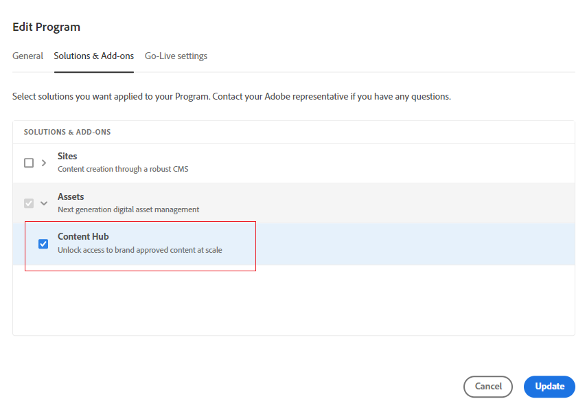

# 部署 Content Hub {#deploy-content-hub}

Content Hub是Experience Manager Assets as a Cloud Service的一部分，可讓組織及其業務合作夥伴普及對品牌上內容的存取。

在Experience Manager Assets as a Cloud Service上標示為已核准的資產可用於Content Hub上的資產發佈。

本文提供端對端工作流程，讓使用者可存取Content Hub，包括根據使用者的需求而變更的許可權。

請觀看這段影片，瞭解如何啟用適用於Experience Manager Assets的Content Hub：

>[!VIDEO](https://video.tv.adobe.com/v/3469851)

Content Hub上的許可權變化包括：

* [Content Hub使用者](#onboard-content-hub-users)：存取Content Hub入口網站上的品牌核准資產。

* [Content Hub管理員](#onboard-content-hub-administrator)：除了存取品牌核准的資產、將資產上傳到Content Hub、Adobe Express整合以編輯影像(如果您有Content Hub許可權)之外，還可以存取Adobe Express上的[設定使用者介面](/help/assets/configure-content-hub-ui-options.md)。

* [有權新增資產的Content Hub使用者](#onboard-content-hub-users-add-assets)：除了存取Content Hub入口網站上的品牌核准資產外，還可以[將資產上傳至Content Hub](/help/assets/upload-brand-approved-assets.md)。

* [除了存取Content Hub入口網站上的品牌核准資產之外，還有權將資產重新混合到新變體](#onboard-content-hub-users-remix-assets)： [Adobe Express整合](/help/assets/edit-images-content-hub.md) (如果您有Adobe Express許可權)。Content Hub使用者。

* [Experience Manager Assets使用者](#experience-manager-assets-users)：可核准Experience Manager Assets as a Cloud Service上的資產，以便這些資產可在Content Hub上使用。

下表總結列出可用的Content Hub使用者型別、使用者擁有的許可權，以及取得這些許可權所需的產品設定檔：

| 使用者角色 | Content Hub使用者 | 有權新增資產的Content Hub使用者 | 有權重新混合資產的Content Hub使用者 | Content Hub管理員 |
|---------------|----------|----------|-------------------------|---|
| **功能** |
| 存取 Content Hub 入口網站上品牌核准的資產 | ✓ | ✓ | ✓ | ✓ |
| 從Content Hub入口網站上傳資產 | − | ✓ | ✓ | ✓ |
| 使用Adobe Express整合功能來編輯影像 | − | − | ✓ | − |
| 存取Content Hub設定UI | − | − | − | ✓ |
| **使用者必須在這些產品設定檔中 (Admin Console)** |
| AEM > 傳遞執行個體 > AEM Assets 受限制的使用者 | ✓ | ✓ | ✓ | ✓ |
| AEM >生產製作例項> AEM使用者 | − | ✓ | ✓ | − |
| AEM > 生產作者執行個體 > AEM 管理員 | − | − | − | ✓ |
| Adobe Express | − | − | ✓ | − |
| **更多資訊** | 檢視[Content Hub使用者](#onboard-content-hub-users) | 檢視有權新增資產的[Content Hub使用者](#onboard-content-hub-users-add-assets) | 檢視有權將資產重新混合成新變數的[Content Hub使用者](#onboard-content-hub-users-remix-assets) | 檢視[Content Hub管理員](#onboard-content-hub-administrator) |

>[!NOTE]
>
>[Experience Manager Assets使用者](#experience-manager-assets-users)能夠在Experience Manager Assets as a Cloud Service環境中核准資產，以便在Content Hub上使用這些資產。 必須使用Admin Console將這些使用者新增至「AEM >生產製作例項> AEM使用者」產品設定檔。

## 步驟1：使用Cloud Manager啟用適用於Experience Manager Assets的Content Hub {#enable-content-hub}

若要存取Content Hub入口網站，管理員必須先使用Cloud Manager為Experience Manager Assets as a Cloud Service啟用Content Hub 。

### 權限 {#permissions-edit-program}

您必須擁有業主角色才能在Cloud Manager中編輯計畫。 如需詳細資訊，請參閱[編輯程式](/help/implementing/cloud-manager/getting-access-to-aem-in-cloud/editing-programs.md)。

若要啟用適用於Experience Manager Assets的Content Hub：

1. 登入Cloud Manager。 確保您在登入時選取正確的組織。 Cloud Manager會列出您的所有計畫。

1. 導覽至Experience Manager Assets as a Cloud Service程式，按一下「更多選項」圖示(...)並選取&#x200B;**[!UICONTROL 編輯程式]**。

   

1. 在[!UICONTROL 編輯程式]對話方塊上，選取&#x200B;**[!UICONTROL 解決方案和附加元件]**&#x200B;索引標籤。

1. 展開&#x200B;**[!UICONTROL Assets]**&#x200B;並選取&#x200B;**[!UICONTROL Content Hub]**。
   

   >[!NOTE]
   >
   >如果在選取Content Hub後沒有為您啟用&#x200B;**[!UICONTROL 更新]**，請確定您已指定此程式的上線設定。

1. 按一下&#x200B;**[!UICONTROL 更新]**。

Content Hub現已為Experience Manager Assets as a Cloud Service啟用。 在生產環境中啟用Content Hub後，您將無法以自助方式將其停用。

>[!NOTE]
>
>您最多可以與250名Content Hub使用者存取和使用Content Hub。 如果您有其他問題，請聯絡您的Adobe代表。

若您為Experience Manager Assets的新手，請按一下[新增程式] ****，然後提供程式詳細資料（程式名稱，為生產設定），然後按一下[繼續] ****。 然後，您可以在&#x200B;**[!UICONTROL 解決方案和附加元件]**&#x200B;索引標籤中選取&#x200B;**[!UICONTROL Assets]**&#x200B;和&#x200B;**[!UICONTROL Content Hub]**。

### Admin Console上的Content Hub執行個體和產品設定檔{#content-hub-instance-product-profile}

使用Cloud Manager[為Assets as a Cloud Service啟用](#enable-content-hub)Content Hub後，Admin Console上的AEM Assets as a Cloud Service內已建立新執行個體，尾碼為`delivery`：

>[!NOTE]
>
>如果您在2024年8月14日之前布建Content Hub，則會建立以`contenthub`作為尾碼的新執行個體。

請注意，Content Hub的執行個體名稱中沒有`author`或`publish`。

按一下執行個體名稱以檢視Content Hub產品設定檔。

>[!NOTE]
>
>如果您在2024年8月14日之前布建Content Hub，Content Hub產品設定檔會在`contenthub`之後提及`Limited Users`，而非`delivery`。

## 步驟2：加入Content Hub管理員 {#onboard-content-hub-administrator}

除了存取品牌核准的資產、將資產上傳到Content Hub、Adobe Express整合以編輯影像(如果您有Content Hub許可權)之外，Content Hub管理員還可以存取Adobe Express上的[設定使用者介面](/help/assets/configure-content-hub-ui-options.md)。

若要加入Content Hub管理員：

1. [存取並按一下Content Hub使用者產品設定檔](#content-hub-instance-product-profile)。

1. 按一下&#x200B;**[!UICONTROL 新增使用者]**，將使用者或使用者群組新增至產品設定檔。

1. 按一下「**[!UICONTROL 儲存]**」以儲存變更。

1. 將使用者新增到Content Hub產品設定檔後，請按一下Admin Console產品清單中的AEM as a Cloud Service產品名稱來存取Experience Manager Assets產品設定檔。

1. 按一下AEM as a Cloud Service的生產製作例項：
   

   Admin Console會顯示AEM as a Cloud Service的兩個產品設定檔：管理員和使用者。
1. 按一下管理員產品設定檔，然後按一下&#x200B;**[!UICONTROL 新增使用者]**以將使用者新增至產品設定檔。
   

1. 按一下「**[!UICONTROL 儲存]**」以儲存變更。

## 步驟3：入門Content Hub使用者 {#onboard-content-hub-users}

Content Hub使用者可以存取入口網站上的可用資產，但無法新增任何資產或修改現有資產。

若要加入Content Hub使用者：

1. [存取並按一下Content Hub使用者產品設定檔](#content-hub-instance-product-profile)。

1. 按一下&#x200B;**[!UICONTROL 新增使用者]**，將使用者或使用者群組新增至產品設定檔。

1. 按一下「**[!UICONTROL 儲存]**」以儲存變更。

這些使用者現在可以存取Content Hub入口網站上的可用資產。

>[!NOTE]
>
>您可以使用所有進階企業功能，例如與外部識別提供者同步化。

### 如何存取 Content Hub？ {#access-content-hub}

Content Hub的存取方式如下：

* 使用以下連結存取 Content Hub：

  `https://experience.adobe.com/#/assets/contenthub`

* 登入`experience.adobe com`並按一下&#x200B;**[!UICONTROL 快速存取]**&#x200B;區段中可用的&#x200B;**[!UICONTROL Experience Manager Assets Content Hub]**：
  

* 登入`experience.adobe com`並按一下產品切換器中可用的&#x200B;**[!UICONTROL Experience Manager Assets Content Hub]**：
  

### 停用使用者的電子郵件通知 {#disable-email-notifications}

如果管理員需要在將使用者新增至Content Hub產品設定檔時停用傳送給使用者的電子郵件通知：

按一下產品設定檔名稱旁的搜尋圖示，並停用&#x200B;**[!UICONTROL 透過電子郵件通知使用者]**&#x200B;切換功能。

## 步驟4：新增Content Hub使用者並取得資產許可權（選用） {#onboard-content-hub-users-add-assets}

有權新增資產的Content Hub使用者可以[將品牌核准的新資產](/help/assets/upload-brand-approved-assets.md)上傳至Content Hub。

若要讓具有新增使用者許可權的Content Hub使用者上線：

1. [將使用者新增至Content Hub產品設定檔](#onboard-content-hub-users)後，請按一下Admin Console產品清單中的AEM as a Cloud Service產品名稱，存取Experience Manager Assets產品設定檔。

1. 按一下AEM as a Cloud Service的生產製作例項：
   

   Admin Console會顯示AEM as a Cloud Service的兩個產品設定檔：管理員和使用者。
1. 按一下[使用者]產品設定檔，然後按一下[新增使用者]****，將使用者新增至產品設定檔。
   

1. 按一下「**[!UICONTROL 儲存]**」以儲存變更。

## 步驟4：加入Content Hub使用者，並有權將資產重新混合成新的變數（選用） {#onboard-content-hub-users-remix-assets}

有權將資產重新混合到新變數的Content Hub使用者可以[使用Adobe Express修改現有資產，並將資產儲存到存放庫](/help/assets/edit-images-content-hub.md)。 只有在使用者擁有Adobe Express許可權時，才能使用Adobe Express編輯資產。

若要讓有權將資產重新混合為新變數的Content Hub使用者上線：

1. [將使用者新增至Content Hub產品設定檔](#onboard-content-hub-users)後，請按一下Admin Console產品清單中的AEM as a Cloud Service產品名稱，存取Experience Manager Assets產品設定檔。

1. 按一下AEM as a Cloud Service的生產製作例項：
   

   Admin Console會顯示AEM as a Cloud Service的兩個產品設定檔：管理員和使用者。
1. 按一下[使用者]產品設定檔，然後按一下[新增使用者]****，將使用者新增至產品設定檔。
   

1. 按一下「**[!UICONTROL 儲存]**」以儲存變更。

## Experience Manager Assets使用者 {#experience-manager-assets-users}

Experience Manager Assets使用者可以在AEM as a Cloud Service上核准資產，以便在Content Hub上使用。

若要設定Experience Manager Assets使用者：

1. 按一下Experience Manager Assets產品清單中的AEM as a Cloud Service產品名稱，存取Admin Console產品設定檔。

1. 按一下AEM as a Cloud Service的生產製作例項：
   

   Admin Console會顯示AEM as a Cloud Service的兩個產品設定檔：管理員和使用者。
1. 按一下[使用者]產品設定檔，然後按一下[新增使用者]****，將使用者新增至產品設定檔。
   

1. 按一下「**[!UICONTROL 儲存]**」以儲存變更。

   >[!NOTE]
   >
   > 您不需要新增至Experience Manager Assets使用者的[Content Hub產品設定檔](#onboard-content-hub-users)。
