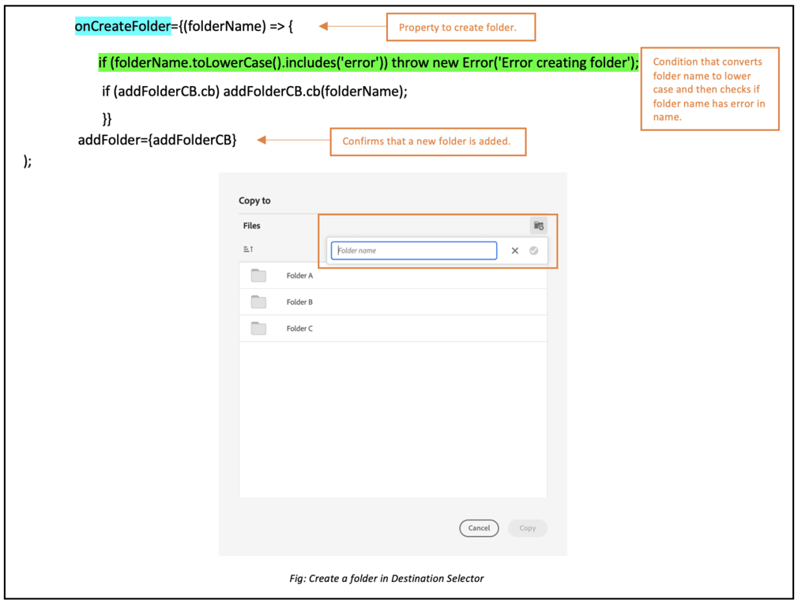

# 微前端目標選擇器 {#Overview}

微前端目標選擇器在您的應用程式中提供了一個使用者介面，可輕鬆地和 [!DNL Experience Manager Assets as a Cloud Service] 存放庫整合。您可以搜尋或瀏覽到 [!DNL Experience Manager Assets as a Cloud Service] 存放庫中的適當資料夾，並從您的應用程式上傳資產。

使用目標選擇器套件即可在您的應用程式體驗中使用微前端使用者介面。套件的任何更新都會自動匯入，而最新部署的目標選擇器則會自動載入到您的應用程式中。


目標選擇器有許多優點，例如：

* 可使用 Vanilla JavaScript 資料庫輕鬆整合任何 Adobe 或非 Adobe 應用程式。
* 易於維護，因為目標選擇器套件的更新會自動部署到您的應用程式可用的目標選擇器。您的應用程式無需更新即可載入最新的修改內容。
* 簡易的自訂功能，因為有可以控制應用程式中目標選擇器顯示的可用屬性。
* 全文檢索搜尋可快速瀏覽到資料夾以從您的應用程式上傳資產。
* 能夠建立資料夾，依照遞增或遞減順序將資料夾排序，並在清單、格線、圖庫或瀑布檢視中進行檢視。

本文的範圍是示範如果在 Unified Shell 之下有 [!DNL Adobe] 應用程式或者已經有為進行身份驗證而產生的 imsToken 時，應如何使用目標選擇器。這些工作流程在本文中稱為非 SUSI 流程。

執行以下任務，以搭配 [!DNL Experience Manager Assets as a Cloud Service] 存放庫來整合與使用目標選擇器：

* [使用 Vanilla JS 整合目標選擇器](#integration-with-vanilla-js)
* [定義目標選擇器顯示屬性](#destination-selector-properties)
* [使用目標選擇器](#using-destination-selector)

## 使用 Vanilla JS 整合目標選擇器 {#integration-with-vanilla-js}

您可以將任何 [!DNL Adobe] 或非 Adobe 應用程式與 [!DNL Experience Manager Assets] as a [!DNL Cloud Service] 存放庫整合，並從應用程式之中選取資產。

匯入目標選擇器套件，並使用 Vanilla JavaScript 資料庫連線至 Assets as a Cloud Service，即可完成整合作業。您必須編輯應用程式內的 `index.html` 或任何適當檔案，才能 -

* 定義身份驗證詳細資訊
* 存取 Assets as a Cloud Service 存放庫
* 設定目標選擇器顯示屬性

在以下情況下，您可以在不定義某些 IMS 屬性的情況下執行身份驗證：

* 在 [!DNL Adobe] [Unified Shell](https://experienceleague.adobe.com/docs/experience-manager-cloud-service/content/overview/aem-cloud-service-on-unified-shell.html?lang=zh-Hant) 之上整合一個應用程式時。
* 您已經具有針對身份驗證產生的一個 IMS 語彙基元。

## 必備條件 {#prerequisites}

在應用程式實作之內定義 `index.html` 檔案或類似檔案的必備條件，以定義存取 [!DNL Experience Manager Assets] as a [!DNL Cloud Service] 存放庫的身分驗證資料。必備條件包括：

* imsOrg
* imsToken
* apikey

## 安裝 {#installation}

ESM CDN (例如，[esm.sh](https://esm.sh/) /[skypack](https://www.skypack.dev/)) 和 [UMD](https://github.com/umdjs/umd) 版本皆提供目標選擇器。

在使用 **UMD 版** 的瀏覽器中 (建議)：

在使用 **UMD 版** 的瀏覽器中 (建議)：

```
<script src="https://experience.adobe.com/solutions/CQ-assets-selectors/static-assets/resources/assets-selectors.js"></script>

<script>
  const { renderAssetSelector } = PureJSSelectors;
</script>
```

在具備 `import maps` 支援並使用 **ESM CDN 版**&#x200B;的瀏覽器中：

```
<script type="module">
  import { AssetSelector } from 'https://experience.adobe.com/solutions/CQ-assets-selectors/static-assets/resources/@assets/selectors/index.js'
</script>
```

在使用 **ESM CDN 版**&#x200B;的 Deno/Webpack Module Federation 中：

```
import { AssetSelector } from 'https://experience.adobe.com/solutions/CQ-assets-selectors/static-assets/resources/@assets/selectors/index.js'
```

### 選取的目標 {#selected-destination}

目標選擇器會接收來自 `onItemSelect`、`onTreeToggleItem` 或者 `onTreeSelectionChange` 的回呼，以及包含物件 (目錄、影像等) 的選取目錄。

**結構語法**

```
interface SelectedDestination {
  id: string;
  children: SelectedDestination[];
  'repo:repositoryId': string;
  'dc:format': string;
  'repo:assetClass': string;
  'storage:directoryType': string;
  'storage:region': string;
  'repo:name': string;
  'repo:path': string;
  'repo:ancestors': string[];
  'repo:createDate': string;
  'storage:assignee':

  { type: string; id: string; }
  ;
  'repo:assetId': string;
  'aem:published': boolean;
  'repo:createdBy': string;
  'repo:state': string;
  'repo:id': string;
  'repo:modifyDate': string;
  _page:

  { orderBy: string; count: number; };
}
```

下表會說明選取目標的一些重要屬性。

| 屬性 | 類型 | 解釋 |
|---|---|---|
| *repo:repositoryId* | 字串 | 儲存資產之存放庫的唯一識別碼。 |
| *repo:id* | 字串 | 資產的唯一識別碼。 |
| *repo:assetClass* | 字串 | 資產的分類 (例如影像或影片、文件)。 |
| *repo:name* | 字串 | 資產的名稱，包括檔案副檔名。 |
| *repo:size* | 數字 | 資產的大小，以位元組計。 |
| *repo:path* | 字串 | 資產在存放庫中的位置。 |
| *repo:ancestors* | `Array<string>` | 存放庫中資產的上階項目陣列。 |
| *repo:state* | 字串 | 存放庫中資產的目前狀態（例如，作用中、已刪除等）。 |
| *repo:createdBy* | 字串 | 建立資產的使用者或系統。 |
| *repo:createDate* | 字串 | 建立資產的日期與時間。 |
| *repo:modifiedBy* | 字串 | 上次修改資產的使用者或系統。 |
| *repo:modifyDate* | 字串 | 上次修改資產的日期和時間。 |
| *dc:format* | 字串 | 資產的格式。 |
| *_頁面* | 順序依據：字串；計數：數字； | 包括文件的頁碼。 |

如需完整的屬性清單和詳細範例，請造訪[目標選擇器代碼範例](https://github.com/adobe/aem-assets-selectors-mfe-examples)。

### 非 SUSI 流程的範例 {#non-ims-vanilla}

本範例會示範在 Unified Shell 之下執行 [!DNL Adobe] 應用程式時，或者已經有為進行身份驗證而產生的 `imsToken` 時，應如何搭配非 SUSI 流程使用目標選擇器。

使用`script`標籤在您的程式碼中包含目的地選擇器套件，如下列範例的&#x200B;_行6-15_&#x200B;所示。 載入指令碼後，`PureJSSelectors`全域變數即可使用。 定義目的地選擇器[屬性](#destination-selector-properties)，如&#x200B;_行16-23_&#x200B;所示。 在非 SUSI 流程執行身份驗證需要 `imsOrg` 和 `imsToken` 屬性。`handleSelection` 屬性用於處理選取的資產。若要轉譯目標選擇器，請呼叫 `renderDestinationSelector` 函數，如&#x200B;_第 17 行_&#x200B;所述。目標選擇器會顯示於 `<div>` 容器元素，如&#x200B;_第 21 和 22 行_&#x200B;所示。

執行這些步驟後，您即可在您的 [!DNL Adobe] 應用程式中，以非 SUSI 流程使用目標選擇器。

```html {line-numbers="true"}
<!DOCTYPE html>
<html>
<head>
    <title>Destination Selector</title>
    <script src="https://experience.adobe.com/solutions/CQ-assets-selectors/assets/resources/assets-selectors.js"></script>
    <script>
        // get the container element in which we want to render the DestinationSelector component
        const container = document.getElementById('destination-selector-container');
        // imsOrg and imsToken are required for authentication in non-SUSI flow
        const destinationSelectorProps = {
            imsOrg: 'example-ims@AdobeOrg',
            imsToken: "example-imsToken",
            apiKey: "example-apiKey-associated-with-imsOrg",
            handleSelection: (assets: SelectedAssetType[]) => {},
        };
        // Call the `renderDestinationSelector` available in PureJSSelectors globals to render DestinationSelector
        PureJSSelectors.renderDestinationSelector(container, destinationselectorprops);
    </script>
</head>

<body>
    <div id="destination-selector-container" style="height: calc(100vh - 80px); width: calc(100vw - 60px); margin: -20px;">
    </div>
</body>

</html>
```

如需詳細的範例，請造訪[目標選擇器代碼範例 ](https://github.com/adobe/aem-assets-selectors-mfe-examples)。

## 使用目標選擇器屬性 {#destination-selector-properties}

您可以使用目標選擇器屬性自訂目標選擇器的呈現方式。下表列出可用於自訂和使用目標選擇器的屬性：

| 屬性 | 類型 | 必要 | 預設 | 說明 |
|---|---|---|---|---|
| *imsOrg* | 字串 | 是 | | Adobe Identity Management System (IMS) ID 是在為您的組織佈建 [!DNL Adobe Experience Manager] as a [!DNL Cloud Service] 時所指派的。`imsOrg`金鑰是驗證您所存取的組織是否位於Adobe IMS下的必要專案。 |
| *imsToken* | 字串 | 否 | | 用於身份驗證的 IMS 持有人語彙基元。如果您使用SUSI流程，則不需要`imsToken`。 不過，如果您使用非SUSI流程，則需使用此功能。 |
| *apiKey* | 字串 | 否 | | 用於存取 AEM Discovery 服務的 API 金鑰。如果您使用SUSI流程，則不需要`apiKey`。 但是，在非 SUSI 流程中即需要。 |
| *rootPath* | 字串 | 否 | /content/dam/ | 目標選擇器會顯示資產的資料夾路徑。`rootPath` 也可以使用封裝形式。例如，給定以下路徑`/content/dam/marketing/subfolder/`，目的地選擇器不允許您周遊任何父資料夾，但只顯示子資料夾。 |
| *hasMore* | 布林值 | 否 | | 當應用程式有更多內容要顯示時，您可以使用此屬性新增載入器，以載入內容並使其顯示在應用程式中。這是一種指示器，表示內容載入正在進行中。 |
| *orgName* | 布林值 | 否 | | 這指和 AEM 相關的組織名稱 (可能是 orgID) |
| *initRepoID* | 字串 | 否 | | 這是您要在預設初始檢視中使用的資產存放庫的路徑 |
| *onCreateFolder* | 字串 | 否 | | `onCreateFolder`屬性可讓您新增圖示，在應用程式中新增資料夾。 |
| *onConfirm* | 字串 | 否 | | 這是當您點擊「確認」按鈕時的一種回呼。 |
| *confirmDisabled* | 字串 | 否 | | 此屬性可控制「確認」按鈕的切換。 |
| *viewType* | 字串 | 否 | | 此 `viewType` 屬性會用於指定檢視，讓您用於顯示資產。 |
| *viewTypeOptions* | 字串 | 否 | | 此屬性是否和 `viewType` 屬性相關。您可以指定一個或多個用於顯示資產的檢視。可用的 viewTypeOptions 包含：清單檢視、格線檢視、圖庫檢視、瀑布檢視和樹系檢視。 |
| *itemNameFormatter* | 字串 | 否 | | 此屬性可讓您格式化專案名稱 |
| *i18nSymbols* | `Object<{ id?: string, defaultMessage?: string, description?: string}>` | 否 |  | 如果 OOTB 翻譯不足以滿足應用程式的需求，您可以公開一個介面，並透過 `i18nSymbols`prop 傳遞您自訂的本地化數值。透過此介面傳遞的值會覆寫已提供的預設翻譯，並改為使用您自己的翻譯。若要執行覆寫，您必須傳遞一個有效的 [Message Descriptor](https://formatjs.io/docs/react-intl/api/#message-descriptor) 物件至您想要覆寫的 `i18nSymbols` 金鑰。 |
| *inlineAlertSetup* | 字串 | 否 | | 這會新增您要在應用程式中傳遞的警示訊息。例如，新增一則警示訊息，提示您沒有存取此資料夾的權限。 |
| *intl* | 物件 | 否 | | 目標選擇器可提供預設的 OOTB 翻譯。您可以透過 `intl.locale`prop 提供有效的語言環境字串，以選擇翻譯語言。例如：`intl={{ locale: "es-es" }}`</br></br>支援的語言環境字串遵循 [ISO 639 - 代碼](https://www.iso.org/iso-639-language-codes.html)來選擇代表語言標準名稱的代碼。</br></br>支援的語言環境清單：英文 - &#39;en-us&#39; (預設) 西班牙文 - &#39;es-es&#39; 德文 - &#39;de-de&#39; 法文 - &#39;fr-fr&#39; 義大利文 - &#39;it-it&#39; 日文 - &#39;ja-jp&#39;韓文 - &#39;ko-kr&#39; 葡萄牙文 - &#39;pt-br&#39; 中文 (繁體)- &#39;zh-cn&#39; 中文 (台灣) - &#39;zh-tw&#39; |

## 使用目標選擇器屬性的範例 {#usage-examples}

您可以定義 `index.html` 檔案裡的目標選擇器[屬性](#destination-selector-properties)，以在應用程式內自訂目標選擇器顯示。

### 範例 1：在目標選擇器中建立資料夾

目的地選擇器可讓您建立資料夾，以上傳、移動或複製特定位置的資產。



### 範例 2：指定目標選擇器的檢視類型

目標選擇器會以四種不同的檢視顯示各種資產，包括清單檢視、格線檢視、圖庫檢視和瀑布檢視。若要指定預設的檢視類型，您可以使用 `viewType` 屬性。此 `viewTypeOptions` 屬性會和 `viewType` 屬性一起用於規定其他檢視類型，以便可以在下拉式清單中顯示其他檢視類型選項。如果您只想要一個顯示選項，可使用單一引數。


### 範例 3：初始化 Assets 資料夾的路徑

使用 `path` 屬性定義在呈現目標選擇器時會自動顯示的資料夾名稱。


## 使用目標選擇器 {#using-destination-selector}

若目標選擇器設定完成，而且您透過 [!DNL Adobe Experience Manager] as a [!DNL Cloud Service] 應用程式使用目標選擇器完成身分驗證，即可選取資產或執行各種其他作業，以便在存放庫中搜尋您的資產。


* **A**：[搜尋列](#search-bar)
* **B**：[排序](#sorting)
* **C**：[資產](#assets-repo)
* **D**：[新增尾碼或首碼](#add-suffix-or-prefix)
* **E**：[建立新資料夾](#create-new-folder)
* **F**：[檢視](#types-of-view)
* **G**：[資訊](#info)
* **H**：[選取資料夾](#select-folder)

### 搜尋列 {#search-bar}

目的地選擇器可讓您在選取的存放庫中執行資產的全文搜尋。 例如，如果您在搜尋列中鍵入關鍵字 `wave`，就會顯示中繼資料屬性中提及 `wave` 關鍵字的所有資產。

### 排序 {#sorting}

您可以依照資產的名稱、維度或大小對目標選擇器中的資產進行排序。您可以依照遞增或遞減順序排序資產。

### 資產存放庫 {#assets-repo}

目的地選擇器也可讓您檢視AEM應用程式中您所選存放庫的資料。 您可以使用 `repositoryID` 屬性初始化要在目標選擇器的第一個執行個體檢視之目標資料夾的路徑。

### 新增尾碼或首碼 {#add-suffix-or-prefix}

這是一個 `optionsFormSetup` 屬性的範例。您可以使用它來確認選取範圍，這會在 `onConfirm` 事件上傳遞。

### 建立資料夾 {#create-new-folder}

它可讓您在[!DNL Adobe Experience Manager]的目的地資料夾中建立一個資料夾作為[!DNL Cloud Service]。

### 檢視的類型 {#types-of-view}

目的地選擇器可讓您以四種不同的檢視檢視檢視資產：

*  [!UICONTROL **清單檢視**]：清單檢視在單一欄中顯示可捲動的檔案和資料夾。
*  [!UICONTROL **格線檢視**]：格線檢視在列與欄的格線中顯示可捲動的檔案和資料夾。
*  [!UICONTROL **圖庫檢視**]：圖庫檢視在居中鎖定的水平清單中顯示檔案或資料夾。
*  [!UICONTROL **瀑布檢視**]：瀑布檢視以 Bridge 的形式顯示檔案或資料夾。

### 資訊 {#info}

資訊或資訊圖示可讓您檢視所選資產的中繼資料。 這會包括各種詳細資訊，例如維度、大小、說明、路徑、修改日期和建立日期。中繼資料資訊是在上傳、複製或建立資產時提供。

### 選取資料夾 {#select-folder}

「選取資料夾」按鈕可讓您選取資產，以執行與目的地選擇器上的[屬性](#destination-selector-properties)相關的各種作業。
