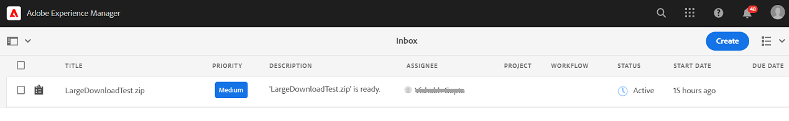

# 從下載資產 [!DNL Adobe Experience Manager] {#download-assets-from-aem}

您可以下載資產，包括靜態和動態格式副本。 或者，您也可以直接從 [!DNL Adobe Experience Manager Assets]。 下載的資產捆綁在ZIP檔案中。 <!-- The compressed ZIP file has a maximum file size of 1 GB for the export job. A maximum of 500 total assets per export job are allowed. -->

<!--
>[!NOTE]
>
>Recipients of emails must be members of the `dam-users` group to access the ZIP download link in the email message. To be able to download the assets, the members must have permissions to launch workflows that trigger downloading of assets.
-->

無法下載資產類型映像集、旋轉集、混合媒體集和旋轉盤集。

可以使用以下方法下載Experience Manager資產：

<!-- * [Link Share](#link-share-download) -->

* [Experience Manager用戶介面](#download-assets)
* [資產共用共用](https://adobe-marketing-cloud.github.io/asset-share-commons/)
* [Brand Portal](https://experienceleague.adobe.com/docs/experience-manager-brand-portal/using/introduction/brand-portal.html)
* [案頭應用](https://experienceleague.adobe.com/docs/experience-manager-desktop-app/using/using.html#download-assets)

## 下載資產使用 [!DNL Experience Manager] 介面 {#download-assets}

非同步下載服務為大規模資產的無縫下載提供了一個框架。 下載存檔大於100GB大小，將其拆分為多個zip存檔，每個最大大小為100GB。 可以單獨下載。 從用戶介面即時下載較小的檔案。 [!DNL Experience Manager] 不存檔下載原始檔案的單個資產下載。 此功能允許更快的下載。

預設情況下， [!DNL Experience Manager] 在下載工作流完成時觸發通知。 下載通知將出現在  [[!DNL Experience Manager] 收件箱](/help/sites-cloud/authoring/getting-started/inbox.md)。



<!--
The large files are downloaded asynchronously and [!DNL Experience Manager] notifies of the completion via notifications in the Inbox. See [understand [!DNL Experience Manager] Inbox](/help/sites-cloud/authoring/getting-started/inbox.md).


*Figure: Download notification via [!DNL Experience Manager] Inbox.*

Asynchronous downloads are triggered in either of the following case:

* If there are more than 10 assets or more than 100 MB to be downloaded.
* If the download takes more than 30 seconds to prepare.
-->


<!-- Go live is on 27th Jan 2022
### Enable email notifications for large downloads {#enable-emails-for-large-downloads}

Asynchronous downloads are triggered in any of the following cases:

* If there are more than ten assets 
* If the download size is more than 100 MB
* If the download takes more than 30 seconds to prepare

While the asynchronous download runs at the backend, the user can continue to explore and work further in Experience Manager. An out-of-the-box mechanism is required to notify the user upon completion of the download process. To achieve this objective, the administrators can configure email service by setting up an SMTP server. See [configure Mail Service](https://experienceleague.adobe.com/docs/experience-manager-cloud-service/content/implementing/developing/development-guidelines.html#sending-email).

Once the email service is configured, the administrators and users can enable email notifications from the Experience Manager interface. 

To enable email notifications:

1. Log in to [!DNL Experience Manager Assets].
1. Click the user icon from the upper-right corner and then click **[!UICONTROL My Preferences]**. The User Preferences window opens.
1. Select the **[!UICONTROL Asset Download email notifications]** check box and click **[!UICONTROL Accept]**.

   

-->

要下載資產，請執行以下步驟：

1. 在 [!DNL Experience Manager] 用戶介面，按一下 **[!UICONTROL 資產]** > **[!UICONTROL 檔案]**。
1. 導航到要下載的資產。 選擇資料夾或在資料夾中選擇一個或多個資產。 在工具欄上，按一下 **[!UICONTROL 下載]**。

   ![從下載資產時可用的選項 [!DNL Experience Manager Assets]](/help/assets/assets/asset-download1.png)

1. 在下載對話框中，選擇所需的下載選項。

   | 下載選項 | 說明 |
   |---|---|
   | **[!UICONTROL 為每一個資產建立個別的資料夾]** | 選擇此選項可將下載的每個資產包括在嵌套在資產父資料夾下的子資料夾中的資產包括在本地電腦上的一個資料夾中。 當此選項為 *不* 預設情況下，選擇將忽略資料夾層次結構，並將所有資產下載到本地電腦的一個資料夾中。 |
   | **[!UICONTROL 電子郵件]** | 選擇此選項可向其他用戶發送電子郵件通知（包含到下載的連結）。 收件人用戶必須是 `dam-users` 組。 標準電子郵件模板可在以下位置使用：<ul><li>`/libs/settings/dam/workflow/notification/email/downloadasset`。</li><li>`/libs/settings/dam/workflow/notification/email/transientworkflowcompleted`。</li></ul> 在部署過程中自定義的模板可在以下位置使用： <ul><li>`/apps/settings/dam/workflow/notification/email/downloadasset`。</li><li>`/apps/settings/dam/workflow/notification/email/transientworkflowcompleted`。</li></ul>您可以在以下位置儲存特定於租戶的自定義模板：<ul><li>`/conf/<tenant_specific_config_root>/settings/dam/workflow/notification/email/downloadasset`。</li><li>`/conf/<tenant_specific_config_root>/settings/dam/workflow/notification/email/transientworkflowcompleted`。</li></ul> |
   | **[!UICONTROL 資產]** | 選擇此選項可以以原始格式下載資產，而不包含任何格式副本。<br>如果原始資產具有子集，則子集選項可用。 |
   | **[!UICONTROL 轉譯]** | 轉譯是資產的二進位表示法。資產具有主要表示形式 — 上載檔案的主要表示形式。 他們可以有任意數目的表示。 <br> 通過此選項，您可以選擇要下載的格式副本。 可用的格式副本取決於您選擇的資產。 |
   | **[!UICONTROL 智慧裁切]** | 選擇此選項可從中下載選定資產的所有智慧裁剪格式副本 [!DNL Experience Manager]。 將建立帶有智慧裁剪格式副本的zip檔案並將其下載到您的本地電腦。 |
   | **[!UICONTROL 動態轉譯]** | 選擇此選項可即時生成一系列替代格式副本。 選擇此選項後，您還可以通過從 [影像預設](/help/assets/dynamic-media/image-presets.md) 清單框。 <br>此外，還可以選擇大小和測量單位、格式、顏色空間、解析度以及任何可選的影像修飾符（如反相影像）。 僅當您 [!DNL Dynamic Media] 啟用。 |

1. 在對話框中，按一下 **[!UICONTROL 下載]**。

   如果為大型下載啟用了電子郵件通知，則收件箱中會出現一封包含已存檔zip資料夾的下載URL的電子郵件。 按一下電子郵件中的下載連結以下載zip資料夾。

   

   您還可以在 [!DNL Experience Manager] 收件箱。

   

## 下載使用連結共用共用的資產 {#link-share-download}

<!--
>[!NOTE]
>
>This functionality is available in the Experience Manager prerelease channel.
-->

使用連結共用資產是一種方便的方法，可讓感興趣的人不必首先登錄即可使用 [!DNL Assets]。 請參閱 [連結共用功能](/help/assets/share-assets.md#sharelink)。

當用戶從共用連結下載資產時， [!DNL Assets] 使用非同步服務，提供更快且不間斷的下載。 要下載的資產將在收件箱的後台排隊到可管理檔案大小的ZIP存檔中。 對於非常大的下載，下載內容會分組到大小為100 GB的檔案中。

收件箱顯示每個存檔的處理狀態。 處理完成後，可以從收件箱下載存檔。


## 啟用資產下載servlet {#enable-asset-download-servlet}

中的預設servlet [!DNL Experience Manager] 允許經過身份驗證的用戶發出任意大的併發下載請求以建立資產的ZIP檔案。 下載準備可能會影響效能，甚至會使伺服器和網路過載。 為了減輕這種功能所帶來的類似DoS的潛在風險， `AssetDownloadServlet` OSGi元件已禁用發佈實例。 如果您不需要作者實例上的下載功能，請禁用作者上的servlet。

要允許從DAM下載資產，例如，當使用諸如資產共用共用或其他類似門戶的實現時，請通過OSGi配置手動啟用servlet。 Adobe建議將允許的下載大小設定得盡可能低，而不影響日常下載要求。 高值可能會影響效能。

1. 建立具有針對發佈運行模式的命名約定的資料夾， `config.publish`:

   `/apps/<your-app-name>/config.publish`

1. 在配置資料夾中，建立新類型的檔案 `nt:file` 命名 `com.day.cq.dam.core.impl.servlet.AssetDownloadServlet.config`。
1. 填充 `com.day.cq.dam.core.impl.servlet.AssetDownloadServlet.config` 下面。 將下載的最大大小（以位元組為單位）設定為 `asset.download.prezip.maxcontentsize`。 下面的示例將ZIP下載的最大大小配置為不超過100 kB。

   ```java
   enabled=B"true"
   asset.download.prezip.maxcontentsize=I"102400"
   ```

## 禁用資產下載servlet {#disable-asset-download-servlet}

如果不需要下載功能，則禁用servlet以防止任何類似DoS的風險。 的 `Asset Download Servlet` 可在 [!DNL Experience Manager] 通過更新調度程式配置來阻止任何資產下載請求來建立和發佈實例。 也可以通過OSGi控制台直接手動禁用servlet。

1. 要通過調度程式配置阻止資產下載請求，請編輯 `dispatcher.any` 配置並向其中添加新規則 [過濾段](https://experienceleague.adobe.com/docs/experience-manager-dispatcher/using/configuring/dispatcher-configuration.html#configuring)。

   `/0100 { /type "deny" /url "*.assetdownload.zip/assets.zip*" }`

## 提示和限制 {#tips-limitations}

* 如果下載了空資料夾， [!DNL Experience Manager] 傳達了有關建立ZIP存檔的成功消息，但未建立存檔。

>[!MORELIKETHIS]
>
>* [下載受DRM保護的資產](drm.md)
>* [在Win或Mac案頭上使用Experience Manager案頭應用下載資產](https://experienceleague.adobe.com/docs/experience-manager-desktop-app/using/using.html)
>* [使用受支援的Adobe Creative Cloud應用中的Adobe資產連結下載資產](https://helpx.adobe.com/tw/enterprise/using/manage-assets-using-adobe-asset-link.html)

