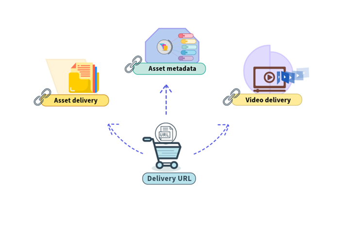

# 具有 OpenAPI 功能的 Dynamic Media {#new-dynaminc-media-apis-overview}

在現今步調迅速的數位世界中，為了在競爭中保持領先，發揮品牌數位資產的全部潛力至關重要。整體數位資產管理 (DAM) 解決方案能促進資產控管、提升品牌一致性，並加速內容傳遞，同時確保品牌完整性和卓越的客戶體驗。

具有 OpenAPI 功能的 Dynamic Media 將 DAM 置於敏捷且高效之內容供應鏈生態系統的核心處，藉此確保資產控管和傳遞。

## 為什麼要使用具有 OpenAPI 功能的 Dynamic Media？ {#dynamic-media-open-api-features}

具有 OpenAPI 功能的 Dynamic Media 有以下主要優勢：

* **緊密整合**：具有 OpenAPI 功能的 Dynamic Media 提供一套全面的搜尋和傳遞 API。它可以讓您的開發人員輕鬆地[將資產傳遞與其應用程式進行整合](/help/assets/integrate-dynamic-media-open-apis.md)。這些應用程式包括 Adobe 以及第三方應用程式。它提供了一個[微前端資產選擇器使用者介面](/help/assets/overview-asset-selector.md)，用來搜尋和選取已核准的資產。選擇器可以輕鬆地與任何採用 JavaScript 框架 (例如 React JS、Angular JS，和 Vanilla JS) 的應用程式整合。

* **集中管理數位資產**：DAM 是所有數位資產的單一事實來源。您的數位資產會在 AEM Assets 集中管理，並透過使用傳遞 URL 參照來傳遞至取用的應用程式，無需複製資產二進位檔案。

* **即時更新**：對 DAM 中已核准資產所做的任何變更 (包括版本更新和中繼資料修改)，都會自動反映在傳遞 URL 中。透過內容傳遞網路為具有 OpenAPI 功能的 Dynamic Media 設定 10 分鐘的短存留時間 (TTL) 值，更新就會在 10 分鐘內顯示於所有製作中和已發佈的介面中。

* **品牌一致性**：唯有[品牌核准的資產](/help/assets/approve-assets.md)才會顯示在下游應用程式中。[品牌經理和行銷人員會對品牌資產維持嚴格控制](/help/assets/restrict-assets-delivery.md)。唯有經核准且最新版本的資產才可供使用，以確保所有管道和應用程式間的品牌一致性。

* **網路最佳化的傳遞**：數位資產以網路最佳化的格式傳遞，以增強您數位體驗的核心頁面指標。這包括支援影像的 WebP 轉譯、透過 HLS 或 DASH 通訊協定對影片進行自適應串流，以及文件的原始轉譯。

* [動態資產轉換](https://developer.adobe.com/experience-cloud/experience-manager-apis)：我們的系統允許使用稱為影像修飾元的 URL 參數進行即時影像轉換。例如寬度、高度、旋轉、翻轉、品質、裁切、格式和智慧裁切。轉換後的轉譯是動態產生，並透過內容傳遞網路順暢傳遞。

* **安全傳遞資產**：具有 OpenAPI 功能的 Dynamic Media 提供機制來控制對您數位資產的存取權。您可以指定使用者角色或群組作為要保護之資產的中繼資料，並設定預先定義的時間範圍，在此期間[只有獲授權的使用者可以存取這些資產](/help/assets/restrict-assets-delivery.md)。在限制的期間內，未經授權的使用者無法解析受保護資產的傳遞 URL。

* **用於做出明智決策的資料分析 (即將推出)**：除了資產管理和傳遞之外，它還能在內容傳遞網路上將傳遞資料深入解析擷取至資產傳遞中，使品牌經理能夠追蹤跨管道的傳遞量度。這樣可讓他們做出資料導向的決策，持續將資產控管和傳遞策略最佳化。

若要了解有關可用的 Dynamic Media 產品資訊及其功能，請參閱 [Dynamic Media Prime 與 Ultimate](/help/assets/dynamic-media/dm-prime-ultimate.md)。

>[!NOTE]
>
>DM Prime 客戶可以使用基本影像修飾工具，包括旋轉、裁切、翻轉、高度、寬度及品質。DM Prime 客戶的智慧型影像不支援 AVIF。

## 存取具備 OpenAPI 功能之 Dynamic Media 的先決條件 {#prerequisites-dynaminc-media-open-apis}

若要存取具備 OpenAPI 功能的 Dynamic Media，您必須擁有以下授權：

* AEM Assets as a Cloud Service

* AEM Dynamic Media

## 如何啟用具有 OpenAPI 功能的 Dynamic Media？ {#enable-dynamic-media-open-apis}

提交在 AEM as a Cloud Service 上啟用具有 OpenAPI 功能的 Dynamic Media 請求之前，請確保該功能尚未啟用。

滿足[先決條件](#prerequisites-dynaminc-media-open-apis)的情況下，若在 AEM as a Cloud Service 執行個體上啟用具有 OpenAPI 功能的 Dynamic Media，則存放庫中的每項已核准資產都會有一個可用的傳遞 URL。如需有關如何複製傳遞 URL 的資訊，請參閱[複製已核准資產的傳遞 URL](approve-assets.md#copy-delivery-url-approved-assets)。Adobe 建議使用此方法來驗證具有 OpenAPI 功能的 Dynamic Media 是否已在 AEM as a Cloud Service 上啟用，然後再提交支援服務單來進行啟用。

若要在 AEM as a Cloud Service 上啟用具有 OpenAPI 功能的 Dynamic Media，請提交包含以下詳細資訊的 Adobe 支援服務單：

* Cloud Service 方案及環境 ID

* 欲使用具有 OpenAPI 功能的 Dynamic Media 整合解決的使用案例詳細資訊。

* 與具有 OpenAPI 功能的 Dynamic Media 整合之下游應用程式的詳細資訊。

  >[!NOTE]
  >
  > 若要與非 Adobe 應用程式整合，請提供應用程式的託管網域名稱以允許清單。

* 參與整合專案之主要客戶的聯絡人詳細資訊。

* Adobe 帳戶主要團隊成員清單 (電子郵件)。

您提交支援服務單後，Adobe 會在您的 Cloud Service 環境上啟用具有 OpenAPI 功能的 Dynamic Media，並與您共用詳細資訊，例如 IMS 用戶端 ID，以利您進行後續整合。

>[!NOTE]
>
>自所有內容套件中排除 `/conf/global/settings/dam/assets-configurations/assetdelivery`，以避免停用具有 OpenAPI 功能的 Dynamic Media。

## 更進一步了解重要功能 {#learn-more-key-capabilities}

<table>
<td>
   
   

      <a href="/help/assets/approve-assets.md">
      <strong>核准 Experience Manager Assets 中的資產</strong>
      </a>
   

   

      <em>核准 AEM Assets 中的資產以簡化資產管理，確保資產處理流程受管控且有效率。</em>
   

</td>
<td>
   
   

      <a href="/help/assets/integrate-dynamic-media-open-apis.md">
      <strong>將 AEM Assets 與下游應用程式整合</strong>
      </a>
   

   

      <em>使用搜尋和傳遞 API 將您自己的自訂使用者介面與 Experience Manager Assets 存放庫整合，或使用 Adobe 的微前端資產選擇器。</em>
   

</td>
<td>
   
   

      <a href="/help/assets/overview-asset-selector.md">
      <strong>Adobe 的微前端資產選擇器</strong>
      </a>
   

   

      <em>能與 AEM Assets 存放庫互動以搜尋資產，然後在您的應用程式製作體驗中使用這些資產的使用者介面。</em>
   

</td>
</table>
<table>

<table>
<td>
   
   

      <a href="/help/assets/search-assets-api.md">
      <strong>在 Experience Manager Assets 存放庫中搜尋資產</strong>
      </a>
   

   

      <em>在 AEM Assets 存放庫中搜尋資產，以將這些資產傳遞至下游應用程式。</em>
   

</td>
<td>
   
   

      <a href="/help/assets/deliver-assets-apis.md">
      <strong>將資產傳遞給下游應用程式</strong>
      </a>
   

   

      <em>使用傳遞 URL 將資產傳遞至整合的下游應用程式。</em>
   

</td>
<td>
   
   

      <a href="/help/assets/restrict-assets-delivery.md">
      <strong>限制存取 Experience Manager 中的資產</strong>
      </a>
   

   

      <em>DAM 管理員或品牌經理透過為 AEM as a Cloud Service 作者執行個體上的已核准資產進行角色設定來限制存取。</em>
   

</td>

</table>
<table>
<td>
   
   

      <a href="/help/assets/integrate-remote-approved-assets-with-sites.md">
      <strong>將遠端 AEM Assets 與 AEM Sites 整合</strong>
      </a>
   

   

      <em>了解如何將遠端 AEM Assets 與 AEM Sites 環境整合。</em>
   

</td>
<td>
   
   

      <a href="/help/assets/dynamic-media-open-apis-faqs.md">
      <strong>具有 OpenAPI 功能的 Dynamic Media 常見問題</strong>
      </a>
   

   

      <em>對於具有 OpenAPI 功能的 Dynamic Media 最常見問題的答覆。</em>
   

</td>
<td>
   
   

      <a href="/help/assets/configure-custom-domain.md">
      <strong>設定自訂網域</strong>
      </a>
   

   

      <em>雖然 AEM as a Cloud Service 具有預設網域，您還是可以根據需要進行自訂。</em>
   

</td>

</table>
