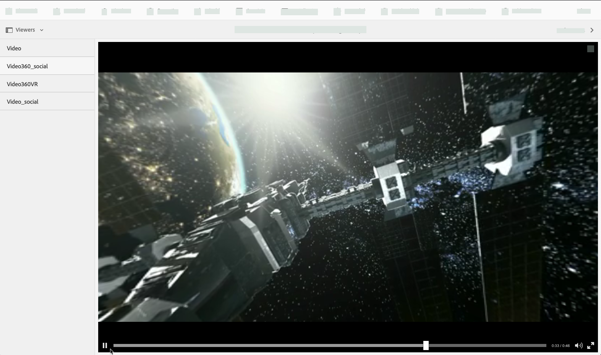
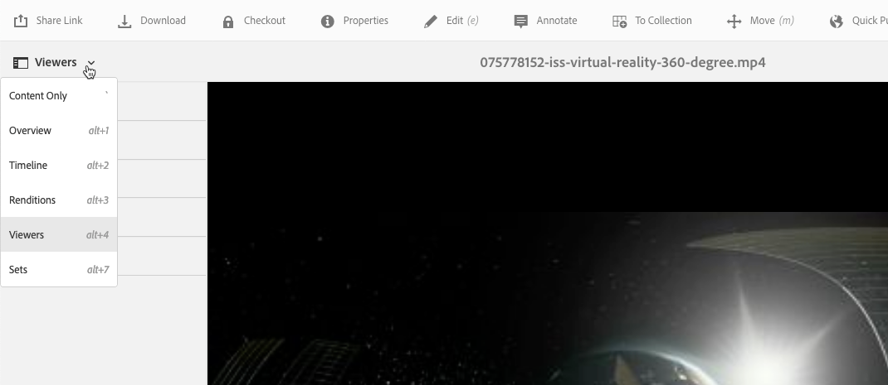

# 360/VR影片 {#vr-video}

360度的視頻同時記錄每個方向的觀看。 它們是用全向攝像機或一組攝像機拍攝的。 在播放期間，在平面顯示器上，用戶可以控制視角；行動裝置上的播放通常會套用其內建的陀螺控制項。

Dynamic Media包含360個視訊資產的原生支援。 依預設，檢視或播放不需要其他設定。 您使用標準視訊副檔名（例如.mp4、.mkv和.mov）來傳送360視訊。 最常見的編解碼器為H.264。

您可以使用360/VR視訊檢視器來轉譯等長形視訊。 這樣，您就能享受身臨其境的房間、財產、位置、景觀、醫療程式等的觀賞體驗。

當前不支援空間音頻；如果音頻在立體聲中混合，則餘額(L/R)不會隨著客戶更改攝像機視角而改變。

請參閱搭配AEM Assets使用Dynamic Media 360視訊和自訂視訊縮圖](https://experienceleague.adobe.com/docs/experience-manager-learn/assets/dynamic-media/dynamic-media-360-video-custom-thumbnail-feature-video-use.html#dynamic-media)。[

另請參閱[管理檢視器預設集](/help/assets/dynamic-media/managing-viewer-presets.md)。

## 360影片的實際運作 {#video-in-action}

選擇[空間站360](https://mobiletest.scene7.com/s7viewers/html5/Video360Viewer.html?asset=Viewers/space_station_360-AVS)以開啟瀏覽器窗口並觀看360度視頻。 在視訊播放期間，將指標拖曳至新位置以變更檢視角度。

*示例來自空間站的視頻幀360*

## 360/VR影片和Adobe Premiere Pro {#vr-video-and-adobe-premiere-pro}

您可以使用AdobePremier Pro來查看和編輯360/VR素材。 例如，您可以將標誌和文字正確放置在場景中，並套用專為等矩形媒體而設計的效果和轉變。

請參閱[編輯360/VR視訊](https://helpx.adobe.com/premiere-pro/how-to/edit-360-vr-video.html)。

## 上傳資產以便與360視訊檢視器搭配使用 {#uploading-assets-for-use-with-the-video-viewer}

上傳至[!DNL Experience Manager]的360個視訊資產在「資產」頁面上標示為&#x200B;**Multimedia**，與一般視訊資產類似。

*selecttopreview在「卡片」檢視中看到已上傳的360視訊資產。資產標籤為多媒體。*

**上傳要與360視訊檢視器搭配使用的資產：**

1. 已建立專屬於360視訊資產的資料夾。
1. [將最適化視訊設定檔套用至資料夾](/help/assets/dynamic-media/video-profiles.md#applying-a-video-profile-to-folders)。

   轉譯360視訊內容比標準非360視訊內容對來源視訊解析度和編碼轉譯解析度的要求更高。

   您可以使用Dynamic Media隨附的現成可用最適化視訊設定檔。 但是，這會導致360視訊品質明顯低於使用非360視訊檢視器轉譯之相同設定所編碼的非360視訊。 因此，如果需要高品質的360視訊，請執行下列動作：

   * 理想情況下，您原始的360視訊內容會有下列其中一個解析度：

      * 1080p - 1920 x 1080，稱為全高清或全高清解析度，或
      * 2160p - 3840 x 2160，稱為4k、UHD或UltraHD解析度。 這種大螢幕解析度通常在高端電視機和電腦顯示器上。 2160p的解析度通常稱為「4k」，因為寬度接近4000像素。 換句話說，它提供的像素是1080p的4倍。
   * [建立自訂適用性視訊設](/help/assets/dynamic-media/video-profiles.md#creating-a-video-encoding-profile-for-adaptive-streaming) 定檔及更高品質的轉譯。例如，您可以建立包含下列三個設定的適用性視訊設定檔：

      * Width=auto;Height=720;位速率= 2500 kbps
      * Width=auto;高度=1080;位速率=5000 kbps
      * Width=auto;高度=1440;位速率=6600 kbps
   * 在專屬於360個視訊資產的資料夾中處理360個視訊內容。

   這種方法對最終用戶的網路和CPU提出了更大的要求。

1. [將影片上傳至資料夾](/help/assets/manage-video-assets.md#upload-and-preview-video-assets)。

<!--

## Overriding the default aspect ratio of 360 videos  {#overriding-the-default-aspect-ratio-of-videos}

For an uploaded asset to qualify as a 360 video that you intend to use with the 360 Video viewer, the asset must have an aspect ratio of 2.

By default, AEM detects video as "360" if its aspect ratio (width/height) is 2.0. If you are an Administrator, you can override the default aspect ratio setting of 2 by setting the optional `s7video360AR` property in CRXDE Lite at the following:

* `/conf/global/settings/cloudconfigs/dmscene7/jcr:content`

  * **Property type**: Double
  * **Value**: floating-point aspect ratio, default 2.0.

After you set this property, it takes effect immediately on both existing videos and newly uploaded videos.

The aspect ratio applies to 360 video assets for the asset details page and the [Video 360 Media WCM component](/help/assets/dynamic-media/adding-dynamic-media-assets-to-pages.md#dynamic-media-components).

Start by uploading 360 Videos.

-->

## 預覽360影片 {#previewing-video}

您可以使用「預覽」來查看360影片對客戶的顯示方式，並確保其如預期般運作。

另請參閱[編輯查看器預設集](/help/assets/dynamic-media/managing-viewer-presets.md#editing-viewer-presets)。

當您對360影片感到滿意時，即可發佈影片。

請參閱[將視訊或影像檢視器內嵌在網頁上](/help/assets/dynamic-media/embed-code.md)。
請參閱[將URL連結到您的Web應用程式](/help/assets/dynamic-media/linking-urls-to-yourwebapplication.md)。 如果您的互動式內容有連結與相對URL，尤其是連結至[!DNL Experience Manager Sites]頁面的連結，則無法使用以URL為基礎的連結方法。
請參閱[將Dynamic Media資產新增至頁面](/help/assets/dynamic-media/adding-dynamic-media-assets-to-pages.md)。

**若要預覽360個影片：**

1. 在&#x200B;**[!UICONTROL Assets]**&#x200B;中，導覽至您已建立的現有360視訊。 若要在預覽模式中開啟，請選取360視訊資產。

   

   若要預覽視訊，請選取360視訊資產。

1. 在預覽頁面上，在頁面左上角附近，選取下拉式清單，然後選取&#x200B;**[!UICONTROL 檢視器]**。

   

   從「檢視器」清單中，選取&#x200B;**[!UICONTROL Video360_social]**，然後執行下列其中一項操作：

   * 若要變更靜態場景的觀看角度，請拖曳指標穿過視訊。
   * 若要開始播放，請選取視訊的&#x200B;**[!UICONTROL Play]**&#x200B;按鈕。 當視訊播放時，拖曳指標至視訊上以變更檢視角度。

   *socialA 360影片螢幕擷圖。*

   * 從「查看器」清單中，選擇&#x200B;**[!UICONTROL Video360VR]**。

      虛擬現實(VR)視訊是沈浸式視訊內容，可透過虛擬現實頭戴式裝置存取。 和普通視訊一樣，當您使用360度的攝像頭來記錄或擷取視訊時，您一開始就會建立VR視訊。
   
   *360 VR視訊螢幕擷圖。*

1. 在預覽頁面的右上方附近，選擇&#x200B;**[!UICONTROL Close]**。

## 發佈360影片 {#publishing-video}

若要使用360影片，您必須發佈影片。 發佈360影片會啟用URL和內嵌程式碼。 此外，也會將360視訊發佈至Dynamic Media雲端，與CDN整合，以提供可擴充且高效能的傳遞。

如需如何發佈360影片的詳細資訊，請參閱[發佈Dynamic Media資產](/help/assets/dynamic-media/publishing-dynamicmedia-assets.md)。
另請參閱[在網頁上嵌入視頻或影像查看器](/help/assets/dynamic-media/embed-code.md)。
另請參閱[將URL連結到Web應用程式](/help/assets/dynamic-media/linking-urls-to-yourwebapplication.md)。 如果您的互動式內容有連結與相對URL，尤其是連結至[!DNL Experience Manager Sites]頁面的連結，則無法使用以URL為基礎的連結方法。
另請參閱[將Dynamic Media資產新增至頁面](/help/assets/dynamic-media/adding-dynamic-media-assets-to-pages.md)。
